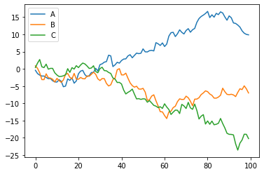

# Plotly and Cufflink Explorations

## Installation and setup


```python
!pip install plotly
!pip install cufflinks
```

    Requirement already satisfied: plotly in /opt/anaconda3/lib/python3.8/site-packages (4.11.0)
    Requirement already satisfied: six in /opt/anaconda3/lib/python3.8/site-packages (from plotly) (1.15.0)
    Requirement already satisfied: retrying>=1.3.3 in /opt/anaconda3/lib/python3.8/site-packages (from plotly) (1.3.3)
    Requirement already satisfied: cufflinks in /opt/anaconda3/lib/python3.8/site-packages (0.17.3)
    Requirement already satisfied: six>=1.9.0 in /opt/anaconda3/lib/python3.8/site-packages (from cufflinks) (1.15.0)
    Requirement already satisfied: plotly>=4.1.1 in /opt/anaconda3/lib/python3.8/site-packages (from cufflinks) (4.11.0)
    Requirement already satisfied: ipywidgets>=7.0.0 in /opt/anaconda3/lib/python3.8/site-packages (from cufflinks) (7.5.1)
    Requirement already satisfied: numpy>=1.9.2 in /opt/anaconda3/lib/python3.8/site-packages (from cufflinks) (1.18.5)
    Requirement already satisfied: pandas>=0.19.2 in /opt/anaconda3/lib/python3.8/site-packages (from cufflinks) (1.0.5)
    Requirement already satisfied: colorlover>=0.2.1 in /opt/anaconda3/lib/python3.8/site-packages (from cufflinks) (0.3.0)
    Requirement already satisfied: setuptools>=34.4.1 in /opt/anaconda3/lib/python3.8/site-packages (from cufflinks) (49.2.0.post20200714)
    Requirement already satisfied: ipython>=5.3.0 in /opt/anaconda3/lib/python3.8/site-packages (from cufflinks) (7.16.1)
    Requirement already satisfied: retrying>=1.3.3 in /opt/anaconda3/lib/python3.8/site-packages (from plotly>=4.1.1->cufflinks) (1.3.3)
    Requirement already satisfied: traitlets>=4.3.1 in /opt/anaconda3/lib/python3.8/site-packages (from ipywidgets>=7.0.0->cufflinks) (4.3.3)
    Requirement already satisfied: ipykernel>=4.5.1 in /opt/anaconda3/lib/python3.8/site-packages (from ipywidgets>=7.0.0->cufflinks) (5.3.2)
    Requirement already satisfied: nbformat>=4.2.0 in /opt/anaconda3/lib/python3.8/site-packages (from ipywidgets>=7.0.0->cufflinks) (5.0.7)
    Requirement already satisfied: widgetsnbextension~=3.5.0 in /opt/anaconda3/lib/python3.8/site-packages (from ipywidgets>=7.0.0->cufflinks) (3.5.1)
    Requirement already satisfied: python-dateutil>=2.6.1 in /opt/anaconda3/lib/python3.8/site-packages (from pandas>=0.19.2->cufflinks) (2.8.1)
    Requirement already satisfied: pytz>=2017.2 in /opt/anaconda3/lib/python3.8/site-packages (from pandas>=0.19.2->cufflinks) (2020.1)
    Requirement already satisfied: appnope; sys_platform == "darwin" in /opt/anaconda3/lib/python3.8/site-packages (from ipython>=5.3.0->cufflinks) (0.1.0)
    Requirement already satisfied: pexpect; sys_platform != "win32" in /opt/anaconda3/lib/python3.8/site-packages (from ipython>=5.3.0->cufflinks) (4.8.0)
    Requirement already satisfied: pygments in /opt/anaconda3/lib/python3.8/site-packages (from ipython>=5.3.0->cufflinks) (2.6.1)
    Requirement already satisfied: pickleshare in /opt/anaconda3/lib/python3.8/site-packages (from ipython>=5.3.0->cufflinks) (0.7.5)
    Requirement already satisfied: prompt-toolkit!=3.0.0,!=3.0.1,<3.1.0,>=2.0.0 in /opt/anaconda3/lib/python3.8/site-packages (from ipython>=5.3.0->cufflinks) (3.0.5)
    Requirement already satisfied: jedi>=0.10 in /opt/anaconda3/lib/python3.8/site-packages (from ipython>=5.3.0->cufflinks) (0.17.1)
    Requirement already satisfied: backcall in /opt/anaconda3/lib/python3.8/site-packages (from ipython>=5.3.0->cufflinks) (0.2.0)
    Requirement already satisfied: decorator in /opt/anaconda3/lib/python3.8/site-packages (from ipython>=5.3.0->cufflinks) (4.4.2)
    Requirement already satisfied: ipython-genutils in /opt/anaconda3/lib/python3.8/site-packages (from traitlets>=4.3.1->ipywidgets>=7.0.0->cufflinks) (0.2.0)
    Requirement already satisfied: tornado>=4.2 in /opt/anaconda3/lib/python3.8/site-packages (from ipykernel>=4.5.1->ipywidgets>=7.0.0->cufflinks) (6.0.4)
    Requirement already satisfied: jupyter-client in /opt/anaconda3/lib/python3.8/site-packages (from ipykernel>=4.5.1->ipywidgets>=7.0.0->cufflinks) (6.1.6)
    Requirement already satisfied: jupyter-core in /opt/anaconda3/lib/python3.8/site-packages (from nbformat>=4.2.0->ipywidgets>=7.0.0->cufflinks) (4.6.3)
    Requirement already satisfied: jsonschema!=2.5.0,>=2.4 in /opt/anaconda3/lib/python3.8/site-packages (from nbformat>=4.2.0->ipywidgets>=7.0.0->cufflinks) (3.2.0)
    Requirement already satisfied: notebook>=4.4.1 in /opt/anaconda3/lib/python3.8/site-packages (from widgetsnbextension~=3.5.0->ipywidgets>=7.0.0->cufflinks) (6.0.3)
    Requirement already satisfied: ptyprocess>=0.5 in /opt/anaconda3/lib/python3.8/site-packages (from pexpect; sys_platform != "win32"->ipython>=5.3.0->cufflinks) (0.6.0)
    Requirement already satisfied: wcwidth in /opt/anaconda3/lib/python3.8/site-packages (from prompt-toolkit!=3.0.0,!=3.0.1,<3.1.0,>=2.0.0->ipython>=5.3.0->cufflinks) (0.2.5)
    Requirement already satisfied: parso<0.8.0,>=0.7.0 in /opt/anaconda3/lib/python3.8/site-packages (from jedi>=0.10->ipython>=5.3.0->cufflinks) (0.7.0)
    Requirement already satisfied: pyzmq>=13 in /opt/anaconda3/lib/python3.8/site-packages (from jupyter-client->ipykernel>=4.5.1->ipywidgets>=7.0.0->cufflinks) (19.0.1)
    Requirement already satisfied: pyrsistent>=0.14.0 in /opt/anaconda3/lib/python3.8/site-packages (from jsonschema!=2.5.0,>=2.4->nbformat>=4.2.0->ipywidgets>=7.0.0->cufflinks) (0.16.0)
    Requirement already satisfied: attrs>=17.4.0 in /opt/anaconda3/lib/python3.8/site-packages (from jsonschema!=2.5.0,>=2.4->nbformat>=4.2.0->ipywidgets>=7.0.0->cufflinks) (19.3.0)
    Requirement already satisfied: terminado>=0.8.1 in /opt/anaconda3/lib/python3.8/site-packages (from notebook>=4.4.1->widgetsnbextension~=3.5.0->ipywidgets>=7.0.0->cufflinks) (0.8.3)
    Requirement already satisfied: Send2Trash in /opt/anaconda3/lib/python3.8/site-packages (from notebook>=4.4.1->widgetsnbextension~=3.5.0->ipywidgets>=7.0.0->cufflinks) (1.5.0)
    Requirement already satisfied: jinja2 in /opt/anaconda3/lib/python3.8/site-packages (from notebook>=4.4.1->widgetsnbextension~=3.5.0->ipywidgets>=7.0.0->cufflinks) (2.11.2)
    Requirement already satisfied: prometheus-client in /opt/anaconda3/lib/python3.8/site-packages (from notebook>=4.4.1->widgetsnbextension~=3.5.0->ipywidgets>=7.0.0->cufflinks) (0.8.0)
    Requirement already satisfied: nbconvert in /opt/anaconda3/lib/python3.8/site-packages (from notebook>=4.4.1->widgetsnbextension~=3.5.0->ipywidgets>=7.0.0->cufflinks) (5.6.1)
    Requirement already satisfied: MarkupSafe>=0.23 in /opt/anaconda3/lib/python3.8/site-packages (from jinja2->notebook>=4.4.1->widgetsnbextension~=3.5.0->ipywidgets>=7.0.0->cufflinks) (1.1.1)
    Requirement already satisfied: testpath in /opt/anaconda3/lib/python3.8/site-packages (from nbconvert->notebook>=4.4.1->widgetsnbextension~=3.5.0->ipywidgets>=7.0.0->cufflinks) (0.4.4)
    Requirement already satisfied: bleach in /opt/anaconda3/lib/python3.8/site-packages (from nbconvert->notebook>=4.4.1->widgetsnbextension~=3.5.0->ipywidgets>=7.0.0->cufflinks) (3.1.5)
    Requirement already satisfied: mistune<2,>=0.8.1 in /opt/anaconda3/lib/python3.8/site-packages (from nbconvert->notebook>=4.4.1->widgetsnbextension~=3.5.0->ipywidgets>=7.0.0->cufflinks) (0.8.4)
    Requirement already satisfied: pandocfilters>=1.4.1 in /opt/anaconda3/lib/python3.8/site-packages (from nbconvert->notebook>=4.4.1->widgetsnbextension~=3.5.0->ipywidgets>=7.0.0->cufflinks) (1.4.2)
    Requirement already satisfied: entrypoints>=0.2.2 in /opt/anaconda3/lib/python3.8/site-packages (from nbconvert->notebook>=4.4.1->widgetsnbextension~=3.5.0->ipywidgets>=7.0.0->cufflinks) (0.3)
    Requirement already satisfied: defusedxml in /opt/anaconda3/lib/python3.8/site-packages (from nbconvert->notebook>=4.4.1->widgetsnbextension~=3.5.0->ipywidgets>=7.0.0->cufflinks) (0.6.0)
    Requirement already satisfied: packaging in /opt/anaconda3/lib/python3.8/site-packages (from bleach->nbconvert->notebook>=4.4.1->widgetsnbextension~=3.5.0->ipywidgets>=7.0.0->cufflinks) (20.4)
    Requirement already satisfied: webencodings in /opt/anaconda3/lib/python3.8/site-packages (from bleach->nbconvert->notebook>=4.4.1->widgetsnbextension~=3.5.0->ipywidgets>=7.0.0->cufflinks) (0.5.1)
    Requirement already satisfied: pyparsing>=2.0.2 in /opt/anaconda3/lib/python3.8/site-packages (from packaging->bleach->nbconvert->notebook>=4.4.1->widgetsnbextension~=3.5.0->ipywidgets>=7.0.0->cufflinks) (2.4.7)


```python
import numpy as np
import pandas as pd
import matplotlib.pyplot as plt
%matplotlib inline
```


```python
import seaborn as sns
```


```python
from plotly.offline import iplot
import plotly as py
```


```python
import cufflinks as cf
```


```python
py.__version__
```


    '4.11.0'


```python
df = pd.DataFrame()
```


```python
py.offline.init_notebook_mode(connected=True)
```


<script type="text/javascript">
window.PlotlyConfig = {MathJaxConfig: 'local'};
if (window.MathJax) {MathJax.Hub.Config({SVG: {font: "STIX-Web"}});}
if (typeof require !== 'undefined') {
require.undef("plotly");
requirejs.config({
    paths: {
        'plotly': ['https://cdn.plot.ly/plotly-latest.min']
    }
});
require(['plotly'], function(Plotly) {
    window._Plotly = Plotly;
});
}
</script>


```python
cf.go_offline()
```


<script type="text/javascript">
window.PlotlyConfig = {MathJaxConfig: 'local'};
if (window.MathJax) {MathJax.Hub.Config({SVG: {font: "STIX-Web"}});}
if (typeof require !== 'undefined') {
require.undef("plotly");
requirejs.config({
    paths: {
        'plotly': ['https://cdn.plot.ly/plotly-latest.min']
    }
});
require(['plotly'], function(Plotly) {
    window._Plotly = Plotly;
});
}
</script>


## Line Plot


```python
df = pd.DataFrame(np.random.randn(100, 3), columns=['A', 'B', 'C'])
df.head()
```


<div>
<style scoped>
    .dataframe tbody tr th:only-of-type {
        vertical-align: middle;
    }

    .dataframe tbody tr th {
        vertical-align: top;
    }

    .dataframe thead th {
        text-align: right;
    }
</style>
<table border="1" class="dataframe">
  <thead>
    <tr style="text-align: right;">
      <th></th>
      <th>A</th>
      <th>B</th>
      <th>C</th>
    </tr>
  </thead>
  <tbody>
    <tr>
      <th>0</th>
      <td>-0.420339</td>
      <td>0.861218</td>
      <td>0.381942</td>
    </tr>
    <tr>
      <th>1</th>
      <td>-0.949567</td>
      <td>-0.727624</td>
      <td>1.289393</td>
    </tr>
    <tr>
      <th>2</th>
      <td>-0.453936</td>
      <td>-1.274422</td>
      <td>1.032753</td>
    </tr>
    <tr>
      <th>3</th>
      <td>-0.263438</td>
      <td>-1.983077</td>
      <td>-2.109609</td>
    </tr>
    <tr>
      <th>4</th>
      <td>-0.004797</td>
      <td>-0.007011</td>
      <td>-0.232089</td>
    </tr>
  </tbody>
</table>
</div>


```python
df = df.cumsum()
```


```python
df.head()
```


<div>
<style scoped>
    .dataframe tbody tr th:only-of-type {
        vertical-align: middle;
    }

    .dataframe tbody tr th {
        vertical-align: top;
    }

    .dataframe thead th {
        text-align: right;
    }
</style>
<table border="1" class="dataframe">
  <thead>
    <tr style="text-align: right;">
      <th></th>
      <th>A</th>
      <th>B</th>
      <th>C</th>
    </tr>
  </thead>
  <tbody>
    <tr>
      <th>0</th>
      <td>-0.420339</td>
      <td>0.861218</td>
      <td>0.381942</td>
    </tr>
    <tr>
      <th>1</th>
      <td>-1.369906</td>
      <td>0.133593</td>
      <td>1.671335</td>
    </tr>
    <tr>
      <th>2</th>
      <td>-1.823842</td>
      <td>-1.140829</td>
      <td>2.704088</td>
    </tr>
    <tr>
      <th>3</th>
      <td>-2.087280</td>
      <td>-3.123906</td>
      <td>0.594479</td>
    </tr>
    <tr>
      <th>4</th>
      <td>-2.092077</td>
      <td>-3.130916</td>
      <td>0.362390</td>
    </tr>
  </tbody>
</table>
</div>


```python
df.shape
```


    (100, 3)


```python
df.iplot()
```


<div>                            <div id="9ede10a6-0e38-40b4-ba81-d9542818536f" class="plotly-graph-div" style="height:525px; width:100%;"></div>            <script type="text/javascript">                require(["plotly"], function(Plotly) {                    window.PLOTLYENV=window.PLOTLYENV || {};
                    window.PLOTLYENV.BASE_URL='https://plot.ly';                                    if (document.getElementById("9ede10a6-0e38-40b4-ba81-d9542818536f")) {                    Plotly.newPlot(                        "9ede10a6-0e38-40b4-ba81-d9542818536f",                        [{"line": {"color": "rgba(255, 153, 51, 1.0)", "dash": "solid", "shape": "linear", "width": 1.3}, "mode": "lines", "name": "A", "text": "", "type": "scatter", "x": [0, 1, 2, 3, 4, 5, 6, 7, 8, 9, 10, 11, 12, 13, 14, 15, 16, 17, 18, 19, 20, 21, 22, 23, 24, 25, 26, 27, 28, 29, 30, 31, 32, 33, 34, 35, 36, 37, 38, 39, 40, 41, 42, 43, 44, 45, 46, 47, 48, 49, 50, 51, 52, 53, 54, 55, 56, 57, 58, 59, 60, 61, 62, 63, 64, 65, 66, 67, 68, 69, 70, 71, 72, 73, 74, 75, 76, 77, 78, 79, 80, 81, 82, 83, 84, 85, 86, 87, 88, 89, 90, 91, 92, 93, 94, 95, 96, 97, 98, 99], "y": [-0.4203392895874538, -1.369905817782749, -1.8238416791922503, -2.0872800723249387, -2.092076792920897, -2.49684587339573, -2.8535527960363987, -2.810248824864963, -3.4515280118710767, -3.7780088133036984, -3.8430106557603674, -3.1396484712854056, -3.6027206738854076, -5.193064857835008, -5.010880677329902, -2.920908376869025, -3.3344369273404566, -2.626806806352273, -4.1626952982471614, -3.5146699164380943, -1.432755397449299, -0.6575042186965682, -0.438169025300527, -1.6822352678878845, -2.2437221640837315, -1.9678600136657587, -1.0713305568197766, -1.0253824182624385, 0.15466599805792547, -0.6251894054853014, 1.2195454525457454, 1.448633284399989, 1.937947950462446, 2.0969387156894355, 3.9650439200970986, 3.762998141814725, 0.6631821375658937, 1.152469444575198, 1.908278943045067, 1.6505546378165072, 2.406651966307142, 2.837205214662199, 2.8956125612450947, 3.7509814585843024, 4.103411714375269, 3.213039742687238, 3.897043547371557, 4.571924983667278, 4.409276426255201, 4.519167178985722, 5.792047509535503, 4.935393515836664, 4.905695210063525, 5.275323843868442, 5.374482445931702, 5.191202976776218, 7.596104876967157, 7.2715530731851725, 6.77660723498167, 7.522086457721337, 6.479044777119531, 7.187757232153654, 9.499999467560515, 10.488900797659007, 10.59923246826559, 9.363427476593104, 10.172770374497567, 11.319643948576054, 10.596005815412392, 10.120160866087792, 11.128340896314356, 11.663899154996717, 10.625217620948035, 11.341515197224235, 11.729637396462897, 13.49296420757262, 14.58848347070353, 15.194309273202013, 15.588781336998139, 16.05850957743325, 16.66608706059982, 14.869018128123992, 15.68578183631696, 14.990027127463087, 16.099860344434518, 15.731009384537984, 16.53706532585039, 16.202168648960537, 15.0632644873071, 14.108440419858633, 15.363436931920354, 14.81491558692019, 13.317852953046383, 13.1757243753738, 12.710832972036007, 12.119269243419772, 11.035483402939908, 10.346917780163277, 9.99461509708053, 9.86769982526003]}, {"line": {"color": "rgba(55, 128, 191, 1.0)", "dash": "solid", "shape": "linear", "width": 1.3}, "mode": "lines", "name": "B", "text": "", "type": "scatter", "x": [0, 1, 2, 3, 4, 5, 6, 7, 8, 9, 10, 11, 12, 13, 14, 15, 16, 17, 18, 19, 20, 21, 22, 23, 24, 25, 26, 27, 28, 29, 30, 31, 32, 33, 34, 35, 36, 37, 38, 39, 40, 41, 42, 43, 44, 45, 46, 47, 48, 49, 50, 51, 52, 53, 54, 55, 56, 57, 58, 59, 60, 61, 62, 63, 64, 65, 66, 67, 68, 69, 70, 71, 72, 73, 74, 75, 76, 77, 78, 79, 80, 81, 82, 83, 84, 85, 86, 87, 88, 89, 90, 91, 92, 93, 94, 95, 96, 97, 98, 99], "y": [0.861217701295068, 0.1335932550773008, -1.140828882352598, -3.123905720341237, -3.1309163536293743, -1.4489484531781156, -2.5553805175160527, -2.6894654879982927, -3.0208269657749662, -3.814053013847026, -2.776521776798689, -3.393854369028735, -3.9180768602187395, -3.22492239669446, -1.6217853161166862, -1.3306823493065085, -2.4480062556697924, -2.924103991780724, -1.3263381137213983, -2.969027382793721, -3.0114343982996714, -2.494543283617685, -2.8422436649613454, -2.900244963832415, -2.0534297055299637, -2.1514948220357892, -1.5713576545151358, -0.9783272568000003, -1.5630906859881948, -2.8884507128540475, -3.3854560271600844, -2.8185969114922322, -2.8412486146044302, -4.231036073945811, -4.963345399476227, -4.64309288866948, -3.150096794631405, -2.694985628991869, -0.2723589934734414, 0.05214558536989533, -1.7590693654875695, -1.7552264100459596, -1.2489944760480496, -2.724867676778518, -4.060592449865583, -4.876077646007968, -5.31380192270035, -5.049187644484265, -5.852017241770446, -5.892860416843802, -5.656890033968333, -6.744920184641799, -9.148191129097148, -8.978048466175471, -7.904827304240728, -7.53352313233632, -9.261483068665289, -10.757090640490734, -12.430206948328257, -12.488843390229755, -13.543746147523532, -14.421356278556352, -12.488825795350502, -12.291620340619433, -11.246088410156219, -10.841758040996353, -9.505242610470885, -8.70407169741761, -8.88895703507922, -8.853199472656138, -7.927151260639004, -8.39247536844568, -9.386001225464536, -10.7178029822575, -8.793885560395175, -8.776803170447158, -8.371900369882542, -7.4655983060893645, -6.995768319072051, -6.385440351494491, -6.620492111842722, -7.293944110299248, -7.683734567878268, -8.48988301753896, -8.503332300895535, -8.195061442266397, -7.655523302347479, -5.616807348861752, -6.6287705339140714, -7.3940818364374, -7.49880054379496, -7.374588848832177, -7.5636235710301944, -8.048058621776587, -6.835221431678624, -5.775539041914257, -6.019374566457954, -4.929153177551897, -5.795877323604843, -7.003184264714636]}, {"line": {"color": "rgba(50, 171, 96, 1.0)", "dash": "solid", "shape": "linear", "width": 1.3}, "mode": "lines", "name": "C", "text": "", "type": "scatter", "x": [0, 1, 2, 3, 4, 5, 6, 7, 8, 9, 10, 11, 12, 13, 14, 15, 16, 17, 18, 19, 20, 21, 22, 23, 24, 25, 26, 27, 28, 29, 30, 31, 32, 33, 34, 35, 36, 37, 38, 39, 40, 41, 42, 43, 44, 45, 46, 47, 48, 49, 50, 51, 52, 53, 54, 55, 56, 57, 58, 59, 60, 61, 62, 63, 64, 65, 66, 67, 68, 69, 70, 71, 72, 73, 74, 75, 76, 77, 78, 79, 80, 81, 82, 83, 84, 85, 86, 87, 88, 89, 90, 91, 92, 93, 94, 95, 96, 97, 98, 99], "y": [0.38194180487182816, 1.6713352812646096, 2.7040878660797665, 0.5944790946079932, 0.3623898475699232, 1.3558510820877931, -0.0981376837783321, 0.13660716193117933, 0.131579938963945, -1.1467370704235251, -1.7845403212024604, -2.2286793427827747, -2.1842201588661565, -2.0200243231642925, -1.717038061088895, 0.04636882360768535, -1.0295529668170784, 0.3471348282466298, -0.06640207422667727, 0.9195366362477124, 0.3643774748316282, 1.1137361541339814, 1.6776040520318096, 1.4193148603864765, 0.8254990736224871, 0.11380806660910481, 0.23911537904548455, 0.893274223190449, -0.7601335997746, -1.1347974978783957, 0.07512582360768372, 0.45868400354812017, -0.5095013697278823, -0.5715466491876016, -1.0408475683395733, -1.3329816390290627, -2.639281792884618, -2.9733451974989427, -3.961418992848563, -3.927569855438939, -4.3875173871844115, -6.151103393583506, -7.288361291467144, -6.817697972267204, -6.459239240742996, -5.875279804660985, -7.354834973587717, -8.72492033588174, -8.641400145080647, -8.860192381080742, -8.691800955309493, -8.742966361693421, -9.686812448883996, -9.20809554475254, -9.896362505917105, -10.594535085234183, -10.824380718951303, -11.250828362742979, -10.992582323237723, -11.483350868938206, -10.13396641188027, -11.067853825132595, -11.809320419191222, -13.238497530038375, -12.559503386654457, -11.969535712391739, -12.018161610420288, -12.970540485849678, -10.305823283572822, -10.755333344211937, -11.506585044226584, -9.723423020014046, -11.314725802488887, -11.745850058047399, -10.216712294481889, -12.064642487251964, -14.546740432025377, -13.735435257152405, -13.287089336098681, -16.010475727201957, -15.117182772966508, -16.08653789913434, -15.157047549898962, -16.22420357112652, -16.080581795077077, -15.804744103972077, -14.39939453614015, -15.864275041656244, -17.152434205259723, -18.695816057084215, -18.997482855541257, -19.019525231146577, -19.166260475837323, -21.742790189656308, -23.570542796347304, -21.564933311488083, -20.64035955340116, -18.96837925177952, -18.990539572616786, -20.232979728717527]}],                        {"legend": {"bgcolor": "#F5F6F9", "font": {"color": "#4D5663"}}, "paper_bgcolor": "#F5F6F9", "plot_bgcolor": "#F5F6F9", "template": {"data": {"bar": [{"error_x": {"color": "#2a3f5f"}, "error_y": {"color": "#2a3f5f"}, "marker": {"line": {"color": "#E5ECF6", "width": 0.5}}, "type": "bar"}], "barpolar": [{"marker": {"line": {"color": "#E5ECF6", "width": 0.5}}, "type": "barpolar"}], "carpet": [{"aaxis": {"endlinecolor": "#2a3f5f", "gridcolor": "white", "linecolor": "white", "minorgridcolor": "white", "startlinecolor": "#2a3f5f"}, "baxis": {"endlinecolor": "#2a3f5f", "gridcolor": "white", "linecolor": "white", "minorgridcolor": "white", "startlinecolor": "#2a3f5f"}, "type": "carpet"}], "choropleth": [{"colorbar": {"outlinewidth": 0, "ticks": ""}, "type": "choropleth"}], "contour": [{"colorbar": {"outlinewidth": 0, "ticks": ""}, "colorscale": [[0.0, "#0d0887"], [0.1111111111111111, "#46039f"], [0.2222222222222222, "#7201a8"], [0.3333333333333333, "#9c179e"], [0.4444444444444444, "#bd3786"], [0.5555555555555556, "#d8576b"], [0.6666666666666666, "#ed7953"], [0.7777777777777778, "#fb9f3a"], [0.8888888888888888, "#fdca26"], [1.0, "#f0f921"]], "type": "contour"}], "contourcarpet": [{"colorbar": {"outlinewidth": 0, "ticks": ""}, "type": "contourcarpet"}], "heatmap": [{"colorbar": {"outlinewidth": 0, "ticks": ""}, "colorscale": [[0.0, "#0d0887"], [0.1111111111111111, "#46039f"], [0.2222222222222222, "#7201a8"], [0.3333333333333333, "#9c179e"], [0.4444444444444444, "#bd3786"], [0.5555555555555556, "#d8576b"], [0.6666666666666666, "#ed7953"], [0.7777777777777778, "#fb9f3a"], [0.8888888888888888, "#fdca26"], [1.0, "#f0f921"]], "type": "heatmap"}], "heatmapgl": [{"colorbar": {"outlinewidth": 0, "ticks": ""}, "colorscale": [[0.0, "#0d0887"], [0.1111111111111111, "#46039f"], [0.2222222222222222, "#7201a8"], [0.3333333333333333, "#9c179e"], [0.4444444444444444, "#bd3786"], [0.5555555555555556, "#d8576b"], [0.6666666666666666, "#ed7953"], [0.7777777777777778, "#fb9f3a"], [0.8888888888888888, "#fdca26"], [1.0, "#f0f921"]], "type": "heatmapgl"}], "histogram": [{"marker": {"colorbar": {"outlinewidth": 0, "ticks": ""}}, "type": "histogram"}], "histogram2d": [{"colorbar": {"outlinewidth": 0, "ticks": ""}, "colorscale": [[0.0, "#0d0887"], [0.1111111111111111, "#46039f"], [0.2222222222222222, "#7201a8"], [0.3333333333333333, "#9c179e"], [0.4444444444444444, "#bd3786"], [0.5555555555555556, "#d8576b"], [0.6666666666666666, "#ed7953"], [0.7777777777777778, "#fb9f3a"], [0.8888888888888888, "#fdca26"], [1.0, "#f0f921"]], "type": "histogram2d"}], "histogram2dcontour": [{"colorbar": {"outlinewidth": 0, "ticks": ""}, "colorscale": [[0.0, "#0d0887"], [0.1111111111111111, "#46039f"], [0.2222222222222222, "#7201a8"], [0.3333333333333333, "#9c179e"], [0.4444444444444444, "#bd3786"], [0.5555555555555556, "#d8576b"], [0.6666666666666666, "#ed7953"], [0.7777777777777778, "#fb9f3a"], [0.8888888888888888, "#fdca26"], [1.0, "#f0f921"]], "type": "histogram2dcontour"}], "mesh3d": [{"colorbar": {"outlinewidth": 0, "ticks": ""}, "type": "mesh3d"}], "parcoords": [{"line": {"colorbar": {"outlinewidth": 0, "ticks": ""}}, "type": "parcoords"}], "pie": [{"automargin": true, "type": "pie"}], "scatter": [{"marker": {"colorbar": {"outlinewidth": 0, "ticks": ""}}, "type": "scatter"}], "scatter3d": [{"line": {"colorbar": {"outlinewidth": 0, "ticks": ""}}, "marker": {"colorbar": {"outlinewidth": 0, "ticks": ""}}, "type": "scatter3d"}], "scattercarpet": [{"marker": {"colorbar": {"outlinewidth": 0, "ticks": ""}}, "type": "scattercarpet"}], "scattergeo": [{"marker": {"colorbar": {"outlinewidth": 0, "ticks": ""}}, "type": "scattergeo"}], "scattergl": [{"marker": {"colorbar": {"outlinewidth": 0, "ticks": ""}}, "type": "scattergl"}], "scattermapbox": [{"marker": {"colorbar": {"outlinewidth": 0, "ticks": ""}}, "type": "scattermapbox"}], "scatterpolar": [{"marker": {"colorbar": {"outlinewidth": 0, "ticks": ""}}, "type": "scatterpolar"}], "scatterpolargl": [{"marker": {"colorbar": {"outlinewidth": 0, "ticks": ""}}, "type": "scatterpolargl"}], "scatterternary": [{"marker": {"colorbar": {"outlinewidth": 0, "ticks": ""}}, "type": "scatterternary"}], "surface": [{"colorbar": {"outlinewidth": 0, "ticks": ""}, "colorscale": [[0.0, "#0d0887"], [0.1111111111111111, "#46039f"], [0.2222222222222222, "#7201a8"], [0.3333333333333333, "#9c179e"], [0.4444444444444444, "#bd3786"], [0.5555555555555556, "#d8576b"], [0.6666666666666666, "#ed7953"], [0.7777777777777778, "#fb9f3a"], [0.8888888888888888, "#fdca26"], [1.0, "#f0f921"]], "type": "surface"}], "table": [{"cells": {"fill": {"color": "#EBF0F8"}, "line": {"color": "white"}}, "header": {"fill": {"color": "#C8D4E3"}, "line": {"color": "white"}}, "type": "table"}]}, "layout": {"annotationdefaults": {"arrowcolor": "#2a3f5f", "arrowhead": 0, "arrowwidth": 1}, "coloraxis": {"colorbar": {"outlinewidth": 0, "ticks": ""}}, "colorscale": {"diverging": [[0, "#8e0152"], [0.1, "#c51b7d"], [0.2, "#de77ae"], [0.3, "#f1b6da"], [0.4, "#fde0ef"], [0.5, "#f7f7f7"], [0.6, "#e6f5d0"], [0.7, "#b8e186"], [0.8, "#7fbc41"], [0.9, "#4d9221"], [1, "#276419"]], "sequential": [[0.0, "#0d0887"], [0.1111111111111111, "#46039f"], [0.2222222222222222, "#7201a8"], [0.3333333333333333, "#9c179e"], [0.4444444444444444, "#bd3786"], [0.5555555555555556, "#d8576b"], [0.6666666666666666, "#ed7953"], [0.7777777777777778, "#fb9f3a"], [0.8888888888888888, "#fdca26"], [1.0, "#f0f921"]], "sequentialminus": [[0.0, "#0d0887"], [0.1111111111111111, "#46039f"], [0.2222222222222222, "#7201a8"], [0.3333333333333333, "#9c179e"], [0.4444444444444444, "#bd3786"], [0.5555555555555556, "#d8576b"], [0.6666666666666666, "#ed7953"], [0.7777777777777778, "#fb9f3a"], [0.8888888888888888, "#fdca26"], [1.0, "#f0f921"]]}, "colorway": ["#636efa", "#EF553B", "#00cc96", "#ab63fa", "#FFA15A", "#19d3f3", "#FF6692", "#B6E880", "#FF97FF", "#FECB52"], "font": {"color": "#2a3f5f"}, "geo": {"bgcolor": "white", "lakecolor": "white", "landcolor": "#E5ECF6", "showlakes": true, "showland": true, "subunitcolor": "white"}, "hoverlabel": {"align": "left"}, "hovermode": "closest", "mapbox": {"style": "light"}, "paper_bgcolor": "white", "plot_bgcolor": "#E5ECF6", "polar": {"angularaxis": {"gridcolor": "white", "linecolor": "white", "ticks": ""}, "bgcolor": "#E5ECF6", "radialaxis": {"gridcolor": "white", "linecolor": "white", "ticks": ""}}, "scene": {"xaxis": {"backgroundcolor": "#E5ECF6", "gridcolor": "white", "gridwidth": 2, "linecolor": "white", "showbackground": true, "ticks": "", "zerolinecolor": "white"}, "yaxis": {"backgroundcolor": "#E5ECF6", "gridcolor": "white", "gridwidth": 2, "linecolor": "white", "showbackground": true, "ticks": "", "zerolinecolor": "white"}, "zaxis": {"backgroundcolor": "#E5ECF6", "gridcolor": "white", "gridwidth": 2, "linecolor": "white", "showbackground": true, "ticks": "", "zerolinecolor": "white"}}, "shapedefaults": {"line": {"color": "#2a3f5f"}}, "ternary": {"aaxis": {"gridcolor": "white", "linecolor": "white", "ticks": ""}, "baxis": {"gridcolor": "white", "linecolor": "white", "ticks": ""}, "bgcolor": "#E5ECF6", "caxis": {"gridcolor": "white", "linecolor": "white", "ticks": ""}}, "title": {"x": 0.05}, "xaxis": {"automargin": true, "gridcolor": "white", "linecolor": "white", "ticks": "", "title": {"standoff": 15}, "zerolinecolor": "white", "zerolinewidth": 2}, "yaxis": {"automargin": true, "gridcolor": "white", "linecolor": "white", "ticks": "", "title": {"standoff": 15}, "zerolinecolor": "white", "zerolinewidth": 2}}}, "title": {"font": {"color": "#4D5663"}}, "xaxis": {"gridcolor": "#E1E5ED", "showgrid": true, "tickfont": {"color": "#4D5663"}, "title": {"font": {"color": "#4D5663"}, "text": ""}, "zerolinecolor": "#E1E5ED"}, "yaxis": {"gridcolor": "#E1E5ED", "showgrid": true, "tickfont": {"color": "#4D5663"}, "title": {"font": {"color": "#4D5663"}, "text": ""}, "zerolinecolor": "#E1E5ED"}},                        {"showLink": true, "linkText": "Export to plot.ly", "plotlyServerURL": "https://plot.ly", "responsive": true}                    ).then(function(){

var gd = document.getElementById('9ede10a6-0e38-40b4-ba81-d9542818536f');
var x = new MutationObserver(function (mutations, observer) {{
        var display = window.getComputedStyle(gd).display;
        if (!display || display === 'none') {{
            console.log([gd, 'removed!']);
            Plotly.purge(gd);
            observer.disconnect();
        }}
}});

// Listen for the removal of the full notebook cells
var notebookContainer = gd.closest('#notebook-container');
if (notebookContainer) {{
    x.observe(notebookContainer, {childList: true});
}}

// Listen for the clearing of the current output cell
var outputEl = gd.closest('.output');
if (outputEl) {{
    x.observe(outputEl, {childList: true});
}}

                        })                };                });            </script>        </div>


```python
df.plot()
```


    <matplotlib.axes._subplots.AxesSubplot at 0x11ea8b910>





## Scatter Plot


```python
df.head()
```


<div>
<style scoped>
    .dataframe tbody tr th:only-of-type {
        vertical-align: middle;
    }

    .dataframe tbody tr th {
        vertical-align: top;
    }

    .dataframe thead th {
        text-align: right;
    }
</style>
<table border="1" class="dataframe">
  <thead>
    <tr style="text-align: right;">
      <th></th>
      <th>A</th>
      <th>B</th>
      <th>C</th>
    </tr>
  </thead>
  <tbody>
    <tr>
      <th>0</th>
      <td>-0.420339</td>
      <td>0.861218</td>
      <td>0.381942</td>
    </tr>
    <tr>
      <th>1</th>
      <td>-1.369906</td>
      <td>0.133593</td>
      <td>1.671335</td>
    </tr>
    <tr>
      <th>2</th>
      <td>-1.823842</td>
      <td>-1.140829</td>
      <td>2.704088</td>
    </tr>
    <tr>
      <th>3</th>
      <td>-2.087280</td>
      <td>-3.123906</td>
      <td>0.594479</td>
    </tr>
    <tr>
      <th>4</th>
      <td>-2.092077</td>
      <td>-3.130916</td>
      <td>0.362390</td>
    </tr>
  </tbody>
</table>
</div>


```python
df.iplot(x = 'A', y = 'B', mode = 'markers', size = 25, title='Scatter Plot', xTitle='X', yTitle='Y')
```


<div>                            <div id="227f0001-397d-4721-8950-42dddb2fe5fc" class="plotly-graph-div" style="height:525px; width:100%;"></div>            <script type="text/javascript">                require(["plotly"], function(Plotly) {                    window.PLOTLYENV=window.PLOTLYENV || {};
                    window.PLOTLYENV.BASE_URL='https://plot.ly';                                    if (document.getElementById("227f0001-397d-4721-8950-42dddb2fe5fc")) {                    Plotly.newPlot(                        "227f0001-397d-4721-8950-42dddb2fe5fc",                        [{"line": {"color": "rgba(255, 153, 51, 1.0)", "dash": "solid", "shape": "linear", "width": 1.3}, "marker": {"size": 25, "symbol": "circle"}, "mode": "markers", "name": "B", "text": "", "type": "scatter", "x": [-0.4203392895874538, -1.369905817782749, -1.8238416791922503, -2.0872800723249387, -2.092076792920897, -2.49684587339573, -2.8535527960363987, -2.810248824864963, -3.4515280118710767, -3.7780088133036984, -3.8430106557603674, -3.1396484712854056, -3.6027206738854076, -5.193064857835008, -5.010880677329902, -2.920908376869025, -3.3344369273404566, -2.626806806352273, -4.1626952982471614, -3.5146699164380943, -1.432755397449299, -0.6575042186965682, -0.438169025300527, -1.6822352678878845, -2.2437221640837315, -1.9678600136657587, -1.0713305568197766, -1.0253824182624385, 0.15466599805792547, -0.6251894054853014, 1.2195454525457454, 1.448633284399989, 1.937947950462446, 2.0969387156894355, 3.9650439200970986, 3.762998141814725, 0.6631821375658937, 1.152469444575198, 1.908278943045067, 1.6505546378165072, 2.406651966307142, 2.837205214662199, 2.8956125612450947, 3.7509814585843024, 4.103411714375269, 3.213039742687238, 3.897043547371557, 4.571924983667278, 4.409276426255201, 4.519167178985722, 5.792047509535503, 4.935393515836664, 4.905695210063525, 5.275323843868442, 5.374482445931702, 5.191202976776218, 7.596104876967157, 7.2715530731851725, 6.77660723498167, 7.522086457721337, 6.479044777119531, 7.187757232153654, 9.499999467560515, 10.488900797659007, 10.59923246826559, 9.363427476593104, 10.172770374497567, 11.319643948576054, 10.596005815412392, 10.120160866087792, 11.128340896314356, 11.663899154996717, 10.625217620948035, 11.341515197224235, 11.729637396462897, 13.49296420757262, 14.58848347070353, 15.194309273202013, 15.588781336998139, 16.05850957743325, 16.66608706059982, 14.869018128123992, 15.68578183631696, 14.990027127463087, 16.099860344434518, 15.731009384537984, 16.53706532585039, 16.202168648960537, 15.0632644873071, 14.108440419858633, 15.363436931920354, 14.81491558692019, 13.317852953046383, 13.1757243753738, 12.710832972036007, 12.119269243419772, 11.035483402939908, 10.346917780163277, 9.99461509708053, 9.86769982526003], "y": [0.861217701295068, 0.1335932550773008, -1.140828882352598, -3.123905720341237, -3.1309163536293743, -1.4489484531781156, -2.5553805175160527, -2.6894654879982927, -3.0208269657749662, -3.814053013847026, -2.776521776798689, -3.393854369028735, -3.9180768602187395, -3.22492239669446, -1.6217853161166862, -1.3306823493065085, -2.4480062556697924, -2.924103991780724, -1.3263381137213983, -2.969027382793721, -3.0114343982996714, -2.494543283617685, -2.8422436649613454, -2.900244963832415, -2.0534297055299637, -2.1514948220357892, -1.5713576545151358, -0.9783272568000003, -1.5630906859881948, -2.8884507128540475, -3.3854560271600844, -2.8185969114922322, -2.8412486146044302, -4.231036073945811, -4.963345399476227, -4.64309288866948, -3.150096794631405, -2.694985628991869, -0.2723589934734414, 0.05214558536989533, -1.7590693654875695, -1.7552264100459596, -1.2489944760480496, -2.724867676778518, -4.060592449865583, -4.876077646007968, -5.31380192270035, -5.049187644484265, -5.852017241770446, -5.892860416843802, -5.656890033968333, -6.744920184641799, -9.148191129097148, -8.978048466175471, -7.904827304240728, -7.53352313233632, -9.261483068665289, -10.757090640490734, -12.430206948328257, -12.488843390229755, -13.543746147523532, -14.421356278556352, -12.488825795350502, -12.291620340619433, -11.246088410156219, -10.841758040996353, -9.505242610470885, -8.70407169741761, -8.88895703507922, -8.853199472656138, -7.927151260639004, -8.39247536844568, -9.386001225464536, -10.7178029822575, -8.793885560395175, -8.776803170447158, -8.371900369882542, -7.4655983060893645, -6.995768319072051, -6.385440351494491, -6.620492111842722, -7.293944110299248, -7.683734567878268, -8.48988301753896, -8.503332300895535, -8.195061442266397, -7.655523302347479, -5.616807348861752, -6.6287705339140714, -7.3940818364374, -7.49880054379496, -7.374588848832177, -7.5636235710301944, -8.048058621776587, -6.835221431678624, -5.775539041914257, -6.019374566457954, -4.929153177551897, -5.795877323604843, -7.003184264714636]}],                        {"legend": {"bgcolor": "#F5F6F9", "font": {"color": "#4D5663"}}, "paper_bgcolor": "#F5F6F9", "plot_bgcolor": "#F5F6F9", "template": {"data": {"bar": [{"error_x": {"color": "#2a3f5f"}, "error_y": {"color": "#2a3f5f"}, "marker": {"line": {"color": "#E5ECF6", "width": 0.5}}, "type": "bar"}], "barpolar": [{"marker": {"line": {"color": "#E5ECF6", "width": 0.5}}, "type": "barpolar"}], "carpet": [{"aaxis": {"endlinecolor": "#2a3f5f", "gridcolor": "white", "linecolor": "white", "minorgridcolor": "white", "startlinecolor": "#2a3f5f"}, "baxis": {"endlinecolor": "#2a3f5f", "gridcolor": "white", "linecolor": "white", "minorgridcolor": "white", "startlinecolor": "#2a3f5f"}, "type": "carpet"}], "choropleth": [{"colorbar": {"outlinewidth": 0, "ticks": ""}, "type": "choropleth"}], "contour": [{"colorbar": {"outlinewidth": 0, "ticks": ""}, "colorscale": [[0.0, "#0d0887"], [0.1111111111111111, "#46039f"], [0.2222222222222222, "#7201a8"], [0.3333333333333333, "#9c179e"], [0.4444444444444444, "#bd3786"], [0.5555555555555556, "#d8576b"], [0.6666666666666666, "#ed7953"], [0.7777777777777778, "#fb9f3a"], [0.8888888888888888, "#fdca26"], [1.0, "#f0f921"]], "type": "contour"}], "contourcarpet": [{"colorbar": {"outlinewidth": 0, "ticks": ""}, "type": "contourcarpet"}], "heatmap": [{"colorbar": {"outlinewidth": 0, "ticks": ""}, "colorscale": [[0.0, "#0d0887"], [0.1111111111111111, "#46039f"], [0.2222222222222222, "#7201a8"], [0.3333333333333333, "#9c179e"], [0.4444444444444444, "#bd3786"], [0.5555555555555556, "#d8576b"], [0.6666666666666666, "#ed7953"], [0.7777777777777778, "#fb9f3a"], [0.8888888888888888, "#fdca26"], [1.0, "#f0f921"]], "type": "heatmap"}], "heatmapgl": [{"colorbar": {"outlinewidth": 0, "ticks": ""}, "colorscale": [[0.0, "#0d0887"], [0.1111111111111111, "#46039f"], [0.2222222222222222, "#7201a8"], [0.3333333333333333, "#9c179e"], [0.4444444444444444, "#bd3786"], [0.5555555555555556, "#d8576b"], [0.6666666666666666, "#ed7953"], [0.7777777777777778, "#fb9f3a"], [0.8888888888888888, "#fdca26"], [1.0, "#f0f921"]], "type": "heatmapgl"}], "histogram": [{"marker": {"colorbar": {"outlinewidth": 0, "ticks": ""}}, "type": "histogram"}], "histogram2d": [{"colorbar": {"outlinewidth": 0, "ticks": ""}, "colorscale": [[0.0, "#0d0887"], [0.1111111111111111, "#46039f"], [0.2222222222222222, "#7201a8"], [0.3333333333333333, "#9c179e"], [0.4444444444444444, "#bd3786"], [0.5555555555555556, "#d8576b"], [0.6666666666666666, "#ed7953"], [0.7777777777777778, "#fb9f3a"], [0.8888888888888888, "#fdca26"], [1.0, "#f0f921"]], "type": "histogram2d"}], "histogram2dcontour": [{"colorbar": {"outlinewidth": 0, "ticks": ""}, "colorscale": [[0.0, "#0d0887"], [0.1111111111111111, "#46039f"], [0.2222222222222222, "#7201a8"], [0.3333333333333333, "#9c179e"], [0.4444444444444444, "#bd3786"], [0.5555555555555556, "#d8576b"], [0.6666666666666666, "#ed7953"], [0.7777777777777778, "#fb9f3a"], [0.8888888888888888, "#fdca26"], [1.0, "#f0f921"]], "type": "histogram2dcontour"}], "mesh3d": [{"colorbar": {"outlinewidth": 0, "ticks": ""}, "type": "mesh3d"}], "parcoords": [{"line": {"colorbar": {"outlinewidth": 0, "ticks": ""}}, "type": "parcoords"}], "pie": [{"automargin": true, "type": "pie"}], "scatter": [{"marker": {"colorbar": {"outlinewidth": 0, "ticks": ""}}, "type": "scatter"}], "scatter3d": [{"line": {"colorbar": {"outlinewidth": 0, "ticks": ""}}, "marker": {"colorbar": {"outlinewidth": 0, "ticks": ""}}, "type": "scatter3d"}], "scattercarpet": [{"marker": {"colorbar": {"outlinewidth": 0, "ticks": ""}}, "type": "scattercarpet"}], "scattergeo": [{"marker": {"colorbar": {"outlinewidth": 0, "ticks": ""}}, "type": "scattergeo"}], "scattergl": [{"marker": {"colorbar": {"outlinewidth": 0, "ticks": ""}}, "type": "scattergl"}], "scattermapbox": [{"marker": {"colorbar": {"outlinewidth": 0, "ticks": ""}}, "type": "scattermapbox"}], "scatterpolar": [{"marker": {"colorbar": {"outlinewidth": 0, "ticks": ""}}, "type": "scatterpolar"}], "scatterpolargl": [{"marker": {"colorbar": {"outlinewidth": 0, "ticks": ""}}, "type": "scatterpolargl"}], "scatterternary": [{"marker": {"colorbar": {"outlinewidth": 0, "ticks": ""}}, "type": "scatterternary"}], "surface": [{"colorbar": {"outlinewidth": 0, "ticks": ""}, "colorscale": [[0.0, "#0d0887"], [0.1111111111111111, "#46039f"], [0.2222222222222222, "#7201a8"], [0.3333333333333333, "#9c179e"], [0.4444444444444444, "#bd3786"], [0.5555555555555556, "#d8576b"], [0.6666666666666666, "#ed7953"], [0.7777777777777778, "#fb9f3a"], [0.8888888888888888, "#fdca26"], [1.0, "#f0f921"]], "type": "surface"}], "table": [{"cells": {"fill": {"color": "#EBF0F8"}, "line": {"color": "white"}}, "header": {"fill": {"color": "#C8D4E3"}, "line": {"color": "white"}}, "type": "table"}]}, "layout": {"annotationdefaults": {"arrowcolor": "#2a3f5f", "arrowhead": 0, "arrowwidth": 1}, "coloraxis": {"colorbar": {"outlinewidth": 0, "ticks": ""}}, "colorscale": {"diverging": [[0, "#8e0152"], [0.1, "#c51b7d"], [0.2, "#de77ae"], [0.3, "#f1b6da"], [0.4, "#fde0ef"], [0.5, "#f7f7f7"], [0.6, "#e6f5d0"], [0.7, "#b8e186"], [0.8, "#7fbc41"], [0.9, "#4d9221"], [1, "#276419"]], "sequential": [[0.0, "#0d0887"], [0.1111111111111111, "#46039f"], [0.2222222222222222, "#7201a8"], [0.3333333333333333, "#9c179e"], [0.4444444444444444, "#bd3786"], [0.5555555555555556, "#d8576b"], [0.6666666666666666, "#ed7953"], [0.7777777777777778, "#fb9f3a"], [0.8888888888888888, "#fdca26"], [1.0, "#f0f921"]], "sequentialminus": [[0.0, "#0d0887"], [0.1111111111111111, "#46039f"], [0.2222222222222222, "#7201a8"], [0.3333333333333333, "#9c179e"], [0.4444444444444444, "#bd3786"], [0.5555555555555556, "#d8576b"], [0.6666666666666666, "#ed7953"], [0.7777777777777778, "#fb9f3a"], [0.8888888888888888, "#fdca26"], [1.0, "#f0f921"]]}, "colorway": ["#636efa", "#EF553B", "#00cc96", "#ab63fa", "#FFA15A", "#19d3f3", "#FF6692", "#B6E880", "#FF97FF", "#FECB52"], "font": {"color": "#2a3f5f"}, "geo": {"bgcolor": "white", "lakecolor": "white", "landcolor": "#E5ECF6", "showlakes": true, "showland": true, "subunitcolor": "white"}, "hoverlabel": {"align": "left"}, "hovermode": "closest", "mapbox": {"style": "light"}, "paper_bgcolor": "white", "plot_bgcolor": "#E5ECF6", "polar": {"angularaxis": {"gridcolor": "white", "linecolor": "white", "ticks": ""}, "bgcolor": "#E5ECF6", "radialaxis": {"gridcolor": "white", "linecolor": "white", "ticks": ""}}, "scene": {"xaxis": {"backgroundcolor": "#E5ECF6", "gridcolor": "white", "gridwidth": 2, "linecolor": "white", "showbackground": true, "ticks": "", "zerolinecolor": "white"}, "yaxis": {"backgroundcolor": "#E5ECF6", "gridcolor": "white", "gridwidth": 2, "linecolor": "white", "showbackground": true, "ticks": "", "zerolinecolor": "white"}, "zaxis": {"backgroundcolor": "#E5ECF6", "gridcolor": "white", "gridwidth": 2, "linecolor": "white", "showbackground": true, "ticks": "", "zerolinecolor": "white"}}, "shapedefaults": {"line": {"color": "#2a3f5f"}}, "ternary": {"aaxis": {"gridcolor": "white", "linecolor": "white", "ticks": ""}, "baxis": {"gridcolor": "white", "linecolor": "white", "ticks": ""}, "bgcolor": "#E5ECF6", "caxis": {"gridcolor": "white", "linecolor": "white", "ticks": ""}}, "title": {"x": 0.05}, "xaxis": {"automargin": true, "gridcolor": "white", "linecolor": "white", "ticks": "", "title": {"standoff": 15}, "zerolinecolor": "white", "zerolinewidth": 2}, "yaxis": {"automargin": true, "gridcolor": "white", "linecolor": "white", "ticks": "", "title": {"standoff": 15}, "zerolinecolor": "white", "zerolinewidth": 2}}}, "title": {"font": {"color": "#4D5663"}, "text": "Scatter Plot"}, "xaxis": {"gridcolor": "#E1E5ED", "showgrid": true, "tickfont": {"color": "#4D5663"}, "title": {"font": {"color": "#4D5663"}, "text": "X"}, "zerolinecolor": "#E1E5ED"}, "yaxis": {"gridcolor": "#E1E5ED", "showgrid": true, "tickfont": {"color": "#4D5663"}, "title": {"font": {"color": "#4D5663"}, "text": "Y"}, "zerolinecolor": "#E1E5ED"}},                        {"showLink": true, "linkText": "Export to plot.ly", "plotlyServerURL": "https://plot.ly", "responsive": true}                    ).then(function(){

var gd = document.getElementById('227f0001-397d-4721-8950-42dddb2fe5fc');
var x = new MutationObserver(function (mutations, observer) {{
        var display = window.getComputedStyle(gd).display;
        if (!display || display === 'none') {{
            console.log([gd, 'removed!']);
            Plotly.purge(gd);
            observer.disconnect();
        }}
}});

// Listen for the removal of the full notebook cells
var notebookContainer = gd.closest('#notebook-container');
if (notebookContainer) {{
    x.observe(notebookContainer, {childList: true});
}}

// Listen for the clearing of the current output cell
var outputEl = gd.closest('.output');
if (outputEl) {{
    x.observe(outputEl, {childList: true});
}}

                        })                };                });            </script>        </div>


## Bar Plot


```python
titanic = sns.load_dataset('titanic')
```


```python
titanic.head()
```


<div>
<style scoped>
    .dataframe tbody tr th:only-of-type {
        vertical-align: middle;
    }

    .dataframe tbody tr th {
        vertical-align: top;
    }

    .dataframe thead th {
        text-align: right;
    }
</style>
<table border="1" class="dataframe">
  <thead>
    <tr style="text-align: right;">
      <th></th>
      <th>survived</th>
      <th>pclass</th>
      <th>sex</th>
      <th>age</th>
      <th>sibsp</th>
      <th>parch</th>
      <th>fare</th>
      <th>embarked</th>
      <th>class</th>
      <th>who</th>
      <th>adult_male</th>
      <th>deck</th>
      <th>embark_town</th>
      <th>alive</th>
      <th>alone</th>
    </tr>
  </thead>
  <tbody>
    <tr>
      <th>0</th>
      <td>0</td>
      <td>3</td>
      <td>male</td>
      <td>22.0</td>
      <td>1</td>
      <td>0</td>
      <td>7.2500</td>
      <td>S</td>
      <td>Third</td>
      <td>man</td>
      <td>True</td>
      <td>NaN</td>
      <td>Southampton</td>
      <td>no</td>
      <td>False</td>
    </tr>
    <tr>
      <th>1</th>
      <td>1</td>
      <td>1</td>
      <td>female</td>
      <td>38.0</td>
      <td>1</td>
      <td>0</td>
      <td>71.2833</td>
      <td>C</td>
      <td>First</td>
      <td>woman</td>
      <td>False</td>
      <td>C</td>
      <td>Cherbourg</td>
      <td>yes</td>
      <td>False</td>
    </tr>
    <tr>
      <th>2</th>
      <td>1</td>
      <td>3</td>
      <td>female</td>
      <td>26.0</td>
      <td>0</td>
      <td>0</td>
      <td>7.9250</td>
      <td>S</td>
      <td>Third</td>
      <td>woman</td>
      <td>False</td>
      <td>NaN</td>
      <td>Southampton</td>
      <td>yes</td>
      <td>True</td>
    </tr>
    <tr>
      <th>3</th>
      <td>1</td>
      <td>1</td>
      <td>female</td>
      <td>35.0</td>
      <td>1</td>
      <td>0</td>
      <td>53.1000</td>
      <td>S</td>
      <td>First</td>
      <td>woman</td>
      <td>False</td>
      <td>C</td>
      <td>Southampton</td>
      <td>yes</td>
      <td>False</td>
    </tr>
    <tr>
      <th>4</th>
      <td>0</td>
      <td>3</td>
      <td>male</td>
      <td>35.0</td>
      <td>0</td>
      <td>0</td>
      <td>8.0500</td>
      <td>S</td>
      <td>Third</td>
      <td>man</td>
      <td>True</td>
      <td>NaN</td>
      <td>Southampton</td>
      <td>no</td>
      <td>True</td>
    </tr>
  </tbody>
</table>
</div>


```python
titanic.iplot(kind = 'bar', x = 'sex', y = 'survived', title = 'Titanic')
```


<div>                            <div id="2569a02c-3b5d-4e41-9137-70fb3b11be8d" class="plotly-graph-div" style="height:525px; width:100%;"></div>            <script type="text/javascript">                require(["plotly"], function(Plotly) {                    window.PLOTLYENV=window.PLOTLYENV || {};
                    window.PLOTLYENV.BASE_URL='https://plot.ly';                                    if (document.getElementById("2569a02c-3b5d-4e41-9137-70fb3b11be8d")) {                    Plotly.newPlot(                        "2569a02c-3b5d-4e41-9137-70fb3b11be8d",                        [{"marker": {"color": "rgba(255, 153, 51, 0.6)", "line": {"color": "rgba(255, 153, 51, 1.0)", "width": 1}}, "name": "survived", "orientation": "v", "text": "", "type": "bar", "x": ["male", "female", "female", "female", "male", "male", "male", "male", "female", "female", "female", "female", "male", "male", "female", "female", "male", "male", "female", "female", "male", "male", "female", "male", "female", "female", "male", "male", "female", "male", "male", "female", "female", "male", "male", "male", "male", "male", "female", "female", "female", "female", "male", "female", "female", "male", "male", "female", "male", "female", "male", "male", "female", "female", "male", "male", "female", "male", "female", "male", "male", "female", "male", "male", "male", "male", "female", "male", "female", "male", "male", "female", "male", "male", "male", "male", "male", "male", "male", "female", "male", "male", "female", "male", "female", "female", "male", "male", "female", "male", "male", "male", "male", "male", "male", "male", "male", "male", "female", "male", "female", "male", "male", "male", "male", "male", "female", "male", "male", "female", "male", "female", "male", "female", "female", "male", "male", "male", "male", "female", "male", "male", "male", "female", "male", "male", "male", "male", "female", "male", "male", "male", "female", "female", "male", "male", "female", "male", "male", "male", "female", "female", "female", "male", "male", "male", "male", "female", "male", "male", "male", "female", "male", "male", "male", "male", "female", "male", "male", "male", "male", "female", "male", "male", "male", "male", "female", "female", "male", "male", "male", "male", "female", "male", "male", "male", "male", "female", "male", "male", "female", "male", "male", "male", "female", "male", "female", "male", "male", "male", "female", "male", "female", "male", "female", "female", "male", "male", "female", "female", "male", "male", "male", "male", "male", "female", "male", "male", "female", "male", "male", "female", "male", "male", "male", "female", "female", "male", "female", "male", "male", "male", "male", "male", "male", "male", "male", "male", "male", "female", "female", "male", "male", "female", "male", "female", "male", "female", "male", "male", "female", "female", "male", "male", "male", "male", "female", "female", "male", "male", "male", "female", "male", "male", "female", "female", "female", "female", "female", "female", "male", "male", "male", "male", "female", "male", "male", "male", "female", "female", "male", "male", "female", "male", "female", "female", "female", "male", "male", "female", "male", "male", "male", "male", "male", "male", "male", "male", "male", "female", "female", "female", "male", "female", "male", "male", "male", "female", "male", "female", "female", "male", "male", "female", "male", "male", "female", "female", "male", "female", "female", "female", "female", "male", "male", "female", "female", "male", "female", "female", "male", "male", "female", "female", "male", "female", "male", "female", "female", "female", "female", "male", "male", "male", "female", "male", "male", "female", "male", "male", "male", "female", "male", "male", "male", "female", "female", "female", "male", "male", "male", "male", "male", "male", "male", "male", "female", "female", "female", "female", "male", "male", "female", "male", "male", "male", "female", "female", "female", "female", "male", "male", "male", "male", "female", "female", "female", "male", "male", "male", "female", "female", "male", "female", "male", "male", "male", "female", "male", "female", "male", "male", "male", "female", "female", "male", "female", "male", "male", "female", "male", "male", "female", "male", "female", "male", "male", "male", "male", "female", "male", "male", "female", "male", "male", "female", "female", "female", "male", "female", "male", "male", "male", "female", "male", "male", "female", "female", "male", "male", "male", "female", "female", "male", "male", "female", "female", "female", "male", "male", "female", "male", "male", "female", "male", "male", "female", "male", "female", "male", "male", "male", "male", "male", "male", "male", "male", "female", "female", "male", "male", "male", "male", "male", "male", "male", "male", "male", "male", "female", "male", "male", "female", "female", "female", "male", "male", "male", "male", "female", "male", "male", "male", "female", "male", "female", "female", "male", "male", "male", "male", "male", "male", "male", "male", "male", "female", "male", "female", "male", "male", "female", "female", "female", "female", "male", "female", "male", "male", "male", "male", "male", "male", "female", "male", "male", "female", "male", "female", "male", "female", "male", "male", "female", "male", "male", "female", "male", "male", "male", "female", "male", "male", "female", "female", "female", "male", "female", "male", "female", "female", "female", "female", "male", "male", "male", "female", "male", "male", "male", "male", "male", "male", "male", "female", "male", "female", "male", "female", "female", "male", "male", "male", "male", "female", "male", "male", "female", "male", "male", "male", "female", "male", "female", "male", "male", "female", "female", "female", "male", "female", "female", "male", "male", "male", "female", "male", "male", "male", "male", "male", "female", "male", "female", "male", "male", "female", "male", "male", "male", "female", "male", "male", "male", "male", "male", "male", "male", "female", "female", "female", "male", "female", "male", "male", "female", "male", "female", "female", "male", "male", "male", "male", "male", "male", "male", "male", "female", "male", "male", "male", "male", "male", "male", "female", "female", "male", "male", "female", "male", "male", "female", "female", "male", "female", "male", "male", "male", "male", "female", "male", "female", "male", "female", "female", "male", "male", "female", "male", "male", "male", "male", "male", "male", "male", "male", "male", "male", "male", "female", "female", "male", "male", "male", "male", "male", "male", "female", "female", "male", "female", "male", "male", "male", "male", "male", "male", "male", "male", "female", "male", "female", "male", "male", "male", "male", "male", "female", "male", "male", "female", "male", "female", "male", "male", "male", "female", "male", "female", "male", "female", "male", "male", "male", "male", "male", "female", "female", "male", "male", "female", "male", "male", "male", "male", "male", "female", "female", "male", "female", "female", "male", "male", "male", "male", "male", "female", "male", "male", "male", "male", "male", "female", "male", "male", "male", "male", "female", "male", "male", "female", "male", "male", "male", "female", "male", "male", "male", "male", "female", "male", "male", "male", "female", "male", "female", "male", "female", "male", "male", "male", "male", "female", "male", "female", "male", "male", "female", "male", "female", "female", "female", "male", "male", "male", "male", "female", "male", "male", "male", "male", "male", "female", "male", "male", "male", "female", "female", "male", "female", "male", "female", "male", "male", "male", "male", "male", "female", "male", "female", "male", "male", "male", "female", "male", "male", "female", "male", "male", "male", "female", "male", "male", "female", "male", "male", "male", "male", "male", "female", "female", "male", "male", "male", "male", "female", "male", "male", "male", "male", "male", "male", "female", "male", "male", "male", "male", "male", "male", "female", "male", "male", "female", "female", "female", "female", "female", "male", "female", "male", "male", "male", "female", "female", "male", "female", "female", "male", "male", "male", "male", "female", "male", "male", "female", "female", "male", "male", "male", "female", "female", "male", "female", "male", "male", "female", "male", "female", "female", "male", "male"], "y": [0, 1, 1, 1, 0, 0, 0, 0, 1, 1, 1, 1, 0, 0, 0, 1, 0, 1, 0, 1, 0, 1, 1, 1, 0, 1, 0, 0, 1, 0, 0, 1, 1, 0, 0, 0, 1, 0, 0, 1, 0, 0, 0, 1, 1, 0, 0, 1, 0, 0, 0, 0, 1, 1, 0, 1, 1, 0, 1, 0, 0, 1, 0, 0, 0, 1, 1, 0, 1, 0, 0, 0, 0, 0, 1, 0, 0, 0, 1, 1, 0, 1, 1, 0, 1, 1, 0, 0, 1, 0, 0, 0, 0, 0, 0, 0, 0, 1, 1, 0, 0, 0, 0, 0, 0, 0, 1, 1, 0, 1, 0, 0, 0, 0, 0, 0, 0, 0, 0, 0, 0, 0, 0, 1, 0, 1, 0, 1, 1, 0, 0, 0, 0, 1, 0, 0, 1, 0, 0, 0, 0, 1, 1, 0, 0, 0, 1, 0, 0, 0, 0, 1, 0, 0, 0, 0, 1, 0, 0, 0, 0, 1, 0, 0, 0, 1, 1, 0, 0, 0, 0, 0, 1, 0, 0, 0, 0, 0, 0, 0, 0, 0, 0, 1, 1, 0, 1, 1, 0, 0, 1, 0, 1, 1, 1, 1, 0, 0, 1, 0, 0, 0, 0, 0, 1, 0, 0, 1, 1, 1, 0, 1, 0, 0, 0, 1, 1, 0, 1, 0, 1, 0, 0, 0, 1, 0, 1, 0, 0, 0, 1, 0, 0, 1, 0, 0, 0, 1, 0, 0, 0, 1, 0, 0, 0, 0, 0, 1, 1, 0, 0, 0, 0, 0, 0, 1, 1, 1, 1, 1, 0, 1, 0, 0, 0, 0, 0, 1, 1, 1, 0, 1, 1, 0, 1, 1, 0, 0, 0, 1, 0, 0, 0, 1, 0, 0, 1, 0, 1, 1, 1, 1, 0, 0, 0, 0, 0, 0, 1, 1, 1, 1, 0, 1, 0, 1, 1, 1, 0, 1, 1, 1, 0, 0, 0, 1, 1, 0, 1, 1, 0, 0, 1, 1, 0, 1, 0, 1, 1, 1, 1, 0, 0, 0, 1, 0, 0, 1, 1, 0, 1, 1, 0, 0, 0, 1, 1, 1, 1, 0, 0, 0, 0, 0, 0, 0, 1, 0, 1, 1, 0, 0, 0, 0, 0, 0, 1, 1, 1, 1, 1, 0, 0, 0, 0, 1, 1, 0, 0, 0, 1, 1, 0, 1, 0, 0, 0, 1, 0, 1, 1, 1, 0, 1, 1, 0, 0, 0, 0, 1, 1, 0, 0, 0, 0, 0, 0, 1, 0, 0, 0, 0, 1, 0, 1, 0, 1, 1, 0, 0, 0, 0, 0, 0, 0, 0, 1, 1, 0, 1, 1, 1, 1, 0, 0, 1, 0, 1, 0, 0, 1, 0, 0, 1, 1, 1, 1, 1, 1, 1, 0, 0, 0, 1, 0, 1, 0, 1, 1, 0, 1, 0, 0, 0, 0, 0, 0, 0, 0, 1, 0, 0, 1, 1, 0, 0, 0, 0, 0, 1, 0, 0, 0, 1, 1, 0, 1, 0, 0, 1, 0, 0, 0, 0, 0, 0, 1, 0, 0, 0, 0, 0, 0, 0, 1, 0, 1, 1, 0, 1, 1, 0, 1, 1, 0, 0, 1, 0, 1, 0, 1, 0, 0, 1, 0, 0, 1, 0, 0, 0, 1, 0, 0, 1, 0, 1, 0, 1, 0, 1, 1, 0, 0, 1, 0, 0, 1, 1, 0, 1, 1, 0, 0, 1, 1, 0, 1, 0, 1, 1, 0, 0, 0, 0, 0, 0, 0, 0, 0, 1, 1, 1, 1, 1, 0, 0, 1, 1, 0, 1, 1, 1, 0, 0, 0, 1, 0, 1, 0, 0, 0, 1, 0, 0, 0, 0, 1, 0, 0, 1, 1, 0, 0, 0, 1, 0, 0, 1, 1, 1, 0, 0, 1, 0, 0, 1, 0, 0, 1, 0, 0, 1, 1, 0, 0, 0, 0, 1, 0, 0, 1, 0, 1, 0, 0, 1, 0, 0, 0, 0, 0, 1, 0, 1, 1, 1, 0, 1, 0, 1, 0, 1, 0, 1, 0, 0, 0, 0, 0, 0, 1, 0, 0, 0, 1, 0, 0, 0, 0, 1, 1, 0, 0, 1, 0, 0, 0, 1, 0, 1, 0, 1, 0, 0, 0, 0, 0, 0, 0, 1, 1, 1, 1, 0, 0, 0, 0, 1, 0, 0, 1, 1, 0, 0, 0, 0, 1, 1, 1, 1, 1, 0, 1, 0, 0, 0, 1, 1, 0, 0, 1, 0, 0, 0, 1, 0, 1, 1, 0, 0, 1, 0, 0, 0, 0, 0, 0, 1, 0, 0, 1, 0, 1, 0, 1, 0, 0, 1, 0, 0, 1, 1, 0, 0, 1, 1, 0, 0, 0, 1, 0, 0, 1, 1, 0, 1, 0, 0, 0, 0, 0, 0, 0, 0, 1, 0, 0, 1, 0, 1, 1, 1, 0, 0, 0, 0, 1, 0, 1, 0, 0, 0, 0, 0, 0, 0, 1, 1, 0, 0, 0, 1, 1, 1, 1, 0, 0, 0, 0, 1, 0, 0, 0, 0, 0, 0, 0, 0, 0, 0, 1, 1, 0, 1, 0, 0, 0, 1, 1, 1, 1, 1, 0, 0, 0, 1, 0, 0, 1, 1, 0, 0, 1, 0, 0, 0, 0, 0, 0, 1, 0, 0, 0, 1, 0, 1, 1, 1, 1, 0, 0, 0, 1, 0, 0, 1, 1, 0, 0, 1, 0, 1, 0, 0, 1, 1, 0, 0, 0, 1, 1, 0, 0, 0, 0, 0, 0, 1, 0, 1, 0]}],                        {"legend": {"bgcolor": "#F5F6F9", "font": {"color": "#4D5663"}}, "paper_bgcolor": "#F5F6F9", "plot_bgcolor": "#F5F6F9", "template": {"data": {"bar": [{"error_x": {"color": "#2a3f5f"}, "error_y": {"color": "#2a3f5f"}, "marker": {"line": {"color": "#E5ECF6", "width": 0.5}}, "type": "bar"}], "barpolar": [{"marker": {"line": {"color": "#E5ECF6", "width": 0.5}}, "type": "barpolar"}], "carpet": [{"aaxis": {"endlinecolor": "#2a3f5f", "gridcolor": "white", "linecolor": "white", "minorgridcolor": "white", "startlinecolor": "#2a3f5f"}, "baxis": {"endlinecolor": "#2a3f5f", "gridcolor": "white", "linecolor": "white", "minorgridcolor": "white", "startlinecolor": "#2a3f5f"}, "type": "carpet"}], "choropleth": [{"colorbar": {"outlinewidth": 0, "ticks": ""}, "type": "choropleth"}], "contour": [{"colorbar": {"outlinewidth": 0, "ticks": ""}, "colorscale": [[0.0, "#0d0887"], [0.1111111111111111, "#46039f"], [0.2222222222222222, "#7201a8"], [0.3333333333333333, "#9c179e"], [0.4444444444444444, "#bd3786"], [0.5555555555555556, "#d8576b"], [0.6666666666666666, "#ed7953"], [0.7777777777777778, "#fb9f3a"], [0.8888888888888888, "#fdca26"], [1.0, "#f0f921"]], "type": "contour"}], "contourcarpet": [{"colorbar": {"outlinewidth": 0, "ticks": ""}, "type": "contourcarpet"}], "heatmap": [{"colorbar": {"outlinewidth": 0, "ticks": ""}, "colorscale": [[0.0, "#0d0887"], [0.1111111111111111, "#46039f"], [0.2222222222222222, "#7201a8"], [0.3333333333333333, "#9c179e"], [0.4444444444444444, "#bd3786"], [0.5555555555555556, "#d8576b"], [0.6666666666666666, "#ed7953"], [0.7777777777777778, "#fb9f3a"], [0.8888888888888888, "#fdca26"], [1.0, "#f0f921"]], "type": "heatmap"}], "heatmapgl": [{"colorbar": {"outlinewidth": 0, "ticks": ""}, "colorscale": [[0.0, "#0d0887"], [0.1111111111111111, "#46039f"], [0.2222222222222222, "#7201a8"], [0.3333333333333333, "#9c179e"], [0.4444444444444444, "#bd3786"], [0.5555555555555556, "#d8576b"], [0.6666666666666666, "#ed7953"], [0.7777777777777778, "#fb9f3a"], [0.8888888888888888, "#fdca26"], [1.0, "#f0f921"]], "type": "heatmapgl"}], "histogram": [{"marker": {"colorbar": {"outlinewidth": 0, "ticks": ""}}, "type": "histogram"}], "histogram2d": [{"colorbar": {"outlinewidth": 0, "ticks": ""}, "colorscale": [[0.0, "#0d0887"], [0.1111111111111111, "#46039f"], [0.2222222222222222, "#7201a8"], [0.3333333333333333, "#9c179e"], [0.4444444444444444, "#bd3786"], [0.5555555555555556, "#d8576b"], [0.6666666666666666, "#ed7953"], [0.7777777777777778, "#fb9f3a"], [0.8888888888888888, "#fdca26"], [1.0, "#f0f921"]], "type": "histogram2d"}], "histogram2dcontour": [{"colorbar": {"outlinewidth": 0, "ticks": ""}, "colorscale": [[0.0, "#0d0887"], [0.1111111111111111, "#46039f"], [0.2222222222222222, "#7201a8"], [0.3333333333333333, "#9c179e"], [0.4444444444444444, "#bd3786"], [0.5555555555555556, "#d8576b"], [0.6666666666666666, "#ed7953"], [0.7777777777777778, "#fb9f3a"], [0.8888888888888888, "#fdca26"], [1.0, "#f0f921"]], "type": "histogram2dcontour"}], "mesh3d": [{"colorbar": {"outlinewidth": 0, "ticks": ""}, "type": "mesh3d"}], "parcoords": [{"line": {"colorbar": {"outlinewidth": 0, "ticks": ""}}, "type": "parcoords"}], "pie": [{"automargin": true, "type": "pie"}], "scatter": [{"marker": {"colorbar": {"outlinewidth": 0, "ticks": ""}}, "type": "scatter"}], "scatter3d": [{"line": {"colorbar": {"outlinewidth": 0, "ticks": ""}}, "marker": {"colorbar": {"outlinewidth": 0, "ticks": ""}}, "type": "scatter3d"}], "scattercarpet": [{"marker": {"colorbar": {"outlinewidth": 0, "ticks": ""}}, "type": "scattercarpet"}], "scattergeo": [{"marker": {"colorbar": {"outlinewidth": 0, "ticks": ""}}, "type": "scattergeo"}], "scattergl": [{"marker": {"colorbar": {"outlinewidth": 0, "ticks": ""}}, "type": "scattergl"}], "scattermapbox": [{"marker": {"colorbar": {"outlinewidth": 0, "ticks": ""}}, "type": "scattermapbox"}], "scatterpolar": [{"marker": {"colorbar": {"outlinewidth": 0, "ticks": ""}}, "type": "scatterpolar"}], "scatterpolargl": [{"marker": {"colorbar": {"outlinewidth": 0, "ticks": ""}}, "type": "scatterpolargl"}], "scatterternary": [{"marker": {"colorbar": {"outlinewidth": 0, "ticks": ""}}, "type": "scatterternary"}], "surface": [{"colorbar": {"outlinewidth": 0, "ticks": ""}, "colorscale": [[0.0, "#0d0887"], [0.1111111111111111, "#46039f"], [0.2222222222222222, "#7201a8"], [0.3333333333333333, "#9c179e"], [0.4444444444444444, "#bd3786"], [0.5555555555555556, "#d8576b"], [0.6666666666666666, "#ed7953"], [0.7777777777777778, "#fb9f3a"], [0.8888888888888888, "#fdca26"], [1.0, "#f0f921"]], "type": "surface"}], "table": [{"cells": {"fill": {"color": "#EBF0F8"}, "line": {"color": "white"}}, "header": {"fill": {"color": "#C8D4E3"}, "line": {"color": "white"}}, "type": "table"}]}, "layout": {"annotationdefaults": {"arrowcolor": "#2a3f5f", "arrowhead": 0, "arrowwidth": 1}, "coloraxis": {"colorbar": {"outlinewidth": 0, "ticks": ""}}, "colorscale": {"diverging": [[0, "#8e0152"], [0.1, "#c51b7d"], [0.2, "#de77ae"], [0.3, "#f1b6da"], [0.4, "#fde0ef"], [0.5, "#f7f7f7"], [0.6, "#e6f5d0"], [0.7, "#b8e186"], [0.8, "#7fbc41"], [0.9, "#4d9221"], [1, "#276419"]], "sequential": [[0.0, "#0d0887"], [0.1111111111111111, "#46039f"], [0.2222222222222222, "#7201a8"], [0.3333333333333333, "#9c179e"], [0.4444444444444444, "#bd3786"], [0.5555555555555556, "#d8576b"], [0.6666666666666666, "#ed7953"], [0.7777777777777778, "#fb9f3a"], [0.8888888888888888, "#fdca26"], [1.0, "#f0f921"]], "sequentialminus": [[0.0, "#0d0887"], [0.1111111111111111, "#46039f"], [0.2222222222222222, "#7201a8"], [0.3333333333333333, "#9c179e"], [0.4444444444444444, "#bd3786"], [0.5555555555555556, "#d8576b"], [0.6666666666666666, "#ed7953"], [0.7777777777777778, "#fb9f3a"], [0.8888888888888888, "#fdca26"], [1.0, "#f0f921"]]}, "colorway": ["#636efa", "#EF553B", "#00cc96", "#ab63fa", "#FFA15A", "#19d3f3", "#FF6692", "#B6E880", "#FF97FF", "#FECB52"], "font": {"color": "#2a3f5f"}, "geo": {"bgcolor": "white", "lakecolor": "white", "landcolor": "#E5ECF6", "showlakes": true, "showland": true, "subunitcolor": "white"}, "hoverlabel": {"align": "left"}, "hovermode": "closest", "mapbox": {"style": "light"}, "paper_bgcolor": "white", "plot_bgcolor": "#E5ECF6", "polar": {"angularaxis": {"gridcolor": "white", "linecolor": "white", "ticks": ""}, "bgcolor": "#E5ECF6", "radialaxis": {"gridcolor": "white", "linecolor": "white", "ticks": ""}}, "scene": {"xaxis": {"backgroundcolor": "#E5ECF6", "gridcolor": "white", "gridwidth": 2, "linecolor": "white", "showbackground": true, "ticks": "", "zerolinecolor": "white"}, "yaxis": {"backgroundcolor": "#E5ECF6", "gridcolor": "white", "gridwidth": 2, "linecolor": "white", "showbackground": true, "ticks": "", "zerolinecolor": "white"}, "zaxis": {"backgroundcolor": "#E5ECF6", "gridcolor": "white", "gridwidth": 2, "linecolor": "white", "showbackground": true, "ticks": "", "zerolinecolor": "white"}}, "shapedefaults": {"line": {"color": "#2a3f5f"}}, "ternary": {"aaxis": {"gridcolor": "white", "linecolor": "white", "ticks": ""}, "baxis": {"gridcolor": "white", "linecolor": "white", "ticks": ""}, "bgcolor": "#E5ECF6", "caxis": {"gridcolor": "white", "linecolor": "white", "ticks": ""}}, "title": {"x": 0.05}, "xaxis": {"automargin": true, "gridcolor": "white", "linecolor": "white", "ticks": "", "title": {"standoff": 15}, "zerolinecolor": "white", "zerolinewidth": 2}, "yaxis": {"automargin": true, "gridcolor": "white", "linecolor": "white", "ticks": "", "title": {"standoff": 15}, "zerolinecolor": "white", "zerolinewidth": 2}}}, "title": {"font": {"color": "#4D5663"}, "text": "Titanic"}, "xaxis": {"gridcolor": "#E1E5ED", "showgrid": true, "tickfont": {"color": "#4D5663"}, "title": {"font": {"color": "#4D5663"}, "text": ""}, "zerolinecolor": "#E1E5ED"}, "yaxis": {"gridcolor": "#E1E5ED", "showgrid": true, "tickfont": {"color": "#4D5663"}, "title": {"font": {"color": "#4D5663"}, "text": ""}, "zerolinecolor": "#E1E5ED"}},                        {"showLink": true, "linkText": "Export to plot.ly", "plotlyServerURL": "https://plot.ly", "responsive": true}                    ).then(function(){

var gd = document.getElementById('2569a02c-3b5d-4e41-9137-70fb3b11be8d');
var x = new MutationObserver(function (mutations, observer) {{
        var display = window.getComputedStyle(gd).display;
        if (!display || display === 'none') {{
            console.log([gd, 'removed!']);
            Plotly.purge(gd);
            observer.disconnect();
        }}
}});

// Listen for the removal of the full notebook cells
var notebookContainer = gd.closest('#notebook-container');
if (notebookContainer) {{
    x.observe(notebookContainer, {childList: true});
}}

// Listen for the clearing of the current output cell
var outputEl = gd.closest('.output');
if (outputEl) {{
    x.observe(outputEl, {childList: true});
}}

                        })                };                });            </script>        </div>


```python
titanic['sex'].value_counts()
```


    male      577
    female    314
    Name: sex, dtype: int64


```python
df.iplot(kind = 'bar', barmode='stack', bargap=0.5)
```


<div>                            <div id="ba0a7f8a-e0e1-4741-a81b-438a153d24be" class="plotly-graph-div" style="height:525px; width:100%;"></div>            <script type="text/javascript">                require(["plotly"], function(Plotly) {                    window.PLOTLYENV=window.PLOTLYENV || {};
                    window.PLOTLYENV.BASE_URL='https://plot.ly';                                    if (document.getElementById("ba0a7f8a-e0e1-4741-a81b-438a153d24be")) {                    Plotly.newPlot(                        "ba0a7f8a-e0e1-4741-a81b-438a153d24be",                        [{"marker": {"color": "rgba(255, 153, 51, 0.6)", "line": {"color": "rgba(255, 153, 51, 1.0)", "width": 1}}, "name": "A", "orientation": "v", "text": "", "type": "bar", "x": [0, 1, 2, 3, 4, 5, 6, 7, 8, 9, 10, 11, 12, 13, 14, 15, 16, 17, 18, 19, 20, 21, 22, 23, 24, 25, 26, 27, 28, 29, 30, 31, 32, 33, 34, 35, 36, 37, 38, 39, 40, 41, 42, 43, 44, 45, 46, 47, 48, 49, 50, 51, 52, 53, 54, 55, 56, 57, 58, 59, 60, 61, 62, 63, 64, 65, 66, 67, 68, 69, 70, 71, 72, 73, 74, 75, 76, 77, 78, 79, 80, 81, 82, 83, 84, 85, 86, 87, 88, 89, 90, 91, 92, 93, 94, 95, 96, 97, 98, 99], "y": [-0.4203392895874538, -1.369905817782749, -1.8238416791922503, -2.0872800723249387, -2.092076792920897, -2.49684587339573, -2.8535527960363987, -2.810248824864963, -3.4515280118710767, -3.7780088133036984, -3.8430106557603674, -3.1396484712854056, -3.6027206738854076, -5.193064857835008, -5.010880677329902, -2.920908376869025, -3.3344369273404566, -2.626806806352273, -4.1626952982471614, -3.5146699164380943, -1.432755397449299, -0.6575042186965682, -0.438169025300527, -1.6822352678878845, -2.2437221640837315, -1.9678600136657587, -1.0713305568197766, -1.0253824182624385, 0.15466599805792547, -0.6251894054853014, 1.2195454525457454, 1.448633284399989, 1.937947950462446, 2.0969387156894355, 3.9650439200970986, 3.762998141814725, 0.6631821375658937, 1.152469444575198, 1.908278943045067, 1.6505546378165072, 2.406651966307142, 2.837205214662199, 2.8956125612450947, 3.7509814585843024, 4.103411714375269, 3.213039742687238, 3.897043547371557, 4.571924983667278, 4.409276426255201, 4.519167178985722, 5.792047509535503, 4.935393515836664, 4.905695210063525, 5.275323843868442, 5.374482445931702, 5.191202976776218, 7.596104876967157, 7.2715530731851725, 6.77660723498167, 7.522086457721337, 6.479044777119531, 7.187757232153654, 9.499999467560515, 10.488900797659007, 10.59923246826559, 9.363427476593104, 10.172770374497567, 11.319643948576054, 10.596005815412392, 10.120160866087792, 11.128340896314356, 11.663899154996717, 10.625217620948035, 11.341515197224235, 11.729637396462897, 13.49296420757262, 14.58848347070353, 15.194309273202013, 15.588781336998139, 16.05850957743325, 16.66608706059982, 14.869018128123992, 15.68578183631696, 14.990027127463087, 16.099860344434518, 15.731009384537984, 16.53706532585039, 16.202168648960537, 15.0632644873071, 14.108440419858633, 15.363436931920354, 14.81491558692019, 13.317852953046383, 13.1757243753738, 12.710832972036007, 12.119269243419772, 11.035483402939908, 10.346917780163277, 9.99461509708053, 9.86769982526003]}, {"marker": {"color": "rgba(55, 128, 191, 0.6)", "line": {"color": "rgba(55, 128, 191, 1.0)", "width": 1}}, "name": "B", "orientation": "v", "text": "", "type": "bar", "x": [0, 1, 2, 3, 4, 5, 6, 7, 8, 9, 10, 11, 12, 13, 14, 15, 16, 17, 18, 19, 20, 21, 22, 23, 24, 25, 26, 27, 28, 29, 30, 31, 32, 33, 34, 35, 36, 37, 38, 39, 40, 41, 42, 43, 44, 45, 46, 47, 48, 49, 50, 51, 52, 53, 54, 55, 56, 57, 58, 59, 60, 61, 62, 63, 64, 65, 66, 67, 68, 69, 70, 71, 72, 73, 74, 75, 76, 77, 78, 79, 80, 81, 82, 83, 84, 85, 86, 87, 88, 89, 90, 91, 92, 93, 94, 95, 96, 97, 98, 99], "y": [0.861217701295068, 0.1335932550773008, -1.140828882352598, -3.123905720341237, -3.1309163536293743, -1.4489484531781156, -2.5553805175160527, -2.6894654879982927, -3.0208269657749662, -3.814053013847026, -2.776521776798689, -3.393854369028735, -3.9180768602187395, -3.22492239669446, -1.6217853161166862, -1.3306823493065085, -2.4480062556697924, -2.924103991780724, -1.3263381137213983, -2.969027382793721, -3.0114343982996714, -2.494543283617685, -2.8422436649613454, -2.900244963832415, -2.0534297055299637, -2.1514948220357892, -1.5713576545151358, -0.9783272568000003, -1.5630906859881948, -2.8884507128540475, -3.3854560271600844, -2.8185969114922322, -2.8412486146044302, -4.231036073945811, -4.963345399476227, -4.64309288866948, -3.150096794631405, -2.694985628991869, -0.2723589934734414, 0.05214558536989533, -1.7590693654875695, -1.7552264100459596, -1.2489944760480496, -2.724867676778518, -4.060592449865583, -4.876077646007968, -5.31380192270035, -5.049187644484265, -5.852017241770446, -5.892860416843802, -5.656890033968333, -6.744920184641799, -9.148191129097148, -8.978048466175471, -7.904827304240728, -7.53352313233632, -9.261483068665289, -10.757090640490734, -12.430206948328257, -12.488843390229755, -13.543746147523532, -14.421356278556352, -12.488825795350502, -12.291620340619433, -11.246088410156219, -10.841758040996353, -9.505242610470885, -8.70407169741761, -8.88895703507922, -8.853199472656138, -7.927151260639004, -8.39247536844568, -9.386001225464536, -10.7178029822575, -8.793885560395175, -8.776803170447158, -8.371900369882542, -7.4655983060893645, -6.995768319072051, -6.385440351494491, -6.620492111842722, -7.293944110299248, -7.683734567878268, -8.48988301753896, -8.503332300895535, -8.195061442266397, -7.655523302347479, -5.616807348861752, -6.6287705339140714, -7.3940818364374, -7.49880054379496, -7.374588848832177, -7.5636235710301944, -8.048058621776587, -6.835221431678624, -5.775539041914257, -6.019374566457954, -4.929153177551897, -5.795877323604843, -7.003184264714636]}, {"marker": {"color": "rgba(50, 171, 96, 0.6)", "line": {"color": "rgba(50, 171, 96, 1.0)", "width": 1}}, "name": "C", "orientation": "v", "text": "", "type": "bar", "x": [0, 1, 2, 3, 4, 5, 6, 7, 8, 9, 10, 11, 12, 13, 14, 15, 16, 17, 18, 19, 20, 21, 22, 23, 24, 25, 26, 27, 28, 29, 30, 31, 32, 33, 34, 35, 36, 37, 38, 39, 40, 41, 42, 43, 44, 45, 46, 47, 48, 49, 50, 51, 52, 53, 54, 55, 56, 57, 58, 59, 60, 61, 62, 63, 64, 65, 66, 67, 68, 69, 70, 71, 72, 73, 74, 75, 76, 77, 78, 79, 80, 81, 82, 83, 84, 85, 86, 87, 88, 89, 90, 91, 92, 93, 94, 95, 96, 97, 98, 99], "y": [0.38194180487182816, 1.6713352812646096, 2.7040878660797665, 0.5944790946079932, 0.3623898475699232, 1.3558510820877931, -0.0981376837783321, 0.13660716193117933, 0.131579938963945, -1.1467370704235251, -1.7845403212024604, -2.2286793427827747, -2.1842201588661565, -2.0200243231642925, -1.717038061088895, 0.04636882360768535, -1.0295529668170784, 0.3471348282466298, -0.06640207422667727, 0.9195366362477124, 0.3643774748316282, 1.1137361541339814, 1.6776040520318096, 1.4193148603864765, 0.8254990736224871, 0.11380806660910481, 0.23911537904548455, 0.893274223190449, -0.7601335997746, -1.1347974978783957, 0.07512582360768372, 0.45868400354812017, -0.5095013697278823, -0.5715466491876016, -1.0408475683395733, -1.3329816390290627, -2.639281792884618, -2.9733451974989427, -3.961418992848563, -3.927569855438939, -4.3875173871844115, -6.151103393583506, -7.288361291467144, -6.817697972267204, -6.459239240742996, -5.875279804660985, -7.354834973587717, -8.72492033588174, -8.641400145080647, -8.860192381080742, -8.691800955309493, -8.742966361693421, -9.686812448883996, -9.20809554475254, -9.896362505917105, -10.594535085234183, -10.824380718951303, -11.250828362742979, -10.992582323237723, -11.483350868938206, -10.13396641188027, -11.067853825132595, -11.809320419191222, -13.238497530038375, -12.559503386654457, -11.969535712391739, -12.018161610420288, -12.970540485849678, -10.305823283572822, -10.755333344211937, -11.506585044226584, -9.723423020014046, -11.314725802488887, -11.745850058047399, -10.216712294481889, -12.064642487251964, -14.546740432025377, -13.735435257152405, -13.287089336098681, -16.010475727201957, -15.117182772966508, -16.08653789913434, -15.157047549898962, -16.22420357112652, -16.080581795077077, -15.804744103972077, -14.39939453614015, -15.864275041656244, -17.152434205259723, -18.695816057084215, -18.997482855541257, -19.019525231146577, -19.166260475837323, -21.742790189656308, -23.570542796347304, -21.564933311488083, -20.64035955340116, -18.96837925177952, -18.990539572616786, -20.232979728717527]}],                        {"bargap": 0.5, "barmode": "stack", "legend": {"bgcolor": "#F5F6F9", "font": {"color": "#4D5663"}, "traceorder": "normal"}, "paper_bgcolor": "#F5F6F9", "plot_bgcolor": "#F5F6F9", "template": {"data": {"bar": [{"error_x": {"color": "#2a3f5f"}, "error_y": {"color": "#2a3f5f"}, "marker": {"line": {"color": "#E5ECF6", "width": 0.5}}, "type": "bar"}], "barpolar": [{"marker": {"line": {"color": "#E5ECF6", "width": 0.5}}, "type": "barpolar"}], "carpet": [{"aaxis": {"endlinecolor": "#2a3f5f", "gridcolor": "white", "linecolor": "white", "minorgridcolor": "white", "startlinecolor": "#2a3f5f"}, "baxis": {"endlinecolor": "#2a3f5f", "gridcolor": "white", "linecolor": "white", "minorgridcolor": "white", "startlinecolor": "#2a3f5f"}, "type": "carpet"}], "choropleth": [{"colorbar": {"outlinewidth": 0, "ticks": ""}, "type": "choropleth"}], "contour": [{"colorbar": {"outlinewidth": 0, "ticks": ""}, "colorscale": [[0.0, "#0d0887"], [0.1111111111111111, "#46039f"], [0.2222222222222222, "#7201a8"], [0.3333333333333333, "#9c179e"], [0.4444444444444444, "#bd3786"], [0.5555555555555556, "#d8576b"], [0.6666666666666666, "#ed7953"], [0.7777777777777778, "#fb9f3a"], [0.8888888888888888, "#fdca26"], [1.0, "#f0f921"]], "type": "contour"}], "contourcarpet": [{"colorbar": {"outlinewidth": 0, "ticks": ""}, "type": "contourcarpet"}], "heatmap": [{"colorbar": {"outlinewidth": 0, "ticks": ""}, "colorscale": [[0.0, "#0d0887"], [0.1111111111111111, "#46039f"], [0.2222222222222222, "#7201a8"], [0.3333333333333333, "#9c179e"], [0.4444444444444444, "#bd3786"], [0.5555555555555556, "#d8576b"], [0.6666666666666666, "#ed7953"], [0.7777777777777778, "#fb9f3a"], [0.8888888888888888, "#fdca26"], [1.0, "#f0f921"]], "type": "heatmap"}], "heatmapgl": [{"colorbar": {"outlinewidth": 0, "ticks": ""}, "colorscale": [[0.0, "#0d0887"], [0.1111111111111111, "#46039f"], [0.2222222222222222, "#7201a8"], [0.3333333333333333, "#9c179e"], [0.4444444444444444, "#bd3786"], [0.5555555555555556, "#d8576b"], [0.6666666666666666, "#ed7953"], [0.7777777777777778, "#fb9f3a"], [0.8888888888888888, "#fdca26"], [1.0, "#f0f921"]], "type": "heatmapgl"}], "histogram": [{"marker": {"colorbar": {"outlinewidth": 0, "ticks": ""}}, "type": "histogram"}], "histogram2d": [{"colorbar": {"outlinewidth": 0, "ticks": ""}, "colorscale": [[0.0, "#0d0887"], [0.1111111111111111, "#46039f"], [0.2222222222222222, "#7201a8"], [0.3333333333333333, "#9c179e"], [0.4444444444444444, "#bd3786"], [0.5555555555555556, "#d8576b"], [0.6666666666666666, "#ed7953"], [0.7777777777777778, "#fb9f3a"], [0.8888888888888888, "#fdca26"], [1.0, "#f0f921"]], "type": "histogram2d"}], "histogram2dcontour": [{"colorbar": {"outlinewidth": 0, "ticks": ""}, "colorscale": [[0.0, "#0d0887"], [0.1111111111111111, "#46039f"], [0.2222222222222222, "#7201a8"], [0.3333333333333333, "#9c179e"], [0.4444444444444444, "#bd3786"], [0.5555555555555556, "#d8576b"], [0.6666666666666666, "#ed7953"], [0.7777777777777778, "#fb9f3a"], [0.8888888888888888, "#fdca26"], [1.0, "#f0f921"]], "type": "histogram2dcontour"}], "mesh3d": [{"colorbar": {"outlinewidth": 0, "ticks": ""}, "type": "mesh3d"}], "parcoords": [{"line": {"colorbar": {"outlinewidth": 0, "ticks": ""}}, "type": "parcoords"}], "pie": [{"automargin": true, "type": "pie"}], "scatter": [{"marker": {"colorbar": {"outlinewidth": 0, "ticks": ""}}, "type": "scatter"}], "scatter3d": [{"line": {"colorbar": {"outlinewidth": 0, "ticks": ""}}, "marker": {"colorbar": {"outlinewidth": 0, "ticks": ""}}, "type": "scatter3d"}], "scattercarpet": [{"marker": {"colorbar": {"outlinewidth": 0, "ticks": ""}}, "type": "scattercarpet"}], "scattergeo": [{"marker": {"colorbar": {"outlinewidth": 0, "ticks": ""}}, "type": "scattergeo"}], "scattergl": [{"marker": {"colorbar": {"outlinewidth": 0, "ticks": ""}}, "type": "scattergl"}], "scattermapbox": [{"marker": {"colorbar": {"outlinewidth": 0, "ticks": ""}}, "type": "scattermapbox"}], "scatterpolar": [{"marker": {"colorbar": {"outlinewidth": 0, "ticks": ""}}, "type": "scatterpolar"}], "scatterpolargl": [{"marker": {"colorbar": {"outlinewidth": 0, "ticks": ""}}, "type": "scatterpolargl"}], "scatterternary": [{"marker": {"colorbar": {"outlinewidth": 0, "ticks": ""}}, "type": "scatterternary"}], "surface": [{"colorbar": {"outlinewidth": 0, "ticks": ""}, "colorscale": [[0.0, "#0d0887"], [0.1111111111111111, "#46039f"], [0.2222222222222222, "#7201a8"], [0.3333333333333333, "#9c179e"], [0.4444444444444444, "#bd3786"], [0.5555555555555556, "#d8576b"], [0.6666666666666666, "#ed7953"], [0.7777777777777778, "#fb9f3a"], [0.8888888888888888, "#fdca26"], [1.0, "#f0f921"]], "type": "surface"}], "table": [{"cells": {"fill": {"color": "#EBF0F8"}, "line": {"color": "white"}}, "header": {"fill": {"color": "#C8D4E3"}, "line": {"color": "white"}}, "type": "table"}]}, "layout": {"annotationdefaults": {"arrowcolor": "#2a3f5f", "arrowhead": 0, "arrowwidth": 1}, "coloraxis": {"colorbar": {"outlinewidth": 0, "ticks": ""}}, "colorscale": {"diverging": [[0, "#8e0152"], [0.1, "#c51b7d"], [0.2, "#de77ae"], [0.3, "#f1b6da"], [0.4, "#fde0ef"], [0.5, "#f7f7f7"], [0.6, "#e6f5d0"], [0.7, "#b8e186"], [0.8, "#7fbc41"], [0.9, "#4d9221"], [1, "#276419"]], "sequential": [[0.0, "#0d0887"], [0.1111111111111111, "#46039f"], [0.2222222222222222, "#7201a8"], [0.3333333333333333, "#9c179e"], [0.4444444444444444, "#bd3786"], [0.5555555555555556, "#d8576b"], [0.6666666666666666, "#ed7953"], [0.7777777777777778, "#fb9f3a"], [0.8888888888888888, "#fdca26"], [1.0, "#f0f921"]], "sequentialminus": [[0.0, "#0d0887"], [0.1111111111111111, "#46039f"], [0.2222222222222222, "#7201a8"], [0.3333333333333333, "#9c179e"], [0.4444444444444444, "#bd3786"], [0.5555555555555556, "#d8576b"], [0.6666666666666666, "#ed7953"], [0.7777777777777778, "#fb9f3a"], [0.8888888888888888, "#fdca26"], [1.0, "#f0f921"]]}, "colorway": ["#636efa", "#EF553B", "#00cc96", "#ab63fa", "#FFA15A", "#19d3f3", "#FF6692", "#B6E880", "#FF97FF", "#FECB52"], "font": {"color": "#2a3f5f"}, "geo": {"bgcolor": "white", "lakecolor": "white", "landcolor": "#E5ECF6", "showlakes": true, "showland": true, "subunitcolor": "white"}, "hoverlabel": {"align": "left"}, "hovermode": "closest", "mapbox": {"style": "light"}, "paper_bgcolor": "white", "plot_bgcolor": "#E5ECF6", "polar": {"angularaxis": {"gridcolor": "white", "linecolor": "white", "ticks": ""}, "bgcolor": "#E5ECF6", "radialaxis": {"gridcolor": "white", "linecolor": "white", "ticks": ""}}, "scene": {"xaxis": {"backgroundcolor": "#E5ECF6", "gridcolor": "white", "gridwidth": 2, "linecolor": "white", "showbackground": true, "ticks": "", "zerolinecolor": "white"}, "yaxis": {"backgroundcolor": "#E5ECF6", "gridcolor": "white", "gridwidth": 2, "linecolor": "white", "showbackground": true, "ticks": "", "zerolinecolor": "white"}, "zaxis": {"backgroundcolor": "#E5ECF6", "gridcolor": "white", "gridwidth": 2, "linecolor": "white", "showbackground": true, "ticks": "", "zerolinecolor": "white"}}, "shapedefaults": {"line": {"color": "#2a3f5f"}}, "ternary": {"aaxis": {"gridcolor": "white", "linecolor": "white", "ticks": ""}, "baxis": {"gridcolor": "white", "linecolor": "white", "ticks": ""}, "bgcolor": "#E5ECF6", "caxis": {"gridcolor": "white", "linecolor": "white", "ticks": ""}}, "title": {"x": 0.05}, "xaxis": {"automargin": true, "gridcolor": "white", "linecolor": "white", "ticks": "", "title": {"standoff": 15}, "zerolinecolor": "white", "zerolinewidth": 2}, "yaxis": {"automargin": true, "gridcolor": "white", "linecolor": "white", "ticks": "", "title": {"standoff": 15}, "zerolinecolor": "white", "zerolinewidth": 2}}}, "title": {"font": {"color": "#4D5663"}}, "xaxis": {"gridcolor": "#E1E5ED", "showgrid": true, "tickfont": {"color": "#4D5663"}, "title": {"font": {"color": "#4D5663"}, "text": ""}, "zerolinecolor": "#E1E5ED"}, "yaxis": {"gridcolor": "#E1E5ED", "showgrid": true, "tickfont": {"color": "#4D5663"}, "title": {"font": {"color": "#4D5663"}, "text": ""}, "zerolinecolor": "#E1E5ED"}},                        {"showLink": true, "linkText": "Export to plot.ly", "plotlyServerURL": "https://plot.ly", "responsive": true}                    ).then(function(){

var gd = document.getElementById('ba0a7f8a-e0e1-4741-a81b-438a153d24be');
var x = new MutationObserver(function (mutations, observer) {{
        var display = window.getComputedStyle(gd).display;
        if (!display || display === 'none') {{
            console.log([gd, 'removed!']);
            Plotly.purge(gd);
            observer.disconnect();
        }}
}});

// Listen for the removal of the full notebook cells
var notebookContainer = gd.closest('#notebook-container');
if (notebookContainer) {{
    x.observe(notebookContainer, {childList: true});
}}

// Listen for the clearing of the current output cell
var outputEl = gd.closest('.output');
if (outputEl) {{
    x.observe(outputEl, {childList: true});
}}

                        })                };                });            </script>        </div>


```python
df.iplot(kind = 'barh', barmode='stack', bargap=0.5)
```


<div>                            <div id="c21294e9-ddb6-4124-807f-19385c825b43" class="plotly-graph-div" style="height:525px; width:100%;"></div>            <script type="text/javascript">                require(["plotly"], function(Plotly) {                    window.PLOTLYENV=window.PLOTLYENV || {};
                    window.PLOTLYENV.BASE_URL='https://plot.ly';                                    if (document.getElementById("c21294e9-ddb6-4124-807f-19385c825b43")) {                    Plotly.newPlot(                        "c21294e9-ddb6-4124-807f-19385c825b43",                        [{"marker": {"color": "rgba(255, 153, 51, 0.6)", "line": {"color": "rgba(255, 153, 51, 1.0)", "width": 1}}, "name": "A", "orientation": "h", "text": "", "type": "bar", "x": [-0.4203392895874538, -1.369905817782749, -1.8238416791922503, -2.0872800723249387, -2.092076792920897, -2.49684587339573, -2.8535527960363987, -2.810248824864963, -3.4515280118710767, -3.7780088133036984, -3.8430106557603674, -3.1396484712854056, -3.6027206738854076, -5.193064857835008, -5.010880677329902, -2.920908376869025, -3.3344369273404566, -2.626806806352273, -4.1626952982471614, -3.5146699164380943, -1.432755397449299, -0.6575042186965682, -0.438169025300527, -1.6822352678878845, -2.2437221640837315, -1.9678600136657587, -1.0713305568197766, -1.0253824182624385, 0.15466599805792547, -0.6251894054853014, 1.2195454525457454, 1.448633284399989, 1.937947950462446, 2.0969387156894355, 3.9650439200970986, 3.762998141814725, 0.6631821375658937, 1.152469444575198, 1.908278943045067, 1.6505546378165072, 2.406651966307142, 2.837205214662199, 2.8956125612450947, 3.7509814585843024, 4.103411714375269, 3.213039742687238, 3.897043547371557, 4.571924983667278, 4.409276426255201, 4.519167178985722, 5.792047509535503, 4.935393515836664, 4.905695210063525, 5.275323843868442, 5.374482445931702, 5.191202976776218, 7.596104876967157, 7.2715530731851725, 6.77660723498167, 7.522086457721337, 6.479044777119531, 7.187757232153654, 9.499999467560515, 10.488900797659007, 10.59923246826559, 9.363427476593104, 10.172770374497567, 11.319643948576054, 10.596005815412392, 10.120160866087792, 11.128340896314356, 11.663899154996717, 10.625217620948035, 11.341515197224235, 11.729637396462897, 13.49296420757262, 14.58848347070353, 15.194309273202013, 15.588781336998139, 16.05850957743325, 16.66608706059982, 14.869018128123992, 15.68578183631696, 14.990027127463087, 16.099860344434518, 15.731009384537984, 16.53706532585039, 16.202168648960537, 15.0632644873071, 14.108440419858633, 15.363436931920354, 14.81491558692019, 13.317852953046383, 13.1757243753738, 12.710832972036007, 12.119269243419772, 11.035483402939908, 10.346917780163277, 9.99461509708053, 9.86769982526003], "y": [0, 1, 2, 3, 4, 5, 6, 7, 8, 9, 10, 11, 12, 13, 14, 15, 16, 17, 18, 19, 20, 21, 22, 23, 24, 25, 26, 27, 28, 29, 30, 31, 32, 33, 34, 35, 36, 37, 38, 39, 40, 41, 42, 43, 44, 45, 46, 47, 48, 49, 50, 51, 52, 53, 54, 55, 56, 57, 58, 59, 60, 61, 62, 63, 64, 65, 66, 67, 68, 69, 70, 71, 72, 73, 74, 75, 76, 77, 78, 79, 80, 81, 82, 83, 84, 85, 86, 87, 88, 89, 90, 91, 92, 93, 94, 95, 96, 97, 98, 99]}, {"marker": {"color": "rgba(55, 128, 191, 0.6)", "line": {"color": "rgba(55, 128, 191, 1.0)", "width": 1}}, "name": "B", "orientation": "h", "text": "", "type": "bar", "x": [0.861217701295068, 0.1335932550773008, -1.140828882352598, -3.123905720341237, -3.1309163536293743, -1.4489484531781156, -2.5553805175160527, -2.6894654879982927, -3.0208269657749662, -3.814053013847026, -2.776521776798689, -3.393854369028735, -3.9180768602187395, -3.22492239669446, -1.6217853161166862, -1.3306823493065085, -2.4480062556697924, -2.924103991780724, -1.3263381137213983, -2.969027382793721, -3.0114343982996714, -2.494543283617685, -2.8422436649613454, -2.900244963832415, -2.0534297055299637, -2.1514948220357892, -1.5713576545151358, -0.9783272568000003, -1.5630906859881948, -2.8884507128540475, -3.3854560271600844, -2.8185969114922322, -2.8412486146044302, -4.231036073945811, -4.963345399476227, -4.64309288866948, -3.150096794631405, -2.694985628991869, -0.2723589934734414, 0.05214558536989533, -1.7590693654875695, -1.7552264100459596, -1.2489944760480496, -2.724867676778518, -4.060592449865583, -4.876077646007968, -5.31380192270035, -5.049187644484265, -5.852017241770446, -5.892860416843802, -5.656890033968333, -6.744920184641799, -9.148191129097148, -8.978048466175471, -7.904827304240728, -7.53352313233632, -9.261483068665289, -10.757090640490734, -12.430206948328257, -12.488843390229755, -13.543746147523532, -14.421356278556352, -12.488825795350502, -12.291620340619433, -11.246088410156219, -10.841758040996353, -9.505242610470885, -8.70407169741761, -8.88895703507922, -8.853199472656138, -7.927151260639004, -8.39247536844568, -9.386001225464536, -10.7178029822575, -8.793885560395175, -8.776803170447158, -8.371900369882542, -7.4655983060893645, -6.995768319072051, -6.385440351494491, -6.620492111842722, -7.293944110299248, -7.683734567878268, -8.48988301753896, -8.503332300895535, -8.195061442266397, -7.655523302347479, -5.616807348861752, -6.6287705339140714, -7.3940818364374, -7.49880054379496, -7.374588848832177, -7.5636235710301944, -8.048058621776587, -6.835221431678624, -5.775539041914257, -6.019374566457954, -4.929153177551897, -5.795877323604843, -7.003184264714636], "y": [0, 1, 2, 3, 4, 5, 6, 7, 8, 9, 10, 11, 12, 13, 14, 15, 16, 17, 18, 19, 20, 21, 22, 23, 24, 25, 26, 27, 28, 29, 30, 31, 32, 33, 34, 35, 36, 37, 38, 39, 40, 41, 42, 43, 44, 45, 46, 47, 48, 49, 50, 51, 52, 53, 54, 55, 56, 57, 58, 59, 60, 61, 62, 63, 64, 65, 66, 67, 68, 69, 70, 71, 72, 73, 74, 75, 76, 77, 78, 79, 80, 81, 82, 83, 84, 85, 86, 87, 88, 89, 90, 91, 92, 93, 94, 95, 96, 97, 98, 99]}, {"marker": {"color": "rgba(50, 171, 96, 0.6)", "line": {"color": "rgba(50, 171, 96, 1.0)", "width": 1}}, "name": "C", "orientation": "h", "text": "", "type": "bar", "x": [0.38194180487182816, 1.6713352812646096, 2.7040878660797665, 0.5944790946079932, 0.3623898475699232, 1.3558510820877931, -0.0981376837783321, 0.13660716193117933, 0.131579938963945, -1.1467370704235251, -1.7845403212024604, -2.2286793427827747, -2.1842201588661565, -2.0200243231642925, -1.717038061088895, 0.04636882360768535, -1.0295529668170784, 0.3471348282466298, -0.06640207422667727, 0.9195366362477124, 0.3643774748316282, 1.1137361541339814, 1.6776040520318096, 1.4193148603864765, 0.8254990736224871, 0.11380806660910481, 0.23911537904548455, 0.893274223190449, -0.7601335997746, -1.1347974978783957, 0.07512582360768372, 0.45868400354812017, -0.5095013697278823, -0.5715466491876016, -1.0408475683395733, -1.3329816390290627, -2.639281792884618, -2.9733451974989427, -3.961418992848563, -3.927569855438939, -4.3875173871844115, -6.151103393583506, -7.288361291467144, -6.817697972267204, -6.459239240742996, -5.875279804660985, -7.354834973587717, -8.72492033588174, -8.641400145080647, -8.860192381080742, -8.691800955309493, -8.742966361693421, -9.686812448883996, -9.20809554475254, -9.896362505917105, -10.594535085234183, -10.824380718951303, -11.250828362742979, -10.992582323237723, -11.483350868938206, -10.13396641188027, -11.067853825132595, -11.809320419191222, -13.238497530038375, -12.559503386654457, -11.969535712391739, -12.018161610420288, -12.970540485849678, -10.305823283572822, -10.755333344211937, -11.506585044226584, -9.723423020014046, -11.314725802488887, -11.745850058047399, -10.216712294481889, -12.064642487251964, -14.546740432025377, -13.735435257152405, -13.287089336098681, -16.010475727201957, -15.117182772966508, -16.08653789913434, -15.157047549898962, -16.22420357112652, -16.080581795077077, -15.804744103972077, -14.39939453614015, -15.864275041656244, -17.152434205259723, -18.695816057084215, -18.997482855541257, -19.019525231146577, -19.166260475837323, -21.742790189656308, -23.570542796347304, -21.564933311488083, -20.64035955340116, -18.96837925177952, -18.990539572616786, -20.232979728717527], "y": [0, 1, 2, 3, 4, 5, 6, 7, 8, 9, 10, 11, 12, 13, 14, 15, 16, 17, 18, 19, 20, 21, 22, 23, 24, 25, 26, 27, 28, 29, 30, 31, 32, 33, 34, 35, 36, 37, 38, 39, 40, 41, 42, 43, 44, 45, 46, 47, 48, 49, 50, 51, 52, 53, 54, 55, 56, 57, 58, 59, 60, 61, 62, 63, 64, 65, 66, 67, 68, 69, 70, 71, 72, 73, 74, 75, 76, 77, 78, 79, 80, 81, 82, 83, 84, 85, 86, 87, 88, 89, 90, 91, 92, 93, 94, 95, 96, 97, 98, 99]}],                        {"bargap": 0.5, "barmode": "stack", "legend": {"bgcolor": "#F5F6F9", "font": {"color": "#4D5663"}, "traceorder": "normal"}, "paper_bgcolor": "#F5F6F9", "plot_bgcolor": "#F5F6F9", "template": {"data": {"bar": [{"error_x": {"color": "#2a3f5f"}, "error_y": {"color": "#2a3f5f"}, "marker": {"line": {"color": "#E5ECF6", "width": 0.5}}, "type": "bar"}], "barpolar": [{"marker": {"line": {"color": "#E5ECF6", "width": 0.5}}, "type": "barpolar"}], "carpet": [{"aaxis": {"endlinecolor": "#2a3f5f", "gridcolor": "white", "linecolor": "white", "minorgridcolor": "white", "startlinecolor": "#2a3f5f"}, "baxis": {"endlinecolor": "#2a3f5f", "gridcolor": "white", "linecolor": "white", "minorgridcolor": "white", "startlinecolor": "#2a3f5f"}, "type": "carpet"}], "choropleth": [{"colorbar": {"outlinewidth": 0, "ticks": ""}, "type": "choropleth"}], "contour": [{"colorbar": {"outlinewidth": 0, "ticks": ""}, "colorscale": [[0.0, "#0d0887"], [0.1111111111111111, "#46039f"], [0.2222222222222222, "#7201a8"], [0.3333333333333333, "#9c179e"], [0.4444444444444444, "#bd3786"], [0.5555555555555556, "#d8576b"], [0.6666666666666666, "#ed7953"], [0.7777777777777778, "#fb9f3a"], [0.8888888888888888, "#fdca26"], [1.0, "#f0f921"]], "type": "contour"}], "contourcarpet": [{"colorbar": {"outlinewidth": 0, "ticks": ""}, "type": "contourcarpet"}], "heatmap": [{"colorbar": {"outlinewidth": 0, "ticks": ""}, "colorscale": [[0.0, "#0d0887"], [0.1111111111111111, "#46039f"], [0.2222222222222222, "#7201a8"], [0.3333333333333333, "#9c179e"], [0.4444444444444444, "#bd3786"], [0.5555555555555556, "#d8576b"], [0.6666666666666666, "#ed7953"], [0.7777777777777778, "#fb9f3a"], [0.8888888888888888, "#fdca26"], [1.0, "#f0f921"]], "type": "heatmap"}], "heatmapgl": [{"colorbar": {"outlinewidth": 0, "ticks": ""}, "colorscale": [[0.0, "#0d0887"], [0.1111111111111111, "#46039f"], [0.2222222222222222, "#7201a8"], [0.3333333333333333, "#9c179e"], [0.4444444444444444, "#bd3786"], [0.5555555555555556, "#d8576b"], [0.6666666666666666, "#ed7953"], [0.7777777777777778, "#fb9f3a"], [0.8888888888888888, "#fdca26"], [1.0, "#f0f921"]], "type": "heatmapgl"}], "histogram": [{"marker": {"colorbar": {"outlinewidth": 0, "ticks": ""}}, "type": "histogram"}], "histogram2d": [{"colorbar": {"outlinewidth": 0, "ticks": ""}, "colorscale": [[0.0, "#0d0887"], [0.1111111111111111, "#46039f"], [0.2222222222222222, "#7201a8"], [0.3333333333333333, "#9c179e"], [0.4444444444444444, "#bd3786"], [0.5555555555555556, "#d8576b"], [0.6666666666666666, "#ed7953"], [0.7777777777777778, "#fb9f3a"], [0.8888888888888888, "#fdca26"], [1.0, "#f0f921"]], "type": "histogram2d"}], "histogram2dcontour": [{"colorbar": {"outlinewidth": 0, "ticks": ""}, "colorscale": [[0.0, "#0d0887"], [0.1111111111111111, "#46039f"], [0.2222222222222222, "#7201a8"], [0.3333333333333333, "#9c179e"], [0.4444444444444444, "#bd3786"], [0.5555555555555556, "#d8576b"], [0.6666666666666666, "#ed7953"], [0.7777777777777778, "#fb9f3a"], [0.8888888888888888, "#fdca26"], [1.0, "#f0f921"]], "type": "histogram2dcontour"}], "mesh3d": [{"colorbar": {"outlinewidth": 0, "ticks": ""}, "type": "mesh3d"}], "parcoords": [{"line": {"colorbar": {"outlinewidth": 0, "ticks": ""}}, "type": "parcoords"}], "pie": [{"automargin": true, "type": "pie"}], "scatter": [{"marker": {"colorbar": {"outlinewidth": 0, "ticks": ""}}, "type": "scatter"}], "scatter3d": [{"line": {"colorbar": {"outlinewidth": 0, "ticks": ""}}, "marker": {"colorbar": {"outlinewidth": 0, "ticks": ""}}, "type": "scatter3d"}], "scattercarpet": [{"marker": {"colorbar": {"outlinewidth": 0, "ticks": ""}}, "type": "scattercarpet"}], "scattergeo": [{"marker": {"colorbar": {"outlinewidth": 0, "ticks": ""}}, "type": "scattergeo"}], "scattergl": [{"marker": {"colorbar": {"outlinewidth": 0, "ticks": ""}}, "type": "scattergl"}], "scattermapbox": [{"marker": {"colorbar": {"outlinewidth": 0, "ticks": ""}}, "type": "scattermapbox"}], "scatterpolar": [{"marker": {"colorbar": {"outlinewidth": 0, "ticks": ""}}, "type": "scatterpolar"}], "scatterpolargl": [{"marker": {"colorbar": {"outlinewidth": 0, "ticks": ""}}, "type": "scatterpolargl"}], "scatterternary": [{"marker": {"colorbar": {"outlinewidth": 0, "ticks": ""}}, "type": "scatterternary"}], "surface": [{"colorbar": {"outlinewidth": 0, "ticks": ""}, "colorscale": [[0.0, "#0d0887"], [0.1111111111111111, "#46039f"], [0.2222222222222222, "#7201a8"], [0.3333333333333333, "#9c179e"], [0.4444444444444444, "#bd3786"], [0.5555555555555556, "#d8576b"], [0.6666666666666666, "#ed7953"], [0.7777777777777778, "#fb9f3a"], [0.8888888888888888, "#fdca26"], [1.0, "#f0f921"]], "type": "surface"}], "table": [{"cells": {"fill": {"color": "#EBF0F8"}, "line": {"color": "white"}}, "header": {"fill": {"color": "#C8D4E3"}, "line": {"color": "white"}}, "type": "table"}]}, "layout": {"annotationdefaults": {"arrowcolor": "#2a3f5f", "arrowhead": 0, "arrowwidth": 1}, "coloraxis": {"colorbar": {"outlinewidth": 0, "ticks": ""}}, "colorscale": {"diverging": [[0, "#8e0152"], [0.1, "#c51b7d"], [0.2, "#de77ae"], [0.3, "#f1b6da"], [0.4, "#fde0ef"], [0.5, "#f7f7f7"], [0.6, "#e6f5d0"], [0.7, "#b8e186"], [0.8, "#7fbc41"], [0.9, "#4d9221"], [1, "#276419"]], "sequential": [[0.0, "#0d0887"], [0.1111111111111111, "#46039f"], [0.2222222222222222, "#7201a8"], [0.3333333333333333, "#9c179e"], [0.4444444444444444, "#bd3786"], [0.5555555555555556, "#d8576b"], [0.6666666666666666, "#ed7953"], [0.7777777777777778, "#fb9f3a"], [0.8888888888888888, "#fdca26"], [1.0, "#f0f921"]], "sequentialminus": [[0.0, "#0d0887"], [0.1111111111111111, "#46039f"], [0.2222222222222222, "#7201a8"], [0.3333333333333333, "#9c179e"], [0.4444444444444444, "#bd3786"], [0.5555555555555556, "#d8576b"], [0.6666666666666666, "#ed7953"], [0.7777777777777778, "#fb9f3a"], [0.8888888888888888, "#fdca26"], [1.0, "#f0f921"]]}, "colorway": ["#636efa", "#EF553B", "#00cc96", "#ab63fa", "#FFA15A", "#19d3f3", "#FF6692", "#B6E880", "#FF97FF", "#FECB52"], "font": {"color": "#2a3f5f"}, "geo": {"bgcolor": "white", "lakecolor": "white", "landcolor": "#E5ECF6", "showlakes": true, "showland": true, "subunitcolor": "white"}, "hoverlabel": {"align": "left"}, "hovermode": "closest", "mapbox": {"style": "light"}, "paper_bgcolor": "white", "plot_bgcolor": "#E5ECF6", "polar": {"angularaxis": {"gridcolor": "white", "linecolor": "white", "ticks": ""}, "bgcolor": "#E5ECF6", "radialaxis": {"gridcolor": "white", "linecolor": "white", "ticks": ""}}, "scene": {"xaxis": {"backgroundcolor": "#E5ECF6", "gridcolor": "white", "gridwidth": 2, "linecolor": "white", "showbackground": true, "ticks": "", "zerolinecolor": "white"}, "yaxis": {"backgroundcolor": "#E5ECF6", "gridcolor": "white", "gridwidth": 2, "linecolor": "white", "showbackground": true, "ticks": "", "zerolinecolor": "white"}, "zaxis": {"backgroundcolor": "#E5ECF6", "gridcolor": "white", "gridwidth": 2, "linecolor": "white", "showbackground": true, "ticks": "", "zerolinecolor": "white"}}, "shapedefaults": {"line": {"color": "#2a3f5f"}}, "ternary": {"aaxis": {"gridcolor": "white", "linecolor": "white", "ticks": ""}, "baxis": {"gridcolor": "white", "linecolor": "white", "ticks": ""}, "bgcolor": "#E5ECF6", "caxis": {"gridcolor": "white", "linecolor": "white", "ticks": ""}}, "title": {"x": 0.05}, "xaxis": {"automargin": true, "gridcolor": "white", "linecolor": "white", "ticks": "", "title": {"standoff": 15}, "zerolinecolor": "white", "zerolinewidth": 2}, "yaxis": {"automargin": true, "gridcolor": "white", "linecolor": "white", "ticks": "", "title": {"standoff": 15}, "zerolinecolor": "white", "zerolinewidth": 2}}}, "title": {"font": {"color": "#4D5663"}}, "xaxis": {"gridcolor": "#E1E5ED", "showgrid": true, "tickfont": {"color": "#4D5663"}, "title": {"font": {"color": "#4D5663"}, "text": ""}, "zerolinecolor": "#E1E5ED"}, "yaxis": {"gridcolor": "#E1E5ED", "showgrid": true, "tickfont": {"color": "#4D5663"}, "title": {"font": {"color": "#4D5663"}, "text": ""}, "zerolinecolor": "#E1E5ED"}},                        {"showLink": true, "linkText": "Export to plot.ly", "plotlyServerURL": "https://plot.ly", "responsive": true}                    ).then(function(){

var gd = document.getElementById('c21294e9-ddb6-4124-807f-19385c825b43');
var x = new MutationObserver(function (mutations, observer) {{
        var display = window.getComputedStyle(gd).display;
        if (!display || display === 'none') {{
            console.log([gd, 'removed!']);
            Plotly.purge(gd);
            observer.disconnect();
        }}
}});

// Listen for the removal of the full notebook cells
var notebookContainer = gd.closest('#notebook-container');
if (notebookContainer) {{
    x.observe(notebookContainer, {childList: true});
}}

// Listen for the clearing of the current output cell
var outputEl = gd.closest('.output');
if (outputEl) {{
    x.observe(outputEl, {childList: true});
}}

                        })                };                });            </script>        </div>


## Bar plot and area plot


```python
df.iplot(kind = 'box')
```


<div>                            <div id="6fc5ae07-252e-4303-8c8d-e7b3aa39aff6" class="plotly-graph-div" style="height:525px; width:100%;"></div>            <script type="text/javascript">                require(["plotly"], function(Plotly) {                    window.PLOTLYENV=window.PLOTLYENV || {};
                    window.PLOTLYENV.BASE_URL='https://plot.ly';                                    if (document.getElementById("6fc5ae07-252e-4303-8c8d-e7b3aa39aff6")) {                    Plotly.newPlot(                        "6fc5ae07-252e-4303-8c8d-e7b3aa39aff6",                        [{"boxpoints": false, "line": {"width": 1.3}, "marker": {"color": "rgba(255, 153, 51, 1.0)"}, "name": "A", "orientation": "v", "type": "box", "y": [-0.4203392895874538, -1.369905817782749, -1.8238416791922503, -2.0872800723249387, -2.092076792920897, -2.49684587339573, -2.8535527960363987, -2.810248824864963, -3.4515280118710767, -3.7780088133036984, -3.8430106557603674, -3.1396484712854056, -3.6027206738854076, -5.193064857835008, -5.010880677329902, -2.920908376869025, -3.3344369273404566, -2.626806806352273, -4.1626952982471614, -3.5146699164380943, -1.432755397449299, -0.6575042186965682, -0.438169025300527, -1.6822352678878845, -2.2437221640837315, -1.9678600136657587, -1.0713305568197766, -1.0253824182624385, 0.15466599805792547, -0.6251894054853014, 1.2195454525457454, 1.448633284399989, 1.937947950462446, 2.0969387156894355, 3.9650439200970986, 3.762998141814725, 0.6631821375658937, 1.152469444575198, 1.908278943045067, 1.6505546378165072, 2.406651966307142, 2.837205214662199, 2.8956125612450947, 3.7509814585843024, 4.103411714375269, 3.213039742687238, 3.897043547371557, 4.571924983667278, 4.409276426255201, 4.519167178985722, 5.792047509535503, 4.935393515836664, 4.905695210063525, 5.275323843868442, 5.374482445931702, 5.191202976776218, 7.596104876967157, 7.2715530731851725, 6.77660723498167, 7.522086457721337, 6.479044777119531, 7.187757232153654, 9.499999467560515, 10.488900797659007, 10.59923246826559, 9.363427476593104, 10.172770374497567, 11.319643948576054, 10.596005815412392, 10.120160866087792, 11.128340896314356, 11.663899154996717, 10.625217620948035, 11.341515197224235, 11.729637396462897, 13.49296420757262, 14.58848347070353, 15.194309273202013, 15.588781336998139, 16.05850957743325, 16.66608706059982, 14.869018128123992, 15.68578183631696, 14.990027127463087, 16.099860344434518, 15.731009384537984, 16.53706532585039, 16.202168648960537, 15.0632644873071, 14.108440419858633, 15.363436931920354, 14.81491558692019, 13.317852953046383, 13.1757243753738, 12.710832972036007, 12.119269243419772, 11.035483402939908, 10.346917780163277, 9.99461509708053, 9.86769982526003]}, {"boxpoints": false, "line": {"width": 1.3}, "marker": {"color": "rgba(55, 128, 191, 1.0)"}, "name": "B", "orientation": "v", "type": "box", "y": [0.861217701295068, 0.1335932550773008, -1.140828882352598, -3.123905720341237, -3.1309163536293743, -1.4489484531781156, -2.5553805175160527, -2.6894654879982927, -3.0208269657749662, -3.814053013847026, -2.776521776798689, -3.393854369028735, -3.9180768602187395, -3.22492239669446, -1.6217853161166862, -1.3306823493065085, -2.4480062556697924, -2.924103991780724, -1.3263381137213983, -2.969027382793721, -3.0114343982996714, -2.494543283617685, -2.8422436649613454, -2.900244963832415, -2.0534297055299637, -2.1514948220357892, -1.5713576545151358, -0.9783272568000003, -1.5630906859881948, -2.8884507128540475, -3.3854560271600844, -2.8185969114922322, -2.8412486146044302, -4.231036073945811, -4.963345399476227, -4.64309288866948, -3.150096794631405, -2.694985628991869, -0.2723589934734414, 0.05214558536989533, -1.7590693654875695, -1.7552264100459596, -1.2489944760480496, -2.724867676778518, -4.060592449865583, -4.876077646007968, -5.31380192270035, -5.049187644484265, -5.852017241770446, -5.892860416843802, -5.656890033968333, -6.744920184641799, -9.148191129097148, -8.978048466175471, -7.904827304240728, -7.53352313233632, -9.261483068665289, -10.757090640490734, -12.430206948328257, -12.488843390229755, -13.543746147523532, -14.421356278556352, -12.488825795350502, -12.291620340619433, -11.246088410156219, -10.841758040996353, -9.505242610470885, -8.70407169741761, -8.88895703507922, -8.853199472656138, -7.927151260639004, -8.39247536844568, -9.386001225464536, -10.7178029822575, -8.793885560395175, -8.776803170447158, -8.371900369882542, -7.4655983060893645, -6.995768319072051, -6.385440351494491, -6.620492111842722, -7.293944110299248, -7.683734567878268, -8.48988301753896, -8.503332300895535, -8.195061442266397, -7.655523302347479, -5.616807348861752, -6.6287705339140714, -7.3940818364374, -7.49880054379496, -7.374588848832177, -7.5636235710301944, -8.048058621776587, -6.835221431678624, -5.775539041914257, -6.019374566457954, -4.929153177551897, -5.795877323604843, -7.003184264714636]}, {"boxpoints": false, "line": {"width": 1.3}, "marker": {"color": "rgba(50, 171, 96, 1.0)"}, "name": "C", "orientation": "v", "type": "box", "y": [0.38194180487182816, 1.6713352812646096, 2.7040878660797665, 0.5944790946079932, 0.3623898475699232, 1.3558510820877931, -0.0981376837783321, 0.13660716193117933, 0.131579938963945, -1.1467370704235251, -1.7845403212024604, -2.2286793427827747, -2.1842201588661565, -2.0200243231642925, -1.717038061088895, 0.04636882360768535, -1.0295529668170784, 0.3471348282466298, -0.06640207422667727, 0.9195366362477124, 0.3643774748316282, 1.1137361541339814, 1.6776040520318096, 1.4193148603864765, 0.8254990736224871, 0.11380806660910481, 0.23911537904548455, 0.893274223190449, -0.7601335997746, -1.1347974978783957, 0.07512582360768372, 0.45868400354812017, -0.5095013697278823, -0.5715466491876016, -1.0408475683395733, -1.3329816390290627, -2.639281792884618, -2.9733451974989427, -3.961418992848563, -3.927569855438939, -4.3875173871844115, -6.151103393583506, -7.288361291467144, -6.817697972267204, -6.459239240742996, -5.875279804660985, -7.354834973587717, -8.72492033588174, -8.641400145080647, -8.860192381080742, -8.691800955309493, -8.742966361693421, -9.686812448883996, -9.20809554475254, -9.896362505917105, -10.594535085234183, -10.824380718951303, -11.250828362742979, -10.992582323237723, -11.483350868938206, -10.13396641188027, -11.067853825132595, -11.809320419191222, -13.238497530038375, -12.559503386654457, -11.969535712391739, -12.018161610420288, -12.970540485849678, -10.305823283572822, -10.755333344211937, -11.506585044226584, -9.723423020014046, -11.314725802488887, -11.745850058047399, -10.216712294481889, -12.064642487251964, -14.546740432025377, -13.735435257152405, -13.287089336098681, -16.010475727201957, -15.117182772966508, -16.08653789913434, -15.157047549898962, -16.22420357112652, -16.080581795077077, -15.804744103972077, -14.39939453614015, -15.864275041656244, -17.152434205259723, -18.695816057084215, -18.997482855541257, -19.019525231146577, -19.166260475837323, -21.742790189656308, -23.570542796347304, -21.564933311488083, -20.64035955340116, -18.96837925177952, -18.990539572616786, -20.232979728717527]}],                        {"legend": {"bgcolor": "#F5F6F9", "font": {"color": "#4D5663"}}, "paper_bgcolor": "#F5F6F9", "plot_bgcolor": "#F5F6F9", "template": {"data": {"bar": [{"error_x": {"color": "#2a3f5f"}, "error_y": {"color": "#2a3f5f"}, "marker": {"line": {"color": "#E5ECF6", "width": 0.5}}, "type": "bar"}], "barpolar": [{"marker": {"line": {"color": "#E5ECF6", "width": 0.5}}, "type": "barpolar"}], "carpet": [{"aaxis": {"endlinecolor": "#2a3f5f", "gridcolor": "white", "linecolor": "white", "minorgridcolor": "white", "startlinecolor": "#2a3f5f"}, "baxis": {"endlinecolor": "#2a3f5f", "gridcolor": "white", "linecolor": "white", "minorgridcolor": "white", "startlinecolor": "#2a3f5f"}, "type": "carpet"}], "choropleth": [{"colorbar": {"outlinewidth": 0, "ticks": ""}, "type": "choropleth"}], "contour": [{"colorbar": {"outlinewidth": 0, "ticks": ""}, "colorscale": [[0.0, "#0d0887"], [0.1111111111111111, "#46039f"], [0.2222222222222222, "#7201a8"], [0.3333333333333333, "#9c179e"], [0.4444444444444444, "#bd3786"], [0.5555555555555556, "#d8576b"], [0.6666666666666666, "#ed7953"], [0.7777777777777778, "#fb9f3a"], [0.8888888888888888, "#fdca26"], [1.0, "#f0f921"]], "type": "contour"}], "contourcarpet": [{"colorbar": {"outlinewidth": 0, "ticks": ""}, "type": "contourcarpet"}], "heatmap": [{"colorbar": {"outlinewidth": 0, "ticks": ""}, "colorscale": [[0.0, "#0d0887"], [0.1111111111111111, "#46039f"], [0.2222222222222222, "#7201a8"], [0.3333333333333333, "#9c179e"], [0.4444444444444444, "#bd3786"], [0.5555555555555556, "#d8576b"], [0.6666666666666666, "#ed7953"], [0.7777777777777778, "#fb9f3a"], [0.8888888888888888, "#fdca26"], [1.0, "#f0f921"]], "type": "heatmap"}], "heatmapgl": [{"colorbar": {"outlinewidth": 0, "ticks": ""}, "colorscale": [[0.0, "#0d0887"], [0.1111111111111111, "#46039f"], [0.2222222222222222, "#7201a8"], [0.3333333333333333, "#9c179e"], [0.4444444444444444, "#bd3786"], [0.5555555555555556, "#d8576b"], [0.6666666666666666, "#ed7953"], [0.7777777777777778, "#fb9f3a"], [0.8888888888888888, "#fdca26"], [1.0, "#f0f921"]], "type": "heatmapgl"}], "histogram": [{"marker": {"colorbar": {"outlinewidth": 0, "ticks": ""}}, "type": "histogram"}], "histogram2d": [{"colorbar": {"outlinewidth": 0, "ticks": ""}, "colorscale": [[0.0, "#0d0887"], [0.1111111111111111, "#46039f"], [0.2222222222222222, "#7201a8"], [0.3333333333333333, "#9c179e"], [0.4444444444444444, "#bd3786"], [0.5555555555555556, "#d8576b"], [0.6666666666666666, "#ed7953"], [0.7777777777777778, "#fb9f3a"], [0.8888888888888888, "#fdca26"], [1.0, "#f0f921"]], "type": "histogram2d"}], "histogram2dcontour": [{"colorbar": {"outlinewidth": 0, "ticks": ""}, "colorscale": [[0.0, "#0d0887"], [0.1111111111111111, "#46039f"], [0.2222222222222222, "#7201a8"], [0.3333333333333333, "#9c179e"], [0.4444444444444444, "#bd3786"], [0.5555555555555556, "#d8576b"], [0.6666666666666666, "#ed7953"], [0.7777777777777778, "#fb9f3a"], [0.8888888888888888, "#fdca26"], [1.0, "#f0f921"]], "type": "histogram2dcontour"}], "mesh3d": [{"colorbar": {"outlinewidth": 0, "ticks": ""}, "type": "mesh3d"}], "parcoords": [{"line": {"colorbar": {"outlinewidth": 0, "ticks": ""}}, "type": "parcoords"}], "pie": [{"automargin": true, "type": "pie"}], "scatter": [{"marker": {"colorbar": {"outlinewidth": 0, "ticks": ""}}, "type": "scatter"}], "scatter3d": [{"line": {"colorbar": {"outlinewidth": 0, "ticks": ""}}, "marker": {"colorbar": {"outlinewidth": 0, "ticks": ""}}, "type": "scatter3d"}], "scattercarpet": [{"marker": {"colorbar": {"outlinewidth": 0, "ticks": ""}}, "type": "scattercarpet"}], "scattergeo": [{"marker": {"colorbar": {"outlinewidth": 0, "ticks": ""}}, "type": "scattergeo"}], "scattergl": [{"marker": {"colorbar": {"outlinewidth": 0, "ticks": ""}}, "type": "scattergl"}], "scattermapbox": [{"marker": {"colorbar": {"outlinewidth": 0, "ticks": ""}}, "type": "scattermapbox"}], "scatterpolar": [{"marker": {"colorbar": {"outlinewidth": 0, "ticks": ""}}, "type": "scatterpolar"}], "scatterpolargl": [{"marker": {"colorbar": {"outlinewidth": 0, "ticks": ""}}, "type": "scatterpolargl"}], "scatterternary": [{"marker": {"colorbar": {"outlinewidth": 0, "ticks": ""}}, "type": "scatterternary"}], "surface": [{"colorbar": {"outlinewidth": 0, "ticks": ""}, "colorscale": [[0.0, "#0d0887"], [0.1111111111111111, "#46039f"], [0.2222222222222222, "#7201a8"], [0.3333333333333333, "#9c179e"], [0.4444444444444444, "#bd3786"], [0.5555555555555556, "#d8576b"], [0.6666666666666666, "#ed7953"], [0.7777777777777778, "#fb9f3a"], [0.8888888888888888, "#fdca26"], [1.0, "#f0f921"]], "type": "surface"}], "table": [{"cells": {"fill": {"color": "#EBF0F8"}, "line": {"color": "white"}}, "header": {"fill": {"color": "#C8D4E3"}, "line": {"color": "white"}}, "type": "table"}]}, "layout": {"annotationdefaults": {"arrowcolor": "#2a3f5f", "arrowhead": 0, "arrowwidth": 1}, "coloraxis": {"colorbar": {"outlinewidth": 0, "ticks": ""}}, "colorscale": {"diverging": [[0, "#8e0152"], [0.1, "#c51b7d"], [0.2, "#de77ae"], [0.3, "#f1b6da"], [0.4, "#fde0ef"], [0.5, "#f7f7f7"], [0.6, "#e6f5d0"], [0.7, "#b8e186"], [0.8, "#7fbc41"], [0.9, "#4d9221"], [1, "#276419"]], "sequential": [[0.0, "#0d0887"], [0.1111111111111111, "#46039f"], [0.2222222222222222, "#7201a8"], [0.3333333333333333, "#9c179e"], [0.4444444444444444, "#bd3786"], [0.5555555555555556, "#d8576b"], [0.6666666666666666, "#ed7953"], [0.7777777777777778, "#fb9f3a"], [0.8888888888888888, "#fdca26"], [1.0, "#f0f921"]], "sequentialminus": [[0.0, "#0d0887"], [0.1111111111111111, "#46039f"], [0.2222222222222222, "#7201a8"], [0.3333333333333333, "#9c179e"], [0.4444444444444444, "#bd3786"], [0.5555555555555556, "#d8576b"], [0.6666666666666666, "#ed7953"], [0.7777777777777778, "#fb9f3a"], [0.8888888888888888, "#fdca26"], [1.0, "#f0f921"]]}, "colorway": ["#636efa", "#EF553B", "#00cc96", "#ab63fa", "#FFA15A", "#19d3f3", "#FF6692", "#B6E880", "#FF97FF", "#FECB52"], "font": {"color": "#2a3f5f"}, "geo": {"bgcolor": "white", "lakecolor": "white", "landcolor": "#E5ECF6", "showlakes": true, "showland": true, "subunitcolor": "white"}, "hoverlabel": {"align": "left"}, "hovermode": "closest", "mapbox": {"style": "light"}, "paper_bgcolor": "white", "plot_bgcolor": "#E5ECF6", "polar": {"angularaxis": {"gridcolor": "white", "linecolor": "white", "ticks": ""}, "bgcolor": "#E5ECF6", "radialaxis": {"gridcolor": "white", "linecolor": "white", "ticks": ""}}, "scene": {"xaxis": {"backgroundcolor": "#E5ECF6", "gridcolor": "white", "gridwidth": 2, "linecolor": "white", "showbackground": true, "ticks": "", "zerolinecolor": "white"}, "yaxis": {"backgroundcolor": "#E5ECF6", "gridcolor": "white", "gridwidth": 2, "linecolor": "white", "showbackground": true, "ticks": "", "zerolinecolor": "white"}, "zaxis": {"backgroundcolor": "#E5ECF6", "gridcolor": "white", "gridwidth": 2, "linecolor": "white", "showbackground": true, "ticks": "", "zerolinecolor": "white"}}, "shapedefaults": {"line": {"color": "#2a3f5f"}}, "ternary": {"aaxis": {"gridcolor": "white", "linecolor": "white", "ticks": ""}, "baxis": {"gridcolor": "white", "linecolor": "white", "ticks": ""}, "bgcolor": "#E5ECF6", "caxis": {"gridcolor": "white", "linecolor": "white", "ticks": ""}}, "title": {"x": 0.05}, "xaxis": {"automargin": true, "gridcolor": "white", "linecolor": "white", "ticks": "", "title": {"standoff": 15}, "zerolinecolor": "white", "zerolinewidth": 2}, "yaxis": {"automargin": true, "gridcolor": "white", "linecolor": "white", "ticks": "", "title": {"standoff": 15}, "zerolinecolor": "white", "zerolinewidth": 2}}}, "title": {"font": {"color": "#4D5663"}}, "xaxis": {"gridcolor": "#E1E5ED", "showgrid": true, "tickfont": {"color": "#4D5663"}, "title": {"font": {"color": "#4D5663"}, "text": ""}, "zerolinecolor": "#E1E5ED"}, "yaxis": {"gridcolor": "#E1E5ED", "showgrid": true, "tickfont": {"color": "#4D5663"}, "title": {"font": {"color": "#4D5663"}, "text": ""}, "zerolinecolor": "#E1E5ED"}},                        {"showLink": true, "linkText": "Export to plot.ly", "plotlyServerURL": "https://plot.ly", "responsive": true}                    ).then(function(){

var gd = document.getElementById('6fc5ae07-252e-4303-8c8d-e7b3aa39aff6');
var x = new MutationObserver(function (mutations, observer) {{
        var display = window.getComputedStyle(gd).display;
        if (!display || display === 'none') {{
            console.log([gd, 'removed!']);
            Plotly.purge(gd);
            observer.disconnect();
        }}
}});

// Listen for the removal of the full notebook cells
var notebookContainer = gd.closest('#notebook-container');
if (notebookContainer) {{
    x.observe(notebookContainer, {childList: true});
}}

// Listen for the clearing of the current output cell
var outputEl = gd.closest('.output');
if (outputEl) {{
    x.observe(outputEl, {childList: true});
}}

                        })                };                });            </script>        </div>


```python
df.iplot(kind = 'area', fill = True)
```


<div>                            <div id="0e0dce8e-0858-4a51-aa43-b0a162e2c83a" class="plotly-graph-div" style="height:525px; width:100%;"></div>            <script type="text/javascript">                require(["plotly"], function(Plotly) {                    window.PLOTLYENV=window.PLOTLYENV || {};
                    window.PLOTLYENV.BASE_URL='https://plot.ly';                                    if (document.getElementById("0e0dce8e-0858-4a51-aa43-b0a162e2c83a")) {                    Plotly.newPlot(                        "0e0dce8e-0858-4a51-aa43-b0a162e2c83a",                        [{"fill": "tonexty", "fillcolor": "rgba(255, 153, 51, 0.3)", "line": {"color": "rgba(255, 153, 51, 1.0)", "dash": "solid", "shape": "linear", "width": 1.3}, "mode": "lines", "name": "A", "text": "", "type": "scatter", "x": [0, 1, 2, 3, 4, 5, 6, 7, 8, 9, 10, 11, 12, 13, 14, 15, 16, 17, 18, 19, 20, 21, 22, 23, 24, 25, 26, 27, 28, 29, 30, 31, 32, 33, 34, 35, 36, 37, 38, 39, 40, 41, 42, 43, 44, 45, 46, 47, 48, 49, 50, 51, 52, 53, 54, 55, 56, 57, 58, 59, 60, 61, 62, 63, 64, 65, 66, 67, 68, 69, 70, 71, 72, 73, 74, 75, 76, 77, 78, 79, 80, 81, 82, 83, 84, 85, 86, 87, 88, 89, 90, 91, 92, 93, 94, 95, 96, 97, 98, 99], "y": [-0.4203392895874538, -1.369905817782749, -1.8238416791922503, -2.0872800723249387, -2.092076792920897, -2.49684587339573, -2.8535527960363987, -2.810248824864963, -3.4515280118710767, -3.7780088133036984, -3.8430106557603674, -3.1396484712854056, -3.6027206738854076, -5.193064857835008, -5.010880677329902, -2.920908376869025, -3.3344369273404566, -2.626806806352273, -4.1626952982471614, -3.5146699164380943, -1.432755397449299, -0.6575042186965682, -0.438169025300527, -1.6822352678878845, -2.2437221640837315, -1.9678600136657587, -1.0713305568197766, -1.0253824182624385, 0.15466599805792547, -0.6251894054853014, 1.2195454525457454, 1.448633284399989, 1.937947950462446, 2.0969387156894355, 3.9650439200970986, 3.762998141814725, 0.6631821375658937, 1.152469444575198, 1.908278943045067, 1.6505546378165072, 2.406651966307142, 2.837205214662199, 2.8956125612450947, 3.7509814585843024, 4.103411714375269, 3.213039742687238, 3.897043547371557, 4.571924983667278, 4.409276426255201, 4.519167178985722, 5.792047509535503, 4.935393515836664, 4.905695210063525, 5.275323843868442, 5.374482445931702, 5.191202976776218, 7.596104876967157, 7.2715530731851725, 6.77660723498167, 7.522086457721337, 6.479044777119531, 7.187757232153654, 9.499999467560515, 10.488900797659007, 10.59923246826559, 9.363427476593104, 10.172770374497567, 11.319643948576054, 10.596005815412392, 10.120160866087792, 11.128340896314356, 11.663899154996717, 10.625217620948035, 11.341515197224235, 11.729637396462897, 13.49296420757262, 14.58848347070353, 15.194309273202013, 15.588781336998139, 16.05850957743325, 16.66608706059982, 14.869018128123992, 15.68578183631696, 14.990027127463087, 16.099860344434518, 15.731009384537984, 16.53706532585039, 16.202168648960537, 15.0632644873071, 14.108440419858633, 15.363436931920354, 14.81491558692019, 13.317852953046383, 13.1757243753738, 12.710832972036007, 12.119269243419772, 11.035483402939908, 10.346917780163277, 9.99461509708053, 9.86769982526003]}, {"fill": "tonexty", "fillcolor": "rgba(55, 128, 191, 0.3)", "line": {"color": "rgba(55, 128, 191, 1.0)", "dash": "solid", "shape": "linear", "width": 1.3}, "mode": "lines", "name": "B", "text": "", "type": "scatter", "x": [0, 1, 2, 3, 4, 5, 6, 7, 8, 9, 10, 11, 12, 13, 14, 15, 16, 17, 18, 19, 20, 21, 22, 23, 24, 25, 26, 27, 28, 29, 30, 31, 32, 33, 34, 35, 36, 37, 38, 39, 40, 41, 42, 43, 44, 45, 46, 47, 48, 49, 50, 51, 52, 53, 54, 55, 56, 57, 58, 59, 60, 61, 62, 63, 64, 65, 66, 67, 68, 69, 70, 71, 72, 73, 74, 75, 76, 77, 78, 79, 80, 81, 82, 83, 84, 85, 86, 87, 88, 89, 90, 91, 92, 93, 94, 95, 96, 97, 98, 99], "y": [0.4408784117076142, -1.2363125627054483, -2.9646705615448483, -5.211185792666176, -5.222993146550271, -3.9457943265738455, -5.408933313552451, -5.499714312863256, -6.472354977646043, -7.592061827150724, -6.6195324325590565, -6.53350284031414, -7.5207975341041475, -8.417987254529468, -6.632665993446588, -4.251590726175534, -5.782443183010249, -5.550910798132997, -5.48903341196856, -6.483697299231816, -4.44418979574897, -3.1520475023142533, -3.280412690261872, -4.582480231720299, -4.297151869613695, -4.119354835701548, -2.6426882113349124, -2.0037096750624386, -1.4084246879302693, -3.513640118339349, -2.165910574614339, -1.3699636270922433, -0.9033006641419843, -2.1340973582563754, -0.998301479379128, -0.8800947468547546, -2.4869146570655114, -1.5425161844166713, 1.6359199495716257, 1.7027002231864026, 0.6475826008195724, 1.0819788046162395, 1.6466180851970451, 1.0261137818057846, 0.04281926450968587, -1.6630379033207294, -1.4167583753287927, -0.47726266081698654, -1.4427408155152452, -1.3736932378580802, 0.13515747556717006, -1.8095266688051348, -4.242495919033622, -3.702724622307029, -2.530344858309026, -2.3423201555601025, -1.6653781916981316, -3.4855375673055615, -5.653599713346587, -4.966756932508418, -7.064701370404, -7.2335990464026985, -2.9888263277899867, -1.8027195429604266, -0.6468559418906281, -1.4783305644032492, 0.6675277640266817, 2.6155722511584436, 1.7070487803331709, 1.2669613934316537, 3.2011896356753518, 3.2714237865510363, 1.2392163954834992, 0.6237122149667353, 2.9357518360677215, 4.716161037125461, 6.216583100820987, 7.728710967112648, 8.593013017926086, 9.673069225938757, 10.045594948757099, 7.575074017824744, 8.002047268438691, 6.500144109924127, 7.596528043538983, 7.535947942271587, 8.88154202350291, 10.585361300098786, 8.434493953393028, 6.714358583421233, 7.864636388125394, 7.440326738088013, 5.754229382016189, 5.127665753597213, 5.875611540357383, 6.343730201505515, 5.016108836481954, 5.41776460261138, 4.1987377734756866, 2.864515560545393]}, {"fill": "tonexty", "fillcolor": "rgba(50, 171, 96, 0.3)", "line": {"color": "rgba(50, 171, 96, 1.0)", "dash": "solid", "shape": "linear", "width": 1.3}, "mode": "lines", "name": "C", "text": "", "type": "scatter", "x": [0, 1, 2, 3, 4, 5, 6, 7, 8, 9, 10, 11, 12, 13, 14, 15, 16, 17, 18, 19, 20, 21, 22, 23, 24, 25, 26, 27, 28, 29, 30, 31, 32, 33, 34, 35, 36, 37, 38, 39, 40, 41, 42, 43, 44, 45, 46, 47, 48, 49, 50, 51, 52, 53, 54, 55, 56, 57, 58, 59, 60, 61, 62, 63, 64, 65, 66, 67, 68, 69, 70, 71, 72, 73, 74, 75, 76, 77, 78, 79, 80, 81, 82, 83, 84, 85, 86, 87, 88, 89, 90, 91, 92, 93, 94, 95, 96, 97, 98, 99], "y": [0.8228202165794424, 0.4350227185591613, -0.26058269546508184, -4.616706698058183, -4.860603298980348, -2.5899432444860526, -5.507070997330783, -5.363107150932077, -6.340775038682098, -8.738798897574249, -8.404072753761517, -8.762182183096915, -9.705017692970305, -10.43801157769376, -8.349704054535483, -4.205221902567849, -6.811996149827328, -5.203775969886367, -5.555435486195237, -5.564160662984103, -4.079812320917342, -2.038311348180272, -1.6028086382300626, -3.1631653713338226, -3.4716527959912082, -4.005546769092444, -2.4035728322894276, -1.1104354518719894, -2.1685582877048692, -4.648437616217745, -2.0907847510066553, -0.9112796235441232, -1.4128020338698666, -2.705644007443977, -2.039149047718701, -2.2130763858838174, -5.126196449950129, -4.515861381915614, -2.3254990432769373, -2.2248696322525365, -3.739934786364839, -5.0691245889672665, -5.641743206270099, -5.791584190461419, -6.4164199762333105, -7.538317707981714, -8.771593348916511, -9.202182996698726, -10.084140960595892, -10.233885618938821, -8.556643479742323, -10.552493030498557, -13.929308367917619, -12.910820167059569, -12.426707364226132, -12.936855240794285, -12.489758910649435, -14.73636593004854, -16.64618203658431, -16.450107801446624, -17.198667782284268, -18.301452871535293, -14.798146746981208, -15.041217072998801, -13.206359328545085, -13.447866276794988, -11.350633846393606, -10.354968234691235, -8.598774503239651, -9.488371950780284, -8.305395408551233, -6.45199923346301, -10.075509407005388, -11.122137843080663, -7.280960458414167, -7.348481450126503, -8.33015733120439, -6.006724290039757, -4.694076318172595, -6.3374065012631995, -5.071587824209409, -8.511463881309595, -7.155000281460271, -9.724059461202392, -8.484053751538093, -8.26879616170049, -5.517852512637241, -5.278913741557458, -8.717940251866695, -11.981457473662982, -11.132846467415863, -11.579198493058565, -13.412031093821135, -16.615124436059094, -17.69493125598992, -15.221203109982568, -15.624250716919207, -13.55061464916814, -14.7918017991411, -17.368464168172135]}],                        {"legend": {"bgcolor": "#F5F6F9", "font": {"color": "#4D5663"}}, "paper_bgcolor": "#F5F6F9", "plot_bgcolor": "#F5F6F9", "template": {"data": {"bar": [{"error_x": {"color": "#2a3f5f"}, "error_y": {"color": "#2a3f5f"}, "marker": {"line": {"color": "#E5ECF6", "width": 0.5}}, "type": "bar"}], "barpolar": [{"marker": {"line": {"color": "#E5ECF6", "width": 0.5}}, "type": "barpolar"}], "carpet": [{"aaxis": {"endlinecolor": "#2a3f5f", "gridcolor": "white", "linecolor": "white", "minorgridcolor": "white", "startlinecolor": "#2a3f5f"}, "baxis": {"endlinecolor": "#2a3f5f", "gridcolor": "white", "linecolor": "white", "minorgridcolor": "white", "startlinecolor": "#2a3f5f"}, "type": "carpet"}], "choropleth": [{"colorbar": {"outlinewidth": 0, "ticks": ""}, "type": "choropleth"}], "contour": [{"colorbar": {"outlinewidth": 0, "ticks": ""}, "colorscale": [[0.0, "#0d0887"], [0.1111111111111111, "#46039f"], [0.2222222222222222, "#7201a8"], [0.3333333333333333, "#9c179e"], [0.4444444444444444, "#bd3786"], [0.5555555555555556, "#d8576b"], [0.6666666666666666, "#ed7953"], [0.7777777777777778, "#fb9f3a"], [0.8888888888888888, "#fdca26"], [1.0, "#f0f921"]], "type": "contour"}], "contourcarpet": [{"colorbar": {"outlinewidth": 0, "ticks": ""}, "type": "contourcarpet"}], "heatmap": [{"colorbar": {"outlinewidth": 0, "ticks": ""}, "colorscale": [[0.0, "#0d0887"], [0.1111111111111111, "#46039f"], [0.2222222222222222, "#7201a8"], [0.3333333333333333, "#9c179e"], [0.4444444444444444, "#bd3786"], [0.5555555555555556, "#d8576b"], [0.6666666666666666, "#ed7953"], [0.7777777777777778, "#fb9f3a"], [0.8888888888888888, "#fdca26"], [1.0, "#f0f921"]], "type": "heatmap"}], "heatmapgl": [{"colorbar": {"outlinewidth": 0, "ticks": ""}, "colorscale": [[0.0, "#0d0887"], [0.1111111111111111, "#46039f"], [0.2222222222222222, "#7201a8"], [0.3333333333333333, "#9c179e"], [0.4444444444444444, "#bd3786"], [0.5555555555555556, "#d8576b"], [0.6666666666666666, "#ed7953"], [0.7777777777777778, "#fb9f3a"], [0.8888888888888888, "#fdca26"], [1.0, "#f0f921"]], "type": "heatmapgl"}], "histogram": [{"marker": {"colorbar": {"outlinewidth": 0, "ticks": ""}}, "type": "histogram"}], "histogram2d": [{"colorbar": {"outlinewidth": 0, "ticks": ""}, "colorscale": [[0.0, "#0d0887"], [0.1111111111111111, "#46039f"], [0.2222222222222222, "#7201a8"], [0.3333333333333333, "#9c179e"], [0.4444444444444444, "#bd3786"], [0.5555555555555556, "#d8576b"], [0.6666666666666666, "#ed7953"], [0.7777777777777778, "#fb9f3a"], [0.8888888888888888, "#fdca26"], [1.0, "#f0f921"]], "type": "histogram2d"}], "histogram2dcontour": [{"colorbar": {"outlinewidth": 0, "ticks": ""}, "colorscale": [[0.0, "#0d0887"], [0.1111111111111111, "#46039f"], [0.2222222222222222, "#7201a8"], [0.3333333333333333, "#9c179e"], [0.4444444444444444, "#bd3786"], [0.5555555555555556, "#d8576b"], [0.6666666666666666, "#ed7953"], [0.7777777777777778, "#fb9f3a"], [0.8888888888888888, "#fdca26"], [1.0, "#f0f921"]], "type": "histogram2dcontour"}], "mesh3d": [{"colorbar": {"outlinewidth": 0, "ticks": ""}, "type": "mesh3d"}], "parcoords": [{"line": {"colorbar": {"outlinewidth": 0, "ticks": ""}}, "type": "parcoords"}], "pie": [{"automargin": true, "type": "pie"}], "scatter": [{"marker": {"colorbar": {"outlinewidth": 0, "ticks": ""}}, "type": "scatter"}], "scatter3d": [{"line": {"colorbar": {"outlinewidth": 0, "ticks": ""}}, "marker": {"colorbar": {"outlinewidth": 0, "ticks": ""}}, "type": "scatter3d"}], "scattercarpet": [{"marker": {"colorbar": {"outlinewidth": 0, "ticks": ""}}, "type": "scattercarpet"}], "scattergeo": [{"marker": {"colorbar": {"outlinewidth": 0, "ticks": ""}}, "type": "scattergeo"}], "scattergl": [{"marker": {"colorbar": {"outlinewidth": 0, "ticks": ""}}, "type": "scattergl"}], "scattermapbox": [{"marker": {"colorbar": {"outlinewidth": 0, "ticks": ""}}, "type": "scattermapbox"}], "scatterpolar": [{"marker": {"colorbar": {"outlinewidth": 0, "ticks": ""}}, "type": "scatterpolar"}], "scatterpolargl": [{"marker": {"colorbar": {"outlinewidth": 0, "ticks": ""}}, "type": "scatterpolargl"}], "scatterternary": [{"marker": {"colorbar": {"outlinewidth": 0, "ticks": ""}}, "type": "scatterternary"}], "surface": [{"colorbar": {"outlinewidth": 0, "ticks": ""}, "colorscale": [[0.0, "#0d0887"], [0.1111111111111111, "#46039f"], [0.2222222222222222, "#7201a8"], [0.3333333333333333, "#9c179e"], [0.4444444444444444, "#bd3786"], [0.5555555555555556, "#d8576b"], [0.6666666666666666, "#ed7953"], [0.7777777777777778, "#fb9f3a"], [0.8888888888888888, "#fdca26"], [1.0, "#f0f921"]], "type": "surface"}], "table": [{"cells": {"fill": {"color": "#EBF0F8"}, "line": {"color": "white"}}, "header": {"fill": {"color": "#C8D4E3"}, "line": {"color": "white"}}, "type": "table"}]}, "layout": {"annotationdefaults": {"arrowcolor": "#2a3f5f", "arrowhead": 0, "arrowwidth": 1}, "coloraxis": {"colorbar": {"outlinewidth": 0, "ticks": ""}}, "colorscale": {"diverging": [[0, "#8e0152"], [0.1, "#c51b7d"], [0.2, "#de77ae"], [0.3, "#f1b6da"], [0.4, "#fde0ef"], [0.5, "#f7f7f7"], [0.6, "#e6f5d0"], [0.7, "#b8e186"], [0.8, "#7fbc41"], [0.9, "#4d9221"], [1, "#276419"]], "sequential": [[0.0, "#0d0887"], [0.1111111111111111, "#46039f"], [0.2222222222222222, "#7201a8"], [0.3333333333333333, "#9c179e"], [0.4444444444444444, "#bd3786"], [0.5555555555555556, "#d8576b"], [0.6666666666666666, "#ed7953"], [0.7777777777777778, "#fb9f3a"], [0.8888888888888888, "#fdca26"], [1.0, "#f0f921"]], "sequentialminus": [[0.0, "#0d0887"], [0.1111111111111111, "#46039f"], [0.2222222222222222, "#7201a8"], [0.3333333333333333, "#9c179e"], [0.4444444444444444, "#bd3786"], [0.5555555555555556, "#d8576b"], [0.6666666666666666, "#ed7953"], [0.7777777777777778, "#fb9f3a"], [0.8888888888888888, "#fdca26"], [1.0, "#f0f921"]]}, "colorway": ["#636efa", "#EF553B", "#00cc96", "#ab63fa", "#FFA15A", "#19d3f3", "#FF6692", "#B6E880", "#FF97FF", "#FECB52"], "font": {"color": "#2a3f5f"}, "geo": {"bgcolor": "white", "lakecolor": "white", "landcolor": "#E5ECF6", "showlakes": true, "showland": true, "subunitcolor": "white"}, "hoverlabel": {"align": "left"}, "hovermode": "closest", "mapbox": {"style": "light"}, "paper_bgcolor": "white", "plot_bgcolor": "#E5ECF6", "polar": {"angularaxis": {"gridcolor": "white", "linecolor": "white", "ticks": ""}, "bgcolor": "#E5ECF6", "radialaxis": {"gridcolor": "white", "linecolor": "white", "ticks": ""}}, "scene": {"xaxis": {"backgroundcolor": "#E5ECF6", "gridcolor": "white", "gridwidth": 2, "linecolor": "white", "showbackground": true, "ticks": "", "zerolinecolor": "white"}, "yaxis": {"backgroundcolor": "#E5ECF6", "gridcolor": "white", "gridwidth": 2, "linecolor": "white", "showbackground": true, "ticks": "", "zerolinecolor": "white"}, "zaxis": {"backgroundcolor": "#E5ECF6", "gridcolor": "white", "gridwidth": 2, "linecolor": "white", "showbackground": true, "ticks": "", "zerolinecolor": "white"}}, "shapedefaults": {"line": {"color": "#2a3f5f"}}, "ternary": {"aaxis": {"gridcolor": "white", "linecolor": "white", "ticks": ""}, "baxis": {"gridcolor": "white", "linecolor": "white", "ticks": ""}, "bgcolor": "#E5ECF6", "caxis": {"gridcolor": "white", "linecolor": "white", "ticks": ""}}, "title": {"x": 0.05}, "xaxis": {"automargin": true, "gridcolor": "white", "linecolor": "white", "ticks": "", "title": {"standoff": 15}, "zerolinecolor": "white", "zerolinewidth": 2}, "yaxis": {"automargin": true, "gridcolor": "white", "linecolor": "white", "ticks": "", "title": {"standoff": 15}, "zerolinecolor": "white", "zerolinewidth": 2}}}, "title": {"font": {"color": "#4D5663"}}, "xaxis": {"gridcolor": "#E1E5ED", "showgrid": true, "tickfont": {"color": "#4D5663"}, "title": {"font": {"color": "#4D5663"}, "text": ""}, "zerolinecolor": "#E1E5ED"}, "yaxis": {"gridcolor": "#E1E5ED", "showgrid": true, "tickfont": {"color": "#4D5663"}, "title": {"font": {"color": "#4D5663"}, "text": ""}, "zerolinecolor": "#E1E5ED"}},                        {"showLink": true, "linkText": "Export to plot.ly", "plotlyServerURL": "https://plot.ly", "responsive": true}                    ).then(function(){

var gd = document.getElementById('0e0dce8e-0858-4a51-aa43-b0a162e2c83a');
var x = new MutationObserver(function (mutations, observer) {{
        var display = window.getComputedStyle(gd).display;
        if (!display || display === 'none') {{
            console.log([gd, 'removed!']);
            Plotly.purge(gd);
            observer.disconnect();
        }}
}});

// Listen for the removal of the full notebook cells
var notebookContainer = gd.closest('#notebook-container');
if (notebookContainer) {{
    x.observe(notebookContainer, {childList: true});
}}

// Listen for the clearing of the current output cell
var outputEl = gd.closest('.output');
if (outputEl) {{
    x.observe(outputEl, {childList: true});
}}

                        })                };                });            </script>        </div>


## 3D Plot


```python
df.iplot(kind = 'surface')
```


<div>                            <div id="84b7d267-fb19-43b9-a086-a746afb98f22" class="plotly-graph-div" style="height:525px; width:100%;"></div>            <script type="text/javascript">                require(["plotly"], function(Plotly) {                    window.PLOTLYENV=window.PLOTLYENV || {};
                    window.PLOTLYENV.BASE_URL='https://plot.ly';                                    if (document.getElementById("84b7d267-fb19-43b9-a086-a746afb98f22")) {                    Plotly.newPlot(                        "84b7d267-fb19-43b9-a086-a746afb98f22",                        [{"colorscale": [[0.0, "rgb(255, 153, 51)"], [0.1111111111111111, "rgb(55, 128, 191)"], [0.2222222222222222, "rgb(50, 171, 96)"], [0.3333333333333333, "rgb(128, 0, 128)"], [0.4444444444444444, "rgb(219, 64, 82)"], [0.5555555555555556, "rgb(0, 128, 128)"], [0.6666666666666666, "rgb(255, 255, 51)"], [0.7777777777777778, "rgb(128, 128, 0)"], [0.8888888888888888, "rgb(251, 128, 114)"], [1.0, "rgb(128, 177, 211)"]], "type": "surface", "x": [0, 1, 2, 3, 4, 5, 6, 7, 8, 9, 10, 11, 12, 13, 14, 15, 16, 17, 18, 19, 20, 21, 22, 23, 24, 25, 26, 27, 28, 29, 30, 31, 32, 33, 34, 35, 36, 37, 38, 39, 40, 41, 42, 43, 44, 45, 46, 47, 48, 49, 50, 51, 52, 53, 54, 55, 56, 57, 58, 59, 60, 61, 62, 63, 64, 65, 66, 67, 68, 69, 70, 71, 72, 73, 74, 75, 76, 77, 78, 79, 80, 81, 82, 83, 84, 85, 86, 87, 88, 89, 90, 91, 92, 93, 94, 95, 96, 97, 98, 99], "y": ["A", "B", "C"], "z": [[-0.4203392895874538, -1.369905817782749, -1.8238416791922503, -2.0872800723249387, -2.092076792920897, -2.49684587339573, -2.8535527960363987, -2.810248824864963, -3.4515280118710767, -3.7780088133036984, -3.8430106557603674, -3.1396484712854056, -3.6027206738854076, -5.193064857835008, -5.010880677329902, -2.920908376869025, -3.3344369273404566, -2.626806806352273, -4.1626952982471614, -3.5146699164380943, -1.432755397449299, -0.6575042186965682, -0.438169025300527, -1.6822352678878845, -2.2437221640837315, -1.9678600136657587, -1.0713305568197766, -1.0253824182624385, 0.15466599805792547, -0.6251894054853014, 1.2195454525457454, 1.448633284399989, 1.937947950462446, 2.0969387156894355, 3.9650439200970986, 3.762998141814725, 0.6631821375658937, 1.152469444575198, 1.908278943045067, 1.6505546378165072, 2.406651966307142, 2.837205214662199, 2.8956125612450947, 3.7509814585843024, 4.103411714375269, 3.213039742687238, 3.897043547371557, 4.571924983667278, 4.409276426255201, 4.519167178985722, 5.792047509535503, 4.935393515836664, 4.905695210063525, 5.275323843868442, 5.374482445931702, 5.191202976776218, 7.596104876967157, 7.2715530731851725, 6.77660723498167, 7.522086457721337, 6.479044777119531, 7.187757232153654, 9.499999467560515, 10.488900797659007, 10.59923246826559, 9.363427476593104, 10.172770374497567, 11.319643948576054, 10.596005815412392, 10.120160866087792, 11.128340896314356, 11.663899154996717, 10.625217620948035, 11.341515197224235, 11.729637396462897, 13.49296420757262, 14.58848347070353, 15.194309273202013, 15.588781336998139, 16.05850957743325, 16.66608706059982, 14.869018128123992, 15.68578183631696, 14.990027127463087, 16.099860344434518, 15.731009384537984, 16.53706532585039, 16.202168648960537, 15.0632644873071, 14.108440419858633, 15.363436931920354, 14.81491558692019, 13.317852953046383, 13.1757243753738, 12.710832972036007, 12.119269243419772, 11.035483402939908, 10.346917780163277, 9.99461509708053, 9.86769982526003], [0.861217701295068, 0.1335932550773008, -1.140828882352598, -3.123905720341237, -3.1309163536293743, -1.4489484531781156, -2.5553805175160527, -2.6894654879982927, -3.0208269657749662, -3.814053013847026, -2.776521776798689, -3.393854369028735, -3.9180768602187395, -3.22492239669446, -1.6217853161166862, -1.3306823493065085, -2.4480062556697924, -2.924103991780724, -1.3263381137213983, -2.969027382793721, -3.0114343982996714, -2.494543283617685, -2.8422436649613454, -2.900244963832415, -2.0534297055299637, -2.1514948220357892, -1.5713576545151358, -0.9783272568000003, -1.5630906859881948, -2.8884507128540475, -3.3854560271600844, -2.8185969114922322, -2.8412486146044302, -4.231036073945811, -4.963345399476227, -4.64309288866948, -3.150096794631405, -2.694985628991869, -0.2723589934734414, 0.05214558536989533, -1.7590693654875695, -1.7552264100459596, -1.2489944760480496, -2.724867676778518, -4.060592449865583, -4.876077646007968, -5.31380192270035, -5.049187644484265, -5.852017241770446, -5.892860416843802, -5.656890033968333, -6.744920184641799, -9.148191129097148, -8.978048466175471, -7.904827304240728, -7.53352313233632, -9.261483068665289, -10.757090640490734, -12.430206948328257, -12.488843390229755, -13.543746147523532, -14.421356278556352, -12.488825795350502, -12.291620340619433, -11.246088410156219, -10.841758040996353, -9.505242610470885, -8.70407169741761, -8.88895703507922, -8.853199472656138, -7.927151260639004, -8.39247536844568, -9.386001225464536, -10.7178029822575, -8.793885560395175, -8.776803170447158, -8.371900369882542, -7.4655983060893645, -6.995768319072051, -6.385440351494491, -6.620492111842722, -7.293944110299248, -7.683734567878268, -8.48988301753896, -8.503332300895535, -8.195061442266397, -7.655523302347479, -5.616807348861752, -6.6287705339140714, -7.3940818364374, -7.49880054379496, -7.374588848832177, -7.5636235710301944, -8.048058621776587, -6.835221431678624, -5.775539041914257, -6.019374566457954, -4.929153177551897, -5.795877323604843, -7.003184264714636], [0.38194180487182816, 1.6713352812646096, 2.7040878660797665, 0.5944790946079932, 0.3623898475699232, 1.3558510820877931, -0.0981376837783321, 0.13660716193117933, 0.131579938963945, -1.1467370704235251, -1.7845403212024604, -2.2286793427827747, -2.1842201588661565, -2.0200243231642925, -1.717038061088895, 0.04636882360768535, -1.0295529668170784, 0.3471348282466298, -0.06640207422667727, 0.9195366362477124, 0.3643774748316282, 1.1137361541339814, 1.6776040520318096, 1.4193148603864765, 0.8254990736224871, 0.11380806660910481, 0.23911537904548455, 0.893274223190449, -0.7601335997746, -1.1347974978783957, 0.07512582360768372, 0.45868400354812017, -0.5095013697278823, -0.5715466491876016, -1.0408475683395733, -1.3329816390290627, -2.639281792884618, -2.9733451974989427, -3.961418992848563, -3.927569855438939, -4.3875173871844115, -6.151103393583506, -7.288361291467144, -6.817697972267204, -6.459239240742996, -5.875279804660985, -7.354834973587717, -8.72492033588174, -8.641400145080647, -8.860192381080742, -8.691800955309493, -8.742966361693421, -9.686812448883996, -9.20809554475254, -9.896362505917105, -10.594535085234183, -10.824380718951303, -11.250828362742979, -10.992582323237723, -11.483350868938206, -10.13396641188027, -11.067853825132595, -11.809320419191222, -13.238497530038375, -12.559503386654457, -11.969535712391739, -12.018161610420288, -12.970540485849678, -10.305823283572822, -10.755333344211937, -11.506585044226584, -9.723423020014046, -11.314725802488887, -11.745850058047399, -10.216712294481889, -12.064642487251964, -14.546740432025377, -13.735435257152405, -13.287089336098681, -16.010475727201957, -15.117182772966508, -16.08653789913434, -15.157047549898962, -16.22420357112652, -16.080581795077077, -15.804744103972077, -14.39939453614015, -15.864275041656244, -17.152434205259723, -18.695816057084215, -18.997482855541257, -19.019525231146577, -19.166260475837323, -21.742790189656308, -23.570542796347304, -21.564933311488083, -20.64035955340116, -18.96837925177952, -18.990539572616786, -20.232979728717527]]}],                        {"legend": {"bgcolor": "#F5F6F9", "font": {"color": "#4D5663"}}, "paper_bgcolor": "#F5F6F9", "plot_bgcolor": "#F5F6F9", "template": {"data": {"bar": [{"error_x": {"color": "#2a3f5f"}, "error_y": {"color": "#2a3f5f"}, "marker": {"line": {"color": "#E5ECF6", "width": 0.5}}, "type": "bar"}], "barpolar": [{"marker": {"line": {"color": "#E5ECF6", "width": 0.5}}, "type": "barpolar"}], "carpet": [{"aaxis": {"endlinecolor": "#2a3f5f", "gridcolor": "white", "linecolor": "white", "minorgridcolor": "white", "startlinecolor": "#2a3f5f"}, "baxis": {"endlinecolor": "#2a3f5f", "gridcolor": "white", "linecolor": "white", "minorgridcolor": "white", "startlinecolor": "#2a3f5f"}, "type": "carpet"}], "choropleth": [{"colorbar": {"outlinewidth": 0, "ticks": ""}, "type": "choropleth"}], "contour": [{"colorbar": {"outlinewidth": 0, "ticks": ""}, "colorscale": [[0.0, "#0d0887"], [0.1111111111111111, "#46039f"], [0.2222222222222222, "#7201a8"], [0.3333333333333333, "#9c179e"], [0.4444444444444444, "#bd3786"], [0.5555555555555556, "#d8576b"], [0.6666666666666666, "#ed7953"], [0.7777777777777778, "#fb9f3a"], [0.8888888888888888, "#fdca26"], [1.0, "#f0f921"]], "type": "contour"}], "contourcarpet": [{"colorbar": {"outlinewidth": 0, "ticks": ""}, "type": "contourcarpet"}], "heatmap": [{"colorbar": {"outlinewidth": 0, "ticks": ""}, "colorscale": [[0.0, "#0d0887"], [0.1111111111111111, "#46039f"], [0.2222222222222222, "#7201a8"], [0.3333333333333333, "#9c179e"], [0.4444444444444444, "#bd3786"], [0.5555555555555556, "#d8576b"], [0.6666666666666666, "#ed7953"], [0.7777777777777778, "#fb9f3a"], [0.8888888888888888, "#fdca26"], [1.0, "#f0f921"]], "type": "heatmap"}], "heatmapgl": [{"colorbar": {"outlinewidth": 0, "ticks": ""}, "colorscale": [[0.0, "#0d0887"], [0.1111111111111111, "#46039f"], [0.2222222222222222, "#7201a8"], [0.3333333333333333, "#9c179e"], [0.4444444444444444, "#bd3786"], [0.5555555555555556, "#d8576b"], [0.6666666666666666, "#ed7953"], [0.7777777777777778, "#fb9f3a"], [0.8888888888888888, "#fdca26"], [1.0, "#f0f921"]], "type": "heatmapgl"}], "histogram": [{"marker": {"colorbar": {"outlinewidth": 0, "ticks": ""}}, "type": "histogram"}], "histogram2d": [{"colorbar": {"outlinewidth": 0, "ticks": ""}, "colorscale": [[0.0, "#0d0887"], [0.1111111111111111, "#46039f"], [0.2222222222222222, "#7201a8"], [0.3333333333333333, "#9c179e"], [0.4444444444444444, "#bd3786"], [0.5555555555555556, "#d8576b"], [0.6666666666666666, "#ed7953"], [0.7777777777777778, "#fb9f3a"], [0.8888888888888888, "#fdca26"], [1.0, "#f0f921"]], "type": "histogram2d"}], "histogram2dcontour": [{"colorbar": {"outlinewidth": 0, "ticks": ""}, "colorscale": [[0.0, "#0d0887"], [0.1111111111111111, "#46039f"], [0.2222222222222222, "#7201a8"], [0.3333333333333333, "#9c179e"], [0.4444444444444444, "#bd3786"], [0.5555555555555556, "#d8576b"], [0.6666666666666666, "#ed7953"], [0.7777777777777778, "#fb9f3a"], [0.8888888888888888, "#fdca26"], [1.0, "#f0f921"]], "type": "histogram2dcontour"}], "mesh3d": [{"colorbar": {"outlinewidth": 0, "ticks": ""}, "type": "mesh3d"}], "parcoords": [{"line": {"colorbar": {"outlinewidth": 0, "ticks": ""}}, "type": "parcoords"}], "pie": [{"automargin": true, "type": "pie"}], "scatter": [{"marker": {"colorbar": {"outlinewidth": 0, "ticks": ""}}, "type": "scatter"}], "scatter3d": [{"line": {"colorbar": {"outlinewidth": 0, "ticks": ""}}, "marker": {"colorbar": {"outlinewidth": 0, "ticks": ""}}, "type": "scatter3d"}], "scattercarpet": [{"marker": {"colorbar": {"outlinewidth": 0, "ticks": ""}}, "type": "scattercarpet"}], "scattergeo": [{"marker": {"colorbar": {"outlinewidth": 0, "ticks": ""}}, "type": "scattergeo"}], "scattergl": [{"marker": {"colorbar": {"outlinewidth": 0, "ticks": ""}}, "type": "scattergl"}], "scattermapbox": [{"marker": {"colorbar": {"outlinewidth": 0, "ticks": ""}}, "type": "scattermapbox"}], "scatterpolar": [{"marker": {"colorbar": {"outlinewidth": 0, "ticks": ""}}, "type": "scatterpolar"}], "scatterpolargl": [{"marker": {"colorbar": {"outlinewidth": 0, "ticks": ""}}, "type": "scatterpolargl"}], "scatterternary": [{"marker": {"colorbar": {"outlinewidth": 0, "ticks": ""}}, "type": "scatterternary"}], "surface": [{"colorbar": {"outlinewidth": 0, "ticks": ""}, "colorscale": [[0.0, "#0d0887"], [0.1111111111111111, "#46039f"], [0.2222222222222222, "#7201a8"], [0.3333333333333333, "#9c179e"], [0.4444444444444444, "#bd3786"], [0.5555555555555556, "#d8576b"], [0.6666666666666666, "#ed7953"], [0.7777777777777778, "#fb9f3a"], [0.8888888888888888, "#fdca26"], [1.0, "#f0f921"]], "type": "surface"}], "table": [{"cells": {"fill": {"color": "#EBF0F8"}, "line": {"color": "white"}}, "header": {"fill": {"color": "#C8D4E3"}, "line": {"color": "white"}}, "type": "table"}]}, "layout": {"annotationdefaults": {"arrowcolor": "#2a3f5f", "arrowhead": 0, "arrowwidth": 1}, "coloraxis": {"colorbar": {"outlinewidth": 0, "ticks": ""}}, "colorscale": {"diverging": [[0, "#8e0152"], [0.1, "#c51b7d"], [0.2, "#de77ae"], [0.3, "#f1b6da"], [0.4, "#fde0ef"], [0.5, "#f7f7f7"], [0.6, "#e6f5d0"], [0.7, "#b8e186"], [0.8, "#7fbc41"], [0.9, "#4d9221"], [1, "#276419"]], "sequential": [[0.0, "#0d0887"], [0.1111111111111111, "#46039f"], [0.2222222222222222, "#7201a8"], [0.3333333333333333, "#9c179e"], [0.4444444444444444, "#bd3786"], [0.5555555555555556, "#d8576b"], [0.6666666666666666, "#ed7953"], [0.7777777777777778, "#fb9f3a"], [0.8888888888888888, "#fdca26"], [1.0, "#f0f921"]], "sequentialminus": [[0.0, "#0d0887"], [0.1111111111111111, "#46039f"], [0.2222222222222222, "#7201a8"], [0.3333333333333333, "#9c179e"], [0.4444444444444444, "#bd3786"], [0.5555555555555556, "#d8576b"], [0.6666666666666666, "#ed7953"], [0.7777777777777778, "#fb9f3a"], [0.8888888888888888, "#fdca26"], [1.0, "#f0f921"]]}, "colorway": ["#636efa", "#EF553B", "#00cc96", "#ab63fa", "#FFA15A", "#19d3f3", "#FF6692", "#B6E880", "#FF97FF", "#FECB52"], "font": {"color": "#2a3f5f"}, "geo": {"bgcolor": "white", "lakecolor": "white", "landcolor": "#E5ECF6", "showlakes": true, "showland": true, "subunitcolor": "white"}, "hoverlabel": {"align": "left"}, "hovermode": "closest", "mapbox": {"style": "light"}, "paper_bgcolor": "white", "plot_bgcolor": "#E5ECF6", "polar": {"angularaxis": {"gridcolor": "white", "linecolor": "white", "ticks": ""}, "bgcolor": "#E5ECF6", "radialaxis": {"gridcolor": "white", "linecolor": "white", "ticks": ""}}, "scene": {"xaxis": {"backgroundcolor": "#E5ECF6", "gridcolor": "white", "gridwidth": 2, "linecolor": "white", "showbackground": true, "ticks": "", "zerolinecolor": "white"}, "yaxis": {"backgroundcolor": "#E5ECF6", "gridcolor": "white", "gridwidth": 2, "linecolor": "white", "showbackground": true, "ticks": "", "zerolinecolor": "white"}, "zaxis": {"backgroundcolor": "#E5ECF6", "gridcolor": "white", "gridwidth": 2, "linecolor": "white", "showbackground": true, "ticks": "", "zerolinecolor": "white"}}, "shapedefaults": {"line": {"color": "#2a3f5f"}}, "ternary": {"aaxis": {"gridcolor": "white", "linecolor": "white", "ticks": ""}, "baxis": {"gridcolor": "white", "linecolor": "white", "ticks": ""}, "bgcolor": "#E5ECF6", "caxis": {"gridcolor": "white", "linecolor": "white", "ticks": ""}}, "title": {"x": 0.05}, "xaxis": {"automargin": true, "gridcolor": "white", "linecolor": "white", "ticks": "", "title": {"standoff": 15}, "zerolinecolor": "white", "zerolinewidth": 2}, "yaxis": {"automargin": true, "gridcolor": "white", "linecolor": "white", "ticks": "", "title": {"standoff": 15}, "zerolinecolor": "white", "zerolinewidth": 2}}}, "title": {"font": {"color": "#4D5663"}}, "xaxis": {"gridcolor": "#E1E5ED", "showgrid": true, "tickfont": {"color": "#4D5663"}, "title": {"font": {"color": "#4D5663"}, "text": ""}, "zerolinecolor": "#E1E5ED"}, "yaxis": {"gridcolor": "#E1E5ED", "showgrid": true, "tickfont": {"color": "#4D5663"}, "title": {"font": {"color": "#4D5663"}, "text": ""}, "zerolinecolor": "#E1E5ED"}},                        {"showLink": true, "linkText": "Export to plot.ly", "plotlyServerURL": "https://plot.ly", "responsive": true}                    ).then(function(){

var gd = document.getElementById('84b7d267-fb19-43b9-a086-a746afb98f22');
var x = new MutationObserver(function (mutations, observer) {{
        var display = window.getComputedStyle(gd).display;
        if (!display || display === 'none') {{
            console.log([gd, 'removed!']);
            Plotly.purge(gd);
            observer.disconnect();
        }}
}});

// Listen for the removal of the full notebook cells
var notebookContainer = gd.closest('#notebook-container');
if (notebookContainer) {{
    x.observe(notebookContainer, {childList: true});
}}

// Listen for the clearing of the current output cell
var outputEl = gd.closest('.output');
if (outputEl) {{
    x.observe(outputEl, {childList: true});
}}

                        })                };                });            </script>        </div>


```python
df.iplot(kind = 'surface', colorscale='rdylbu')
```


<div>                            <div id="b5686bd1-9102-440d-b7a9-6a24b1fe4601" class="plotly-graph-div" style="height:525px; width:100%;"></div>            <script type="text/javascript">                require(["plotly"], function(Plotly) {                    window.PLOTLYENV=window.PLOTLYENV || {};
                    window.PLOTLYENV.BASE_URL='https://plot.ly';                                    if (document.getElementById("b5686bd1-9102-440d-b7a9-6a24b1fe4601")) {                    Plotly.newPlot(                        "b5686bd1-9102-440d-b7a9-6a24b1fe4601",                        [{"colorscale": [[0.0, "rgb(165,0,38)"], [0.1, "rgb(215,48,39)"], [0.2, "rgb(244,109,67)"], [0.3, "rgb(253,174,97)"], [0.4, "rgb(254,224,144)"], [0.5, "rgb(255,255,191)"], [0.6, "rgb(224,243,248)"], [0.7, "rgb(171,217,233)"], [0.8, "rgb(116,173,209)"], [0.9, "rgb(69,117,180)"], [1.0, "rgb(49,54,149)"]], "type": "surface", "x": [0, 1, 2, 3, 4, 5, 6, 7, 8, 9, 10, 11, 12, 13, 14, 15, 16, 17, 18, 19, 20, 21, 22, 23, 24, 25, 26, 27, 28, 29, 30, 31, 32, 33, 34, 35, 36, 37, 38, 39, 40, 41, 42, 43, 44, 45, 46, 47, 48, 49, 50, 51, 52, 53, 54, 55, 56, 57, 58, 59, 60, 61, 62, 63, 64, 65, 66, 67, 68, 69, 70, 71, 72, 73, 74, 75, 76, 77, 78, 79, 80, 81, 82, 83, 84, 85, 86, 87, 88, 89, 90, 91, 92, 93, 94, 95, 96, 97, 98, 99], "y": ["A", "B", "C"], "z": [[-0.4203392895874538, -1.369905817782749, -1.8238416791922503, -2.0872800723249387, -2.092076792920897, -2.49684587339573, -2.8535527960363987, -2.810248824864963, -3.4515280118710767, -3.7780088133036984, -3.8430106557603674, -3.1396484712854056, -3.6027206738854076, -5.193064857835008, -5.010880677329902, -2.920908376869025, -3.3344369273404566, -2.626806806352273, -4.1626952982471614, -3.5146699164380943, -1.432755397449299, -0.6575042186965682, -0.438169025300527, -1.6822352678878845, -2.2437221640837315, -1.9678600136657587, -1.0713305568197766, -1.0253824182624385, 0.15466599805792547, -0.6251894054853014, 1.2195454525457454, 1.448633284399989, 1.937947950462446, 2.0969387156894355, 3.9650439200970986, 3.762998141814725, 0.6631821375658937, 1.152469444575198, 1.908278943045067, 1.6505546378165072, 2.406651966307142, 2.837205214662199, 2.8956125612450947, 3.7509814585843024, 4.103411714375269, 3.213039742687238, 3.897043547371557, 4.571924983667278, 4.409276426255201, 4.519167178985722, 5.792047509535503, 4.935393515836664, 4.905695210063525, 5.275323843868442, 5.374482445931702, 5.191202976776218, 7.596104876967157, 7.2715530731851725, 6.77660723498167, 7.522086457721337, 6.479044777119531, 7.187757232153654, 9.499999467560515, 10.488900797659007, 10.59923246826559, 9.363427476593104, 10.172770374497567, 11.319643948576054, 10.596005815412392, 10.120160866087792, 11.128340896314356, 11.663899154996717, 10.625217620948035, 11.341515197224235, 11.729637396462897, 13.49296420757262, 14.58848347070353, 15.194309273202013, 15.588781336998139, 16.05850957743325, 16.66608706059982, 14.869018128123992, 15.68578183631696, 14.990027127463087, 16.099860344434518, 15.731009384537984, 16.53706532585039, 16.202168648960537, 15.0632644873071, 14.108440419858633, 15.363436931920354, 14.81491558692019, 13.317852953046383, 13.1757243753738, 12.710832972036007, 12.119269243419772, 11.035483402939908, 10.346917780163277, 9.99461509708053, 9.86769982526003], [0.861217701295068, 0.1335932550773008, -1.140828882352598, -3.123905720341237, -3.1309163536293743, -1.4489484531781156, -2.5553805175160527, -2.6894654879982927, -3.0208269657749662, -3.814053013847026, -2.776521776798689, -3.393854369028735, -3.9180768602187395, -3.22492239669446, -1.6217853161166862, -1.3306823493065085, -2.4480062556697924, -2.924103991780724, -1.3263381137213983, -2.969027382793721, -3.0114343982996714, -2.494543283617685, -2.8422436649613454, -2.900244963832415, -2.0534297055299637, -2.1514948220357892, -1.5713576545151358, -0.9783272568000003, -1.5630906859881948, -2.8884507128540475, -3.3854560271600844, -2.8185969114922322, -2.8412486146044302, -4.231036073945811, -4.963345399476227, -4.64309288866948, -3.150096794631405, -2.694985628991869, -0.2723589934734414, 0.05214558536989533, -1.7590693654875695, -1.7552264100459596, -1.2489944760480496, -2.724867676778518, -4.060592449865583, -4.876077646007968, -5.31380192270035, -5.049187644484265, -5.852017241770446, -5.892860416843802, -5.656890033968333, -6.744920184641799, -9.148191129097148, -8.978048466175471, -7.904827304240728, -7.53352313233632, -9.261483068665289, -10.757090640490734, -12.430206948328257, -12.488843390229755, -13.543746147523532, -14.421356278556352, -12.488825795350502, -12.291620340619433, -11.246088410156219, -10.841758040996353, -9.505242610470885, -8.70407169741761, -8.88895703507922, -8.853199472656138, -7.927151260639004, -8.39247536844568, -9.386001225464536, -10.7178029822575, -8.793885560395175, -8.776803170447158, -8.371900369882542, -7.4655983060893645, -6.995768319072051, -6.385440351494491, -6.620492111842722, -7.293944110299248, -7.683734567878268, -8.48988301753896, -8.503332300895535, -8.195061442266397, -7.655523302347479, -5.616807348861752, -6.6287705339140714, -7.3940818364374, -7.49880054379496, -7.374588848832177, -7.5636235710301944, -8.048058621776587, -6.835221431678624, -5.775539041914257, -6.019374566457954, -4.929153177551897, -5.795877323604843, -7.003184264714636], [0.38194180487182816, 1.6713352812646096, 2.7040878660797665, 0.5944790946079932, 0.3623898475699232, 1.3558510820877931, -0.0981376837783321, 0.13660716193117933, 0.131579938963945, -1.1467370704235251, -1.7845403212024604, -2.2286793427827747, -2.1842201588661565, -2.0200243231642925, -1.717038061088895, 0.04636882360768535, -1.0295529668170784, 0.3471348282466298, -0.06640207422667727, 0.9195366362477124, 0.3643774748316282, 1.1137361541339814, 1.6776040520318096, 1.4193148603864765, 0.8254990736224871, 0.11380806660910481, 0.23911537904548455, 0.893274223190449, -0.7601335997746, -1.1347974978783957, 0.07512582360768372, 0.45868400354812017, -0.5095013697278823, -0.5715466491876016, -1.0408475683395733, -1.3329816390290627, -2.639281792884618, -2.9733451974989427, -3.961418992848563, -3.927569855438939, -4.3875173871844115, -6.151103393583506, -7.288361291467144, -6.817697972267204, -6.459239240742996, -5.875279804660985, -7.354834973587717, -8.72492033588174, -8.641400145080647, -8.860192381080742, -8.691800955309493, -8.742966361693421, -9.686812448883996, -9.20809554475254, -9.896362505917105, -10.594535085234183, -10.824380718951303, -11.250828362742979, -10.992582323237723, -11.483350868938206, -10.13396641188027, -11.067853825132595, -11.809320419191222, -13.238497530038375, -12.559503386654457, -11.969535712391739, -12.018161610420288, -12.970540485849678, -10.305823283572822, -10.755333344211937, -11.506585044226584, -9.723423020014046, -11.314725802488887, -11.745850058047399, -10.216712294481889, -12.064642487251964, -14.546740432025377, -13.735435257152405, -13.287089336098681, -16.010475727201957, -15.117182772966508, -16.08653789913434, -15.157047549898962, -16.22420357112652, -16.080581795077077, -15.804744103972077, -14.39939453614015, -15.864275041656244, -17.152434205259723, -18.695816057084215, -18.997482855541257, -19.019525231146577, -19.166260475837323, -21.742790189656308, -23.570542796347304, -21.564933311488083, -20.64035955340116, -18.96837925177952, -18.990539572616786, -20.232979728717527]]}],                        {"legend": {"bgcolor": "#F5F6F9", "font": {"color": "#4D5663"}}, "paper_bgcolor": "#F5F6F9", "plot_bgcolor": "#F5F6F9", "template": {"data": {"bar": [{"error_x": {"color": "#2a3f5f"}, "error_y": {"color": "#2a3f5f"}, "marker": {"line": {"color": "#E5ECF6", "width": 0.5}}, "type": "bar"}], "barpolar": [{"marker": {"line": {"color": "#E5ECF6", "width": 0.5}}, "type": "barpolar"}], "carpet": [{"aaxis": {"endlinecolor": "#2a3f5f", "gridcolor": "white", "linecolor": "white", "minorgridcolor": "white", "startlinecolor": "#2a3f5f"}, "baxis": {"endlinecolor": "#2a3f5f", "gridcolor": "white", "linecolor": "white", "minorgridcolor": "white", "startlinecolor": "#2a3f5f"}, "type": "carpet"}], "choropleth": [{"colorbar": {"outlinewidth": 0, "ticks": ""}, "type": "choropleth"}], "contour": [{"colorbar": {"outlinewidth": 0, "ticks": ""}, "colorscale": [[0.0, "#0d0887"], [0.1111111111111111, "#46039f"], [0.2222222222222222, "#7201a8"], [0.3333333333333333, "#9c179e"], [0.4444444444444444, "#bd3786"], [0.5555555555555556, "#d8576b"], [0.6666666666666666, "#ed7953"], [0.7777777777777778, "#fb9f3a"], [0.8888888888888888, "#fdca26"], [1.0, "#f0f921"]], "type": "contour"}], "contourcarpet": [{"colorbar": {"outlinewidth": 0, "ticks": ""}, "type": "contourcarpet"}], "heatmap": [{"colorbar": {"outlinewidth": 0, "ticks": ""}, "colorscale": [[0.0, "#0d0887"], [0.1111111111111111, "#46039f"], [0.2222222222222222, "#7201a8"], [0.3333333333333333, "#9c179e"], [0.4444444444444444, "#bd3786"], [0.5555555555555556, "#d8576b"], [0.6666666666666666, "#ed7953"], [0.7777777777777778, "#fb9f3a"], [0.8888888888888888, "#fdca26"], [1.0, "#f0f921"]], "type": "heatmap"}], "heatmapgl": [{"colorbar": {"outlinewidth": 0, "ticks": ""}, "colorscale": [[0.0, "#0d0887"], [0.1111111111111111, "#46039f"], [0.2222222222222222, "#7201a8"], [0.3333333333333333, "#9c179e"], [0.4444444444444444, "#bd3786"], [0.5555555555555556, "#d8576b"], [0.6666666666666666, "#ed7953"], [0.7777777777777778, "#fb9f3a"], [0.8888888888888888, "#fdca26"], [1.0, "#f0f921"]], "type": "heatmapgl"}], "histogram": [{"marker": {"colorbar": {"outlinewidth": 0, "ticks": ""}}, "type": "histogram"}], "histogram2d": [{"colorbar": {"outlinewidth": 0, "ticks": ""}, "colorscale": [[0.0, "#0d0887"], [0.1111111111111111, "#46039f"], [0.2222222222222222, "#7201a8"], [0.3333333333333333, "#9c179e"], [0.4444444444444444, "#bd3786"], [0.5555555555555556, "#d8576b"], [0.6666666666666666, "#ed7953"], [0.7777777777777778, "#fb9f3a"], [0.8888888888888888, "#fdca26"], [1.0, "#f0f921"]], "type": "histogram2d"}], "histogram2dcontour": [{"colorbar": {"outlinewidth": 0, "ticks": ""}, "colorscale": [[0.0, "#0d0887"], [0.1111111111111111, "#46039f"], [0.2222222222222222, "#7201a8"], [0.3333333333333333, "#9c179e"], [0.4444444444444444, "#bd3786"], [0.5555555555555556, "#d8576b"], [0.6666666666666666, "#ed7953"], [0.7777777777777778, "#fb9f3a"], [0.8888888888888888, "#fdca26"], [1.0, "#f0f921"]], "type": "histogram2dcontour"}], "mesh3d": [{"colorbar": {"outlinewidth": 0, "ticks": ""}, "type": "mesh3d"}], "parcoords": [{"line": {"colorbar": {"outlinewidth": 0, "ticks": ""}}, "type": "parcoords"}], "pie": [{"automargin": true, "type": "pie"}], "scatter": [{"marker": {"colorbar": {"outlinewidth": 0, "ticks": ""}}, "type": "scatter"}], "scatter3d": [{"line": {"colorbar": {"outlinewidth": 0, "ticks": ""}}, "marker": {"colorbar": {"outlinewidth": 0, "ticks": ""}}, "type": "scatter3d"}], "scattercarpet": [{"marker": {"colorbar": {"outlinewidth": 0, "ticks": ""}}, "type": "scattercarpet"}], "scattergeo": [{"marker": {"colorbar": {"outlinewidth": 0, "ticks": ""}}, "type": "scattergeo"}], "scattergl": [{"marker": {"colorbar": {"outlinewidth": 0, "ticks": ""}}, "type": "scattergl"}], "scattermapbox": [{"marker": {"colorbar": {"outlinewidth": 0, "ticks": ""}}, "type": "scattermapbox"}], "scatterpolar": [{"marker": {"colorbar": {"outlinewidth": 0, "ticks": ""}}, "type": "scatterpolar"}], "scatterpolargl": [{"marker": {"colorbar": {"outlinewidth": 0, "ticks": ""}}, "type": "scatterpolargl"}], "scatterternary": [{"marker": {"colorbar": {"outlinewidth": 0, "ticks": ""}}, "type": "scatterternary"}], "surface": [{"colorbar": {"outlinewidth": 0, "ticks": ""}, "colorscale": [[0.0, "#0d0887"], [0.1111111111111111, "#46039f"], [0.2222222222222222, "#7201a8"], [0.3333333333333333, "#9c179e"], [0.4444444444444444, "#bd3786"], [0.5555555555555556, "#d8576b"], [0.6666666666666666, "#ed7953"], [0.7777777777777778, "#fb9f3a"], [0.8888888888888888, "#fdca26"], [1.0, "#f0f921"]], "type": "surface"}], "table": [{"cells": {"fill": {"color": "#EBF0F8"}, "line": {"color": "white"}}, "header": {"fill": {"color": "#C8D4E3"}, "line": {"color": "white"}}, "type": "table"}]}, "layout": {"annotationdefaults": {"arrowcolor": "#2a3f5f", "arrowhead": 0, "arrowwidth": 1}, "coloraxis": {"colorbar": {"outlinewidth": 0, "ticks": ""}}, "colorscale": {"diverging": [[0, "#8e0152"], [0.1, "#c51b7d"], [0.2, "#de77ae"], [0.3, "#f1b6da"], [0.4, "#fde0ef"], [0.5, "#f7f7f7"], [0.6, "#e6f5d0"], [0.7, "#b8e186"], [0.8, "#7fbc41"], [0.9, "#4d9221"], [1, "#276419"]], "sequential": [[0.0, "#0d0887"], [0.1111111111111111, "#46039f"], [0.2222222222222222, "#7201a8"], [0.3333333333333333, "#9c179e"], [0.4444444444444444, "#bd3786"], [0.5555555555555556, "#d8576b"], [0.6666666666666666, "#ed7953"], [0.7777777777777778, "#fb9f3a"], [0.8888888888888888, "#fdca26"], [1.0, "#f0f921"]], "sequentialminus": [[0.0, "#0d0887"], [0.1111111111111111, "#46039f"], [0.2222222222222222, "#7201a8"], [0.3333333333333333, "#9c179e"], [0.4444444444444444, "#bd3786"], [0.5555555555555556, "#d8576b"], [0.6666666666666666, "#ed7953"], [0.7777777777777778, "#fb9f3a"], [0.8888888888888888, "#fdca26"], [1.0, "#f0f921"]]}, "colorway": ["#636efa", "#EF553B", "#00cc96", "#ab63fa", "#FFA15A", "#19d3f3", "#FF6692", "#B6E880", "#FF97FF", "#FECB52"], "font": {"color": "#2a3f5f"}, "geo": {"bgcolor": "white", "lakecolor": "white", "landcolor": "#E5ECF6", "showlakes": true, "showland": true, "subunitcolor": "white"}, "hoverlabel": {"align": "left"}, "hovermode": "closest", "mapbox": {"style": "light"}, "paper_bgcolor": "white", "plot_bgcolor": "#E5ECF6", "polar": {"angularaxis": {"gridcolor": "white", "linecolor": "white", "ticks": ""}, "bgcolor": "#E5ECF6", "radialaxis": {"gridcolor": "white", "linecolor": "white", "ticks": ""}}, "scene": {"xaxis": {"backgroundcolor": "#E5ECF6", "gridcolor": "white", "gridwidth": 2, "linecolor": "white", "showbackground": true, "ticks": "", "zerolinecolor": "white"}, "yaxis": {"backgroundcolor": "#E5ECF6", "gridcolor": "white", "gridwidth": 2, "linecolor": "white", "showbackground": true, "ticks": "", "zerolinecolor": "white"}, "zaxis": {"backgroundcolor": "#E5ECF6", "gridcolor": "white", "gridwidth": 2, "linecolor": "white", "showbackground": true, "ticks": "", "zerolinecolor": "white"}}, "shapedefaults": {"line": {"color": "#2a3f5f"}}, "ternary": {"aaxis": {"gridcolor": "white", "linecolor": "white", "ticks": ""}, "baxis": {"gridcolor": "white", "linecolor": "white", "ticks": ""}, "bgcolor": "#E5ECF6", "caxis": {"gridcolor": "white", "linecolor": "white", "ticks": ""}}, "title": {"x": 0.05}, "xaxis": {"automargin": true, "gridcolor": "white", "linecolor": "white", "ticks": "", "title": {"standoff": 15}, "zerolinecolor": "white", "zerolinewidth": 2}, "yaxis": {"automargin": true, "gridcolor": "white", "linecolor": "white", "ticks": "", "title": {"standoff": 15}, "zerolinecolor": "white", "zerolinewidth": 2}}}, "title": {"font": {"color": "#4D5663"}}, "xaxis": {"gridcolor": "#E1E5ED", "showgrid": true, "tickfont": {"color": "#4D5663"}, "title": {"font": {"color": "#4D5663"}, "text": ""}, "zerolinecolor": "#E1E5ED"}, "yaxis": {"gridcolor": "#E1E5ED", "showgrid": true, "tickfont": {"color": "#4D5663"}, "title": {"font": {"color": "#4D5663"}, "text": ""}, "zerolinecolor": "#E1E5ED"}},                        {"showLink": true, "linkText": "Export to plot.ly", "plotlyServerURL": "https://plot.ly", "responsive": true}                    ).then(function(){

var gd = document.getElementById('b5686bd1-9102-440d-b7a9-6a24b1fe4601');
var x = new MutationObserver(function (mutations, observer) {{
        var display = window.getComputedStyle(gd).display;
        if (!display || display === 'none') {{
            console.log([gd, 'removed!']);
            Plotly.purge(gd);
            observer.disconnect();
        }}
}});

// Listen for the removal of the full notebook cells
var notebookContainer = gd.closest('#notebook-container');
if (notebookContainer) {{
    x.observe(notebookContainer, {childList: true});
}}

// Listen for the clearing of the current output cell
var outputEl = gd.closest('.output');
if (outputEl) {{
    x.observe(outputEl, {childList: true});
}}

                        })                };                });            </script>        </div>


```python
cf.datagen.sinwave(10, 0.25).iplot(kind = 'surface')
```


<div>                            <div id="82bcae67-2f36-454c-a906-6aef34b616e6" class="plotly-graph-div" style="height:525px; width:100%;"></div>            <script type="text/javascript">                require(["plotly"], function(Plotly) {                    window.PLOTLYENV=window.PLOTLYENV || {};
                    window.PLOTLYENV.BASE_URL='https://plot.ly';                                    if (document.getElementById("82bcae67-2f36-454c-a906-6aef34b616e6")) {                    Plotly.newPlot(                        "82bcae67-2f36-454c-a906-6aef34b616e6",                        [{"colorscale": [[0.0, "rgb(255, 153, 51)"], [0.1111111111111111, "rgb(55, 128, 191)"], [0.2222222222222222, "rgb(50, 171, 96)"], [0.3333333333333333, "rgb(128, 0, 128)"], [0.4444444444444444, "rgb(219, 64, 82)"], [0.5555555555555556, "rgb(0, 128, 128)"], [0.6666666666666666, "rgb(255, 255, 51)"], [0.7777777777777778, "rgb(128, 128, 0)"], [0.8888888888888888, "rgb(251, 128, 114)"], [1.0, "rgb(128, 177, 211)"]], "type": "surface", "x": [-10.0, -9.75, -9.5, -9.25, -9.0, -8.75, -8.5, -8.25, -8.0, -7.75, -7.5, -7.25, -7.0, -6.75, -6.5, -6.25, -6.0, -5.75, -5.5, -5.25, -5.0, -4.75, -4.5, -4.25, -4.0, -3.75, -3.5, -3.25, -3.0, -2.75, -2.5, -2.25, -2.0, -1.75, -1.5, -1.25, -1.0, -0.75, -0.5, -0.25, 0.0, 0.25, 0.5, 0.75, 1.0, 1.25, 1.5, 1.75, 2.0, 2.25, 2.5, 2.75, 3.0, 3.25, 3.5, 3.75, 4.0, 4.25, 4.5, 4.75, 5.0, 5.25, 5.5, 5.75, 6.0, 6.25, 6.5, 6.75, 7.0, 7.25, 7.5, 7.75, 8.0, 8.25, 8.5, 8.75, 9.0, 9.25, 9.5, 9.75], "y": [-10.0, -9.75, -9.5, -9.25, -9.0, -8.75, -8.5, -8.25, -8.0, -7.75, -7.5, -7.25, -7.0, -6.75, -6.5, -6.25, -6.0, -5.75, -5.5, -5.25, -5.0, -4.75, -4.5, -4.25, -4.0, -3.75, -3.5, -3.25, -3.0, -2.75, -2.5, -2.25, -2.0, -1.75, -1.5, -1.25, -1.0, -0.75, -0.5, -0.25, 0.0, 0.25, 0.5, 0.75, 1.0, 1.25, 1.5, 1.75, 2.0, 2.25, 2.5, 2.75, 3.0, 3.25, 3.5, 3.75, 4.0, 4.25, 4.5, 4.75, 5.0, 5.25, 5.5, 5.75, 6.0, 6.25, 6.5, 6.75, 7.0, 7.25, 7.5, 7.75, 8.0, 8.25, 8.5, 8.75, 9.0, 9.25, 9.5, 9.75], "z": [[0.14141961054935853, 0.14111903500315878, 0.13650222610828716, 0.12777380562398274, 0.11526115097856117, 0.09939584623073991, 0.08069235790121831, 0.059725017515438364, 0.037104384846577534, 0.013454008098850966, -0.01061150357619211, -0.03450631526902421, -0.05769048962428925, -0.07968395387291566, -0.10007704610444178, -0.11853755153953284, -0.13481430178982187, -0.1487375524385824, -0.16021647158282734, -0.16923416092386775, -0.17584069010379264, -0.1801446545297837, -0.18230376872794093, -0.18251498442862385, -0.18100457917857166, -0.17801860199902664, -0.1738139924448547, -0.16865061331126227, -0.16278435980926842, -0.15646143337355978, -0.1499137997580331, -0.14335579129849668, -0.13698176393514344, -0.13096468174943518, -0.1254554756233313, -0.12058300781296416, -0.1164544699167505, -0.1131560467581887, -0.1107536917561867, -0.10929387900894774, -0.10880422217787397, -0.10929387900894774, -0.1107536917561867, -0.1131560467581887, -0.1164544699167505, -0.12058300781296416, -0.1254554756233313, -0.13096468174943518, -0.13698176393514344, -0.14335579129849668, -0.1499137997580331, -0.15646143337355978, -0.16278435980926842, -0.16865061331126227, -0.1738139924448547, -0.17801860199902664, -0.18100457917857166, -0.18251498442862385, -0.18230376872794093, -0.1801446545297837, -0.17584069010379264, -0.16923416092386775, -0.16021647158282734, -0.1487375524385824, -0.13481430178982187, -0.11853755153953284, -0.10007704610444178, -0.07968395387291566, -0.05769048962428925, -0.03450631526902421, -0.01061150357619211, 0.013454008098850966, 0.037104384846577534, 0.059725017515438364, 0.08069235790121831, 0.09939584623073991, 0.11526115097856117, 0.12777380562398274, 0.13650222610828716, 0.14111903500315878], [0.14111903500315878, 0.13632396086944565, 0.12719030582037316, 0.11405907878471822, 0.09738828403656238, 0.07773008237271903, 0.05570574218106777, 0.031979584532860615, 0.007233082355737275, -0.017859822184363938, -0.042655257000177006, -0.06655906279410359, -0.08904297911487404, -0.10965701691843573, -0.12803786284735597, -0.14391335124448024, -0.15710321083861073, -0.16751643729146143, -0.1751457556394694, -0.1800597155006458, -0.18239300622958532, -0.18233559039097344, -0.18012123502583363, -0.1760159755489718, -0.17030698199702413, -0.16329221750830802, -0.15527119023634722, -0.14653700801271363, -0.13736985507049018, -0.12803192632998142, -0.11876378051842666, -0.10978201113265726, -0.10127808535368477, -0.09341816596346664, -0.08634370978474622, -0.0801726272272316, -0.0750007897964791, -0.07090368426500879, -0.06793803188546252, -0.06614321685638791, -0.06554239869174842, -0.06614321685638791, -0.06793803188546252, -0.07090368426500879, -0.0750007897964791, -0.0801726272272316, -0.08634370978474622, -0.09341816596346664, -0.10127808535368477, -0.10978201113265726, -0.11876378051842666, -0.12803192632998142, -0.13736985507049018, -0.14653700801271363, -0.15527119023634722, -0.16329221750830802, -0.17030698199702413, -0.1760159755489718, -0.18012123502583363, -0.18233559039097344, -0.18239300622958532, -0.1800597155006458, -0.1751457556394694, -0.16751643729146143, -0.15710321083861073, -0.14391335124448024, -0.12803786284735597, -0.10965701691843573, -0.08904297911487404, -0.06655906279410359, -0.042655257000177006, -0.017859822184363938, 0.007233082355737275, 0.031979584532860615, 0.05570574218106777, 0.07773008237271903, 0.09738828403656238, 0.11405907878471822, 0.12719030582037316, 0.13632396086944565], [0.13650222610828716, 0.12719030582037316, 0.1136526088802527, 0.09636827159298988, 0.07592356787813712, 0.05298490441364873, 0.028270310898122823, 0.0025207381574719806, -0.023527608249201665, -0.04916880920228074, -0.07374973820785839, -0.09668883252747353, -0.11749065565570795, -0.13575600794040762, -0.1511875643863488, -0.163591222139663, -0.17287351607260815, -0.17903560277058095, -0.1821644169794075, -0.18242166855756492, -0.1800313728705813, -0.1752665961050691, -0.16843605361995675, -0.15987112992755653, -0.1499137997580331, -0.13890582780165694, -0.12717951693409724, -0.11505016730310495, -0.10281030706494565, -0.0907256642328181, -0.07903277128303787, -0.06793803188546252, -0.05761803324395175, -0.04822085787410071, -0.039868134180728126, -0.032657564269347995, -0.026665677985416577, -0.021950582012676394, -0.018554499810198334, -0.016505930263581485, -0.015821288518275644, -0.016505930263581485, -0.018554499810198334, -0.021950582012676394, -0.026665677985416577, -0.032657564269347995, -0.039868134180728126, -0.04822085787410071, -0.05761803324395175, -0.06793803188546252, -0.07903277128303787, -0.0907256642328181, -0.10281030706494565, -0.11505016730310495, -0.12717951693409724, -0.13890582780165694, -0.1499137997580331, -0.15987112992755653, -0.16843605361995675, -0.1752665961050691, -0.1800313728705813, -0.18242166855756492, -0.1821644169794075, -0.17903560277058095, -0.17287351607260815, -0.163591222139663, -0.1511875643863488, -0.13575600794040762, -0.11749065565570795, -0.09668883252747353, -0.07374973820785839, -0.04916880920228074, -0.023527608249201665, 0.0025207381574719806, 0.028270310898122823, 0.05298490441364873, 0.07592356787813712, 0.09636827159298988, 0.1136526088802527, 0.12719030582037316], [0.12777380562398274, 0.11405907878471822, 0.09636827159298988, 0.07531659368730659, 0.05161237775613617, 0.02602614756404476, -0.0006409754282528475, -0.027588123185645037, -0.054043516875550875, -0.07929019757294747, -0.10268778525178764, -0.12368964794720452, -0.14185512230149663, -0.156856682687678, -0.16848219583369567, -0.17663261032673944, -0.18131560690315682, -0.1826358700412797, -0.18078273088932142, -0.1760159755489718, -0.16865061331126227, -0.15904136091487175, -0.14756752732225356, -0.13461888616197776, -0.12058300781296416, -0.10583439818051152, -0.0907256642328181, -0.07558080422426756, -0.060690608986011814, -0.046310064114579955, -0.032657564269347995, -0.019915691575644295, -0.00823327044894154, 0.0022716100207446164, 0.011507919583092052, 0.019407660252202565, 0.025921773001301992, 0.031016232090896555, 0.03466854669458865, 0.03686485131708162, 0.03759772656874239, 0.03686485131708162, 0.03466854669458865, 0.031016232090896555, 0.025921773001301992, 0.019407660252202565, 0.011507919583092052, 0.0022716100207446164, -0.00823327044894154, -0.019915691575644295, -0.032657564269347995, -0.046310064114579955, -0.060690608986011814, -0.07558080422426756, -0.0907256642328181, -0.10583439818051152, -0.12058300781296416, -0.13461888616197776, -0.14756752732225356, -0.15904136091487175, -0.16865061331126227, -0.1760159755489718, -0.18078273088932142, -0.1826358700412797, -0.18131560690315682, -0.17663261032673944, -0.16848219583369567, -0.156856682687678, -0.14185512230149663, -0.12368964794720452, -0.10268778525178764, -0.07929019757294747, -0.054043516875550875, -0.027588123185645037, -0.0006409754282528475, 0.02602614756404476, 0.05161237775613617, 0.07531659368730659, 0.09636827159298988, 0.11405907878471822], [0.11526115097856117, 0.09738828403656238, 0.07592356787813712, 0.05161237775613617, 0.025275083284098894, -0.0022274559793407315, -0.03002807965783915, -0.0572857273340844, -0.08321475815193494, -0.10711012813756442, -0.1283676319466868, -0.1464987033293174, -0.16113955966514656, -0.17205475511311313, -0.17913546063850083, -0.18239300622958532, -0.18194839266053625, -0.17801860199902664, -0.17090060569317098, -0.1609539875623888, -0.14858307017251748, -0.1342193630071566, -0.11830504740258321, -0.10127808535368477, -0.08355939645450051, -0.06554239869174842, -0.04758506314163741, -0.030004497243790427, -0.013073952151520388, 0.0029779491154211806, 0.017966041941118966, 0.03174584045906861, 0.04420950936148295, 0.05528095770522729, 0.0649104168254659, 0.0730688420601732, 0.07974244535617742, 0.08492762656935865, 0.08862652853638416, 0.09084339726921296, 0.09158188560927924, 0.09084339726921296, 0.08862652853638416, 0.08492762656935865, 0.07974244535617742, 0.0730688420601732, 0.0649104168254659, 0.05528095770522729, 0.04420950936148295, 0.03174584045906861, 0.017966041941118966, 0.0029779491154211806, -0.013073952151520388, -0.030004497243790427, -0.04758506314163741, -0.06554239869174842, -0.08355939645450051, -0.10127808535368477, -0.11830504740258321, -0.1342193630071566, -0.14858307017251748, -0.1609539875623888, -0.17090060569317098, -0.17801860199902664, -0.18194839266053625, -0.18239300622958532, -0.17913546063850083, -0.17205475511311313, -0.16113955966514656, -0.1464987033293174, -0.1283676319466868, -0.10711012813756442, -0.08321475815193494, -0.0572857273340844, -0.03002807965783915, -0.0022274559793407315, 0.025275083284098894, 0.05161237775613617, 0.07592356787813712, 0.09738828403656238], [0.09939584623073991, 0.07773008237271903, 0.05298490441364873, 0.02602614756404476, -0.0022274559793407315, -0.030841885736018548, -0.05890402451081101, -0.08555491563889543, -0.11001880232017779, -0.13162694788727833, -0.14983554931501694, -0.1642373823959323, -0.17456713788189782, -0.1807007071005138, -0.18264893898060253, -0.18054660691367944, -0.17463748569481502, -0.16525654180237792, -0.1528102839666787, -0.13775630818181953, -0.12058300781296416, -0.10179031338845618, -0.08187218787401292, -0.06130144248577226, -0.040517266401149735, -0.019915691575644295, 0.0001569493213448689, 0.019407660252202565, 0.03759772656874239, 0.054541276561040686, 0.07010183827093616, 0.08418731130237875, 0.09674378883254962, 0.10774865812501504, 0.11720338291232232, 0.12512633286074154, 0.13154597877649796, 0.13649472168344115, 0.14000357308347133, 0.14209785531573385, 0.14279404657238684, 0.14209785531573385, 0.14000357308347133, 0.13649472168344115, 0.13154597877649796, 0.12512633286074154, 0.11720338291232232, 0.10774865812501504, 0.09674378883254962, 0.08418731130237875, 0.07010183827093616, 0.054541276561040686, 0.03759772656874239, 0.019407660252202565, 0.0001569493213448689, -0.019915691575644295, -0.040517266401149735, -0.06130144248577226, -0.08187218787401292, -0.10179031338845618, -0.12058300781296416, -0.13775630818181953, -0.1528102839666787, -0.16525654180237792, -0.17463748569481502, -0.18054660691367944, -0.18264893898060253, -0.1807007071005138, -0.17456713788189782, -0.1642373823959323, -0.14983554931501694, -0.13162694788727833, -0.11001880232017779, -0.08555491563889543, -0.05890402451081101, -0.030841885736018548, -0.0022274559793407315, 0.02602614756404476, 0.05298490441364873, 0.07773008237271903], [0.08069235790121831, 0.05570574218106777, 0.028270310898122823, -0.0006409754282528475, -0.03002807965783915, -0.05890402451081101, -0.08633239590937543, -0.11146068062310277, -0.13354819579908725, -0.15198770280837584, -0.16632015713858264, -0.17624240938958516, -0.18160802037610754, -0.18242166855756492, -0.1788278960809016, -0.17109514979541932, -0.15959621882048483, -0.14478624788034108, -0.12717951693409724, -0.10732612754693129, -0.0857896329957062, -0.0631265026963309, -0.039868134180728126, -0.016505930263581485, 0.0065202421682302655, 0.02883009042098063, 0.05010748884225075, 0.07010183827093616, 0.08862652853638416, 0.10555493165712146, 0.12081441070397907, 0.13437885433763305, 0.14626024334832619, 0.15649972810645998, 0.16515865057394136, 0.17230988766358785, 0.17802983029511174, 0.1823912498142454, 0.18545724476618586, 0.18727640924644018, 0.18787932061729182, 0.18727640924644018, 0.18545724476618586, 0.1823912498142454, 0.17802983029511174, 0.17230988766358785, 0.16515865057394136, 0.15649972810645998, 0.14626024334832619, 0.13437885433763305, 0.12081441070397907, 0.10555493165712146, 0.08862652853638416, 0.07010183827093616, 0.05010748884225075, 0.02883009042098063, 0.0065202421682302655, -0.016505930263581485, -0.039868134180728126, -0.0631265026963309, -0.0857896329957062, -0.10732612754693129, -0.12717951693409724, -0.14478624788034108, -0.15959621882048483, -0.17109514979541932, -0.1788278960809016, -0.18242166855756492, -0.18160802037610754, -0.17624240938958516, -0.16632015713858264, -0.15198770280837584, -0.13354819579908725, -0.11146068062310277, -0.08633239590937543, -0.05890402451081101, -0.03002807965783915, -0.0006409754282528475, 0.028270310898122823, 0.05570574218106777], [0.059725017515438364, 0.031979584532860615, 0.0025207381574719806, -0.027588123185645037, -0.0572857273340844, -0.08555491563889543, -0.11146068062310277, -0.13418273806183598, -0.15304146672549196, -0.16751643729146143, -0.17725715646546372, -0.18208605074549258, -0.18199408570471504, -0.17712974307464055, -0.16778234479339135, -0.1543609103022869, -0.13736985507049018, -0.11738288358628372, -0.0950164022704569, -0.07090368426500879, -0.04567086938080606, -0.019915691575644295, 0.0058103924762656495, 0.031016232090896555, 0.05528095770522729, 0.07825990831739421, 0.09968670899986166, 0.11937185506223688, 0.13719827990417027, 0.15311446345017118, 0.16712567793535366, 0.1792839709402817, 0.18967745729212915, 0.19841943861188654, 0.20563779959612533, 0.21146505144444128, 0.21602931256266372, 0.21944644111666825, 0.22181346801290225, 0.2232034254780841, 0.22366162672468853, 0.2232034254780841, 0.22181346801290225, 0.21944644111666825, 0.21602931256266372, 0.21146505144444128, 0.20563779959612533, 0.19841943861188654, 0.18967745729212915, 0.1792839709402817, 0.16712567793535366, 0.15311446345017118, 0.13719827990417027, 0.11937185506223688, 0.09968670899986166, 0.07825990831739421, 0.05528095770522729, 0.031016232090896555, 0.0058103924762656495, -0.019915691575644295, -0.04567086938080606, -0.07090368426500879, -0.0950164022704569, -0.11738288358628372, -0.13736985507049018, -0.1543609103022869, -0.16778234479339135, -0.17712974307464055, -0.18199408570471504, -0.18208605074549258, -0.17725715646546372, -0.16751643729146143, -0.15304146672549196, -0.13418273806183598, -0.11146068062310277, -0.08555491563889543, -0.0572857273340844, -0.027588123185645037, 0.0025207381574719806, 0.031979584532860615], [0.037104384846577534, 0.007233082355737275, -0.023527608249201665, -0.054043516875550875, -0.08321475815193494, -0.11001880232017779, -0.13354819579908725, -0.15304146672549196, -0.167906160972842, -0.17773339606034183, -0.18230376872794093, -0.18158488243001691, -0.17572115154133375, -0.16501687105976595, -0.1499137997580331, -0.13096468174943518, -0.10880422217787397, -0.08411903827788304, -0.05761803324395175, -0.030004497243790427, -0.001951040868825416, 0.025921773001301992, 0.05306249567952219, 0.07900122348247962, 0.10335731863015636, 0.1258425822940911, 0.14626024334832619, 0.16450028494360933, 0.18053174205108255, 0.1943926655354523, 0.2061784643801796, 0.21602931256266372, 0.2241172482256385, 0.23063350923189954, 0.23577655069724138, 0.23974108638511749, 0.242708395806646, 0.24483804991090946, 0.24626113579560338, 0.24707500803079696, 0.24733956165584545, 0.24707500803079696, 0.24626113579560338, 0.24483804991090946, 0.242708395806646, 0.23974108638511749, 0.23577655069724138, 0.23063350923189954, 0.2241172482256385, 0.21602931256266372, 0.2061784643801796, 0.1943926655354523, 0.18053174205108255, 0.16450028494360933, 0.14626024334832619, 0.1258425822940911, 0.10335731863015636, 0.07900122348247962, 0.05306249567952219, 0.025921773001301992, -0.001951040868825416, -0.030004497243790427, -0.05761803324395175, -0.08411903827788304, -0.10880422217787397, -0.13096468174943518, -0.1499137997580331, -0.16501687105976595, -0.17572115154133375, -0.18158488243001691, -0.18230376872794093, -0.17773339606034183, -0.167906160972842, -0.15304146672549196, -0.13354819579908725, -0.11001880232017779, -0.08321475815193494, -0.054043516875550875, -0.023527608249201665, 0.007233082355737275], [0.013454008098850966, -0.017859822184363938, -0.04916880920228074, -0.07929019757294747, -0.10711012813756442, -0.13162694788727833, -0.15198770280837584, -0.16751643729146143, -0.17773339606034183, -0.18236471957976835, -0.18134271385500067, -0.1747972342928682, -0.16303912773542587, -0.14653700801271363, -0.12588888462629053, -0.10179031338845618, -0.0750007897964791, -0.046310064114579955, -0.016505930263581485, 0.013655158230898754, 0.043473546354522816, 0.07232710218505173, 0.09968670899986166, 0.12512633286074154, 0.1483277611258021, 0.16908036038891633, 0.18727640924644018, 0.20290271423033404, 0.21602931256266372, 0.22679610352037188, 0.23539823538075702, 0.2420710146043941, 0.24707500803079696, 0.2506818889186662, 0.2531614457800734, 0.25477004091850136, 0.2557406839380664, 0.2562747828163765, 0.25653555744366946, 0.2566430509401283, 0.2566706526738519, 0.2566430509401283, 0.25653555744366946, 0.2562747828163765, 0.2557406839380664, 0.25477004091850136, 0.2531614457800734, 0.2506818889186662, 0.24707500803079696, 0.2420710146043941, 0.23539823538075702, 0.22679610352037188, 0.21602931256266372, 0.20290271423033404, 0.18727640924644018, 0.16908036038891633, 0.1483277611258021, 0.12512633286074154, 0.09968670899986166, 0.07232710218505173, 0.043473546354522816, 0.013655158230898754, -0.016505930263581485, -0.046310064114579955, -0.0750007897964791, -0.10179031338845618, -0.12588888462629053, -0.14653700801271363, -0.16303912773542587, -0.1747972342928682, -0.18134271385500067, -0.18236471957976835, -0.17773339606034183, -0.16751643729146143, -0.15198770280837584, -0.13162694788727833, -0.10711012813756442, -0.07929019757294747, -0.04916880920228074, -0.017859822184363938], [-0.01061150357619211, -0.042655257000177006, -0.07374973820785839, -0.10268778525178764, -0.1283676319466868, -0.14983554931501694, -0.16632015713858264, -0.17725715646546372, -0.18230376872794093, -0.18134271385500067, -0.17447608825271163, -0.16200998595397612, -0.14443111863131364, -0.12237701362727327, -0.096601590755175, -0.06793803188546252, -0.03726086233570953, -0.005449066140771361, 0.02664812972492339, 0.058241427706856384, 0.08862652853638416, 0.11720338291232232, 0.14348926836260514, 0.16712567793535366, 0.18787932061729182, 0.20563779959612533, 0.22040074178662336, 0.23226729318028777, 0.24142096714711753, 0.24811283911536614, 0.25264402764959015, 0.255348298963932, 0.256575492104657, 0.2566762997375786, 0.2559887694405144, 0.2548267267047997, 0.25347017586536014, 0.252157618714697, 0.25108014921898075, 0.25037713957121355, 0.25013332713993036, 0.25037713957121355, 0.25108014921898075, 0.252157618714697, 0.25347017586536014, 0.2548267267047997, 0.2559887694405144, 0.2566762997375786, 0.256575492104657, 0.255348298963932, 0.25264402764959015, 0.24811283911536614, 0.24142096714711753, 0.23226729318028777, 0.22040074178662336, 0.20563779959612533, 0.18787932061729182, 0.16712567793535366, 0.14348926836260514, 0.11720338291232232, 0.08862652853638416, 0.058241427706856384, 0.02664812972492339, -0.005449066140771361, -0.03726086233570953, -0.06793803188546252, -0.096601590755175, -0.12237701362727327, -0.14443111863131364, -0.16200998595397612, -0.17447608825271163, -0.18134271385500067, -0.18230376872794093, -0.17725715646546372, -0.16632015713858264, -0.14983554931501694, -0.1283676319466868, -0.10268778525178764, -0.07374973820785839, -0.042655257000177006], [-0.03450631526902421, -0.06655906279410359, -0.09668883252747353, -0.12368964794720452, -0.1464987033293174, -0.1642373823959323, -0.17624240938958516, -0.18208605074549258, -0.18158488243001691, -0.1747972342928682, -0.16200998595397612, -0.1437158894806465, -0.12058300781296416, -0.09341816596346664, -0.0631265026963309, -0.03066927919323432, 0.0029779491154211806, 0.03686485131708162, 0.07010183827093616, 0.1018902143955224, 0.13154597877649796, 0.15851669454452746, 0.1823912498142454, 0.20290271423033404, 0.21992483146863692, 0.23346296309158113, 0.24364050109720906, 0.2506818889186662, 0.254893432701845, 0.2566430509401283, 0.2563400102730029, 0.25441554164532254, 0.25130504004127213, 0.24743234013685533, 0.2431963471432226, 0.23896010343988033, 0.23504220166614895, 0.2317103248693539, 0.22917661128094333, 0.22759450814784551, 0.22705679421007047, 0.22759450814784551, 0.22917661128094333, 0.2317103248693539, 0.23504220166614895, 0.23896010343988033, 0.2431963471432226, 0.24743234013685533, 0.25130504004127213, 0.25441554164532254, 0.2563400102730029, 0.2566430509401283, 0.254893432701845, 0.2506818889186662, 0.24364050109720906, 0.23346296309158113, 0.21992483146863692, 0.20290271423033404, 0.1823912498142454, 0.15851669454452746, 0.13154597877649796, 0.1018902143955224, 0.07010183827093616, 0.03686485131708162, 0.0029779491154211806, -0.03066927919323432, -0.0631265026963309, -0.09341816596346664, -0.12058300781296416, -0.1437158894806465, -0.16200998595397612, -0.1747972342928682, -0.18158488243001691, -0.18208605074549258, -0.17624240938958516, -0.1642373823959323, -0.1464987033293174, -0.12368964794720452, -0.09668883252747353, -0.06655906279410359], [-0.05769048962428925, -0.08904297911487404, -0.11749065565570795, -0.14185512230149663, -0.16113955966514656, -0.17456713788189782, -0.18160802037610754, -0.18199408570471504, -0.17572115154133375, -0.16303912773542587, -0.14443111863131364, -0.12058300781296416, -0.09234546620178369, -0.060690608986011814, -0.026665677985416577, 0.008653858363151095, 0.04420950936148295, 0.07900122348247962, 0.11212338767979042, 0.14279404657238684, 0.17037647050011587, 0.1943926655354523, 0.2145288714461612, 0.23063350923189954, 0.242708395806646, 0.2508943222213973, 0.2554522819126627, 0.2567417315441088, 0.25519727019112654, 0.25130504004127213, 0.2455799958764798, 0.23854497801642713, 0.23071227369415243, 0.22256808600007377, 0.21456006847846776, 0.20708784654198087, 0.20049625055173417, 0.19507084218595114, 0.1910352333229509, 0.18854967763954522, 0.18771045677679687, 0.18854967763954522, 0.1910352333229509, 0.19507084218595114, 0.20049625055173417, 0.20708784654198087, 0.21456006847846776, 0.22256808600007377, 0.23071227369415243, 0.23854497801642713, 0.2455799958764798, 0.25130504004127213, 0.25519727019112654, 0.2567417315441088, 0.2554522819126627, 0.2508943222213973, 0.242708395806646, 0.23063350923189954, 0.2145288714461612, 0.1943926655354523, 0.17037647050011587, 0.14279404657238684, 0.11212338767979042, 0.07900122348247962, 0.04420950936148295, 0.008653858363151095, -0.026665677985416577, -0.060690608986011814, -0.09234546620178369, -0.12058300781296416, -0.14443111863131364, -0.16303912773542587, -0.17572115154133375, -0.18199408570471504, -0.18160802037610754, -0.17456713788189782, -0.16113955966514656, -0.14185512230149663, -0.11749065565570795, -0.08904297911487404], [-0.07968395387291566, -0.10965701691843573, -0.13575600794040762, -0.156856682687678, -0.17205475511311313, -0.1807007071005138, -0.18242166855756492, -0.17712974307464055, -0.16501687105976595, -0.14653700801271363, -0.12237701362727327, -0.09341816596346664, -0.060690608986011814, -0.025323294279215685, 0.011507919583092052, 0.04863139306208121, 0.08492762656935865, 0.11937185506223688, 0.1510696036571175, 0.1792839709402817, 0.20345392533496165, 0.2232034254780841, 0.2383416766936446, 0.24885528388828942, 0.254893432701845, 0.25674750760048576, 0.2548267267047997, 0.24963143467045815, 0.24172565029557566, 0.2317103248693539, 0.22019854657881394, 0.20779364608280454, 0.19507084218595114, 0.18256273925541686, 0.17074867404778504, 0.16004763127913005, 0.15081422331281308, 0.1433370736825879, 0.13783886506830845, 0.134477311926808, 0.1333463922312941, 0.134477311926808, 0.13783886506830845, 0.1433370736825879, 0.15081422331281308, 0.16004763127913005, 0.17074867404778504, 0.18256273925541686, 0.19507084218595114, 0.20779364608280454, 0.22019854657881394, 0.2317103248693539, 0.24172565029557566, 0.24963143467045815, 0.2548267267047997, 0.25674750760048576, 0.254893432701845, 0.24885528388828942, 0.2383416766936446, 0.2232034254780841, 0.20345392533496165, 0.1792839709402817, 0.1510696036571175, 0.11937185506223688, 0.08492762656935865, 0.04863139306208121, 0.011507919583092052, -0.025323294279215685, -0.060690608986011814, -0.09341816596346664, -0.12237701362727327, -0.14653700801271363, -0.16501687105976595, -0.17712974307464055, -0.18242166855756492, -0.1807007071005138, -0.17205475511311313, -0.156856682687678, -0.13575600794040762, -0.10965701691843573], [-0.10007704610444178, -0.12803786284735597, -0.1511875643863488, -0.16848219583369567, -0.17913546063850083, -0.18264893898060253, -0.1788278960809016, -0.16778234479339135, -0.1499137997580331, -0.12588888462629053, -0.096601590755175, -0.0631265026963309, -0.026665677985416577, 0.011507919583092052, 0.05010748884225075, 0.0878871354792479, 0.12369173187889267, 0.15649972810645998, 0.18545724476618586, 0.20990234059772522, 0.22937894091767205, 0.24364050109720906, 0.25264402764959015, 0.25653555744366946, 0.25562857790064414, 0.25037713957121355, 0.24134555690668877, 0.22917661128094333, 0.21456006847846776, 0.1982031145119569, 0.18080401871815466, 0.16302997642437583, 0.1454996929947382, 0.12877087581897037, 0.11333242903336226, 0.09960082298540655, 0.0879198578107667, 0.07856287339249271, 0.07173638515428266, 0.06758414818694233, 0.0661907655654817, 0.06758414818694233, 0.07173638515428266, 0.07856287339249271, 0.0879198578107667, 0.09960082298540655, 0.11333242903336226, 0.12877087581897037, 0.1454996929947382, 0.16302997642437583, 0.18080401871815466, 0.1982031145119569, 0.21456006847846776, 0.22917661128094333, 0.24134555690668877, 0.25037713957121355, 0.25562857790064414, 0.25653555744366946, 0.25264402764959015, 0.24364050109720906, 0.22937894091767205, 0.20990234059772522, 0.18545724476618586, 0.15649972810645998, 0.12369173187889267, 0.0878871354792479, 0.05010748884225075, 0.011507919583092052, -0.026665677985416577, -0.0631265026963309, -0.096601590755175, -0.12588888462629053, -0.1499137997580331, -0.16778234479339135, -0.1788278960809016, -0.18264893898060253, -0.17913546063850083, -0.16848219583369567, -0.1511875643863488, -0.12803786284735597], [-0.11853755153953284, -0.14391335124448024, -0.163591222139663, -0.17663261032673944, -0.18239300622958532, -0.18054660691367944, -0.17109514979541932, -0.1543609103022869, -0.13096468174943518, -0.10179031338845618, -0.06793803188546252, -0.03066927919323432, 0.008653858363151095, 0.04863139306208121, 0.0878871354792479, 0.12512633286074154, 0.15918658398472915, 0.1890798565922851, 0.21402402107025095, 0.23346296309158113, 0.24707500803079696, 0.25477004091850136, 0.2566762997375786, 0.25311832399967577, 0.24458792842044305, 0.2317103248693539, 0.2152076253393881, 0.19586192453391038, 0.17447999195279823, 0.1518613174850798, 0.12877087581897037, 0.10591753298818529, 0.08393854575868848, 0.06339013493636744, 0.044743679368913644, 0.028386707352167823, 0.014627580006334946, 0.0037025838949493145, -0.004215913110515241, -0.009011537058698997, -0.010617349295218181, -0.009011537058698997, -0.004215913110515241, 0.0037025838949493145, 0.014627580006334946, 0.028386707352167823, 0.044743679368913644, 0.06339013493636744, 0.08393854575868848, 0.10591753298818529, 0.12877087581897037, 0.1518613174850798, 0.17447999195279823, 0.19586192453391038, 0.2152076253393881, 0.2317103248693539, 0.24458792842044305, 0.25311832399967577, 0.2566762997375786, 0.25477004091850136, 0.24707500803079696, 0.23346296309158113, 0.21402402107025095, 0.1890798565922851, 0.15918658398472915, 0.12512633286074154, 0.0878871354792479, 0.04863139306208121, 0.008653858363151095, -0.03066927919323432, -0.06793803188546252, -0.10179031338845618, -0.13096468174943518, -0.1543609103022869, -0.17109514979541932, -0.18054660691367944, -0.18239300622958532, -0.17663261032673944, -0.163591222139663, -0.14391335124448024], [-0.13481430178982187, -0.15710321083861073, -0.17287351607260815, -0.18131560690315682, -0.18194839266053625, -0.17463748569481502, -0.15959621882048483, -0.13736985507049018, -0.10880422217787397, -0.0750007897964791, -0.03726086233570953, 0.0029779491154211806, 0.04420950936148295, 0.08492762656935865, 0.12369173187889267, 0.15918658398472915, 0.1902732638436695, 0.21602931256266372, 0.23577655069724138, 0.24909585663212155, 0.25582893038458626, 0.2560677827399544, 0.25013332713993036, 0.23854497801642713, 0.2219835469000772, 0.20124995852555586, 0.1772223753881244, 0.15081422331281308, 0.12293536517635703, 0.09445829662141196, 0.0661907655654817, 0.03885568116655977, 0.013078615468659325, -0.010617349295218181, -0.03181017613329085, -0.050171999808914604, -0.06545830501430487, -0.07749482277960204, -0.08616386191642224, -0.09139170665445415, -0.09313849939964196, -0.09139170665445415, -0.08616386191642224, -0.07749482277960204, -0.06545830501430487, -0.050171999808914604, -0.03181017613329085, -0.010617349295218181, 0.013078615468659325, 0.03885568116655977, 0.0661907655654817, 0.09445829662141196, 0.12293536517635703, 0.15081422331281308, 0.1772223753881244, 0.20124995852555586, 0.2219835469000772, 0.23854497801642713, 0.25013332713993036, 0.2560677827399544, 0.25582893038458626, 0.24909585663212155, 0.23577655069724138, 0.21602931256266372, 0.1902732638436695, 0.15918658398472915, 0.12369173187889267, 0.08492762656935865, 0.04420950936148295, 0.0029779491154211806, -0.03726086233570953, -0.0750007897964791, -0.10880422217787397, -0.13736985507049018, -0.15959621882048483, -0.17463748569481502, -0.18194839266053625, -0.18131560690315682, -0.17287351607260815, -0.15710321083861073], [-0.1487375524385824, -0.16751643729146143, -0.17903560277058095, -0.1826358700412797, -0.17801860199902664, -0.16525654180237792, -0.14478624788034108, -0.11738288358628372, -0.08411903827788304, -0.046310064114579955, -0.005449066140771361, 0.03686485131708162, 0.07900122348247962, 0.11937185506223688, 0.15649972810645998, 0.1890798565922851, 0.21602931256266372, 0.2365243422174828, 0.25002327766855664, 0.2562747828163765, 0.2553118000893658, 0.24743234013685533, 0.23316893482082693, 0.21324911772700825, 0.18854967763954522, 0.16004763127913005, 0.12877087581897037, 0.0957513146109, 0.061982917598318914, 0.028386707352167823, -0.004215913110515241, -0.03512071345143313, -0.06374895250625122, -0.08964697741323371, -0.11247819731414006, -0.13200899576526398, -0.14809048863531396, -0.16063822727306362, -0.1696119802323752, -0.17499760171649797, -0.17679272260843765, -0.17499760171649797, -0.1696119802323752, -0.16063822727306362, -0.14809048863531396, -0.13200899576526398, -0.11247819731414006, -0.08964697741323371, -0.06374895250625122, -0.03512071345143313, -0.004215913110515241, 0.028386707352167823, 0.061982917598318914, 0.0957513146109, 0.12877087581897037, 0.16004763127913005, 0.18854967763954522, 0.21324911772700825, 0.23316893482082693, 0.24743234013685533, 0.2553118000893658, 0.2562747828163765, 0.25002327766855664, 0.2365243422174828, 0.21602931256266372, 0.1890798565922851, 0.15649972810645998, 0.11937185506223688, 0.07900122348247962, 0.03686485131708162, -0.005449066140771361, -0.046310064114579955, -0.08411903827788304, -0.11738288358628372, -0.14478624788034108, -0.16525654180237792, -0.17801860199902664, -0.1826358700412797, -0.17903560277058095, -0.16751643729146143], [-0.16021647158282734, -0.1751457556394694, -0.1821644169794075, -0.18078273088932142, -0.17090060569317098, -0.1528102839666787, -0.12717951693409724, -0.0950164022704569, -0.05761803324395175, -0.016505930263581485, 0.02664812972492339, 0.07010183827093616, 0.11212338767979042, 0.1510696036571175, 0.18545724476618586, 0.21402402107025095, 0.23577655069724138, 0.25002327766855664, 0.25639126767027576, 0.2548267267047997, 0.2455799958764798, 0.22917661128094333, 0.2063767337439853, 0.17812580971586786, 0.1454996929947382, 0.1096476200446325, 0.07173638515428266, 0.03289881404405714, -0.005810793613848673, -0.043452159632214875, -0.0792240541655952, -0.11247819731414006, -0.1427221428215067, -0.1696119802323752, -0.1929363397545002, -0.2125937105436689, -0.22856545626592412, -0.24088710992360066, -0.24962054293732017, -0.254829433326894, -0.2565601183892334, -0.254829433326894, -0.24962054293732017, -0.24088710992360066, -0.22856545626592412, -0.2125937105436689, -0.1929363397545002, -0.1696119802323752, -0.1427221428215067, -0.11247819731414006, -0.0792240541655952, -0.043452159632214875, -0.005810793613848673, 0.03289881404405714, 0.07173638515428266, 0.1096476200446325, 0.1454996929947382, 0.17812580971586786, 0.2063767337439853, 0.22917661128094333, 0.2455799958764798, 0.2548267267047997, 0.25639126767027576, 0.25002327766855664, 0.23577655069724138, 0.21402402107025095, 0.18545724476618586, 0.1510696036571175, 0.11212338767979042, 0.07010183827093616, 0.02664812972492339, -0.016505930263581485, -0.05761803324395175, -0.0950164022704569, -0.12717951693409724, -0.1528102839666787, -0.17090060569317098, -0.18078273088932142, -0.1821644169794075, -0.1751457556394694], [-0.16923416092386775, -0.1800597155006458, -0.18242166855756492, -0.1760159755489718, -0.1609539875623888, -0.13775630818181953, -0.10732612754693129, -0.07090368426500879, -0.030004497243790427, 0.013655158230898754, 0.058241427706856384, 0.1018902143955224, 0.14279404657238684, 0.1792839709402817, 0.20990234059772522, 0.23346296309158113, 0.24909585663212155, 0.2562747828163765, 0.2548267267047997, 0.24492352037505036, 0.22705679421007047, 0.20199833430642128, 0.17074867404778504, 0.134477311926808, 0.09445829662141196, 0.05200503792795912, 0.00840808631479302, -0.03512071345143313, -0.07749482277960204, -0.1177881852505473, -0.15525760655490364, -0.18935183535374994, -0.21970771693043264, -0.24613461781837798, -0.268589046149572, -0.28714197491104243, -0.301941778767541, -0.31317589634427284, -0.3210343185560354, -0.32567778292945404, -0.3272131403529875, -0.32567778292945404, -0.3210343185560354, -0.31317589634427284, -0.301941778767541, -0.28714197491104243, -0.268589046149572, -0.24613461781837798, -0.21970771693043264, -0.18935183535374994, -0.15525760655490364, -0.1177881852505473, -0.07749482277960204, -0.03512071345143313, 0.00840808631479302, 0.05200503792795912, 0.09445829662141196, 0.134477311926808, 0.17074867404778504, 0.20199833430642128, 0.22705679421007047, 0.24492352037505036, 0.2548267267047997, 0.2562747828163765, 0.24909585663212155, 0.23346296309158113, 0.20990234059772522, 0.1792839709402817, 0.14279404657238684, 0.1018902143955224, 0.058241427706856384, 0.013655158230898754, -0.030004497243790427, -0.07090368426500879, -0.10732612754693129, -0.13775630818181953, -0.1609539875623888, -0.1760159755489718, -0.18242166855756492, -0.1800597155006458], [-0.17584069010379264, -0.18239300622958532, -0.1800313728705813, -0.16865061331126227, -0.14858307017251748, -0.12058300781296416, -0.0857896329957062, -0.04567086938080606, -0.001951040868825416, 0.043473546354522816, 0.08862652853638416, 0.13154597877649796, 0.17037647050011587, 0.20345392533496165, 0.22937894091767205, 0.24707500803079696, 0.25582893038458626, 0.2553118000893658, 0.2455799958764798, 0.22705679421007047, 0.20049625055173417, 0.16693195814109424, 0.12761407121954643, 0.08393854575868848, 0.037372873633869375, -0.010617349295218181, -0.05863687417657578, -0.10542055787501849, -0.14988136590815446, -0.19114437378651342, -0.22856545626592412, -0.26173434833756565, -0.29046275344788247, -0.31475910259630246, -0.33479237619194996, -0.35084804028714445, -0.3632795822101567, -0.37245933283868765, -0.3787322233669178, -0.382375848005458, -0.3835697098652554, -0.382375848005458, -0.3787322233669178, -0.37245933283868765, -0.3632795822101567, -0.35084804028714445, -0.33479237619194996, -0.31475910259630246, -0.29046275344788247, -0.26173434833756565, -0.22856545626592412, -0.19114437378651342, -0.14988136590815446, -0.10542055787501849, -0.05863687417657578, -0.010617349295218181, 0.037372873633869375, 0.08393854575868848, 0.12761407121954643, 0.16693195814109424, 0.20049625055173417, 0.22705679421007047, 0.2455799958764798, 0.2553118000893658, 0.25582893038458626, 0.24707500803079696, 0.22937894091767205, 0.20345392533496165, 0.17037647050011587, 0.13154597877649796, 0.08862652853638416, 0.043473546354522816, -0.001951040868825416, -0.04567086938080606, -0.0857896329957062, -0.12058300781296416, -0.14858307017251748, -0.16865061331126227, -0.1800313728705813, -0.18239300622958532], [-0.1801446545297837, -0.18233559039097344, -0.1752665961050691, -0.15904136091487175, -0.1342193630071566, -0.10179031338845618, -0.0631265026963309, -0.019915691575644295, 0.025921773001301992, 0.07232710218505173, 0.11720338291232232, 0.15851669454452746, 0.1943926655354523, 0.2232034254780841, 0.24364050109720906, 0.25477004091850136, 0.2560677827399544, 0.24743234013685533, 0.22917661128094333, 0.20199833430642128, 0.16693195814109424, 0.12528500092613942, 0.07856287339249271, 0.028386707352167823, -0.023590980168544766, -0.0757679524450742, -0.12666669235949252, -0.17499760171649797, -0.21970771693043264, -0.26001264723920775, -0.29541051237375787, -0.32567778292945404, -0.35084804028714445, -0.37117570680030565, -0.38708768931988075, -0.3991265770886398, -0.407889497747319, -0.41396693622794944, -0.417885750201407, -0.4200602785751461, -0.4207548585159486, -0.4200602785751461, -0.417885750201407, -0.41396693622794944, -0.407889497747319, -0.3991265770886398, -0.38708768931988075, -0.37117570680030565, -0.35084804028714445, -0.32567778292945404, -0.29541051237375787, -0.26001264723920775, -0.21970771693043264, -0.17499760171649797, -0.12666669235949252, -0.0757679524450742, -0.023590980168544766, 0.028386707352167823, 0.07856287339249271, 0.12528500092613942, 0.16693195814109424, 0.20199833430642128, 0.22917661128094333, 0.24743234013685533, 0.2560677827399544, 0.25477004091850136, 0.24364050109720906, 0.2232034254780841, 0.1943926655354523, 0.15851669454452746, 0.11720338291232232, 0.07232710218505173, 0.025921773001301992, -0.019915691575644295, -0.0631265026963309, -0.10179031338845618, -0.1342193630071566, -0.15904136091487175, -0.1752665961050691, -0.18233559039097344], [-0.18230376872794093, -0.18012123502583363, -0.16843605361995675, -0.14756752732225356, -0.11830504740258321, -0.08187218787401292, -0.039868134180728126, 0.0058103924762656495, 0.05306249567952219, 0.09968670899986166, 0.14348926836260514, 0.1823912498142454, 0.2145288714461612, 0.2383416766936446, 0.25264402764959015, 0.2566762997375786, 0.25013332713993036, 0.23316893482082693, 0.2063767337439853, 0.17074867404778504, 0.12761407121954643, 0.07856287339249271, 0.025357764438280087, -0.030159748399708135, -0.08616386191642224, -0.1409342819269669, -0.1929363397545002, -0.24088710992360066, -0.2838041182964338, -0.3210343185560354, -0.35226222727992795, -0.37749737145928347, -0.3970424421347404, -0.41144469052055266, -0.42143408131469146, -0.42785247459104203, -0.43157859884674826, -0.4334537754581445, -0.434213248547002, -0.43442757176285574, -0.43445783007337646, -0.43442757176285574, -0.434213248547002, -0.4334537754581445, -0.43157859884674826, -0.42785247459104203, -0.42143408131469146, -0.41144469052055266, -0.3970424421347404, -0.37749737145928347, -0.35226222727992795, -0.3210343185560354, -0.2838041182964338, -0.24088710992360066, -0.1929363397545002, -0.1409342819269669, -0.08616386191642224, -0.030159748399708135, 0.025357764438280087, 0.07856287339249271, 0.12761407121954643, 0.17074867404778504, 0.2063767337439853, 0.23316893482082693, 0.25013332713993036, 0.2566762997375786, 0.25264402764959015, 0.2383416766936446, 0.2145288714461612, 0.1823912498142454, 0.14348926836260514, 0.09968670899986166, 0.05306249567952219, 0.0058103924762656495, -0.039868134180728126, -0.08187218787401292, -0.11830504740258321, -0.14756752732225356, -0.16843605361995675, -0.18012123502583363], [-0.18251498442862385, -0.1760159755489718, -0.15987112992755653, -0.13461888616197776, -0.10127808535368477, -0.06130144248577226, -0.016505930263581485, 0.031016232090896555, 0.07900122348247962, 0.12512633286074154, 0.16712567793535366, 0.20290271423033404, 0.23063350923189954, 0.24885528388828942, 0.25653555744366946, 0.25311832399967577, 0.23854497801642713, 0.21324911772700825, 0.17812580971586786, 0.134477311926808, 0.08393854575868848, 0.028386707352167823, -0.030159748399708135, -0.08964697741323371, -0.14809048863531396, -0.2036729142303004, -0.254829433326894, -0.30031625065864676, -0.3392585664190622, -0.37117570680030565, -0.39598244357893553, -0.41396693622794944, -0.42574709936268906, -0.43220845214435083, -0.43442757176285574, -0.4335860886421158, -0.4308806796227811, -0.4274347075936389, -0.42421701152445723, -0.42197287899622543, -0.421171462695804, -0.42197287899622543, -0.42421701152445723, -0.4274347075936389, -0.4308806796227811, -0.4335860886421158, -0.43442757176285574, -0.43220845214435083, -0.42574709936268906, -0.41396693622794944, -0.39598244357893553, -0.37117570680030565, -0.3392585664190622, -0.30031625065864676, -0.254829433326894, -0.2036729142303004, -0.14809048863531396, -0.08964697741323371, -0.030159748399708135, 0.028386707352167823, 0.08393854575868848, 0.134477311926808, 0.17812580971586786, 0.21324911772700825, 0.23854497801642713, 0.25311832399967577, 0.25653555744366946, 0.24885528388828942, 0.23063350923189954, 0.20290271423033404, 0.16712567793535366, 0.12512633286074154, 0.07900122348247962, 0.031016232090896555, -0.016505930263581485, -0.06130144248577226, -0.10127808535368477, -0.13461888616197776, -0.15987112992755653, -0.1760159755489718], [-0.18100457917857166, -0.17030698199702413, -0.1499137997580331, -0.12058300781296416, -0.08355939645450051, -0.040517266401149735, 0.0065202421682302655, 0.05528095770522729, 0.10335731863015636, 0.1483277611258021, 0.18787932061729182, 0.21992483146863692, 0.242708395806646, 0.254893432701845, 0.25562857790064414, 0.24458792842044305, 0.2219835469000772, 0.18854967763954522, 0.1454996929947382, 0.09445829662141196, 0.037372873633869375, -0.023590980168544766, -0.08616386191642224, -0.14809048863531396, -0.20724458052139974, -0.26173434833756565, -0.309992807249447, -0.35084804028714445, -0.3835697098652554, -0.407889497747319, -0.42399466300627076, -0.43249545715781157, -0.43436863670247905, -0.4308806796227811, -0.4234954655643872, -0.4137720534188708, -0.40325873487122593, -0.39338972722403176, -0.38539068328494824, -0.3801986514917913, -0.3784012476539641, -0.3801986514917913, -0.38539068328494824, -0.39338972722403176, -0.40325873487122593, -0.4137720534188708, -0.4234954655643872, -0.4308806796227811, -0.43436863670247905, -0.43249545715781157, -0.42399466300627076, -0.407889497747319, -0.3835697098652554, -0.35084804028714445, -0.309992807249447, -0.26173434833756565, -0.20724458052139974, -0.14809048863531396, -0.08616386191642224, -0.023590980168544766, 0.037372873633869375, 0.09445829662141196, 0.1454996929947382, 0.18854967763954522, 0.2219835469000772, 0.24458792842044305, 0.25562857790064414, 0.254893432701845, 0.242708395806646, 0.21992483146863692, 0.18787932061729182, 0.1483277611258021, 0.10335731863015636, 0.05528095770522729, 0.0065202421682302655, -0.040517266401149735, -0.08355939645450051, -0.12058300781296416, -0.1499137997580331, -0.17030698199702413], [-0.17801860199902664, -0.16329221750830802, -0.13890582780165694, -0.10583439818051152, -0.06554239869174842, -0.019915691575644295, 0.02883009042098063, 0.07825990831739421, 0.1258425822940911, 0.16908036038891633, 0.20563779959612533, 0.23346296309158113, 0.2508943222213973, 0.25674750760048576, 0.25037713957121355, 0.2317103248693539, 0.20124995852555586, 0.16004763127913005, 0.1096476200446325, 0.05200503792795912, -0.010617349295218181, -0.0757679524450742, -0.1409342819269669, -0.2036729142303004, -0.26173434833756565, -0.31317589634427284, -0.3564564355250057, -0.3905078789395116, -0.4147795406040892, -0.42925310491460716, -0.43442757176285574, -0.4312752446188071, -0.421171462695804, -0.40580225753498556, -0.38705535500366767, -0.36690087535799776, -0.3472686537517362, -0.32992927901128904, -0.3163857196862348, -0.3077817863653888, -0.30483270332925005, -0.3077817863653888, -0.3163857196862348, -0.32992927901128904, -0.3472686537517362, -0.36690087535799776, -0.38705535500366767, -0.40580225753498556, -0.421171462695804, -0.4312752446188071, -0.43442757176285574, -0.42925310491460716, -0.4147795406040892, -0.3905078789395116, -0.3564564355250057, -0.31317589634427284, -0.26173434833756565, -0.2036729142303004, -0.1409342819269669, -0.0757679524450742, -0.010617349295218181, 0.05200503792795912, 0.1096476200446325, 0.16004763127913005, 0.20124995852555586, 0.2317103248693539, 0.25037713957121355, 0.25674750760048576, 0.2508943222213973, 0.23346296309158113, 0.20563779959612533, 0.16908036038891633, 0.1258425822940911, 0.07825990831739421, 0.02883009042098063, -0.019915691575644295, -0.06554239869174842, -0.10583439818051152, -0.13890582780165694, -0.16329221750830802], [-0.1738139924448547, -0.15527119023634722, -0.12717951693409724, -0.0907256642328181, -0.04758506314163741, 0.0001569493213448689, 0.05010748884225075, 0.09968670899986166, 0.14626024334832619, 0.18727640924644018, 0.22040074178662336, 0.24364050109720906, 0.2554522819126627, 0.2548267267047997, 0.24134555690668877, 0.2152076253393881, 0.1772223753881244, 0.12877087581897037, 0.07173638515428266, 0.00840808631479302, -0.05863687417657578, -0.12666669235949252, -0.1929363397545002, -0.254829433326894, -0.309992807249447, -0.3564564355250057, -0.39273214882544505, -0.417885750201407, -0.43157859884674826, -0.434076417833265, -0.42622489689420734, -0.4093935036702951, -0.38539068328494824, -0.35635521764627226, -0.324629843053556, -0.29262421276448536, -0.2626748843273063, -0.23691017597600564, -0.21712746254366178, -0.20468978410715197, -0.20044755867978276, -0.20468978410715197, -0.21712746254366178, -0.23691017597600564, -0.2626748843273063, -0.29262421276448536, -0.324629843053556, -0.35635521764627226, -0.38539068328494824, -0.4093935036702951, -0.42622489689420734, -0.434076417833265, -0.43157859884674826, -0.417885750201407, -0.39273214882544505, -0.3564564355250057, -0.309992807249447, -0.254829433326894, -0.1929363397545002, -0.12666669235949252, -0.05863687417657578, 0.00840808631479302, 0.07173638515428266, 0.12877087581897037, 0.1772223753881244, 0.2152076253393881, 0.24134555690668877, 0.2548267267047997, 0.2554522819126627, 0.24364050109720906, 0.22040074178662336, 0.18727640924644018, 0.14626024334832619, 0.09968670899986166, 0.05010748884225075, 0.0001569493213448689, -0.04758506314163741, -0.0907256642328181, -0.12717951693409724, -0.15527119023634722], [-0.16865061331126227, -0.14653700801271363, -0.11505016730310495, -0.07558080422426756, -0.030004497243790427, 0.019407660252202565, 0.07010183827093616, 0.11937185506223688, 0.16450028494360933, 0.20290271423033404, 0.23226729318028777, 0.2506818889186662, 0.2567417315441088, 0.24963143467045815, 0.22917661128094333, 0.19586192453391038, 0.15081422331281308, 0.0957513146109, 0.03289881404405714, -0.03512071345143313, -0.10542055787501849, -0.17499760171649797, -0.24088710992360066, -0.30031625065864676, -0.35084804028714445, -0.3905078789395116, -0.417885750201407, -0.43220845214435083, -0.4333778373354074, -0.42197287899622543, -0.39921534828629784, -0.36690087535799776, -0.32729906443176787, -0.2830280353399072, -0.23691017597600564, -0.19181693290541058, -0.15051108239111077, -0.11549507625799744, -0.08887373699192959, -0.0722388011028484, -0.06658162124929747, -0.0722388011028484, -0.08887373699192959, -0.11549507625799744, -0.15051108239111077, -0.19181693290541058, -0.23691017597600564, -0.2830280353399072, -0.32729906443176787, -0.36690087535799776, -0.39921534828629784, -0.42197287899622543, -0.4333778373354074, -0.43220845214435083, -0.417885750201407, -0.3905078789395116, -0.35084804028714445, -0.30031625065864676, -0.24088710992360066, -0.17499760171649797, -0.10542055787501849, -0.03512071345143313, 0.03289881404405714, 0.0957513146109, 0.15081422331281308, 0.19586192453391038, 0.22917661128094333, 0.24963143467045815, 0.2567417315441088, 0.2506818889186662, 0.23226729318028777, 0.20290271423033404, 0.16450028494360933, 0.11937185506223688, 0.07010183827093616, 0.019407660252202565, -0.030004497243790427, -0.07558080422426756, -0.11505016730310495, -0.14653700801271363], [-0.16278435980926842, -0.13736985507049018, -0.10281030706494565, -0.060690608986011814, -0.013073952151520388, 0.03759772656874239, 0.08862652853638416, 0.13719827990417027, 0.18053174205108255, 0.21602931256266372, 0.24142096714711753, 0.254893432701845, 0.25519727019112654, 0.24172565029557566, 0.21456006847846776, 0.17447999195279823, 0.12293536517635703, 0.061982917598318914, -0.005810793613848673, -0.07749482277960204, -0.14988136590815446, -0.21970771693043264, -0.2838041182964338, -0.3392585664190622, -0.3835697098652554, -0.4147795406040892, -0.43157859884674826, -0.4333778373354074, -0.4203430458705095, -0.39338972722403176, -0.3541384336243295, -0.30483270332925005, -0.24822376277499156, -0.18742796995085204, -0.1257644689695074, -0.06658162124929747, -0.0130814139378774, 0.03184881503912622, 0.06578836263647261, 0.08691073780520595, 0.0940800053732448, 0.08691073780520595, 0.06578836263647261, 0.03184881503912622, -0.0130814139378774, -0.06658162124929747, -0.1257644689695074, -0.18742796995085204, -0.24822376277499156, -0.30483270332925005, -0.3541384336243295, -0.39338972722403176, -0.4203430458705095, -0.4333778373354074, -0.43157859884674826, -0.4147795406040892, -0.3835697098652554, -0.3392585664190622, -0.2838041182964338, -0.21970771693043264, -0.14988136590815446, -0.07749482277960204, -0.005810793613848673, 0.061982917598318914, 0.12293536517635703, 0.17447999195279823, 0.21456006847846776, 0.24172565029557566, 0.25519727019112654, 0.254893432701845, 0.24142096714711753, 0.21602931256266372, 0.18053174205108255, 0.13719827990417027, 0.08862652853638416, 0.03759772656874239, -0.013073952151520388, -0.060690608986011814, -0.10281030706494565, -0.13736985507049018], [-0.15646143337355978, -0.12803192632998142, -0.0907256642328181, -0.046310064114579955, 0.0029779491154211806, 0.054541276561040686, 0.10555493165712146, 0.15311446345017118, 0.1943926655354523, 0.22679610352037188, 0.24811283911536614, 0.2566430509401283, 0.25130504004127213, 0.2317103248693539, 0.1982031145119569, 0.1518613174850798, 0.09445829662141196, 0.028386707352167823, -0.043452159632214875, -0.1177881852505473, -0.19114437378651342, -0.26001264723920775, -0.3210343185560354, -0.37117570680030565, -0.407889497747319, -0.42925310491460716, -0.434076417833265, -0.42197287899622543, -0.39338972722403176, -0.3495953826561967, -0.29262421276448536, -0.22518118755916025, -0.15051108239111077, -0.0722388011028484, 0.005811034304373925, 0.07980593576993696, 0.14609889758077332, 0.20141317105264114, 0.24300880867803662, 0.2688222513075441, 0.2775716305835139, 0.2688222513075441, 0.24300880867803662, 0.20141317105264114, 0.14609889758077332, 0.07980593576993696, 0.005811034304373925, -0.0722388011028484, -0.15051108239111077, -0.22518118755916025, -0.29262421276448536, -0.3495953826561967, -0.39338972722403176, -0.42197287899622543, -0.434076417833265, -0.42925310491460716, -0.407889497747319, -0.37117570680030565, -0.3210343185560354, -0.26001264723920775, -0.19114437378651342, -0.1177881852505473, -0.043452159632214875, 0.028386707352167823, 0.09445829662141196, 0.1518613174850798, 0.1982031145119569, 0.2317103248693539, 0.25130504004127213, 0.2566430509401283, 0.24811283911536614, 0.22679610352037188, 0.1943926655354523, 0.15311446345017118, 0.10555493165712146, 0.054541276561040686, 0.0029779491154211806, -0.046310064114579955, -0.0907256642328181, -0.12803192632998142], [-0.1499137997580331, -0.11876378051842666, -0.07903277128303787, -0.032657564269347995, 0.017966041941118966, 0.07010183827093616, 0.12081441070397907, 0.16712567793535366, 0.2061784643801796, 0.23539823538075702, 0.25264402764959015, 0.2563400102730029, 0.2455799958764798, 0.22019854657881394, 0.18080401871815466, 0.12877087581897037, 0.0661907655654817, -0.004215913110515241, -0.0792240541655952, -0.15525760655490364, -0.22856545626592412, -0.29541051237375787, -0.35226222727992795, -0.39598244357893553, -0.42399466300627076, -0.43442757176285574, -0.42622489689420734, -0.39921534828629784, -0.3541384336243295, -0.29262421276448536, -0.21712746254366178, -0.13081912452072303, -0.037440177202271274, 0.05887491198907235, 0.15379635121620988, 0.24300880867803662, 0.32242214992953067, 0.38837235101706136, 0.43780226922078175, 0.4684129583840573, 0.47877771528316515, 0.4684129583840573, 0.43780226922078175, 0.38837235101706136, 0.32242214992953067, 0.24300880867803662, 0.15379635121620988, 0.05887491198907235, -0.037440177202271274, -0.13081912452072303, -0.21712746254366178, -0.29262421276448536, -0.3541384336243295, -0.39921534828629784, -0.42622489689420734, -0.43442757176285574, -0.42399466300627076, -0.39598244357893553, -0.35226222727992795, -0.29541051237375787, -0.22856545626592412, -0.15525760655490364, -0.0792240541655952, -0.004215913110515241, 0.0661907655654817, 0.12877087581897037, 0.18080401871815466, 0.22019854657881394, 0.2455799958764798, 0.2563400102730029, 0.25264402764959015, 0.23539823538075702, 0.2061784643801796, 0.16712567793535366, 0.12081441070397907, 0.07010183827093616, 0.017966041941118966, -0.032657564269347995, -0.07903277128303787, -0.11876378051842666], [-0.14335579129849668, -0.10978201113265726, -0.06793803188546252, -0.019915691575644295, 0.03174584045906861, 0.08418731130237875, 0.13437885433763305, 0.1792839709402817, 0.21602931256266372, 0.2420710146043941, 0.255348298963932, 0.25441554164532254, 0.23854497801642713, 0.20779364608280454, 0.16302997642437583, 0.10591753298818529, 0.03885568116655977, -0.03512071345143313, -0.11247819731414006, -0.18935183535374994, -0.26173434833756565, -0.32567778292945404, -0.37749737145928347, -0.41396693622794944, -0.43249545715781157, -0.4312752446188071, -0.4093935036702951, -0.36690087535799776, -0.30483270332925005, -0.22518118755916025, -0.13081912452072303, -0.025378460035175753, 0.08691073780520595, 0.20141317105264114, 0.3133036361206578, 0.4177941096414197, 0.5103612401471838, 0.5869627944413911, 0.6442321103834694, 0.6796406846183429, 0.69162061945593, 0.6796406846183429, 0.6442321103834694, 0.5869627944413911, 0.5103612401471838, 0.4177941096414197, 0.3133036361206578, 0.20141317105264114, 0.08691073780520595, -0.025378460035175753, -0.13081912452072303, -0.22518118755916025, -0.30483270332925005, -0.36690087535799776, -0.4093935036702951, -0.4312752446188071, -0.43249545715781157, -0.41396693622794944, -0.37749737145928347, -0.32567778292945404, -0.26173434833756565, -0.18935183535374994, -0.11247819731414006, -0.03512071345143313, 0.03885568116655977, 0.10591753298818529, 0.16302997642437583, 0.20779364608280454, 0.23854497801642713, 0.25441554164532254, 0.255348298963932, 0.2420710146043941, 0.21602931256266372, 0.1792839709402817, 0.13437885433763305, 0.08418731130237875, 0.03174584045906861, -0.019915691575644295, -0.06793803188546252, -0.10978201113265726], [-0.13698176393514344, -0.10127808535368477, -0.05761803324395175, -0.00823327044894154, 0.04420950936148295, 0.09674378883254962, 0.14626024334832619, 0.18967745729212915, 0.2241172482256385, 0.24707500803079696, 0.256575492104657, 0.25130504004127213, 0.23071227369415243, 0.19507084218595114, 0.1454996929947382, 0.08393854575868848, 0.013078615468659325, -0.06374895250625122, -0.1427221428215067, -0.21970771693043264, -0.29046275344788247, -0.35084804028714445, -0.3970424421347404, -0.42574709936268906, -0.43436863670247905, -0.421171462695804, -0.38539068328494824, -0.32729906443176787, -0.24822376277499156, -0.15051108239111077, -0.037440177202271274, 0.08691073780520595, 0.21783961811686398, 0.35022902170777614, 0.47877771528316515, 0.5982441516081277, 0.7036898157513979, 0.790710357098502, 0.8556429685382863, 0.8957396184216221, 0.9092974268256817, 0.8957396184216221, 0.8556429685382863, 0.790710357098502, 0.7036898157513979, 0.5982441516081277, 0.47877771528316515, 0.35022902170777614, 0.21783961811686398, 0.08691073780520595, -0.037440177202271274, -0.15051108239111077, -0.24822376277499156, -0.32729906443176787, -0.38539068328494824, -0.421171462695804, -0.43436863670247905, -0.42574709936268906, -0.3970424421347404, -0.35084804028714445, -0.29046275344788247, -0.21970771693043264, -0.1427221428215067, -0.06374895250625122, 0.013078615468659325, 0.08393854575868848, 0.1454996929947382, 0.19507084218595114, 0.23071227369415243, 0.25130504004127213, 0.256575492104657, 0.24707500803079696, 0.2241172482256385, 0.18967745729212915, 0.14626024334832619, 0.09674378883254962, 0.04420950936148295, -0.00823327044894154, -0.05761803324395175, -0.10127808535368477], [-0.13096468174943518, -0.09341816596346664, -0.04822085787410071, 0.0022716100207446164, 0.05528095770522729, 0.10774865812501504, 0.15649972810645998, 0.19841943861188654, 0.23063350923189954, 0.2506818889186662, 0.2566762997375786, 0.24743234013685533, 0.22256808600007377, 0.18256273925541686, 0.12877087581897037, 0.06339013493636744, -0.010617349295218181, -0.08964697741323371, -0.1696119802323752, -0.24613461781837798, -0.31475910259630246, -0.37117570680030565, -0.41144469052055266, -0.43220845214435083, -0.4308806796227811, -0.40580225753498556, -0.35635521764627226, -0.2830280353399072, -0.18742796995085204, -0.0722388011028484, 0.05887491198907235, 0.20141317105264114, 0.35022902170777614, 0.49975144871271493, 0.6442321103834694, 0.7780040258931075, 0.8957396184216221, 0.992695449836068, 1.0649315658049785, 1.1094945766040856, 1.124555367855928, 1.1094945766040856, 1.0649315658049785, 0.992695449836068, 0.8957396184216221, 0.7780040258931075, 0.6442321103834694, 0.49975144871271493, 0.35022902170777614, 0.20141317105264114, 0.05887491198907235, -0.0722388011028484, -0.18742796995085204, -0.2830280353399072, -0.35635521764627226, -0.40580225753498556, -0.4308806796227811, -0.43220845214435083, -0.41144469052055266, -0.37117570680030565, -0.31475910259630246, -0.24613461781837798, -0.1696119802323752, -0.08964697741323371, -0.010617349295218181, 0.06339013493636744, 0.12877087581897037, 0.18256273925541686, 0.22256808600007377, 0.24743234013685533, 0.2566762997375786, 0.2506818889186662, 0.23063350923189954, 0.19841943861188654, 0.15649972810645998, 0.10774865812501504, 0.05528095770522729, 0.0022716100207446164, -0.04822085787410071, -0.09341816596346664], [-0.1254554756233313, -0.08634370978474622, -0.039868134180728126, 0.011507919583092052, 0.0649104168254659, 0.11720338291232232, 0.16515865057394136, 0.20563779959612533, 0.23577655069724138, 0.2531614457800734, 0.2559887694405144, 0.2431963471432226, 0.21456006847846776, 0.17074867404778504, 0.11333242903336226, 0.044743679368913644, -0.03181017613329085, -0.11247819731414006, -0.1929363397545002, -0.268589046149572, -0.33479237619194996, -0.38708768931988075, -0.42143408131469146, -0.43442757176285574, -0.4234954655643872, -0.38705535500366767, -0.324629843053556, -0.23691017597600564, -0.1257644689695074, 0.005811034304373925, 0.15379635121620988, 0.3133036361206578, 0.47877771528316515, 0.6442321103834694, 0.803509484779075, 0.9505541014891831, 1.0796831610910465, 1.1858438330909473, 1.2648434125627805, 1.3135412961886945, 1.3299933154720727, 1.3135412961886945, 1.2648434125627805, 1.1858438330909473, 1.0796831610910465, 0.9505541014891831, 0.803509484779075, 0.6442321103834694, 0.47877771528316515, 0.3133036361206578, 0.15379635121620988, 0.005811034304373925, -0.1257644689695074, -0.23691017597600564, -0.324629843053556, -0.38705535500366767, -0.4234954655643872, -0.43442757176285574, -0.42143408131469146, -0.38708768931988075, -0.33479237619194996, -0.268589046149572, -0.1929363397545002, -0.11247819731414006, -0.03181017613329085, 0.044743679368913644, 0.11333242903336226, 0.17074867404778504, 0.21456006847846776, 0.2431963471432226, 0.2559887694405144, 0.2531614457800734, 0.23577655069724138, 0.20563779959612533, 0.16515865057394136, 0.11720338291232232, 0.0649104168254659, 0.011507919583092052, -0.039868134180728126, -0.08634370978474622], [-0.12058300781296416, -0.0801726272272316, -0.032657564269347995, 0.019407660252202565, 0.0730688420601732, 0.12512633286074154, 0.17230988766358785, 0.21146505144444128, 0.23974108638511749, 0.25477004091850136, 0.2548267267047997, 0.23896010343988033, 0.20708784654198087, 0.16004763127913005, 0.09960082298540655, 0.028386707352167823, -0.050171999808914604, -0.13200899576526398, -0.2125937105436689, -0.28714197491104243, -0.35084804028714445, -0.3991265770886398, -0.42785247459104203, -0.4335860886421158, -0.4137720534188708, -0.36690087535799776, -0.29262421276448536, -0.19181693290541058, -0.06658162124929747, 0.07980593576993696, 0.24300880867803662, 0.4177941096414197, 0.5982441516081277, 0.7780040258931075, 0.9505541014891831, 1.1094945766040856, 1.2488284837498442, 1.3632295064019535, 1.4482816142111579, 1.500678835049543, 1.518375390968938, 1.500678835049543, 1.4482816142111579, 1.3632295064019535, 1.2488284837498442, 1.1094945766040856, 0.9505541014891831, 0.7780040258931075, 0.5982441516081277, 0.4177941096414197, 0.24300880867803662, 0.07980593576993696, -0.06658162124929747, -0.19181693290541058, -0.29262421276448536, -0.36690087535799776, -0.4137720534188708, -0.4335860886421158, -0.42785247459104203, -0.3991265770886398, -0.35084804028714445, -0.28714197491104243, -0.2125937105436689, -0.13200899576526398, -0.050171999808914604, 0.028386707352167823, 0.09960082298540655, 0.16004763127913005, 0.20708784654198087, 0.23896010343988033, 0.2548267267047997, 0.25477004091850136, 0.23974108638511749, 0.21146505144444128, 0.17230988766358785, 0.12512633286074154, 0.0730688420601732, 0.019407660252202565, -0.032657564269347995, -0.0801726272272316], [-0.1164544699167505, -0.0750007897964791, -0.026665677985416577, 0.025921773001301992, 0.07974244535617742, 0.13154597877649796, 0.17802983029511174, 0.21602931256266372, 0.242708395806646, 0.2557406839380664, 0.25347017586536014, 0.23504220166614895, 0.20049625055173417, 0.15081422331281308, 0.0879198578107667, 0.014627580006334946, -0.06545830501430487, -0.14809048863531396, -0.22856545626592412, -0.301941778767541, -0.3632795822101567, -0.407889497747319, -0.43157859884674826, -0.4308806796227811, -0.40325873487122593, -0.3472686537517362, -0.2626748843273063, -0.15051108239111077, -0.0130814139378774, 0.14609889758077332, 0.32242214992953067, 0.5103612401471838, 0.7036898157513979, 0.8957396184216221, 1.0796831610910465, 1.2488284837498442, 1.3969119972732167, 1.518375390968938, 1.608613254431116, 1.6641794167481594, 1.682941969615793, 1.6641794167481594, 1.608613254431116, 1.518375390968938, 1.3969119972732167, 1.2488284837498442, 1.0796831610910465, 0.8957396184216221, 0.7036898157513979, 0.5103612401471838, 0.32242214992953067, 0.14609889758077332, -0.0130814139378774, -0.15051108239111077, -0.2626748843273063, -0.3472686537517362, -0.40325873487122593, -0.4308806796227811, -0.43157859884674826, -0.407889497747319, -0.3632795822101567, -0.301941778767541, -0.22856545626592412, -0.14809048863531396, -0.06545830501430487, 0.014627580006334946, 0.0879198578107667, 0.15081422331281308, 0.20049625055173417, 0.23504220166614895, 0.25347017586536014, 0.2557406839380664, 0.242708395806646, 0.21602931256266372, 0.17802983029511174, 0.13154597877649796, 0.07974244535617742, 0.025921773001301992, -0.026665677985416577, -0.0750007897964791], [-0.1131560467581887, -0.07090368426500879, -0.021950582012676394, 0.031016232090896555, 0.08492762656935865, 0.13649472168344115, 0.1823912498142454, 0.21944644111666825, 0.24483804991090946, 0.2562747828163765, 0.252157618714697, 0.2317103248693539, 0.19507084218595114, 0.1433370736825879, 0.07856287339249271, 0.0037025838949493145, -0.07749482277960204, -0.16063822727306362, -0.24088710992360066, -0.31317589634427284, -0.37245933283868765, -0.41396693622794944, -0.4334537754581445, -0.4274347075936389, -0.39338972722403176, -0.32992927901128904, -0.23691017597600564, -0.11549507625799744, 0.03184881503912622, 0.20141317105264114, 0.38837235101706136, 0.5869627944413911, 0.790710357098502, 0.992695449836068, 1.1858438330909473, 1.3632295064019535, 1.518375390968938, 1.645537477496898, 1.7399588071171013, 1.7980810383563552, 1.8177033600622245, 1.7980810383563552, 1.7399588071171013, 1.645537477496898, 1.518375390968938, 1.3632295064019535, 1.1858438330909473, 0.992695449836068, 0.790710357098502, 0.5869627944413911, 0.38837235101706136, 0.20141317105264114, 0.03184881503912622, -0.11549507625799744, -0.23691017597600564, -0.32992927901128904, -0.39338972722403176, -0.4274347075936389, -0.4334537754581445, -0.41396693622794944, -0.37245933283868765, -0.31317589634427284, -0.24088710992360066, -0.16063822727306362, -0.07749482277960204, 0.0037025838949493145, 0.07856287339249271, 0.1433370736825879, 0.19507084218595114, 0.2317103248693539, 0.252157618714697, 0.2562747828163765, 0.24483804991090946, 0.21944644111666825, 0.1823912498142454, 0.13649472168344115, 0.08492762656935865, 0.031016232090896555, -0.021950582012676394, -0.07090368426500879], [-0.1107536917561867, -0.06793803188546252, -0.018554499810198334, 0.03466854669458865, 0.08862652853638416, 0.14000357308347133, 0.18545724476618586, 0.22181346801290225, 0.24626113579560338, 0.25653555744366946, 0.25108014921898075, 0.22917661128094333, 0.1910352333229509, 0.13783886506830845, 0.07173638515428266, -0.004215913110515241, -0.08616386191642224, -0.1696119802323752, -0.24962054293732017, -0.3210343185560354, -0.3787322233669178, -0.417885750201407, -0.434213248547002, -0.42421701152445723, -0.38539068328494824, -0.3163857196862348, -0.21712746254366178, -0.08887373699192959, 0.06578836263647261, 0.24300880867803662, 0.43780226922078175, 0.6442321103834694, 0.8556429685382863, 1.0649315658049785, 1.2648434125627805, 1.4482816142111579, 1.608613254431116, 1.7399588071171013, 1.8374507397311368, 1.8974488797623419, 1.917702154416812, 1.8974488797623419, 1.8374507397311368, 1.7399588071171013, 1.608613254431116, 1.4482816142111579, 1.2648434125627805, 1.0649315658049785, 0.8556429685382863, 0.6442321103834694, 0.43780226922078175, 0.24300880867803662, 0.06578836263647261, -0.08887373699192959, -0.21712746254366178, -0.3163857196862348, -0.38539068328494824, -0.42421701152445723, -0.434213248547002, -0.417885750201407, -0.3787322233669178, -0.3210343185560354, -0.24962054293732017, -0.1696119802323752, -0.08616386191642224, -0.004215913110515241, 0.07173638515428266, 0.13783886506830845, 0.1910352333229509, 0.22917661128094333, 0.25108014921898075, 0.25653555744366946, 0.24626113579560338, 0.22181346801290225, 0.18545724476618586, 0.14000357308347133, 0.08862652853638416, 0.03466854669458865, -0.018554499810198334, -0.06793803188546252], [-0.10929387900894774, -0.06614321685638791, -0.016505930263581485, 0.03686485131708162, 0.09084339726921296, 0.14209785531573385, 0.18727640924644018, 0.2232034254780841, 0.24707500803079696, 0.2566430509401283, 0.25037713957121355, 0.22759450814784551, 0.18854967763954522, 0.134477311926808, 0.06758414818694233, -0.009011537058698997, -0.09139170665445415, -0.17499760171649797, -0.254829433326894, -0.32567778292945404, -0.382375848005458, -0.4200602785751461, -0.43442757176285574, -0.42197287899622543, -0.3801986514917913, -0.3077817863653888, -0.20468978410715197, -0.0722388011028484, 0.08691073780520595, 0.2688222513075441, 0.4684129583840573, 0.6796406846183429, 0.8957396184216221, 1.1094945766040856, 1.3135412961886945, 1.500678835049543, 1.6641794167481594, 1.7980810383563552, 1.8974488797623419, 1.9585929762944412, 1.9792316740361835, 1.9585929762944412, 1.8974488797623419, 1.7980810383563552, 1.6641794167481594, 1.500678835049543, 1.3135412961886945, 1.1094945766040856, 0.8957396184216221, 0.6796406846183429, 0.4684129583840573, 0.2688222513075441, 0.08691073780520595, -0.0722388011028484, -0.20468978410715197, -0.3077817863653888, -0.3801986514917913, -0.42197287899622543, -0.43442757176285574, -0.4200602785751461, -0.382375848005458, -0.32567778292945404, -0.254829433326894, -0.17499760171649797, -0.09139170665445415, -0.009011537058698997, 0.06758414818694233, 0.134477311926808, 0.18854967763954522, 0.22759450814784551, 0.25037713957121355, 0.2566430509401283, 0.24707500803079696, 0.2232034254780841, 0.18727640924644018, 0.14209785531573385, 0.09084339726921296, 0.03686485131708162, -0.016505930263581485, -0.06614321685638791], [-0.10880422217787397, -0.06554239869174842, -0.015821288518275644, 0.03759772656874239, 0.09158188560927924, 0.14279404657238684, 0.18787932061729182, 0.22366162672468853, 0.24733956165584545, 0.2566706526738519, 0.25013332713993036, 0.22705679421007047, 0.18771045677679687, 0.1333463922312941, 0.0661907655654817, -0.010617349295218181, -0.09313849939964196, -0.17679272260843765, -0.2565601183892334, -0.3272131403529875, -0.3835697098652554, -0.4207548585159486, -0.43445783007337646, -0.421171462695804, -0.3784012476539641, -0.30483270332925005, -0.20044755867978276, -0.06658162124929747, 0.0940800053732448, 0.2775716305835139, 0.47877771528316515, 0.69162061945593, 0.9092974268256817, 1.124555367855928, 1.3299933154720727, 1.518375390968938, 1.682941969615793, 1.8177033600622245, 1.917702154416812, 1.9792316740361835, null, 1.9792316740361835, 1.917702154416812, 1.8177033600622245, 1.682941969615793, 1.518375390968938, 1.3299933154720727, 1.124555367855928, 0.9092974268256817, 0.69162061945593, 0.47877771528316515, 0.2775716305835139, 0.0940800053732448, -0.06658162124929747, -0.20044755867978276, -0.30483270332925005, -0.3784012476539641, -0.421171462695804, -0.43445783007337646, -0.4207548585159486, -0.3835697098652554, -0.3272131403529875, -0.2565601183892334, -0.17679272260843765, -0.09313849939964196, -0.010617349295218181, 0.0661907655654817, 0.1333463922312941, 0.18771045677679687, 0.22705679421007047, 0.25013332713993036, 0.2566706526738519, 0.24733956165584545, 0.22366162672468853, 0.18787932061729182, 0.14279404657238684, 0.09158188560927924, 0.03759772656874239, -0.015821288518275644, -0.06554239869174842], [-0.10929387900894774, -0.06614321685638791, -0.016505930263581485, 0.03686485131708162, 0.09084339726921296, 0.14209785531573385, 0.18727640924644018, 0.2232034254780841, 0.24707500803079696, 0.2566430509401283, 0.25037713957121355, 0.22759450814784551, 0.18854967763954522, 0.134477311926808, 0.06758414818694233, -0.009011537058698997, -0.09139170665445415, -0.17499760171649797, -0.254829433326894, -0.32567778292945404, -0.382375848005458, -0.4200602785751461, -0.43442757176285574, -0.42197287899622543, -0.3801986514917913, -0.3077817863653888, -0.20468978410715197, -0.0722388011028484, 0.08691073780520595, 0.2688222513075441, 0.4684129583840573, 0.6796406846183429, 0.8957396184216221, 1.1094945766040856, 1.3135412961886945, 1.500678835049543, 1.6641794167481594, 1.7980810383563552, 1.8974488797623419, 1.9585929762944412, 1.9792316740361835, 1.9585929762944412, 1.8974488797623419, 1.7980810383563552, 1.6641794167481594, 1.500678835049543, 1.3135412961886945, 1.1094945766040856, 0.8957396184216221, 0.6796406846183429, 0.4684129583840573, 0.2688222513075441, 0.08691073780520595, -0.0722388011028484, -0.20468978410715197, -0.3077817863653888, -0.3801986514917913, -0.42197287899622543, -0.43442757176285574, -0.4200602785751461, -0.382375848005458, -0.32567778292945404, -0.254829433326894, -0.17499760171649797, -0.09139170665445415, -0.009011537058698997, 0.06758414818694233, 0.134477311926808, 0.18854967763954522, 0.22759450814784551, 0.25037713957121355, 0.2566430509401283, 0.24707500803079696, 0.2232034254780841, 0.18727640924644018, 0.14209785531573385, 0.09084339726921296, 0.03686485131708162, -0.016505930263581485, -0.06614321685638791], [-0.1107536917561867, -0.06793803188546252, -0.018554499810198334, 0.03466854669458865, 0.08862652853638416, 0.14000357308347133, 0.18545724476618586, 0.22181346801290225, 0.24626113579560338, 0.25653555744366946, 0.25108014921898075, 0.22917661128094333, 0.1910352333229509, 0.13783886506830845, 0.07173638515428266, -0.004215913110515241, -0.08616386191642224, -0.1696119802323752, -0.24962054293732017, -0.3210343185560354, -0.3787322233669178, -0.417885750201407, -0.434213248547002, -0.42421701152445723, -0.38539068328494824, -0.3163857196862348, -0.21712746254366178, -0.08887373699192959, 0.06578836263647261, 0.24300880867803662, 0.43780226922078175, 0.6442321103834694, 0.8556429685382863, 1.0649315658049785, 1.2648434125627805, 1.4482816142111579, 1.608613254431116, 1.7399588071171013, 1.8374507397311368, 1.8974488797623419, 1.917702154416812, 1.8974488797623419, 1.8374507397311368, 1.7399588071171013, 1.608613254431116, 1.4482816142111579, 1.2648434125627805, 1.0649315658049785, 0.8556429685382863, 0.6442321103834694, 0.43780226922078175, 0.24300880867803662, 0.06578836263647261, -0.08887373699192959, -0.21712746254366178, -0.3163857196862348, -0.38539068328494824, -0.42421701152445723, -0.434213248547002, -0.417885750201407, -0.3787322233669178, -0.3210343185560354, -0.24962054293732017, -0.1696119802323752, -0.08616386191642224, -0.004215913110515241, 0.07173638515428266, 0.13783886506830845, 0.1910352333229509, 0.22917661128094333, 0.25108014921898075, 0.25653555744366946, 0.24626113579560338, 0.22181346801290225, 0.18545724476618586, 0.14000357308347133, 0.08862652853638416, 0.03466854669458865, -0.018554499810198334, -0.06793803188546252], [-0.1131560467581887, -0.07090368426500879, -0.021950582012676394, 0.031016232090896555, 0.08492762656935865, 0.13649472168344115, 0.1823912498142454, 0.21944644111666825, 0.24483804991090946, 0.2562747828163765, 0.252157618714697, 0.2317103248693539, 0.19507084218595114, 0.1433370736825879, 0.07856287339249271, 0.0037025838949493145, -0.07749482277960204, -0.16063822727306362, -0.24088710992360066, -0.31317589634427284, -0.37245933283868765, -0.41396693622794944, -0.4334537754581445, -0.4274347075936389, -0.39338972722403176, -0.32992927901128904, -0.23691017597600564, -0.11549507625799744, 0.03184881503912622, 0.20141317105264114, 0.38837235101706136, 0.5869627944413911, 0.790710357098502, 0.992695449836068, 1.1858438330909473, 1.3632295064019535, 1.518375390968938, 1.645537477496898, 1.7399588071171013, 1.7980810383563552, 1.8177033600622245, 1.7980810383563552, 1.7399588071171013, 1.645537477496898, 1.518375390968938, 1.3632295064019535, 1.1858438330909473, 0.992695449836068, 0.790710357098502, 0.5869627944413911, 0.38837235101706136, 0.20141317105264114, 0.03184881503912622, -0.11549507625799744, -0.23691017597600564, -0.32992927901128904, -0.39338972722403176, -0.4274347075936389, -0.4334537754581445, -0.41396693622794944, -0.37245933283868765, -0.31317589634427284, -0.24088710992360066, -0.16063822727306362, -0.07749482277960204, 0.0037025838949493145, 0.07856287339249271, 0.1433370736825879, 0.19507084218595114, 0.2317103248693539, 0.252157618714697, 0.2562747828163765, 0.24483804991090946, 0.21944644111666825, 0.1823912498142454, 0.13649472168344115, 0.08492762656935865, 0.031016232090896555, -0.021950582012676394, -0.07090368426500879], [-0.1164544699167505, -0.0750007897964791, -0.026665677985416577, 0.025921773001301992, 0.07974244535617742, 0.13154597877649796, 0.17802983029511174, 0.21602931256266372, 0.242708395806646, 0.2557406839380664, 0.25347017586536014, 0.23504220166614895, 0.20049625055173417, 0.15081422331281308, 0.0879198578107667, 0.014627580006334946, -0.06545830501430487, -0.14809048863531396, -0.22856545626592412, -0.301941778767541, -0.3632795822101567, -0.407889497747319, -0.43157859884674826, -0.4308806796227811, -0.40325873487122593, -0.3472686537517362, -0.2626748843273063, -0.15051108239111077, -0.0130814139378774, 0.14609889758077332, 0.32242214992953067, 0.5103612401471838, 0.7036898157513979, 0.8957396184216221, 1.0796831610910465, 1.2488284837498442, 1.3969119972732167, 1.518375390968938, 1.608613254431116, 1.6641794167481594, 1.682941969615793, 1.6641794167481594, 1.608613254431116, 1.518375390968938, 1.3969119972732167, 1.2488284837498442, 1.0796831610910465, 0.8957396184216221, 0.7036898157513979, 0.5103612401471838, 0.32242214992953067, 0.14609889758077332, -0.0130814139378774, -0.15051108239111077, -0.2626748843273063, -0.3472686537517362, -0.40325873487122593, -0.4308806796227811, -0.43157859884674826, -0.407889497747319, -0.3632795822101567, -0.301941778767541, -0.22856545626592412, -0.14809048863531396, -0.06545830501430487, 0.014627580006334946, 0.0879198578107667, 0.15081422331281308, 0.20049625055173417, 0.23504220166614895, 0.25347017586536014, 0.2557406839380664, 0.242708395806646, 0.21602931256266372, 0.17802983029511174, 0.13154597877649796, 0.07974244535617742, 0.025921773001301992, -0.026665677985416577, -0.0750007897964791], [-0.12058300781296416, -0.0801726272272316, -0.032657564269347995, 0.019407660252202565, 0.0730688420601732, 0.12512633286074154, 0.17230988766358785, 0.21146505144444128, 0.23974108638511749, 0.25477004091850136, 0.2548267267047997, 0.23896010343988033, 0.20708784654198087, 0.16004763127913005, 0.09960082298540655, 0.028386707352167823, -0.050171999808914604, -0.13200899576526398, -0.2125937105436689, -0.28714197491104243, -0.35084804028714445, -0.3991265770886398, -0.42785247459104203, -0.4335860886421158, -0.4137720534188708, -0.36690087535799776, -0.29262421276448536, -0.19181693290541058, -0.06658162124929747, 0.07980593576993696, 0.24300880867803662, 0.4177941096414197, 0.5982441516081277, 0.7780040258931075, 0.9505541014891831, 1.1094945766040856, 1.2488284837498442, 1.3632295064019535, 1.4482816142111579, 1.500678835049543, 1.518375390968938, 1.500678835049543, 1.4482816142111579, 1.3632295064019535, 1.2488284837498442, 1.1094945766040856, 0.9505541014891831, 0.7780040258931075, 0.5982441516081277, 0.4177941096414197, 0.24300880867803662, 0.07980593576993696, -0.06658162124929747, -0.19181693290541058, -0.29262421276448536, -0.36690087535799776, -0.4137720534188708, -0.4335860886421158, -0.42785247459104203, -0.3991265770886398, -0.35084804028714445, -0.28714197491104243, -0.2125937105436689, -0.13200899576526398, -0.050171999808914604, 0.028386707352167823, 0.09960082298540655, 0.16004763127913005, 0.20708784654198087, 0.23896010343988033, 0.2548267267047997, 0.25477004091850136, 0.23974108638511749, 0.21146505144444128, 0.17230988766358785, 0.12512633286074154, 0.0730688420601732, 0.019407660252202565, -0.032657564269347995, -0.0801726272272316], [-0.1254554756233313, -0.08634370978474622, -0.039868134180728126, 0.011507919583092052, 0.0649104168254659, 0.11720338291232232, 0.16515865057394136, 0.20563779959612533, 0.23577655069724138, 0.2531614457800734, 0.2559887694405144, 0.2431963471432226, 0.21456006847846776, 0.17074867404778504, 0.11333242903336226, 0.044743679368913644, -0.03181017613329085, -0.11247819731414006, -0.1929363397545002, -0.268589046149572, -0.33479237619194996, -0.38708768931988075, -0.42143408131469146, -0.43442757176285574, -0.4234954655643872, -0.38705535500366767, -0.324629843053556, -0.23691017597600564, -0.1257644689695074, 0.005811034304373925, 0.15379635121620988, 0.3133036361206578, 0.47877771528316515, 0.6442321103834694, 0.803509484779075, 0.9505541014891831, 1.0796831610910465, 1.1858438330909473, 1.2648434125627805, 1.3135412961886945, 1.3299933154720727, 1.3135412961886945, 1.2648434125627805, 1.1858438330909473, 1.0796831610910465, 0.9505541014891831, 0.803509484779075, 0.6442321103834694, 0.47877771528316515, 0.3133036361206578, 0.15379635121620988, 0.005811034304373925, -0.1257644689695074, -0.23691017597600564, -0.324629843053556, -0.38705535500366767, -0.4234954655643872, -0.43442757176285574, -0.42143408131469146, -0.38708768931988075, -0.33479237619194996, -0.268589046149572, -0.1929363397545002, -0.11247819731414006, -0.03181017613329085, 0.044743679368913644, 0.11333242903336226, 0.17074867404778504, 0.21456006847846776, 0.2431963471432226, 0.2559887694405144, 0.2531614457800734, 0.23577655069724138, 0.20563779959612533, 0.16515865057394136, 0.11720338291232232, 0.0649104168254659, 0.011507919583092052, -0.039868134180728126, -0.08634370978474622], [-0.13096468174943518, -0.09341816596346664, -0.04822085787410071, 0.0022716100207446164, 0.05528095770522729, 0.10774865812501504, 0.15649972810645998, 0.19841943861188654, 0.23063350923189954, 0.2506818889186662, 0.2566762997375786, 0.24743234013685533, 0.22256808600007377, 0.18256273925541686, 0.12877087581897037, 0.06339013493636744, -0.010617349295218181, -0.08964697741323371, -0.1696119802323752, -0.24613461781837798, -0.31475910259630246, -0.37117570680030565, -0.41144469052055266, -0.43220845214435083, -0.4308806796227811, -0.40580225753498556, -0.35635521764627226, -0.2830280353399072, -0.18742796995085204, -0.0722388011028484, 0.05887491198907235, 0.20141317105264114, 0.35022902170777614, 0.49975144871271493, 0.6442321103834694, 0.7780040258931075, 0.8957396184216221, 0.992695449836068, 1.0649315658049785, 1.1094945766040856, 1.124555367855928, 1.1094945766040856, 1.0649315658049785, 0.992695449836068, 0.8957396184216221, 0.7780040258931075, 0.6442321103834694, 0.49975144871271493, 0.35022902170777614, 0.20141317105264114, 0.05887491198907235, -0.0722388011028484, -0.18742796995085204, -0.2830280353399072, -0.35635521764627226, -0.40580225753498556, -0.4308806796227811, -0.43220845214435083, -0.41144469052055266, -0.37117570680030565, -0.31475910259630246, -0.24613461781837798, -0.1696119802323752, -0.08964697741323371, -0.010617349295218181, 0.06339013493636744, 0.12877087581897037, 0.18256273925541686, 0.22256808600007377, 0.24743234013685533, 0.2566762997375786, 0.2506818889186662, 0.23063350923189954, 0.19841943861188654, 0.15649972810645998, 0.10774865812501504, 0.05528095770522729, 0.0022716100207446164, -0.04822085787410071, -0.09341816596346664], [-0.13698176393514344, -0.10127808535368477, -0.05761803324395175, -0.00823327044894154, 0.04420950936148295, 0.09674378883254962, 0.14626024334832619, 0.18967745729212915, 0.2241172482256385, 0.24707500803079696, 0.256575492104657, 0.25130504004127213, 0.23071227369415243, 0.19507084218595114, 0.1454996929947382, 0.08393854575868848, 0.013078615468659325, -0.06374895250625122, -0.1427221428215067, -0.21970771693043264, -0.29046275344788247, -0.35084804028714445, -0.3970424421347404, -0.42574709936268906, -0.43436863670247905, -0.421171462695804, -0.38539068328494824, -0.32729906443176787, -0.24822376277499156, -0.15051108239111077, -0.037440177202271274, 0.08691073780520595, 0.21783961811686398, 0.35022902170777614, 0.47877771528316515, 0.5982441516081277, 0.7036898157513979, 0.790710357098502, 0.8556429685382863, 0.8957396184216221, 0.9092974268256817, 0.8957396184216221, 0.8556429685382863, 0.790710357098502, 0.7036898157513979, 0.5982441516081277, 0.47877771528316515, 0.35022902170777614, 0.21783961811686398, 0.08691073780520595, -0.037440177202271274, -0.15051108239111077, -0.24822376277499156, -0.32729906443176787, -0.38539068328494824, -0.421171462695804, -0.43436863670247905, -0.42574709936268906, -0.3970424421347404, -0.35084804028714445, -0.29046275344788247, -0.21970771693043264, -0.1427221428215067, -0.06374895250625122, 0.013078615468659325, 0.08393854575868848, 0.1454996929947382, 0.19507084218595114, 0.23071227369415243, 0.25130504004127213, 0.256575492104657, 0.24707500803079696, 0.2241172482256385, 0.18967745729212915, 0.14626024334832619, 0.09674378883254962, 0.04420950936148295, -0.00823327044894154, -0.05761803324395175, -0.10127808535368477], [-0.14335579129849668, -0.10978201113265726, -0.06793803188546252, -0.019915691575644295, 0.03174584045906861, 0.08418731130237875, 0.13437885433763305, 0.1792839709402817, 0.21602931256266372, 0.2420710146043941, 0.255348298963932, 0.25441554164532254, 0.23854497801642713, 0.20779364608280454, 0.16302997642437583, 0.10591753298818529, 0.03885568116655977, -0.03512071345143313, -0.11247819731414006, -0.18935183535374994, -0.26173434833756565, -0.32567778292945404, -0.37749737145928347, -0.41396693622794944, -0.43249545715781157, -0.4312752446188071, -0.4093935036702951, -0.36690087535799776, -0.30483270332925005, -0.22518118755916025, -0.13081912452072303, -0.025378460035175753, 0.08691073780520595, 0.20141317105264114, 0.3133036361206578, 0.4177941096414197, 0.5103612401471838, 0.5869627944413911, 0.6442321103834694, 0.6796406846183429, 0.69162061945593, 0.6796406846183429, 0.6442321103834694, 0.5869627944413911, 0.5103612401471838, 0.4177941096414197, 0.3133036361206578, 0.20141317105264114, 0.08691073780520595, -0.025378460035175753, -0.13081912452072303, -0.22518118755916025, -0.30483270332925005, -0.36690087535799776, -0.4093935036702951, -0.4312752446188071, -0.43249545715781157, -0.41396693622794944, -0.37749737145928347, -0.32567778292945404, -0.26173434833756565, -0.18935183535374994, -0.11247819731414006, -0.03512071345143313, 0.03885568116655977, 0.10591753298818529, 0.16302997642437583, 0.20779364608280454, 0.23854497801642713, 0.25441554164532254, 0.255348298963932, 0.2420710146043941, 0.21602931256266372, 0.1792839709402817, 0.13437885433763305, 0.08418731130237875, 0.03174584045906861, -0.019915691575644295, -0.06793803188546252, -0.10978201113265726], [-0.1499137997580331, -0.11876378051842666, -0.07903277128303787, -0.032657564269347995, 0.017966041941118966, 0.07010183827093616, 0.12081441070397907, 0.16712567793535366, 0.2061784643801796, 0.23539823538075702, 0.25264402764959015, 0.2563400102730029, 0.2455799958764798, 0.22019854657881394, 0.18080401871815466, 0.12877087581897037, 0.0661907655654817, -0.004215913110515241, -0.0792240541655952, -0.15525760655490364, -0.22856545626592412, -0.29541051237375787, -0.35226222727992795, -0.39598244357893553, -0.42399466300627076, -0.43442757176285574, -0.42622489689420734, -0.39921534828629784, -0.3541384336243295, -0.29262421276448536, -0.21712746254366178, -0.13081912452072303, -0.037440177202271274, 0.05887491198907235, 0.15379635121620988, 0.24300880867803662, 0.32242214992953067, 0.38837235101706136, 0.43780226922078175, 0.4684129583840573, 0.47877771528316515, 0.4684129583840573, 0.43780226922078175, 0.38837235101706136, 0.32242214992953067, 0.24300880867803662, 0.15379635121620988, 0.05887491198907235, -0.037440177202271274, -0.13081912452072303, -0.21712746254366178, -0.29262421276448536, -0.3541384336243295, -0.39921534828629784, -0.42622489689420734, -0.43442757176285574, -0.42399466300627076, -0.39598244357893553, -0.35226222727992795, -0.29541051237375787, -0.22856545626592412, -0.15525760655490364, -0.0792240541655952, -0.004215913110515241, 0.0661907655654817, 0.12877087581897037, 0.18080401871815466, 0.22019854657881394, 0.2455799958764798, 0.2563400102730029, 0.25264402764959015, 0.23539823538075702, 0.2061784643801796, 0.16712567793535366, 0.12081441070397907, 0.07010183827093616, 0.017966041941118966, -0.032657564269347995, -0.07903277128303787, -0.11876378051842666], [-0.15646143337355978, -0.12803192632998142, -0.0907256642328181, -0.046310064114579955, 0.0029779491154211806, 0.054541276561040686, 0.10555493165712146, 0.15311446345017118, 0.1943926655354523, 0.22679610352037188, 0.24811283911536614, 0.2566430509401283, 0.25130504004127213, 0.2317103248693539, 0.1982031145119569, 0.1518613174850798, 0.09445829662141196, 0.028386707352167823, -0.043452159632214875, -0.1177881852505473, -0.19114437378651342, -0.26001264723920775, -0.3210343185560354, -0.37117570680030565, -0.407889497747319, -0.42925310491460716, -0.434076417833265, -0.42197287899622543, -0.39338972722403176, -0.3495953826561967, -0.29262421276448536, -0.22518118755916025, -0.15051108239111077, -0.0722388011028484, 0.005811034304373925, 0.07980593576993696, 0.14609889758077332, 0.20141317105264114, 0.24300880867803662, 0.2688222513075441, 0.2775716305835139, 0.2688222513075441, 0.24300880867803662, 0.20141317105264114, 0.14609889758077332, 0.07980593576993696, 0.005811034304373925, -0.0722388011028484, -0.15051108239111077, -0.22518118755916025, -0.29262421276448536, -0.3495953826561967, -0.39338972722403176, -0.42197287899622543, -0.434076417833265, -0.42925310491460716, -0.407889497747319, -0.37117570680030565, -0.3210343185560354, -0.26001264723920775, -0.19114437378651342, -0.1177881852505473, -0.043452159632214875, 0.028386707352167823, 0.09445829662141196, 0.1518613174850798, 0.1982031145119569, 0.2317103248693539, 0.25130504004127213, 0.2566430509401283, 0.24811283911536614, 0.22679610352037188, 0.1943926655354523, 0.15311446345017118, 0.10555493165712146, 0.054541276561040686, 0.0029779491154211806, -0.046310064114579955, -0.0907256642328181, -0.12803192632998142], [-0.16278435980926842, -0.13736985507049018, -0.10281030706494565, -0.060690608986011814, -0.013073952151520388, 0.03759772656874239, 0.08862652853638416, 0.13719827990417027, 0.18053174205108255, 0.21602931256266372, 0.24142096714711753, 0.254893432701845, 0.25519727019112654, 0.24172565029557566, 0.21456006847846776, 0.17447999195279823, 0.12293536517635703, 0.061982917598318914, -0.005810793613848673, -0.07749482277960204, -0.14988136590815446, -0.21970771693043264, -0.2838041182964338, -0.3392585664190622, -0.3835697098652554, -0.4147795406040892, -0.43157859884674826, -0.4333778373354074, -0.4203430458705095, -0.39338972722403176, -0.3541384336243295, -0.30483270332925005, -0.24822376277499156, -0.18742796995085204, -0.1257644689695074, -0.06658162124929747, -0.0130814139378774, 0.03184881503912622, 0.06578836263647261, 0.08691073780520595, 0.0940800053732448, 0.08691073780520595, 0.06578836263647261, 0.03184881503912622, -0.0130814139378774, -0.06658162124929747, -0.1257644689695074, -0.18742796995085204, -0.24822376277499156, -0.30483270332925005, -0.3541384336243295, -0.39338972722403176, -0.4203430458705095, -0.4333778373354074, -0.43157859884674826, -0.4147795406040892, -0.3835697098652554, -0.3392585664190622, -0.2838041182964338, -0.21970771693043264, -0.14988136590815446, -0.07749482277960204, -0.005810793613848673, 0.061982917598318914, 0.12293536517635703, 0.17447999195279823, 0.21456006847846776, 0.24172565029557566, 0.25519727019112654, 0.254893432701845, 0.24142096714711753, 0.21602931256266372, 0.18053174205108255, 0.13719827990417027, 0.08862652853638416, 0.03759772656874239, -0.013073952151520388, -0.060690608986011814, -0.10281030706494565, -0.13736985507049018], [-0.16865061331126227, -0.14653700801271363, -0.11505016730310495, -0.07558080422426756, -0.030004497243790427, 0.019407660252202565, 0.07010183827093616, 0.11937185506223688, 0.16450028494360933, 0.20290271423033404, 0.23226729318028777, 0.2506818889186662, 0.2567417315441088, 0.24963143467045815, 0.22917661128094333, 0.19586192453391038, 0.15081422331281308, 0.0957513146109, 0.03289881404405714, -0.03512071345143313, -0.10542055787501849, -0.17499760171649797, -0.24088710992360066, -0.30031625065864676, -0.35084804028714445, -0.3905078789395116, -0.417885750201407, -0.43220845214435083, -0.4333778373354074, -0.42197287899622543, -0.39921534828629784, -0.36690087535799776, -0.32729906443176787, -0.2830280353399072, -0.23691017597600564, -0.19181693290541058, -0.15051108239111077, -0.11549507625799744, -0.08887373699192959, -0.0722388011028484, -0.06658162124929747, -0.0722388011028484, -0.08887373699192959, -0.11549507625799744, -0.15051108239111077, -0.19181693290541058, -0.23691017597600564, -0.2830280353399072, -0.32729906443176787, -0.36690087535799776, -0.39921534828629784, -0.42197287899622543, -0.4333778373354074, -0.43220845214435083, -0.417885750201407, -0.3905078789395116, -0.35084804028714445, -0.30031625065864676, -0.24088710992360066, -0.17499760171649797, -0.10542055787501849, -0.03512071345143313, 0.03289881404405714, 0.0957513146109, 0.15081422331281308, 0.19586192453391038, 0.22917661128094333, 0.24963143467045815, 0.2567417315441088, 0.2506818889186662, 0.23226729318028777, 0.20290271423033404, 0.16450028494360933, 0.11937185506223688, 0.07010183827093616, 0.019407660252202565, -0.030004497243790427, -0.07558080422426756, -0.11505016730310495, -0.14653700801271363], [-0.1738139924448547, -0.15527119023634722, -0.12717951693409724, -0.0907256642328181, -0.04758506314163741, 0.0001569493213448689, 0.05010748884225075, 0.09968670899986166, 0.14626024334832619, 0.18727640924644018, 0.22040074178662336, 0.24364050109720906, 0.2554522819126627, 0.2548267267047997, 0.24134555690668877, 0.2152076253393881, 0.1772223753881244, 0.12877087581897037, 0.07173638515428266, 0.00840808631479302, -0.05863687417657578, -0.12666669235949252, -0.1929363397545002, -0.254829433326894, -0.309992807249447, -0.3564564355250057, -0.39273214882544505, -0.417885750201407, -0.43157859884674826, -0.434076417833265, -0.42622489689420734, -0.4093935036702951, -0.38539068328494824, -0.35635521764627226, -0.324629843053556, -0.29262421276448536, -0.2626748843273063, -0.23691017597600564, -0.21712746254366178, -0.20468978410715197, -0.20044755867978276, -0.20468978410715197, -0.21712746254366178, -0.23691017597600564, -0.2626748843273063, -0.29262421276448536, -0.324629843053556, -0.35635521764627226, -0.38539068328494824, -0.4093935036702951, -0.42622489689420734, -0.434076417833265, -0.43157859884674826, -0.417885750201407, -0.39273214882544505, -0.3564564355250057, -0.309992807249447, -0.254829433326894, -0.1929363397545002, -0.12666669235949252, -0.05863687417657578, 0.00840808631479302, 0.07173638515428266, 0.12877087581897037, 0.1772223753881244, 0.2152076253393881, 0.24134555690668877, 0.2548267267047997, 0.2554522819126627, 0.24364050109720906, 0.22040074178662336, 0.18727640924644018, 0.14626024334832619, 0.09968670899986166, 0.05010748884225075, 0.0001569493213448689, -0.04758506314163741, -0.0907256642328181, -0.12717951693409724, -0.15527119023634722], [-0.17801860199902664, -0.16329221750830802, -0.13890582780165694, -0.10583439818051152, -0.06554239869174842, -0.019915691575644295, 0.02883009042098063, 0.07825990831739421, 0.1258425822940911, 0.16908036038891633, 0.20563779959612533, 0.23346296309158113, 0.2508943222213973, 0.25674750760048576, 0.25037713957121355, 0.2317103248693539, 0.20124995852555586, 0.16004763127913005, 0.1096476200446325, 0.05200503792795912, -0.010617349295218181, -0.0757679524450742, -0.1409342819269669, -0.2036729142303004, -0.26173434833756565, -0.31317589634427284, -0.3564564355250057, -0.3905078789395116, -0.4147795406040892, -0.42925310491460716, -0.43442757176285574, -0.4312752446188071, -0.421171462695804, -0.40580225753498556, -0.38705535500366767, -0.36690087535799776, -0.3472686537517362, -0.32992927901128904, -0.3163857196862348, -0.3077817863653888, -0.30483270332925005, -0.3077817863653888, -0.3163857196862348, -0.32992927901128904, -0.3472686537517362, -0.36690087535799776, -0.38705535500366767, -0.40580225753498556, -0.421171462695804, -0.4312752446188071, -0.43442757176285574, -0.42925310491460716, -0.4147795406040892, -0.3905078789395116, -0.3564564355250057, -0.31317589634427284, -0.26173434833756565, -0.2036729142303004, -0.1409342819269669, -0.0757679524450742, -0.010617349295218181, 0.05200503792795912, 0.1096476200446325, 0.16004763127913005, 0.20124995852555586, 0.2317103248693539, 0.25037713957121355, 0.25674750760048576, 0.2508943222213973, 0.23346296309158113, 0.20563779959612533, 0.16908036038891633, 0.1258425822940911, 0.07825990831739421, 0.02883009042098063, -0.019915691575644295, -0.06554239869174842, -0.10583439818051152, -0.13890582780165694, -0.16329221750830802], [-0.18100457917857166, -0.17030698199702413, -0.1499137997580331, -0.12058300781296416, -0.08355939645450051, -0.040517266401149735, 0.0065202421682302655, 0.05528095770522729, 0.10335731863015636, 0.1483277611258021, 0.18787932061729182, 0.21992483146863692, 0.242708395806646, 0.254893432701845, 0.25562857790064414, 0.24458792842044305, 0.2219835469000772, 0.18854967763954522, 0.1454996929947382, 0.09445829662141196, 0.037372873633869375, -0.023590980168544766, -0.08616386191642224, -0.14809048863531396, -0.20724458052139974, -0.26173434833756565, -0.309992807249447, -0.35084804028714445, -0.3835697098652554, -0.407889497747319, -0.42399466300627076, -0.43249545715781157, -0.43436863670247905, -0.4308806796227811, -0.4234954655643872, -0.4137720534188708, -0.40325873487122593, -0.39338972722403176, -0.38539068328494824, -0.3801986514917913, -0.3784012476539641, -0.3801986514917913, -0.38539068328494824, -0.39338972722403176, -0.40325873487122593, -0.4137720534188708, -0.4234954655643872, -0.4308806796227811, -0.43436863670247905, -0.43249545715781157, -0.42399466300627076, -0.407889497747319, -0.3835697098652554, -0.35084804028714445, -0.309992807249447, -0.26173434833756565, -0.20724458052139974, -0.14809048863531396, -0.08616386191642224, -0.023590980168544766, 0.037372873633869375, 0.09445829662141196, 0.1454996929947382, 0.18854967763954522, 0.2219835469000772, 0.24458792842044305, 0.25562857790064414, 0.254893432701845, 0.242708395806646, 0.21992483146863692, 0.18787932061729182, 0.1483277611258021, 0.10335731863015636, 0.05528095770522729, 0.0065202421682302655, -0.040517266401149735, -0.08355939645450051, -0.12058300781296416, -0.1499137997580331, -0.17030698199702413], [-0.18251498442862385, -0.1760159755489718, -0.15987112992755653, -0.13461888616197776, -0.10127808535368477, -0.06130144248577226, -0.016505930263581485, 0.031016232090896555, 0.07900122348247962, 0.12512633286074154, 0.16712567793535366, 0.20290271423033404, 0.23063350923189954, 0.24885528388828942, 0.25653555744366946, 0.25311832399967577, 0.23854497801642713, 0.21324911772700825, 0.17812580971586786, 0.134477311926808, 0.08393854575868848, 0.028386707352167823, -0.030159748399708135, -0.08964697741323371, -0.14809048863531396, -0.2036729142303004, -0.254829433326894, -0.30031625065864676, -0.3392585664190622, -0.37117570680030565, -0.39598244357893553, -0.41396693622794944, -0.42574709936268906, -0.43220845214435083, -0.43442757176285574, -0.4335860886421158, -0.4308806796227811, -0.4274347075936389, -0.42421701152445723, -0.42197287899622543, -0.421171462695804, -0.42197287899622543, -0.42421701152445723, -0.4274347075936389, -0.4308806796227811, -0.4335860886421158, -0.43442757176285574, -0.43220845214435083, -0.42574709936268906, -0.41396693622794944, -0.39598244357893553, -0.37117570680030565, -0.3392585664190622, -0.30031625065864676, -0.254829433326894, -0.2036729142303004, -0.14809048863531396, -0.08964697741323371, -0.030159748399708135, 0.028386707352167823, 0.08393854575868848, 0.134477311926808, 0.17812580971586786, 0.21324911772700825, 0.23854497801642713, 0.25311832399967577, 0.25653555744366946, 0.24885528388828942, 0.23063350923189954, 0.20290271423033404, 0.16712567793535366, 0.12512633286074154, 0.07900122348247962, 0.031016232090896555, -0.016505930263581485, -0.06130144248577226, -0.10127808535368477, -0.13461888616197776, -0.15987112992755653, -0.1760159755489718], [-0.18230376872794093, -0.18012123502583363, -0.16843605361995675, -0.14756752732225356, -0.11830504740258321, -0.08187218787401292, -0.039868134180728126, 0.0058103924762656495, 0.05306249567952219, 0.09968670899986166, 0.14348926836260514, 0.1823912498142454, 0.2145288714461612, 0.2383416766936446, 0.25264402764959015, 0.2566762997375786, 0.25013332713993036, 0.23316893482082693, 0.2063767337439853, 0.17074867404778504, 0.12761407121954643, 0.07856287339249271, 0.025357764438280087, -0.030159748399708135, -0.08616386191642224, -0.1409342819269669, -0.1929363397545002, -0.24088710992360066, -0.2838041182964338, -0.3210343185560354, -0.35226222727992795, -0.37749737145928347, -0.3970424421347404, -0.41144469052055266, -0.42143408131469146, -0.42785247459104203, -0.43157859884674826, -0.4334537754581445, -0.434213248547002, -0.43442757176285574, -0.43445783007337646, -0.43442757176285574, -0.434213248547002, -0.4334537754581445, -0.43157859884674826, -0.42785247459104203, -0.42143408131469146, -0.41144469052055266, -0.3970424421347404, -0.37749737145928347, -0.35226222727992795, -0.3210343185560354, -0.2838041182964338, -0.24088710992360066, -0.1929363397545002, -0.1409342819269669, -0.08616386191642224, -0.030159748399708135, 0.025357764438280087, 0.07856287339249271, 0.12761407121954643, 0.17074867404778504, 0.2063767337439853, 0.23316893482082693, 0.25013332713993036, 0.2566762997375786, 0.25264402764959015, 0.2383416766936446, 0.2145288714461612, 0.1823912498142454, 0.14348926836260514, 0.09968670899986166, 0.05306249567952219, 0.0058103924762656495, -0.039868134180728126, -0.08187218787401292, -0.11830504740258321, -0.14756752732225356, -0.16843605361995675, -0.18012123502583363], [-0.1801446545297837, -0.18233559039097344, -0.1752665961050691, -0.15904136091487175, -0.1342193630071566, -0.10179031338845618, -0.0631265026963309, -0.019915691575644295, 0.025921773001301992, 0.07232710218505173, 0.11720338291232232, 0.15851669454452746, 0.1943926655354523, 0.2232034254780841, 0.24364050109720906, 0.25477004091850136, 0.2560677827399544, 0.24743234013685533, 0.22917661128094333, 0.20199833430642128, 0.16693195814109424, 0.12528500092613942, 0.07856287339249271, 0.028386707352167823, -0.023590980168544766, -0.0757679524450742, -0.12666669235949252, -0.17499760171649797, -0.21970771693043264, -0.26001264723920775, -0.29541051237375787, -0.32567778292945404, -0.35084804028714445, -0.37117570680030565, -0.38708768931988075, -0.3991265770886398, -0.407889497747319, -0.41396693622794944, -0.417885750201407, -0.4200602785751461, -0.4207548585159486, -0.4200602785751461, -0.417885750201407, -0.41396693622794944, -0.407889497747319, -0.3991265770886398, -0.38708768931988075, -0.37117570680030565, -0.35084804028714445, -0.32567778292945404, -0.29541051237375787, -0.26001264723920775, -0.21970771693043264, -0.17499760171649797, -0.12666669235949252, -0.0757679524450742, -0.023590980168544766, 0.028386707352167823, 0.07856287339249271, 0.12528500092613942, 0.16693195814109424, 0.20199833430642128, 0.22917661128094333, 0.24743234013685533, 0.2560677827399544, 0.25477004091850136, 0.24364050109720906, 0.2232034254780841, 0.1943926655354523, 0.15851669454452746, 0.11720338291232232, 0.07232710218505173, 0.025921773001301992, -0.019915691575644295, -0.0631265026963309, -0.10179031338845618, -0.1342193630071566, -0.15904136091487175, -0.1752665961050691, -0.18233559039097344], [-0.17584069010379264, -0.18239300622958532, -0.1800313728705813, -0.16865061331126227, -0.14858307017251748, -0.12058300781296416, -0.0857896329957062, -0.04567086938080606, -0.001951040868825416, 0.043473546354522816, 0.08862652853638416, 0.13154597877649796, 0.17037647050011587, 0.20345392533496165, 0.22937894091767205, 0.24707500803079696, 0.25582893038458626, 0.2553118000893658, 0.2455799958764798, 0.22705679421007047, 0.20049625055173417, 0.16693195814109424, 0.12761407121954643, 0.08393854575868848, 0.037372873633869375, -0.010617349295218181, -0.05863687417657578, -0.10542055787501849, -0.14988136590815446, -0.19114437378651342, -0.22856545626592412, -0.26173434833756565, -0.29046275344788247, -0.31475910259630246, -0.33479237619194996, -0.35084804028714445, -0.3632795822101567, -0.37245933283868765, -0.3787322233669178, -0.382375848005458, -0.3835697098652554, -0.382375848005458, -0.3787322233669178, -0.37245933283868765, -0.3632795822101567, -0.35084804028714445, -0.33479237619194996, -0.31475910259630246, -0.29046275344788247, -0.26173434833756565, -0.22856545626592412, -0.19114437378651342, -0.14988136590815446, -0.10542055787501849, -0.05863687417657578, -0.010617349295218181, 0.037372873633869375, 0.08393854575868848, 0.12761407121954643, 0.16693195814109424, 0.20049625055173417, 0.22705679421007047, 0.2455799958764798, 0.2553118000893658, 0.25582893038458626, 0.24707500803079696, 0.22937894091767205, 0.20345392533496165, 0.17037647050011587, 0.13154597877649796, 0.08862652853638416, 0.043473546354522816, -0.001951040868825416, -0.04567086938080606, -0.0857896329957062, -0.12058300781296416, -0.14858307017251748, -0.16865061331126227, -0.1800313728705813, -0.18239300622958532], [-0.16923416092386775, -0.1800597155006458, -0.18242166855756492, -0.1760159755489718, -0.1609539875623888, -0.13775630818181953, -0.10732612754693129, -0.07090368426500879, -0.030004497243790427, 0.013655158230898754, 0.058241427706856384, 0.1018902143955224, 0.14279404657238684, 0.1792839709402817, 0.20990234059772522, 0.23346296309158113, 0.24909585663212155, 0.2562747828163765, 0.2548267267047997, 0.24492352037505036, 0.22705679421007047, 0.20199833430642128, 0.17074867404778504, 0.134477311926808, 0.09445829662141196, 0.05200503792795912, 0.00840808631479302, -0.03512071345143313, -0.07749482277960204, -0.1177881852505473, -0.15525760655490364, -0.18935183535374994, -0.21970771693043264, -0.24613461781837798, -0.268589046149572, -0.28714197491104243, -0.301941778767541, -0.31317589634427284, -0.3210343185560354, -0.32567778292945404, -0.3272131403529875, -0.32567778292945404, -0.3210343185560354, -0.31317589634427284, -0.301941778767541, -0.28714197491104243, -0.268589046149572, -0.24613461781837798, -0.21970771693043264, -0.18935183535374994, -0.15525760655490364, -0.1177881852505473, -0.07749482277960204, -0.03512071345143313, 0.00840808631479302, 0.05200503792795912, 0.09445829662141196, 0.134477311926808, 0.17074867404778504, 0.20199833430642128, 0.22705679421007047, 0.24492352037505036, 0.2548267267047997, 0.2562747828163765, 0.24909585663212155, 0.23346296309158113, 0.20990234059772522, 0.1792839709402817, 0.14279404657238684, 0.1018902143955224, 0.058241427706856384, 0.013655158230898754, -0.030004497243790427, -0.07090368426500879, -0.10732612754693129, -0.13775630818181953, -0.1609539875623888, -0.1760159755489718, -0.18242166855756492, -0.1800597155006458], [-0.16021647158282734, -0.1751457556394694, -0.1821644169794075, -0.18078273088932142, -0.17090060569317098, -0.1528102839666787, -0.12717951693409724, -0.0950164022704569, -0.05761803324395175, -0.016505930263581485, 0.02664812972492339, 0.07010183827093616, 0.11212338767979042, 0.1510696036571175, 0.18545724476618586, 0.21402402107025095, 0.23577655069724138, 0.25002327766855664, 0.25639126767027576, 0.2548267267047997, 0.2455799958764798, 0.22917661128094333, 0.2063767337439853, 0.17812580971586786, 0.1454996929947382, 0.1096476200446325, 0.07173638515428266, 0.03289881404405714, -0.005810793613848673, -0.043452159632214875, -0.0792240541655952, -0.11247819731414006, -0.1427221428215067, -0.1696119802323752, -0.1929363397545002, -0.2125937105436689, -0.22856545626592412, -0.24088710992360066, -0.24962054293732017, -0.254829433326894, -0.2565601183892334, -0.254829433326894, -0.24962054293732017, -0.24088710992360066, -0.22856545626592412, -0.2125937105436689, -0.1929363397545002, -0.1696119802323752, -0.1427221428215067, -0.11247819731414006, -0.0792240541655952, -0.043452159632214875, -0.005810793613848673, 0.03289881404405714, 0.07173638515428266, 0.1096476200446325, 0.1454996929947382, 0.17812580971586786, 0.2063767337439853, 0.22917661128094333, 0.2455799958764798, 0.2548267267047997, 0.25639126767027576, 0.25002327766855664, 0.23577655069724138, 0.21402402107025095, 0.18545724476618586, 0.1510696036571175, 0.11212338767979042, 0.07010183827093616, 0.02664812972492339, -0.016505930263581485, -0.05761803324395175, -0.0950164022704569, -0.12717951693409724, -0.1528102839666787, -0.17090060569317098, -0.18078273088932142, -0.1821644169794075, -0.1751457556394694], [-0.1487375524385824, -0.16751643729146143, -0.17903560277058095, -0.1826358700412797, -0.17801860199902664, -0.16525654180237792, -0.14478624788034108, -0.11738288358628372, -0.08411903827788304, -0.046310064114579955, -0.005449066140771361, 0.03686485131708162, 0.07900122348247962, 0.11937185506223688, 0.15649972810645998, 0.1890798565922851, 0.21602931256266372, 0.2365243422174828, 0.25002327766855664, 0.2562747828163765, 0.2553118000893658, 0.24743234013685533, 0.23316893482082693, 0.21324911772700825, 0.18854967763954522, 0.16004763127913005, 0.12877087581897037, 0.0957513146109, 0.061982917598318914, 0.028386707352167823, -0.004215913110515241, -0.03512071345143313, -0.06374895250625122, -0.08964697741323371, -0.11247819731414006, -0.13200899576526398, -0.14809048863531396, -0.16063822727306362, -0.1696119802323752, -0.17499760171649797, -0.17679272260843765, -0.17499760171649797, -0.1696119802323752, -0.16063822727306362, -0.14809048863531396, -0.13200899576526398, -0.11247819731414006, -0.08964697741323371, -0.06374895250625122, -0.03512071345143313, -0.004215913110515241, 0.028386707352167823, 0.061982917598318914, 0.0957513146109, 0.12877087581897037, 0.16004763127913005, 0.18854967763954522, 0.21324911772700825, 0.23316893482082693, 0.24743234013685533, 0.2553118000893658, 0.2562747828163765, 0.25002327766855664, 0.2365243422174828, 0.21602931256266372, 0.1890798565922851, 0.15649972810645998, 0.11937185506223688, 0.07900122348247962, 0.03686485131708162, -0.005449066140771361, -0.046310064114579955, -0.08411903827788304, -0.11738288358628372, -0.14478624788034108, -0.16525654180237792, -0.17801860199902664, -0.1826358700412797, -0.17903560277058095, -0.16751643729146143], [-0.13481430178982187, -0.15710321083861073, -0.17287351607260815, -0.18131560690315682, -0.18194839266053625, -0.17463748569481502, -0.15959621882048483, -0.13736985507049018, -0.10880422217787397, -0.0750007897964791, -0.03726086233570953, 0.0029779491154211806, 0.04420950936148295, 0.08492762656935865, 0.12369173187889267, 0.15918658398472915, 0.1902732638436695, 0.21602931256266372, 0.23577655069724138, 0.24909585663212155, 0.25582893038458626, 0.2560677827399544, 0.25013332713993036, 0.23854497801642713, 0.2219835469000772, 0.20124995852555586, 0.1772223753881244, 0.15081422331281308, 0.12293536517635703, 0.09445829662141196, 0.0661907655654817, 0.03885568116655977, 0.013078615468659325, -0.010617349295218181, -0.03181017613329085, -0.050171999808914604, -0.06545830501430487, -0.07749482277960204, -0.08616386191642224, -0.09139170665445415, -0.09313849939964196, -0.09139170665445415, -0.08616386191642224, -0.07749482277960204, -0.06545830501430487, -0.050171999808914604, -0.03181017613329085, -0.010617349295218181, 0.013078615468659325, 0.03885568116655977, 0.0661907655654817, 0.09445829662141196, 0.12293536517635703, 0.15081422331281308, 0.1772223753881244, 0.20124995852555586, 0.2219835469000772, 0.23854497801642713, 0.25013332713993036, 0.2560677827399544, 0.25582893038458626, 0.24909585663212155, 0.23577655069724138, 0.21602931256266372, 0.1902732638436695, 0.15918658398472915, 0.12369173187889267, 0.08492762656935865, 0.04420950936148295, 0.0029779491154211806, -0.03726086233570953, -0.0750007897964791, -0.10880422217787397, -0.13736985507049018, -0.15959621882048483, -0.17463748569481502, -0.18194839266053625, -0.18131560690315682, -0.17287351607260815, -0.15710321083861073], [-0.11853755153953284, -0.14391335124448024, -0.163591222139663, -0.17663261032673944, -0.18239300622958532, -0.18054660691367944, -0.17109514979541932, -0.1543609103022869, -0.13096468174943518, -0.10179031338845618, -0.06793803188546252, -0.03066927919323432, 0.008653858363151095, 0.04863139306208121, 0.0878871354792479, 0.12512633286074154, 0.15918658398472915, 0.1890798565922851, 0.21402402107025095, 0.23346296309158113, 0.24707500803079696, 0.25477004091850136, 0.2566762997375786, 0.25311832399967577, 0.24458792842044305, 0.2317103248693539, 0.2152076253393881, 0.19586192453391038, 0.17447999195279823, 0.1518613174850798, 0.12877087581897037, 0.10591753298818529, 0.08393854575868848, 0.06339013493636744, 0.044743679368913644, 0.028386707352167823, 0.014627580006334946, 0.0037025838949493145, -0.004215913110515241, -0.009011537058698997, -0.010617349295218181, -0.009011537058698997, -0.004215913110515241, 0.0037025838949493145, 0.014627580006334946, 0.028386707352167823, 0.044743679368913644, 0.06339013493636744, 0.08393854575868848, 0.10591753298818529, 0.12877087581897037, 0.1518613174850798, 0.17447999195279823, 0.19586192453391038, 0.2152076253393881, 0.2317103248693539, 0.24458792842044305, 0.25311832399967577, 0.2566762997375786, 0.25477004091850136, 0.24707500803079696, 0.23346296309158113, 0.21402402107025095, 0.1890798565922851, 0.15918658398472915, 0.12512633286074154, 0.0878871354792479, 0.04863139306208121, 0.008653858363151095, -0.03066927919323432, -0.06793803188546252, -0.10179031338845618, -0.13096468174943518, -0.1543609103022869, -0.17109514979541932, -0.18054660691367944, -0.18239300622958532, -0.17663261032673944, -0.163591222139663, -0.14391335124448024], [-0.10007704610444178, -0.12803786284735597, -0.1511875643863488, -0.16848219583369567, -0.17913546063850083, -0.18264893898060253, -0.1788278960809016, -0.16778234479339135, -0.1499137997580331, -0.12588888462629053, -0.096601590755175, -0.0631265026963309, -0.026665677985416577, 0.011507919583092052, 0.05010748884225075, 0.0878871354792479, 0.12369173187889267, 0.15649972810645998, 0.18545724476618586, 0.20990234059772522, 0.22937894091767205, 0.24364050109720906, 0.25264402764959015, 0.25653555744366946, 0.25562857790064414, 0.25037713957121355, 0.24134555690668877, 0.22917661128094333, 0.21456006847846776, 0.1982031145119569, 0.18080401871815466, 0.16302997642437583, 0.1454996929947382, 0.12877087581897037, 0.11333242903336226, 0.09960082298540655, 0.0879198578107667, 0.07856287339249271, 0.07173638515428266, 0.06758414818694233, 0.0661907655654817, 0.06758414818694233, 0.07173638515428266, 0.07856287339249271, 0.0879198578107667, 0.09960082298540655, 0.11333242903336226, 0.12877087581897037, 0.1454996929947382, 0.16302997642437583, 0.18080401871815466, 0.1982031145119569, 0.21456006847846776, 0.22917661128094333, 0.24134555690668877, 0.25037713957121355, 0.25562857790064414, 0.25653555744366946, 0.25264402764959015, 0.24364050109720906, 0.22937894091767205, 0.20990234059772522, 0.18545724476618586, 0.15649972810645998, 0.12369173187889267, 0.0878871354792479, 0.05010748884225075, 0.011507919583092052, -0.026665677985416577, -0.0631265026963309, -0.096601590755175, -0.12588888462629053, -0.1499137997580331, -0.16778234479339135, -0.1788278960809016, -0.18264893898060253, -0.17913546063850083, -0.16848219583369567, -0.1511875643863488, -0.12803786284735597], [-0.07968395387291566, -0.10965701691843573, -0.13575600794040762, -0.156856682687678, -0.17205475511311313, -0.1807007071005138, -0.18242166855756492, -0.17712974307464055, -0.16501687105976595, -0.14653700801271363, -0.12237701362727327, -0.09341816596346664, -0.060690608986011814, -0.025323294279215685, 0.011507919583092052, 0.04863139306208121, 0.08492762656935865, 0.11937185506223688, 0.1510696036571175, 0.1792839709402817, 0.20345392533496165, 0.2232034254780841, 0.2383416766936446, 0.24885528388828942, 0.254893432701845, 0.25674750760048576, 0.2548267267047997, 0.24963143467045815, 0.24172565029557566, 0.2317103248693539, 0.22019854657881394, 0.20779364608280454, 0.19507084218595114, 0.18256273925541686, 0.17074867404778504, 0.16004763127913005, 0.15081422331281308, 0.1433370736825879, 0.13783886506830845, 0.134477311926808, 0.1333463922312941, 0.134477311926808, 0.13783886506830845, 0.1433370736825879, 0.15081422331281308, 0.16004763127913005, 0.17074867404778504, 0.18256273925541686, 0.19507084218595114, 0.20779364608280454, 0.22019854657881394, 0.2317103248693539, 0.24172565029557566, 0.24963143467045815, 0.2548267267047997, 0.25674750760048576, 0.254893432701845, 0.24885528388828942, 0.2383416766936446, 0.2232034254780841, 0.20345392533496165, 0.1792839709402817, 0.1510696036571175, 0.11937185506223688, 0.08492762656935865, 0.04863139306208121, 0.011507919583092052, -0.025323294279215685, -0.060690608986011814, -0.09341816596346664, -0.12237701362727327, -0.14653700801271363, -0.16501687105976595, -0.17712974307464055, -0.18242166855756492, -0.1807007071005138, -0.17205475511311313, -0.156856682687678, -0.13575600794040762, -0.10965701691843573], [-0.05769048962428925, -0.08904297911487404, -0.11749065565570795, -0.14185512230149663, -0.16113955966514656, -0.17456713788189782, -0.18160802037610754, -0.18199408570471504, -0.17572115154133375, -0.16303912773542587, -0.14443111863131364, -0.12058300781296416, -0.09234546620178369, -0.060690608986011814, -0.026665677985416577, 0.008653858363151095, 0.04420950936148295, 0.07900122348247962, 0.11212338767979042, 0.14279404657238684, 0.17037647050011587, 0.1943926655354523, 0.2145288714461612, 0.23063350923189954, 0.242708395806646, 0.2508943222213973, 0.2554522819126627, 0.2567417315441088, 0.25519727019112654, 0.25130504004127213, 0.2455799958764798, 0.23854497801642713, 0.23071227369415243, 0.22256808600007377, 0.21456006847846776, 0.20708784654198087, 0.20049625055173417, 0.19507084218595114, 0.1910352333229509, 0.18854967763954522, 0.18771045677679687, 0.18854967763954522, 0.1910352333229509, 0.19507084218595114, 0.20049625055173417, 0.20708784654198087, 0.21456006847846776, 0.22256808600007377, 0.23071227369415243, 0.23854497801642713, 0.2455799958764798, 0.25130504004127213, 0.25519727019112654, 0.2567417315441088, 0.2554522819126627, 0.2508943222213973, 0.242708395806646, 0.23063350923189954, 0.2145288714461612, 0.1943926655354523, 0.17037647050011587, 0.14279404657238684, 0.11212338767979042, 0.07900122348247962, 0.04420950936148295, 0.008653858363151095, -0.026665677985416577, -0.060690608986011814, -0.09234546620178369, -0.12058300781296416, -0.14443111863131364, -0.16303912773542587, -0.17572115154133375, -0.18199408570471504, -0.18160802037610754, -0.17456713788189782, -0.16113955966514656, -0.14185512230149663, -0.11749065565570795, -0.08904297911487404], [-0.03450631526902421, -0.06655906279410359, -0.09668883252747353, -0.12368964794720452, -0.1464987033293174, -0.1642373823959323, -0.17624240938958516, -0.18208605074549258, -0.18158488243001691, -0.1747972342928682, -0.16200998595397612, -0.1437158894806465, -0.12058300781296416, -0.09341816596346664, -0.0631265026963309, -0.03066927919323432, 0.0029779491154211806, 0.03686485131708162, 0.07010183827093616, 0.1018902143955224, 0.13154597877649796, 0.15851669454452746, 0.1823912498142454, 0.20290271423033404, 0.21992483146863692, 0.23346296309158113, 0.24364050109720906, 0.2506818889186662, 0.254893432701845, 0.2566430509401283, 0.2563400102730029, 0.25441554164532254, 0.25130504004127213, 0.24743234013685533, 0.2431963471432226, 0.23896010343988033, 0.23504220166614895, 0.2317103248693539, 0.22917661128094333, 0.22759450814784551, 0.22705679421007047, 0.22759450814784551, 0.22917661128094333, 0.2317103248693539, 0.23504220166614895, 0.23896010343988033, 0.2431963471432226, 0.24743234013685533, 0.25130504004127213, 0.25441554164532254, 0.2563400102730029, 0.2566430509401283, 0.254893432701845, 0.2506818889186662, 0.24364050109720906, 0.23346296309158113, 0.21992483146863692, 0.20290271423033404, 0.1823912498142454, 0.15851669454452746, 0.13154597877649796, 0.1018902143955224, 0.07010183827093616, 0.03686485131708162, 0.0029779491154211806, -0.03066927919323432, -0.0631265026963309, -0.09341816596346664, -0.12058300781296416, -0.1437158894806465, -0.16200998595397612, -0.1747972342928682, -0.18158488243001691, -0.18208605074549258, -0.17624240938958516, -0.1642373823959323, -0.1464987033293174, -0.12368964794720452, -0.09668883252747353, -0.06655906279410359], [-0.01061150357619211, -0.042655257000177006, -0.07374973820785839, -0.10268778525178764, -0.1283676319466868, -0.14983554931501694, -0.16632015713858264, -0.17725715646546372, -0.18230376872794093, -0.18134271385500067, -0.17447608825271163, -0.16200998595397612, -0.14443111863131364, -0.12237701362727327, -0.096601590755175, -0.06793803188546252, -0.03726086233570953, -0.005449066140771361, 0.02664812972492339, 0.058241427706856384, 0.08862652853638416, 0.11720338291232232, 0.14348926836260514, 0.16712567793535366, 0.18787932061729182, 0.20563779959612533, 0.22040074178662336, 0.23226729318028777, 0.24142096714711753, 0.24811283911536614, 0.25264402764959015, 0.255348298963932, 0.256575492104657, 0.2566762997375786, 0.2559887694405144, 0.2548267267047997, 0.25347017586536014, 0.252157618714697, 0.25108014921898075, 0.25037713957121355, 0.25013332713993036, 0.25037713957121355, 0.25108014921898075, 0.252157618714697, 0.25347017586536014, 0.2548267267047997, 0.2559887694405144, 0.2566762997375786, 0.256575492104657, 0.255348298963932, 0.25264402764959015, 0.24811283911536614, 0.24142096714711753, 0.23226729318028777, 0.22040074178662336, 0.20563779959612533, 0.18787932061729182, 0.16712567793535366, 0.14348926836260514, 0.11720338291232232, 0.08862652853638416, 0.058241427706856384, 0.02664812972492339, -0.005449066140771361, -0.03726086233570953, -0.06793803188546252, -0.096601590755175, -0.12237701362727327, -0.14443111863131364, -0.16200998595397612, -0.17447608825271163, -0.18134271385500067, -0.18230376872794093, -0.17725715646546372, -0.16632015713858264, -0.14983554931501694, -0.1283676319466868, -0.10268778525178764, -0.07374973820785839, -0.042655257000177006], [0.013454008098850966, -0.017859822184363938, -0.04916880920228074, -0.07929019757294747, -0.10711012813756442, -0.13162694788727833, -0.15198770280837584, -0.16751643729146143, -0.17773339606034183, -0.18236471957976835, -0.18134271385500067, -0.1747972342928682, -0.16303912773542587, -0.14653700801271363, -0.12588888462629053, -0.10179031338845618, -0.0750007897964791, -0.046310064114579955, -0.016505930263581485, 0.013655158230898754, 0.043473546354522816, 0.07232710218505173, 0.09968670899986166, 0.12512633286074154, 0.1483277611258021, 0.16908036038891633, 0.18727640924644018, 0.20290271423033404, 0.21602931256266372, 0.22679610352037188, 0.23539823538075702, 0.2420710146043941, 0.24707500803079696, 0.2506818889186662, 0.2531614457800734, 0.25477004091850136, 0.2557406839380664, 0.2562747828163765, 0.25653555744366946, 0.2566430509401283, 0.2566706526738519, 0.2566430509401283, 0.25653555744366946, 0.2562747828163765, 0.2557406839380664, 0.25477004091850136, 0.2531614457800734, 0.2506818889186662, 0.24707500803079696, 0.2420710146043941, 0.23539823538075702, 0.22679610352037188, 0.21602931256266372, 0.20290271423033404, 0.18727640924644018, 0.16908036038891633, 0.1483277611258021, 0.12512633286074154, 0.09968670899986166, 0.07232710218505173, 0.043473546354522816, 0.013655158230898754, -0.016505930263581485, -0.046310064114579955, -0.0750007897964791, -0.10179031338845618, -0.12588888462629053, -0.14653700801271363, -0.16303912773542587, -0.1747972342928682, -0.18134271385500067, -0.18236471957976835, -0.17773339606034183, -0.16751643729146143, -0.15198770280837584, -0.13162694788727833, -0.10711012813756442, -0.07929019757294747, -0.04916880920228074, -0.017859822184363938], [0.037104384846577534, 0.007233082355737275, -0.023527608249201665, -0.054043516875550875, -0.08321475815193494, -0.11001880232017779, -0.13354819579908725, -0.15304146672549196, -0.167906160972842, -0.17773339606034183, -0.18230376872794093, -0.18158488243001691, -0.17572115154133375, -0.16501687105976595, -0.1499137997580331, -0.13096468174943518, -0.10880422217787397, -0.08411903827788304, -0.05761803324395175, -0.030004497243790427, -0.001951040868825416, 0.025921773001301992, 0.05306249567952219, 0.07900122348247962, 0.10335731863015636, 0.1258425822940911, 0.14626024334832619, 0.16450028494360933, 0.18053174205108255, 0.1943926655354523, 0.2061784643801796, 0.21602931256266372, 0.2241172482256385, 0.23063350923189954, 0.23577655069724138, 0.23974108638511749, 0.242708395806646, 0.24483804991090946, 0.24626113579560338, 0.24707500803079696, 0.24733956165584545, 0.24707500803079696, 0.24626113579560338, 0.24483804991090946, 0.242708395806646, 0.23974108638511749, 0.23577655069724138, 0.23063350923189954, 0.2241172482256385, 0.21602931256266372, 0.2061784643801796, 0.1943926655354523, 0.18053174205108255, 0.16450028494360933, 0.14626024334832619, 0.1258425822940911, 0.10335731863015636, 0.07900122348247962, 0.05306249567952219, 0.025921773001301992, -0.001951040868825416, -0.030004497243790427, -0.05761803324395175, -0.08411903827788304, -0.10880422217787397, -0.13096468174943518, -0.1499137997580331, -0.16501687105976595, -0.17572115154133375, -0.18158488243001691, -0.18230376872794093, -0.17773339606034183, -0.167906160972842, -0.15304146672549196, -0.13354819579908725, -0.11001880232017779, -0.08321475815193494, -0.054043516875550875, -0.023527608249201665, 0.007233082355737275], [0.059725017515438364, 0.031979584532860615, 0.0025207381574719806, -0.027588123185645037, -0.0572857273340844, -0.08555491563889543, -0.11146068062310277, -0.13418273806183598, -0.15304146672549196, -0.16751643729146143, -0.17725715646546372, -0.18208605074549258, -0.18199408570471504, -0.17712974307464055, -0.16778234479339135, -0.1543609103022869, -0.13736985507049018, -0.11738288358628372, -0.0950164022704569, -0.07090368426500879, -0.04567086938080606, -0.019915691575644295, 0.0058103924762656495, 0.031016232090896555, 0.05528095770522729, 0.07825990831739421, 0.09968670899986166, 0.11937185506223688, 0.13719827990417027, 0.15311446345017118, 0.16712567793535366, 0.1792839709402817, 0.18967745729212915, 0.19841943861188654, 0.20563779959612533, 0.21146505144444128, 0.21602931256266372, 0.21944644111666825, 0.22181346801290225, 0.2232034254780841, 0.22366162672468853, 0.2232034254780841, 0.22181346801290225, 0.21944644111666825, 0.21602931256266372, 0.21146505144444128, 0.20563779959612533, 0.19841943861188654, 0.18967745729212915, 0.1792839709402817, 0.16712567793535366, 0.15311446345017118, 0.13719827990417027, 0.11937185506223688, 0.09968670899986166, 0.07825990831739421, 0.05528095770522729, 0.031016232090896555, 0.0058103924762656495, -0.019915691575644295, -0.04567086938080606, -0.07090368426500879, -0.0950164022704569, -0.11738288358628372, -0.13736985507049018, -0.1543609103022869, -0.16778234479339135, -0.17712974307464055, -0.18199408570471504, -0.18208605074549258, -0.17725715646546372, -0.16751643729146143, -0.15304146672549196, -0.13418273806183598, -0.11146068062310277, -0.08555491563889543, -0.0572857273340844, -0.027588123185645037, 0.0025207381574719806, 0.031979584532860615], [0.08069235790121831, 0.05570574218106777, 0.028270310898122823, -0.0006409754282528475, -0.03002807965783915, -0.05890402451081101, -0.08633239590937543, -0.11146068062310277, -0.13354819579908725, -0.15198770280837584, -0.16632015713858264, -0.17624240938958516, -0.18160802037610754, -0.18242166855756492, -0.1788278960809016, -0.17109514979541932, -0.15959621882048483, -0.14478624788034108, -0.12717951693409724, -0.10732612754693129, -0.0857896329957062, -0.0631265026963309, -0.039868134180728126, -0.016505930263581485, 0.0065202421682302655, 0.02883009042098063, 0.05010748884225075, 0.07010183827093616, 0.08862652853638416, 0.10555493165712146, 0.12081441070397907, 0.13437885433763305, 0.14626024334832619, 0.15649972810645998, 0.16515865057394136, 0.17230988766358785, 0.17802983029511174, 0.1823912498142454, 0.18545724476618586, 0.18727640924644018, 0.18787932061729182, 0.18727640924644018, 0.18545724476618586, 0.1823912498142454, 0.17802983029511174, 0.17230988766358785, 0.16515865057394136, 0.15649972810645998, 0.14626024334832619, 0.13437885433763305, 0.12081441070397907, 0.10555493165712146, 0.08862652853638416, 0.07010183827093616, 0.05010748884225075, 0.02883009042098063, 0.0065202421682302655, -0.016505930263581485, -0.039868134180728126, -0.0631265026963309, -0.0857896329957062, -0.10732612754693129, -0.12717951693409724, -0.14478624788034108, -0.15959621882048483, -0.17109514979541932, -0.1788278960809016, -0.18242166855756492, -0.18160802037610754, -0.17624240938958516, -0.16632015713858264, -0.15198770280837584, -0.13354819579908725, -0.11146068062310277, -0.08633239590937543, -0.05890402451081101, -0.03002807965783915, -0.0006409754282528475, 0.028270310898122823, 0.05570574218106777], [0.09939584623073991, 0.07773008237271903, 0.05298490441364873, 0.02602614756404476, -0.0022274559793407315, -0.030841885736018548, -0.05890402451081101, -0.08555491563889543, -0.11001880232017779, -0.13162694788727833, -0.14983554931501694, -0.1642373823959323, -0.17456713788189782, -0.1807007071005138, -0.18264893898060253, -0.18054660691367944, -0.17463748569481502, -0.16525654180237792, -0.1528102839666787, -0.13775630818181953, -0.12058300781296416, -0.10179031338845618, -0.08187218787401292, -0.06130144248577226, -0.040517266401149735, -0.019915691575644295, 0.0001569493213448689, 0.019407660252202565, 0.03759772656874239, 0.054541276561040686, 0.07010183827093616, 0.08418731130237875, 0.09674378883254962, 0.10774865812501504, 0.11720338291232232, 0.12512633286074154, 0.13154597877649796, 0.13649472168344115, 0.14000357308347133, 0.14209785531573385, 0.14279404657238684, 0.14209785531573385, 0.14000357308347133, 0.13649472168344115, 0.13154597877649796, 0.12512633286074154, 0.11720338291232232, 0.10774865812501504, 0.09674378883254962, 0.08418731130237875, 0.07010183827093616, 0.054541276561040686, 0.03759772656874239, 0.019407660252202565, 0.0001569493213448689, -0.019915691575644295, -0.040517266401149735, -0.06130144248577226, -0.08187218787401292, -0.10179031338845618, -0.12058300781296416, -0.13775630818181953, -0.1528102839666787, -0.16525654180237792, -0.17463748569481502, -0.18054660691367944, -0.18264893898060253, -0.1807007071005138, -0.17456713788189782, -0.1642373823959323, -0.14983554931501694, -0.13162694788727833, -0.11001880232017779, -0.08555491563889543, -0.05890402451081101, -0.030841885736018548, -0.0022274559793407315, 0.02602614756404476, 0.05298490441364873, 0.07773008237271903], [0.11526115097856117, 0.09738828403656238, 0.07592356787813712, 0.05161237775613617, 0.025275083284098894, -0.0022274559793407315, -0.03002807965783915, -0.0572857273340844, -0.08321475815193494, -0.10711012813756442, -0.1283676319466868, -0.1464987033293174, -0.16113955966514656, -0.17205475511311313, -0.17913546063850083, -0.18239300622958532, -0.18194839266053625, -0.17801860199902664, -0.17090060569317098, -0.1609539875623888, -0.14858307017251748, -0.1342193630071566, -0.11830504740258321, -0.10127808535368477, -0.08355939645450051, -0.06554239869174842, -0.04758506314163741, -0.030004497243790427, -0.013073952151520388, 0.0029779491154211806, 0.017966041941118966, 0.03174584045906861, 0.04420950936148295, 0.05528095770522729, 0.0649104168254659, 0.0730688420601732, 0.07974244535617742, 0.08492762656935865, 0.08862652853638416, 0.09084339726921296, 0.09158188560927924, 0.09084339726921296, 0.08862652853638416, 0.08492762656935865, 0.07974244535617742, 0.0730688420601732, 0.0649104168254659, 0.05528095770522729, 0.04420950936148295, 0.03174584045906861, 0.017966041941118966, 0.0029779491154211806, -0.013073952151520388, -0.030004497243790427, -0.04758506314163741, -0.06554239869174842, -0.08355939645450051, -0.10127808535368477, -0.11830504740258321, -0.1342193630071566, -0.14858307017251748, -0.1609539875623888, -0.17090060569317098, -0.17801860199902664, -0.18194839266053625, -0.18239300622958532, -0.17913546063850083, -0.17205475511311313, -0.16113955966514656, -0.1464987033293174, -0.1283676319466868, -0.10711012813756442, -0.08321475815193494, -0.0572857273340844, -0.03002807965783915, -0.0022274559793407315, 0.025275083284098894, 0.05161237775613617, 0.07592356787813712, 0.09738828403656238], [0.12777380562398274, 0.11405907878471822, 0.09636827159298988, 0.07531659368730659, 0.05161237775613617, 0.02602614756404476, -0.0006409754282528475, -0.027588123185645037, -0.054043516875550875, -0.07929019757294747, -0.10268778525178764, -0.12368964794720452, -0.14185512230149663, -0.156856682687678, -0.16848219583369567, -0.17663261032673944, -0.18131560690315682, -0.1826358700412797, -0.18078273088932142, -0.1760159755489718, -0.16865061331126227, -0.15904136091487175, -0.14756752732225356, -0.13461888616197776, -0.12058300781296416, -0.10583439818051152, -0.0907256642328181, -0.07558080422426756, -0.060690608986011814, -0.046310064114579955, -0.032657564269347995, -0.019915691575644295, -0.00823327044894154, 0.0022716100207446164, 0.011507919583092052, 0.019407660252202565, 0.025921773001301992, 0.031016232090896555, 0.03466854669458865, 0.03686485131708162, 0.03759772656874239, 0.03686485131708162, 0.03466854669458865, 0.031016232090896555, 0.025921773001301992, 0.019407660252202565, 0.011507919583092052, 0.0022716100207446164, -0.00823327044894154, -0.019915691575644295, -0.032657564269347995, -0.046310064114579955, -0.060690608986011814, -0.07558080422426756, -0.0907256642328181, -0.10583439818051152, -0.12058300781296416, -0.13461888616197776, -0.14756752732225356, -0.15904136091487175, -0.16865061331126227, -0.1760159755489718, -0.18078273088932142, -0.1826358700412797, -0.18131560690315682, -0.17663261032673944, -0.16848219583369567, -0.156856682687678, -0.14185512230149663, -0.12368964794720452, -0.10268778525178764, -0.07929019757294747, -0.054043516875550875, -0.027588123185645037, -0.0006409754282528475, 0.02602614756404476, 0.05161237775613617, 0.07531659368730659, 0.09636827159298988, 0.11405907878471822], [0.13650222610828716, 0.12719030582037316, 0.1136526088802527, 0.09636827159298988, 0.07592356787813712, 0.05298490441364873, 0.028270310898122823, 0.0025207381574719806, -0.023527608249201665, -0.04916880920228074, -0.07374973820785839, -0.09668883252747353, -0.11749065565570795, -0.13575600794040762, -0.1511875643863488, -0.163591222139663, -0.17287351607260815, -0.17903560277058095, -0.1821644169794075, -0.18242166855756492, -0.1800313728705813, -0.1752665961050691, -0.16843605361995675, -0.15987112992755653, -0.1499137997580331, -0.13890582780165694, -0.12717951693409724, -0.11505016730310495, -0.10281030706494565, -0.0907256642328181, -0.07903277128303787, -0.06793803188546252, -0.05761803324395175, -0.04822085787410071, -0.039868134180728126, -0.032657564269347995, -0.026665677985416577, -0.021950582012676394, -0.018554499810198334, -0.016505930263581485, -0.015821288518275644, -0.016505930263581485, -0.018554499810198334, -0.021950582012676394, -0.026665677985416577, -0.032657564269347995, -0.039868134180728126, -0.04822085787410071, -0.05761803324395175, -0.06793803188546252, -0.07903277128303787, -0.0907256642328181, -0.10281030706494565, -0.11505016730310495, -0.12717951693409724, -0.13890582780165694, -0.1499137997580331, -0.15987112992755653, -0.16843605361995675, -0.1752665961050691, -0.1800313728705813, -0.18242166855756492, -0.1821644169794075, -0.17903560277058095, -0.17287351607260815, -0.163591222139663, -0.1511875643863488, -0.13575600794040762, -0.11749065565570795, -0.09668883252747353, -0.07374973820785839, -0.04916880920228074, -0.023527608249201665, 0.0025207381574719806, 0.028270310898122823, 0.05298490441364873, 0.07592356787813712, 0.09636827159298988, 0.1136526088802527, 0.12719030582037316], [0.14111903500315878, 0.13632396086944565, 0.12719030582037316, 0.11405907878471822, 0.09738828403656238, 0.07773008237271903, 0.05570574218106777, 0.031979584532860615, 0.007233082355737275, -0.017859822184363938, -0.042655257000177006, -0.06655906279410359, -0.08904297911487404, -0.10965701691843573, -0.12803786284735597, -0.14391335124448024, -0.15710321083861073, -0.16751643729146143, -0.1751457556394694, -0.1800597155006458, -0.18239300622958532, -0.18233559039097344, -0.18012123502583363, -0.1760159755489718, -0.17030698199702413, -0.16329221750830802, -0.15527119023634722, -0.14653700801271363, -0.13736985507049018, -0.12803192632998142, -0.11876378051842666, -0.10978201113265726, -0.10127808535368477, -0.09341816596346664, -0.08634370978474622, -0.0801726272272316, -0.0750007897964791, -0.07090368426500879, -0.06793803188546252, -0.06614321685638791, -0.06554239869174842, -0.06614321685638791, -0.06793803188546252, -0.07090368426500879, -0.0750007897964791, -0.0801726272272316, -0.08634370978474622, -0.09341816596346664, -0.10127808535368477, -0.10978201113265726, -0.11876378051842666, -0.12803192632998142, -0.13736985507049018, -0.14653700801271363, -0.15527119023634722, -0.16329221750830802, -0.17030698199702413, -0.1760159755489718, -0.18012123502583363, -0.18233559039097344, -0.18239300622958532, -0.1800597155006458, -0.1751457556394694, -0.16751643729146143, -0.15710321083861073, -0.14391335124448024, -0.12803786284735597, -0.10965701691843573, -0.08904297911487404, -0.06655906279410359, -0.042655257000177006, -0.017859822184363938, 0.007233082355737275, 0.031979584532860615, 0.05570574218106777, 0.07773008237271903, 0.09738828403656238, 0.11405907878471822, 0.12719030582037316, 0.13632396086944565]]}],                        {"legend": {"bgcolor": "#F5F6F9", "font": {"color": "#4D5663"}}, "paper_bgcolor": "#F5F6F9", "plot_bgcolor": "#F5F6F9", "template": {"data": {"bar": [{"error_x": {"color": "#2a3f5f"}, "error_y": {"color": "#2a3f5f"}, "marker": {"line": {"color": "#E5ECF6", "width": 0.5}}, "type": "bar"}], "barpolar": [{"marker": {"line": {"color": "#E5ECF6", "width": 0.5}}, "type": "barpolar"}], "carpet": [{"aaxis": {"endlinecolor": "#2a3f5f", "gridcolor": "white", "linecolor": "white", "minorgridcolor": "white", "startlinecolor": "#2a3f5f"}, "baxis": {"endlinecolor": "#2a3f5f", "gridcolor": "white", "linecolor": "white", "minorgridcolor": "white", "startlinecolor": "#2a3f5f"}, "type": "carpet"}], "choropleth": [{"colorbar": {"outlinewidth": 0, "ticks": ""}, "type": "choropleth"}], "contour": [{"colorbar": {"outlinewidth": 0, "ticks": ""}, "colorscale": [[0.0, "#0d0887"], [0.1111111111111111, "#46039f"], [0.2222222222222222, "#7201a8"], [0.3333333333333333, "#9c179e"], [0.4444444444444444, "#bd3786"], [0.5555555555555556, "#d8576b"], [0.6666666666666666, "#ed7953"], [0.7777777777777778, "#fb9f3a"], [0.8888888888888888, "#fdca26"], [1.0, "#f0f921"]], "type": "contour"}], "contourcarpet": [{"colorbar": {"outlinewidth": 0, "ticks": ""}, "type": "contourcarpet"}], "heatmap": [{"colorbar": {"outlinewidth": 0, "ticks": ""}, "colorscale": [[0.0, "#0d0887"], [0.1111111111111111, "#46039f"], [0.2222222222222222, "#7201a8"], [0.3333333333333333, "#9c179e"], [0.4444444444444444, "#bd3786"], [0.5555555555555556, "#d8576b"], [0.6666666666666666, "#ed7953"], [0.7777777777777778, "#fb9f3a"], [0.8888888888888888, "#fdca26"], [1.0, "#f0f921"]], "type": "heatmap"}], "heatmapgl": [{"colorbar": {"outlinewidth": 0, "ticks": ""}, "colorscale": [[0.0, "#0d0887"], [0.1111111111111111, "#46039f"], [0.2222222222222222, "#7201a8"], [0.3333333333333333, "#9c179e"], [0.4444444444444444, "#bd3786"], [0.5555555555555556, "#d8576b"], [0.6666666666666666, "#ed7953"], [0.7777777777777778, "#fb9f3a"], [0.8888888888888888, "#fdca26"], [1.0, "#f0f921"]], "type": "heatmapgl"}], "histogram": [{"marker": {"colorbar": {"outlinewidth": 0, "ticks": ""}}, "type": "histogram"}], "histogram2d": [{"colorbar": {"outlinewidth": 0, "ticks": ""}, "colorscale": [[0.0, "#0d0887"], [0.1111111111111111, "#46039f"], [0.2222222222222222, "#7201a8"], [0.3333333333333333, "#9c179e"], [0.4444444444444444, "#bd3786"], [0.5555555555555556, "#d8576b"], [0.6666666666666666, "#ed7953"], [0.7777777777777778, "#fb9f3a"], [0.8888888888888888, "#fdca26"], [1.0, "#f0f921"]], "type": "histogram2d"}], "histogram2dcontour": [{"colorbar": {"outlinewidth": 0, "ticks": ""}, "colorscale": [[0.0, "#0d0887"], [0.1111111111111111, "#46039f"], [0.2222222222222222, "#7201a8"], [0.3333333333333333, "#9c179e"], [0.4444444444444444, "#bd3786"], [0.5555555555555556, "#d8576b"], [0.6666666666666666, "#ed7953"], [0.7777777777777778, "#fb9f3a"], [0.8888888888888888, "#fdca26"], [1.0, "#f0f921"]], "type": "histogram2dcontour"}], "mesh3d": [{"colorbar": {"outlinewidth": 0, "ticks": ""}, "type": "mesh3d"}], "parcoords": [{"line": {"colorbar": {"outlinewidth": 0, "ticks": ""}}, "type": "parcoords"}], "pie": [{"automargin": true, "type": "pie"}], "scatter": [{"marker": {"colorbar": {"outlinewidth": 0, "ticks": ""}}, "type": "scatter"}], "scatter3d": [{"line": {"colorbar": {"outlinewidth": 0, "ticks": ""}}, "marker": {"colorbar": {"outlinewidth": 0, "ticks": ""}}, "type": "scatter3d"}], "scattercarpet": [{"marker": {"colorbar": {"outlinewidth": 0, "ticks": ""}}, "type": "scattercarpet"}], "scattergeo": [{"marker": {"colorbar": {"outlinewidth": 0, "ticks": ""}}, "type": "scattergeo"}], "scattergl": [{"marker": {"colorbar": {"outlinewidth": 0, "ticks": ""}}, "type": "scattergl"}], "scattermapbox": [{"marker": {"colorbar": {"outlinewidth": 0, "ticks": ""}}, "type": "scattermapbox"}], "scatterpolar": [{"marker": {"colorbar": {"outlinewidth": 0, "ticks": ""}}, "type": "scatterpolar"}], "scatterpolargl": [{"marker": {"colorbar": {"outlinewidth": 0, "ticks": ""}}, "type": "scatterpolargl"}], "scatterternary": [{"marker": {"colorbar": {"outlinewidth": 0, "ticks": ""}}, "type": "scatterternary"}], "surface": [{"colorbar": {"outlinewidth": 0, "ticks": ""}, "colorscale": [[0.0, "#0d0887"], [0.1111111111111111, "#46039f"], [0.2222222222222222, "#7201a8"], [0.3333333333333333, "#9c179e"], [0.4444444444444444, "#bd3786"], [0.5555555555555556, "#d8576b"], [0.6666666666666666, "#ed7953"], [0.7777777777777778, "#fb9f3a"], [0.8888888888888888, "#fdca26"], [1.0, "#f0f921"]], "type": "surface"}], "table": [{"cells": {"fill": {"color": "#EBF0F8"}, "line": {"color": "white"}}, "header": {"fill": {"color": "#C8D4E3"}, "line": {"color": "white"}}, "type": "table"}]}, "layout": {"annotationdefaults": {"arrowcolor": "#2a3f5f", "arrowhead": 0, "arrowwidth": 1}, "coloraxis": {"colorbar": {"outlinewidth": 0, "ticks": ""}}, "colorscale": {"diverging": [[0, "#8e0152"], [0.1, "#c51b7d"], [0.2, "#de77ae"], [0.3, "#f1b6da"], [0.4, "#fde0ef"], [0.5, "#f7f7f7"], [0.6, "#e6f5d0"], [0.7, "#b8e186"], [0.8, "#7fbc41"], [0.9, "#4d9221"], [1, "#276419"]], "sequential": [[0.0, "#0d0887"], [0.1111111111111111, "#46039f"], [0.2222222222222222, "#7201a8"], [0.3333333333333333, "#9c179e"], [0.4444444444444444, "#bd3786"], [0.5555555555555556, "#d8576b"], [0.6666666666666666, "#ed7953"], [0.7777777777777778, "#fb9f3a"], [0.8888888888888888, "#fdca26"], [1.0, "#f0f921"]], "sequentialminus": [[0.0, "#0d0887"], [0.1111111111111111, "#46039f"], [0.2222222222222222, "#7201a8"], [0.3333333333333333, "#9c179e"], [0.4444444444444444, "#bd3786"], [0.5555555555555556, "#d8576b"], [0.6666666666666666, "#ed7953"], [0.7777777777777778, "#fb9f3a"], [0.8888888888888888, "#fdca26"], [1.0, "#f0f921"]]}, "colorway": ["#636efa", "#EF553B", "#00cc96", "#ab63fa", "#FFA15A", "#19d3f3", "#FF6692", "#B6E880", "#FF97FF", "#FECB52"], "font": {"color": "#2a3f5f"}, "geo": {"bgcolor": "white", "lakecolor": "white", "landcolor": "#E5ECF6", "showlakes": true, "showland": true, "subunitcolor": "white"}, "hoverlabel": {"align": "left"}, "hovermode": "closest", "mapbox": {"style": "light"}, "paper_bgcolor": "white", "plot_bgcolor": "#E5ECF6", "polar": {"angularaxis": {"gridcolor": "white", "linecolor": "white", "ticks": ""}, "bgcolor": "#E5ECF6", "radialaxis": {"gridcolor": "white", "linecolor": "white", "ticks": ""}}, "scene": {"xaxis": {"backgroundcolor": "#E5ECF6", "gridcolor": "white", "gridwidth": 2, "linecolor": "white", "showbackground": true, "ticks": "", "zerolinecolor": "white"}, "yaxis": {"backgroundcolor": "#E5ECF6", "gridcolor": "white", "gridwidth": 2, "linecolor": "white", "showbackground": true, "ticks": "", "zerolinecolor": "white"}, "zaxis": {"backgroundcolor": "#E5ECF6", "gridcolor": "white", "gridwidth": 2, "linecolor": "white", "showbackground": true, "ticks": "", "zerolinecolor": "white"}}, "shapedefaults": {"line": {"color": "#2a3f5f"}}, "ternary": {"aaxis": {"gridcolor": "white", "linecolor": "white", "ticks": ""}, "baxis": {"gridcolor": "white", "linecolor": "white", "ticks": ""}, "bgcolor": "#E5ECF6", "caxis": {"gridcolor": "white", "linecolor": "white", "ticks": ""}}, "title": {"x": 0.05}, "xaxis": {"automargin": true, "gridcolor": "white", "linecolor": "white", "ticks": "", "title": {"standoff": 15}, "zerolinecolor": "white", "zerolinewidth": 2}, "yaxis": {"automargin": true, "gridcolor": "white", "linecolor": "white", "ticks": "", "title": {"standoff": 15}, "zerolinecolor": "white", "zerolinewidth": 2}}}, "title": {"font": {"color": "#4D5663"}}, "xaxis": {"gridcolor": "#E1E5ED", "showgrid": true, "tickfont": {"color": "#4D5663"}, "title": {"font": {"color": "#4D5663"}, "text": ""}, "zerolinecolor": "#E1E5ED"}, "yaxis": {"gridcolor": "#E1E5ED", "showgrid": true, "tickfont": {"color": "#4D5663"}, "title": {"font": {"color": "#4D5663"}, "text": ""}, "zerolinecolor": "#E1E5ED"}},                        {"showLink": true, "linkText": "Export to plot.ly", "plotlyServerURL": "https://plot.ly", "responsive": true}                    ).then(function(){

var gd = document.getElementById('82bcae67-2f36-454c-a906-6aef34b616e6');
var x = new MutationObserver(function (mutations, observer) {{
        var display = window.getComputedStyle(gd).display;
        if (!display || display === 'none') {{
            console.log([gd, 'removed!']);
            Plotly.purge(gd);
            observer.disconnect();
        }}
}});

// Listen for the removal of the full notebook cells
var notebookContainer = gd.closest('#notebook-container');
if (notebookContainer) {{
    x.observe(notebookContainer, {childList: true});
}}

// Listen for the clearing of the current output cell
var outputEl = gd.closest('.output');
if (outputEl) {{
    x.observe(outputEl, {childList: true});
}}

                        })                };                });            </script>        </div>


## Spread Plot and Hist Plot


```python
df.iplot(kind = 'spread')
```


<div>                            <div id="853b98c1-3a1c-4778-966b-94e01742adee" class="plotly-graph-div" style="height:525px; width:100%;"></div>            <script type="text/javascript">                require(["plotly"], function(Plotly) {                    window.PLOTLYENV=window.PLOTLYENV || {};
                    window.PLOTLYENV.BASE_URL='https://plot.ly';                                    if (document.getElementById("853b98c1-3a1c-4778-966b-94e01742adee")) {                    Plotly.newPlot(                        "853b98c1-3a1c-4778-966b-94e01742adee",                        [{"line": {"color": "rgba(255, 153, 51, 1.0)", "dash": "solid", "shape": "linear", "width": 1.3}, "mode": "lines", "name": "A", "text": "", "type": "scatter", "x": [0, 1, 2, 3, 4, 5, 6, 7, 8, 9, 10, 11, 12, 13, 14, 15, 16, 17, 18, 19, 20, 21, 22, 23, 24, 25, 26, 27, 28, 29, 30, 31, 32, 33, 34, 35, 36, 37, 38, 39, 40, 41, 42, 43, 44, 45, 46, 47, 48, 49, 50, 51, 52, 53, 54, 55, 56, 57, 58, 59, 60, 61, 62, 63, 64, 65, 66, 67, 68, 69, 70, 71, 72, 73, 74, 75, 76, 77, 78, 79, 80, 81, 82, 83, 84, 85, 86, 87, 88, 89, 90, 91, 92, 93, 94, 95, 96, 97, 98, 99], "y": [-0.4203392895874538, -1.369905817782749, -1.8238416791922503, -2.0872800723249387, -2.092076792920897, -2.49684587339573, -2.8535527960363987, -2.810248824864963, -3.4515280118710767, -3.7780088133036984, -3.8430106557603674, -3.1396484712854056, -3.6027206738854076, -5.193064857835008, -5.010880677329902, -2.920908376869025, -3.3344369273404566, -2.626806806352273, -4.1626952982471614, -3.5146699164380943, -1.432755397449299, -0.6575042186965682, -0.438169025300527, -1.6822352678878845, -2.2437221640837315, -1.9678600136657587, -1.0713305568197766, -1.0253824182624385, 0.15466599805792547, -0.6251894054853014, 1.2195454525457454, 1.448633284399989, 1.937947950462446, 2.0969387156894355, 3.9650439200970986, 3.762998141814725, 0.6631821375658937, 1.152469444575198, 1.908278943045067, 1.6505546378165072, 2.406651966307142, 2.837205214662199, 2.8956125612450947, 3.7509814585843024, 4.103411714375269, 3.213039742687238, 3.897043547371557, 4.571924983667278, 4.409276426255201, 4.519167178985722, 5.792047509535503, 4.935393515836664, 4.905695210063525, 5.275323843868442, 5.374482445931702, 5.191202976776218, 7.596104876967157, 7.2715530731851725, 6.77660723498167, 7.522086457721337, 6.479044777119531, 7.187757232153654, 9.499999467560515, 10.488900797659007, 10.59923246826559, 9.363427476593104, 10.172770374497567, 11.319643948576054, 10.596005815412392, 10.120160866087792, 11.128340896314356, 11.663899154996717, 10.625217620948035, 11.341515197224235, 11.729637396462897, 13.49296420757262, 14.58848347070353, 15.194309273202013, 15.588781336998139, 16.05850957743325, 16.66608706059982, 14.869018128123992, 15.68578183631696, 14.990027127463087, 16.099860344434518, 15.731009384537984, 16.53706532585039, 16.202168648960537, 15.0632644873071, 14.108440419858633, 15.363436931920354, 14.81491558692019, 13.317852953046383, 13.1757243753738, 12.710832972036007, 12.119269243419772, 11.035483402939908, 10.346917780163277, 9.99461509708053, 9.86769982526003]}, {"line": {"color": "rgba(55, 128, 191, 1.0)", "dash": "solid", "shape": "linear", "width": 1.3}, "mode": "lines", "name": "B", "text": "", "type": "scatter", "x": [0, 1, 2, 3, 4, 5, 6, 7, 8, 9, 10, 11, 12, 13, 14, 15, 16, 17, 18, 19, 20, 21, 22, 23, 24, 25, 26, 27, 28, 29, 30, 31, 32, 33, 34, 35, 36, 37, 38, 39, 40, 41, 42, 43, 44, 45, 46, 47, 48, 49, 50, 51, 52, 53, 54, 55, 56, 57, 58, 59, 60, 61, 62, 63, 64, 65, 66, 67, 68, 69, 70, 71, 72, 73, 74, 75, 76, 77, 78, 79, 80, 81, 82, 83, 84, 85, 86, 87, 88, 89, 90, 91, 92, 93, 94, 95, 96, 97, 98, 99], "y": [0.861217701295068, 0.1335932550773008, -1.140828882352598, -3.123905720341237, -3.1309163536293743, -1.4489484531781156, -2.5553805175160527, -2.6894654879982927, -3.0208269657749662, -3.814053013847026, -2.776521776798689, -3.393854369028735, -3.9180768602187395, -3.22492239669446, -1.6217853161166862, -1.3306823493065085, -2.4480062556697924, -2.924103991780724, -1.3263381137213983, -2.969027382793721, -3.0114343982996714, -2.494543283617685, -2.8422436649613454, -2.900244963832415, -2.0534297055299637, -2.1514948220357892, -1.5713576545151358, -0.9783272568000003, -1.5630906859881948, -2.8884507128540475, -3.3854560271600844, -2.8185969114922322, -2.8412486146044302, -4.231036073945811, -4.963345399476227, -4.64309288866948, -3.150096794631405, -2.694985628991869, -0.2723589934734414, 0.05214558536989533, -1.7590693654875695, -1.7552264100459596, -1.2489944760480496, -2.724867676778518, -4.060592449865583, -4.876077646007968, -5.31380192270035, -5.049187644484265, -5.852017241770446, -5.892860416843802, -5.656890033968333, -6.744920184641799, -9.148191129097148, -8.978048466175471, -7.904827304240728, -7.53352313233632, -9.261483068665289, -10.757090640490734, -12.430206948328257, -12.488843390229755, -13.543746147523532, -14.421356278556352, -12.488825795350502, -12.291620340619433, -11.246088410156219, -10.841758040996353, -9.505242610470885, -8.70407169741761, -8.88895703507922, -8.853199472656138, -7.927151260639004, -8.39247536844568, -9.386001225464536, -10.7178029822575, -8.793885560395175, -8.776803170447158, -8.371900369882542, -7.4655983060893645, -6.995768319072051, -6.385440351494491, -6.620492111842722, -7.293944110299248, -7.683734567878268, -8.48988301753896, -8.503332300895535, -8.195061442266397, -7.655523302347479, -5.616807348861752, -6.6287705339140714, -7.3940818364374, -7.49880054379496, -7.374588848832177, -7.5636235710301944, -8.048058621776587, -6.835221431678624, -5.775539041914257, -6.019374566457954, -4.929153177551897, -5.795877323604843, -7.003184264714636]}, {"line": {"color": "rgba(50, 171, 96, 1.0)", "dash": "solid", "shape": "linear", "width": 1.3}, "mode": "lines", "name": "C", "text": "", "type": "scatter", "x": [0, 1, 2, 3, 4, 5, 6, 7, 8, 9, 10, 11, 12, 13, 14, 15, 16, 17, 18, 19, 20, 21, 22, 23, 24, 25, 26, 27, 28, 29, 30, 31, 32, 33, 34, 35, 36, 37, 38, 39, 40, 41, 42, 43, 44, 45, 46, 47, 48, 49, 50, 51, 52, 53, 54, 55, 56, 57, 58, 59, 60, 61, 62, 63, 64, 65, 66, 67, 68, 69, 70, 71, 72, 73, 74, 75, 76, 77, 78, 79, 80, 81, 82, 83, 84, 85, 86, 87, 88, 89, 90, 91, 92, 93, 94, 95, 96, 97, 98, 99], "y": [0.38194180487182816, 1.6713352812646096, 2.7040878660797665, 0.5944790946079932, 0.3623898475699232, 1.3558510820877931, -0.0981376837783321, 0.13660716193117933, 0.131579938963945, -1.1467370704235251, -1.7845403212024604, -2.2286793427827747, -2.1842201588661565, -2.0200243231642925, -1.717038061088895, 0.04636882360768535, -1.0295529668170784, 0.3471348282466298, -0.06640207422667727, 0.9195366362477124, 0.3643774748316282, 1.1137361541339814, 1.6776040520318096, 1.4193148603864765, 0.8254990736224871, 0.11380806660910481, 0.23911537904548455, 0.893274223190449, -0.7601335997746, -1.1347974978783957, 0.07512582360768372, 0.45868400354812017, -0.5095013697278823, -0.5715466491876016, -1.0408475683395733, -1.3329816390290627, -2.639281792884618, -2.9733451974989427, -3.961418992848563, -3.927569855438939, -4.3875173871844115, -6.151103393583506, -7.288361291467144, -6.817697972267204, -6.459239240742996, -5.875279804660985, -7.354834973587717, -8.72492033588174, -8.641400145080647, -8.860192381080742, -8.691800955309493, -8.742966361693421, -9.686812448883996, -9.20809554475254, -9.896362505917105, -10.594535085234183, -10.824380718951303, -11.250828362742979, -10.992582323237723, -11.483350868938206, -10.13396641188027, -11.067853825132595, -11.809320419191222, -13.238497530038375, -12.559503386654457, -11.969535712391739, -12.018161610420288, -12.970540485849678, -10.305823283572822, -10.755333344211937, -11.506585044226584, -9.723423020014046, -11.314725802488887, -11.745850058047399, -10.216712294481889, -12.064642487251964, -14.546740432025377, -13.735435257152405, -13.287089336098681, -16.010475727201957, -15.117182772966508, -16.08653789913434, -15.157047549898962, -16.22420357112652, -16.080581795077077, -15.804744103972077, -14.39939453614015, -15.864275041656244, -17.152434205259723, -18.695816057084215, -18.997482855541257, -19.019525231146577, -19.166260475837323, -21.742790189656308, -23.570542796347304, -21.564933311488083, -20.64035955340116, -18.96837925177952, -18.990539572616786, -20.232979728717527]}, {"connectgaps": false, "fill": "tozeroy", "line": {"color": "green", "dash": "solid", "shape": "linear", "width": 0.5}, "mode": "lines", "name": "Spread", "showlegend": false, "type": "scatter", "x": [0, 1, 2, 3, 4, 5, 6, 7, 8, 9, 10, 11, 12, 13, 14, 15, 16, 17, 18, 19, 20, 21, 22, 23, 24, 25, 26, 27, 28, 29, 30, 31, 32, 33, 34, 35, 36, 37, 38, 39, 40, 41, 42, 43, 44, 45, 46, 47, 48, 49, 50, 51, 52, 53, 54, 55, 56, 57, 58, 59, 60, 61, 62, 63, 64, 65, 66, 67, 68, 69, 70, 71, 72, 73, 74, 75, 76, 77, 78, 79, 80, 81, 82, 83, 84, 85, 86, 87, 88, 89, 90, 91, 92, 93, 94, 95, 96, 97, 98, 99], "xaxis": "x2", "y": ["", "", "", 1.0366256480162983, 1.0388395607084773, "", "", "", "", 0.03604420054332769, "", 0.25420589774332925, 0.31535618633333184, "", "", "", "", 0.29729718542845074, "", "", 1.5786790008503724, 1.8370390649211168, 2.4040746396608186, 1.2180096959445306, "", 0.18363480837003054, 0.5000270976953591, "", 1.7177566840461203, 2.263261307368746, 4.60500147970583, 4.267230195892221, 4.779196565066876, 6.327974789635246, 8.928389319573325, 8.406091030484205, 3.813278932197299, 3.847455073567067, 2.1806379365185085, 1.598409052446612, 4.165721331794711, 4.5924316247081585, 4.144607037293144, 6.47584913536282, 8.16400416424085, 8.089117388695206, 9.210845470071906, 9.621112628151543, 10.261293668025647, 10.412027595829525, 11.448937543503835, 11.680313700478465, 14.053886339160673, 14.253372310043913, 13.27930975017243, 12.724726109112538, 16.857587945632446, 18.028643713675905, 19.206814183309927, 20.010929847951093, 20.02279092464306, 21.609113510710007, 21.988825262911018, 22.780521138278438, 21.84532087842181, 20.205185517589456, 19.678012984968454, 20.023715645993665, 19.484962850491613, 18.97336033874393, 19.05549215695336, 20.056374523442397, 20.01121884641257, 22.059318179481735, 20.523522956858073, 22.26976737801978, 22.960383840586072, 22.659907579291378, 22.58454965607019, 22.44394992892774, 23.286579172442543, 22.16296223842324, 23.369516404195227, 23.479910145002044, 24.603192645330054, 23.92607082680438, 24.192588628197868, 21.81897599782229, 21.692035021221173, 21.502522256296032, 22.862237475715315, 22.18950443575237, 20.88147652407658, 21.223782997150387, 19.54605440371463, 17.89480828533403, 17.05485796939786, 15.276070957715174, 15.790492420685373, 16.870884089974666], "yaxis": "y2"}, {"connectgaps": false, "fill": "tozeroy", "line": {"color": "red", "dash": "solid", "shape": "linear", "width": 0.5}, "mode": "lines", "name": "Spread", "showlegend": false, "type": "scatter", "x": [0, 1, 2, 3, 4, 5, 6, 7, 8, 9, 10, 11, 12, 13, 14, 15, 16, 17, 18, 19, 20, 21, 22, 23, 24, 25, 26, 27, 28, 29, 30, 31, 32, 33, 34, 35, 36, 37, 38, 39, 40, 41, 42, 43, 44, 45, 46, 47, 48, 49, 50, 51, 52, 53, 54, 55, 56, 57, 58, 59, 60, 61, 62, 63, 64, 65, 66, 67, 68, 69, 70, 71, 72, 73, 74, 75, 76, 77, 78, 79, 80, 81, 82, 83, 84, 85, 86, 87, 88, 89, 90, 91, 92, 93, 94, 95, 96, 97, 98, 99], "xaxis": "x2", "y": [-1.281556990882522, -1.5034990728600497, -0.6830127968396522, "", "", -1.0478974202176143, -0.298172278520346, -0.12078333686667042, -0.4307010460961105, "", -1.0664888789616782, "", "", -1.9681424611405482, -3.3890953612132155, -1.5902260275625166, -0.8864306716706642, "", -2.836357184525763, -0.5456425336443735, "", "", "", "", -0.19029245855376775, "", "", -0.047055161462438155, "", "", "", "", "", "", "", "", "", "", "", "", "", "", "", "", "", "", "", "", "", "", "", "", "", "", "", "", "", "", "", "", "", "", "", "", "", "", "", "", "", "", "", "", "", "", "", "", "", "", "", "", "", "", "", "", "", "", "", "", "", "", "", "", "", "", "", "", "", "", "", ""], "yaxis": "y2"}],                        {"hovermode": "x", "legend": {"bgcolor": "#F5F6F9", "font": {"color": "#4D5663"}}, "paper_bgcolor": "#F5F6F9", "plot_bgcolor": "#F5F6F9", "template": {"data": {"bar": [{"error_x": {"color": "#2a3f5f"}, "error_y": {"color": "#2a3f5f"}, "marker": {"line": {"color": "#E5ECF6", "width": 0.5}}, "type": "bar"}], "barpolar": [{"marker": {"line": {"color": "#E5ECF6", "width": 0.5}}, "type": "barpolar"}], "carpet": [{"aaxis": {"endlinecolor": "#2a3f5f", "gridcolor": "white", "linecolor": "white", "minorgridcolor": "white", "startlinecolor": "#2a3f5f"}, "baxis": {"endlinecolor": "#2a3f5f", "gridcolor": "white", "linecolor": "white", "minorgridcolor": "white", "startlinecolor": "#2a3f5f"}, "type": "carpet"}], "choropleth": [{"colorbar": {"outlinewidth": 0, "ticks": ""}, "type": "choropleth"}], "contour": [{"colorbar": {"outlinewidth": 0, "ticks": ""}, "colorscale": [[0.0, "#0d0887"], [0.1111111111111111, "#46039f"], [0.2222222222222222, "#7201a8"], [0.3333333333333333, "#9c179e"], [0.4444444444444444, "#bd3786"], [0.5555555555555556, "#d8576b"], [0.6666666666666666, "#ed7953"], [0.7777777777777778, "#fb9f3a"], [0.8888888888888888, "#fdca26"], [1.0, "#f0f921"]], "type": "contour"}], "contourcarpet": [{"colorbar": {"outlinewidth": 0, "ticks": ""}, "type": "contourcarpet"}], "heatmap": [{"colorbar": {"outlinewidth": 0, "ticks": ""}, "colorscale": [[0.0, "#0d0887"], [0.1111111111111111, "#46039f"], [0.2222222222222222, "#7201a8"], [0.3333333333333333, "#9c179e"], [0.4444444444444444, "#bd3786"], [0.5555555555555556, "#d8576b"], [0.6666666666666666, "#ed7953"], [0.7777777777777778, "#fb9f3a"], [0.8888888888888888, "#fdca26"], [1.0, "#f0f921"]], "type": "heatmap"}], "heatmapgl": [{"colorbar": {"outlinewidth": 0, "ticks": ""}, "colorscale": [[0.0, "#0d0887"], [0.1111111111111111, "#46039f"], [0.2222222222222222, "#7201a8"], [0.3333333333333333, "#9c179e"], [0.4444444444444444, "#bd3786"], [0.5555555555555556, "#d8576b"], [0.6666666666666666, "#ed7953"], [0.7777777777777778, "#fb9f3a"], [0.8888888888888888, "#fdca26"], [1.0, "#f0f921"]], "type": "heatmapgl"}], "histogram": [{"marker": {"colorbar": {"outlinewidth": 0, "ticks": ""}}, "type": "histogram"}], "histogram2d": [{"colorbar": {"outlinewidth": 0, "ticks": ""}, "colorscale": [[0.0, "#0d0887"], [0.1111111111111111, "#46039f"], [0.2222222222222222, "#7201a8"], [0.3333333333333333, "#9c179e"], [0.4444444444444444, "#bd3786"], [0.5555555555555556, "#d8576b"], [0.6666666666666666, "#ed7953"], [0.7777777777777778, "#fb9f3a"], [0.8888888888888888, "#fdca26"], [1.0, "#f0f921"]], "type": "histogram2d"}], "histogram2dcontour": [{"colorbar": {"outlinewidth": 0, "ticks": ""}, "colorscale": [[0.0, "#0d0887"], [0.1111111111111111, "#46039f"], [0.2222222222222222, "#7201a8"], [0.3333333333333333, "#9c179e"], [0.4444444444444444, "#bd3786"], [0.5555555555555556, "#d8576b"], [0.6666666666666666, "#ed7953"], [0.7777777777777778, "#fb9f3a"], [0.8888888888888888, "#fdca26"], [1.0, "#f0f921"]], "type": "histogram2dcontour"}], "mesh3d": [{"colorbar": {"outlinewidth": 0, "ticks": ""}, "type": "mesh3d"}], "parcoords": [{"line": {"colorbar": {"outlinewidth": 0, "ticks": ""}}, "type": "parcoords"}], "pie": [{"automargin": true, "type": "pie"}], "scatter": [{"marker": {"colorbar": {"outlinewidth": 0, "ticks": ""}}, "type": "scatter"}], "scatter3d": [{"line": {"colorbar": {"outlinewidth": 0, "ticks": ""}}, "marker": {"colorbar": {"outlinewidth": 0, "ticks": ""}}, "type": "scatter3d"}], "scattercarpet": [{"marker": {"colorbar": {"outlinewidth": 0, "ticks": ""}}, "type": "scattercarpet"}], "scattergeo": [{"marker": {"colorbar": {"outlinewidth": 0, "ticks": ""}}, "type": "scattergeo"}], "scattergl": [{"marker": {"colorbar": {"outlinewidth": 0, "ticks": ""}}, "type": "scattergl"}], "scattermapbox": [{"marker": {"colorbar": {"outlinewidth": 0, "ticks": ""}}, "type": "scattermapbox"}], "scatterpolar": [{"marker": {"colorbar": {"outlinewidth": 0, "ticks": ""}}, "type": "scatterpolar"}], "scatterpolargl": [{"marker": {"colorbar": {"outlinewidth": 0, "ticks": ""}}, "type": "scatterpolargl"}], "scatterternary": [{"marker": {"colorbar": {"outlinewidth": 0, "ticks": ""}}, "type": "scatterternary"}], "surface": [{"colorbar": {"outlinewidth": 0, "ticks": ""}, "colorscale": [[0.0, "#0d0887"], [0.1111111111111111, "#46039f"], [0.2222222222222222, "#7201a8"], [0.3333333333333333, "#9c179e"], [0.4444444444444444, "#bd3786"], [0.5555555555555556, "#d8576b"], [0.6666666666666666, "#ed7953"], [0.7777777777777778, "#fb9f3a"], [0.8888888888888888, "#fdca26"], [1.0, "#f0f921"]], "type": "surface"}], "table": [{"cells": {"fill": {"color": "#EBF0F8"}, "line": {"color": "white"}}, "header": {"fill": {"color": "#C8D4E3"}, "line": {"color": "white"}}, "type": "table"}]}, "layout": {"annotationdefaults": {"arrowcolor": "#2a3f5f", "arrowhead": 0, "arrowwidth": 1}, "coloraxis": {"colorbar": {"outlinewidth": 0, "ticks": ""}}, "colorscale": {"diverging": [[0, "#8e0152"], [0.1, "#c51b7d"], [0.2, "#de77ae"], [0.3, "#f1b6da"], [0.4, "#fde0ef"], [0.5, "#f7f7f7"], [0.6, "#e6f5d0"], [0.7, "#b8e186"], [0.8, "#7fbc41"], [0.9, "#4d9221"], [1, "#276419"]], "sequential": [[0.0, "#0d0887"], [0.1111111111111111, "#46039f"], [0.2222222222222222, "#7201a8"], [0.3333333333333333, "#9c179e"], [0.4444444444444444, "#bd3786"], [0.5555555555555556, "#d8576b"], [0.6666666666666666, "#ed7953"], [0.7777777777777778, "#fb9f3a"], [0.8888888888888888, "#fdca26"], [1.0, "#f0f921"]], "sequentialminus": [[0.0, "#0d0887"], [0.1111111111111111, "#46039f"], [0.2222222222222222, "#7201a8"], [0.3333333333333333, "#9c179e"], [0.4444444444444444, "#bd3786"], [0.5555555555555556, "#d8576b"], [0.6666666666666666, "#ed7953"], [0.7777777777777778, "#fb9f3a"], [0.8888888888888888, "#fdca26"], [1.0, "#f0f921"]]}, "colorway": ["#636efa", "#EF553B", "#00cc96", "#ab63fa", "#FFA15A", "#19d3f3", "#FF6692", "#B6E880", "#FF97FF", "#FECB52"], "font": {"color": "#2a3f5f"}, "geo": {"bgcolor": "white", "lakecolor": "white", "landcolor": "#E5ECF6", "showlakes": true, "showland": true, "subunitcolor": "white"}, "hoverlabel": {"align": "left"}, "hovermode": "closest", "mapbox": {"style": "light"}, "paper_bgcolor": "white", "plot_bgcolor": "#E5ECF6", "polar": {"angularaxis": {"gridcolor": "white", "linecolor": "white", "ticks": ""}, "bgcolor": "#E5ECF6", "radialaxis": {"gridcolor": "white", "linecolor": "white", "ticks": ""}}, "scene": {"xaxis": {"backgroundcolor": "#E5ECF6", "gridcolor": "white", "gridwidth": 2, "linecolor": "white", "showbackground": true, "ticks": "", "zerolinecolor": "white"}, "yaxis": {"backgroundcolor": "#E5ECF6", "gridcolor": "white", "gridwidth": 2, "linecolor": "white", "showbackground": true, "ticks": "", "zerolinecolor": "white"}, "zaxis": {"backgroundcolor": "#E5ECF6", "gridcolor": "white", "gridwidth": 2, "linecolor": "white", "showbackground": true, "ticks": "", "zerolinecolor": "white"}}, "shapedefaults": {"line": {"color": "#2a3f5f"}}, "ternary": {"aaxis": {"gridcolor": "white", "linecolor": "white", "ticks": ""}, "baxis": {"gridcolor": "white", "linecolor": "white", "ticks": ""}, "bgcolor": "#E5ECF6", "caxis": {"gridcolor": "white", "linecolor": "white", "ticks": ""}}, "title": {"x": 0.05}, "xaxis": {"automargin": true, "gridcolor": "white", "linecolor": "white", "ticks": "", "title": {"standoff": 15}, "zerolinecolor": "white", "zerolinewidth": 2}, "yaxis": {"automargin": true, "gridcolor": "white", "linecolor": "white", "ticks": "", "title": {"standoff": 15}, "zerolinecolor": "white", "zerolinewidth": 2}}}, "title": {"font": {"color": "#4D5663"}}, "xaxis": {"gridcolor": "#E1E5ED", "showgrid": true, "tickfont": {"color": "#4D5663"}, "title": {"font": {"color": "#4D5663"}, "text": ""}, "zerolinecolor": "#E1E5ED"}, "xaxis2": {"anchor": "y2", "gridcolor": "#E1E5ED", "showgrid": true, "showticklabels": false, "tickfont": {"color": "#4D5663"}, "title": {"font": {"color": "#4D5663"}, "text": ""}, "zerolinecolor": "#E1E5ED"}, "yaxis": {"domain": [0.3, 1], "gridcolor": "#E1E5ED", "showgrid": true, "tickfont": {"color": "#4D5663"}, "title": {"font": {"color": "#4D5663"}, "text": ""}, "zerolinecolor": "#E1E5ED"}, "yaxis2": {"domain": [0, 0.25], "gridcolor": "#E1E5ED", "showgrid": true, "tickfont": {"color": "#4D5663"}, "title": {"font": {"color": "#4D5663"}, "text": "Spread"}, "zerolinecolor": "#E1E5ED"}},                        {"showLink": true, "linkText": "Export to plot.ly", "plotlyServerURL": "https://plot.ly", "responsive": true}                    ).then(function(){

var gd = document.getElementById('853b98c1-3a1c-4778-966b-94e01742adee');
var x = new MutationObserver(function (mutations, observer) {{
        var display = window.getComputedStyle(gd).display;
        if (!display || display === 'none') {{
            console.log([gd, 'removed!']);
            Plotly.purge(gd);
            observer.disconnect();
        }}
}});

// Listen for the removal of the full notebook cells
var notebookContainer = gd.closest('#notebook-container');
if (notebookContainer) {{
    x.observe(notebookContainer, {childList: true});
}}

// Listen for the clearing of the current output cell
var outputEl = gd.closest('.output');
if (outputEl) {{
    x.observe(outputEl, {childList: true});
}}

                        })                };                });            </script>        </div>


```python
df.iplot(kind = 'hist', bins = 25, barmode = 'overlay', bargap = 0.5)
```


<div>                            <div id="fe8f8abc-9625-4d07-b71e-1dc70539d7ea" class="plotly-graph-div" style="height:525px; width:100%;"></div>            <script type="text/javascript">                require(["plotly"], function(Plotly) {                    window.PLOTLYENV=window.PLOTLYENV || {};
                    window.PLOTLYENV.BASE_URL='https://plot.ly';                                    if (document.getElementById("fe8f8abc-9625-4d07-b71e-1dc70539d7ea")) {                    Plotly.newPlot(                        "fe8f8abc-9625-4d07-b71e-1dc70539d7ea",                        [{"histfunc": "count", "histnorm": "", "marker": {"color": "rgba(255, 153, 51, 1.0)", "line": {"color": "#4D5663", "width": 1.3}}, "name": "A", "nbinsx": 25, "opacity": 0.8, "orientation": "v", "type": "histogram", "x": [-0.4203392895874538, -1.369905817782749, -1.8238416791922503, -2.0872800723249387, -2.092076792920897, -2.49684587339573, -2.8535527960363987, -2.810248824864963, -3.4515280118710767, -3.7780088133036984, -3.8430106557603674, -3.1396484712854056, -3.6027206738854076, -5.193064857835008, -5.010880677329902, -2.920908376869025, -3.3344369273404566, -2.626806806352273, -4.1626952982471614, -3.5146699164380943, -1.432755397449299, -0.6575042186965682, -0.438169025300527, -1.6822352678878845, -2.2437221640837315, -1.9678600136657587, -1.0713305568197766, -1.0253824182624385, 0.15466599805792547, -0.6251894054853014, 1.2195454525457454, 1.448633284399989, 1.937947950462446, 2.0969387156894355, 3.9650439200970986, 3.762998141814725, 0.6631821375658937, 1.152469444575198, 1.908278943045067, 1.6505546378165072, 2.406651966307142, 2.837205214662199, 2.8956125612450947, 3.7509814585843024, 4.103411714375269, 3.213039742687238, 3.897043547371557, 4.571924983667278, 4.409276426255201, 4.519167178985722, 5.792047509535503, 4.935393515836664, 4.905695210063525, 5.275323843868442, 5.374482445931702, 5.191202976776218, 7.596104876967157, 7.2715530731851725, 6.77660723498167, 7.522086457721337, 6.479044777119531, 7.187757232153654, 9.499999467560515, 10.488900797659007, 10.59923246826559, 9.363427476593104, 10.172770374497567, 11.319643948576054, 10.596005815412392, 10.120160866087792, 11.128340896314356, 11.663899154996717, 10.625217620948035, 11.341515197224235, 11.729637396462897, 13.49296420757262, 14.58848347070353, 15.194309273202013, 15.588781336998139, 16.05850957743325, 16.66608706059982, 14.869018128123992, 15.68578183631696, 14.990027127463087, 16.099860344434518, 15.731009384537984, 16.53706532585039, 16.202168648960537, 15.0632644873071, 14.108440419858633, 15.363436931920354, 14.81491558692019, 13.317852953046383, 13.1757243753738, 12.710832972036007, 12.119269243419772, 11.035483402939908, 10.346917780163277, 9.99461509708053, 9.86769982526003]}, {"histfunc": "count", "histnorm": "", "marker": {"color": "rgba(55, 128, 191, 1.0)", "line": {"color": "#4D5663", "width": 1.3}}, "name": "B", "nbinsx": 25, "opacity": 0.8, "orientation": "v", "type": "histogram", "x": [0.861217701295068, 0.1335932550773008, -1.140828882352598, -3.123905720341237, -3.1309163536293743, -1.4489484531781156, -2.5553805175160527, -2.6894654879982927, -3.0208269657749662, -3.814053013847026, -2.776521776798689, -3.393854369028735, -3.9180768602187395, -3.22492239669446, -1.6217853161166862, -1.3306823493065085, -2.4480062556697924, -2.924103991780724, -1.3263381137213983, -2.969027382793721, -3.0114343982996714, -2.494543283617685, -2.8422436649613454, -2.900244963832415, -2.0534297055299637, -2.1514948220357892, -1.5713576545151358, -0.9783272568000003, -1.5630906859881948, -2.8884507128540475, -3.3854560271600844, -2.8185969114922322, -2.8412486146044302, -4.231036073945811, -4.963345399476227, -4.64309288866948, -3.150096794631405, -2.694985628991869, -0.2723589934734414, 0.05214558536989533, -1.7590693654875695, -1.7552264100459596, -1.2489944760480496, -2.724867676778518, -4.060592449865583, -4.876077646007968, -5.31380192270035, -5.049187644484265, -5.852017241770446, -5.892860416843802, -5.656890033968333, -6.744920184641799, -9.148191129097148, -8.978048466175471, -7.904827304240728, -7.53352313233632, -9.261483068665289, -10.757090640490734, -12.430206948328257, -12.488843390229755, -13.543746147523532, -14.421356278556352, -12.488825795350502, -12.291620340619433, -11.246088410156219, -10.841758040996353, -9.505242610470885, -8.70407169741761, -8.88895703507922, -8.853199472656138, -7.927151260639004, -8.39247536844568, -9.386001225464536, -10.7178029822575, -8.793885560395175, -8.776803170447158, -8.371900369882542, -7.4655983060893645, -6.995768319072051, -6.385440351494491, -6.620492111842722, -7.293944110299248, -7.683734567878268, -8.48988301753896, -8.503332300895535, -8.195061442266397, -7.655523302347479, -5.616807348861752, -6.6287705339140714, -7.3940818364374, -7.49880054379496, -7.374588848832177, -7.5636235710301944, -8.048058621776587, -6.835221431678624, -5.775539041914257, -6.019374566457954, -4.929153177551897, -5.795877323604843, -7.003184264714636]}, {"histfunc": "count", "histnorm": "", "marker": {"color": "rgba(50, 171, 96, 1.0)", "line": {"color": "#4D5663", "width": 1.3}}, "name": "C", "nbinsx": 25, "opacity": 0.8, "orientation": "v", "type": "histogram", "x": [0.38194180487182816, 1.6713352812646096, 2.7040878660797665, 0.5944790946079932, 0.3623898475699232, 1.3558510820877931, -0.0981376837783321, 0.13660716193117933, 0.131579938963945, -1.1467370704235251, -1.7845403212024604, -2.2286793427827747, -2.1842201588661565, -2.0200243231642925, -1.717038061088895, 0.04636882360768535, -1.0295529668170784, 0.3471348282466298, -0.06640207422667727, 0.9195366362477124, 0.3643774748316282, 1.1137361541339814, 1.6776040520318096, 1.4193148603864765, 0.8254990736224871, 0.11380806660910481, 0.23911537904548455, 0.893274223190449, -0.7601335997746, -1.1347974978783957, 0.07512582360768372, 0.45868400354812017, -0.5095013697278823, -0.5715466491876016, -1.0408475683395733, -1.3329816390290627, -2.639281792884618, -2.9733451974989427, -3.961418992848563, -3.927569855438939, -4.3875173871844115, -6.151103393583506, -7.288361291467144, -6.817697972267204, -6.459239240742996, -5.875279804660985, -7.354834973587717, -8.72492033588174, -8.641400145080647, -8.860192381080742, -8.691800955309493, -8.742966361693421, -9.686812448883996, -9.20809554475254, -9.896362505917105, -10.594535085234183, -10.824380718951303, -11.250828362742979, -10.992582323237723, -11.483350868938206, -10.13396641188027, -11.067853825132595, -11.809320419191222, -13.238497530038375, -12.559503386654457, -11.969535712391739, -12.018161610420288, -12.970540485849678, -10.305823283572822, -10.755333344211937, -11.506585044226584, -9.723423020014046, -11.314725802488887, -11.745850058047399, -10.216712294481889, -12.064642487251964, -14.546740432025377, -13.735435257152405, -13.287089336098681, -16.010475727201957, -15.117182772966508, -16.08653789913434, -15.157047549898962, -16.22420357112652, -16.080581795077077, -15.804744103972077, -14.39939453614015, -15.864275041656244, -17.152434205259723, -18.695816057084215, -18.997482855541257, -19.019525231146577, -19.166260475837323, -21.742790189656308, -23.570542796347304, -21.564933311488083, -20.64035955340116, -18.96837925177952, -18.990539572616786, -20.232979728717527]}],                        {"bargap": 0.5, "barmode": "overlay", "legend": {"bgcolor": "#F5F6F9", "font": {"color": "#4D5663"}}, "paper_bgcolor": "#F5F6F9", "plot_bgcolor": "#F5F6F9", "template": {"data": {"bar": [{"error_x": {"color": "#2a3f5f"}, "error_y": {"color": "#2a3f5f"}, "marker": {"line": {"color": "#E5ECF6", "width": 0.5}}, "type": "bar"}], "barpolar": [{"marker": {"line": {"color": "#E5ECF6", "width": 0.5}}, "type": "barpolar"}], "carpet": [{"aaxis": {"endlinecolor": "#2a3f5f", "gridcolor": "white", "linecolor": "white", "minorgridcolor": "white", "startlinecolor": "#2a3f5f"}, "baxis": {"endlinecolor": "#2a3f5f", "gridcolor": "white", "linecolor": "white", "minorgridcolor": "white", "startlinecolor": "#2a3f5f"}, "type": "carpet"}], "choropleth": [{"colorbar": {"outlinewidth": 0, "ticks": ""}, "type": "choropleth"}], "contour": [{"colorbar": {"outlinewidth": 0, "ticks": ""}, "colorscale": [[0.0, "#0d0887"], [0.1111111111111111, "#46039f"], [0.2222222222222222, "#7201a8"], [0.3333333333333333, "#9c179e"], [0.4444444444444444, "#bd3786"], [0.5555555555555556, "#d8576b"], [0.6666666666666666, "#ed7953"], [0.7777777777777778, "#fb9f3a"], [0.8888888888888888, "#fdca26"], [1.0, "#f0f921"]], "type": "contour"}], "contourcarpet": [{"colorbar": {"outlinewidth": 0, "ticks": ""}, "type": "contourcarpet"}], "heatmap": [{"colorbar": {"outlinewidth": 0, "ticks": ""}, "colorscale": [[0.0, "#0d0887"], [0.1111111111111111, "#46039f"], [0.2222222222222222, "#7201a8"], [0.3333333333333333, "#9c179e"], [0.4444444444444444, "#bd3786"], [0.5555555555555556, "#d8576b"], [0.6666666666666666, "#ed7953"], [0.7777777777777778, "#fb9f3a"], [0.8888888888888888, "#fdca26"], [1.0, "#f0f921"]], "type": "heatmap"}], "heatmapgl": [{"colorbar": {"outlinewidth": 0, "ticks": ""}, "colorscale": [[0.0, "#0d0887"], [0.1111111111111111, "#46039f"], [0.2222222222222222, "#7201a8"], [0.3333333333333333, "#9c179e"], [0.4444444444444444, "#bd3786"], [0.5555555555555556, "#d8576b"], [0.6666666666666666, "#ed7953"], [0.7777777777777778, "#fb9f3a"], [0.8888888888888888, "#fdca26"], [1.0, "#f0f921"]], "type": "heatmapgl"}], "histogram": [{"marker": {"colorbar": {"outlinewidth": 0, "ticks": ""}}, "type": "histogram"}], "histogram2d": [{"colorbar": {"outlinewidth": 0, "ticks": ""}, "colorscale": [[0.0, "#0d0887"], [0.1111111111111111, "#46039f"], [0.2222222222222222, "#7201a8"], [0.3333333333333333, "#9c179e"], [0.4444444444444444, "#bd3786"], [0.5555555555555556, "#d8576b"], [0.6666666666666666, "#ed7953"], [0.7777777777777778, "#fb9f3a"], [0.8888888888888888, "#fdca26"], [1.0, "#f0f921"]], "type": "histogram2d"}], "histogram2dcontour": [{"colorbar": {"outlinewidth": 0, "ticks": ""}, "colorscale": [[0.0, "#0d0887"], [0.1111111111111111, "#46039f"], [0.2222222222222222, "#7201a8"], [0.3333333333333333, "#9c179e"], [0.4444444444444444, "#bd3786"], [0.5555555555555556, "#d8576b"], [0.6666666666666666, "#ed7953"], [0.7777777777777778, "#fb9f3a"], [0.8888888888888888, "#fdca26"], [1.0, "#f0f921"]], "type": "histogram2dcontour"}], "mesh3d": [{"colorbar": {"outlinewidth": 0, "ticks": ""}, "type": "mesh3d"}], "parcoords": [{"line": {"colorbar": {"outlinewidth": 0, "ticks": ""}}, "type": "parcoords"}], "pie": [{"automargin": true, "type": "pie"}], "scatter": [{"marker": {"colorbar": {"outlinewidth": 0, "ticks": ""}}, "type": "scatter"}], "scatter3d": [{"line": {"colorbar": {"outlinewidth": 0, "ticks": ""}}, "marker": {"colorbar": {"outlinewidth": 0, "ticks": ""}}, "type": "scatter3d"}], "scattercarpet": [{"marker": {"colorbar": {"outlinewidth": 0, "ticks": ""}}, "type": "scattercarpet"}], "scattergeo": [{"marker": {"colorbar": {"outlinewidth": 0, "ticks": ""}}, "type": "scattergeo"}], "scattergl": [{"marker": {"colorbar": {"outlinewidth": 0, "ticks": ""}}, "type": "scattergl"}], "scattermapbox": [{"marker": {"colorbar": {"outlinewidth": 0, "ticks": ""}}, "type": "scattermapbox"}], "scatterpolar": [{"marker": {"colorbar": {"outlinewidth": 0, "ticks": ""}}, "type": "scatterpolar"}], "scatterpolargl": [{"marker": {"colorbar": {"outlinewidth": 0, "ticks": ""}}, "type": "scatterpolargl"}], "scatterternary": [{"marker": {"colorbar": {"outlinewidth": 0, "ticks": ""}}, "type": "scatterternary"}], "surface": [{"colorbar": {"outlinewidth": 0, "ticks": ""}, "colorscale": [[0.0, "#0d0887"], [0.1111111111111111, "#46039f"], [0.2222222222222222, "#7201a8"], [0.3333333333333333, "#9c179e"], [0.4444444444444444, "#bd3786"], [0.5555555555555556, "#d8576b"], [0.6666666666666666, "#ed7953"], [0.7777777777777778, "#fb9f3a"], [0.8888888888888888, "#fdca26"], [1.0, "#f0f921"]], "type": "surface"}], "table": [{"cells": {"fill": {"color": "#EBF0F8"}, "line": {"color": "white"}}, "header": {"fill": {"color": "#C8D4E3"}, "line": {"color": "white"}}, "type": "table"}]}, "layout": {"annotationdefaults": {"arrowcolor": "#2a3f5f", "arrowhead": 0, "arrowwidth": 1}, "coloraxis": {"colorbar": {"outlinewidth": 0, "ticks": ""}}, "colorscale": {"diverging": [[0, "#8e0152"], [0.1, "#c51b7d"], [0.2, "#de77ae"], [0.3, "#f1b6da"], [0.4, "#fde0ef"], [0.5, "#f7f7f7"], [0.6, "#e6f5d0"], [0.7, "#b8e186"], [0.8, "#7fbc41"], [0.9, "#4d9221"], [1, "#276419"]], "sequential": [[0.0, "#0d0887"], [0.1111111111111111, "#46039f"], [0.2222222222222222, "#7201a8"], [0.3333333333333333, "#9c179e"], [0.4444444444444444, "#bd3786"], [0.5555555555555556, "#d8576b"], [0.6666666666666666, "#ed7953"], [0.7777777777777778, "#fb9f3a"], [0.8888888888888888, "#fdca26"], [1.0, "#f0f921"]], "sequentialminus": [[0.0, "#0d0887"], [0.1111111111111111, "#46039f"], [0.2222222222222222, "#7201a8"], [0.3333333333333333, "#9c179e"], [0.4444444444444444, "#bd3786"], [0.5555555555555556, "#d8576b"], [0.6666666666666666, "#ed7953"], [0.7777777777777778, "#fb9f3a"], [0.8888888888888888, "#fdca26"], [1.0, "#f0f921"]]}, "colorway": ["#636efa", "#EF553B", "#00cc96", "#ab63fa", "#FFA15A", "#19d3f3", "#FF6692", "#B6E880", "#FF97FF", "#FECB52"], "font": {"color": "#2a3f5f"}, "geo": {"bgcolor": "white", "lakecolor": "white", "landcolor": "#E5ECF6", "showlakes": true, "showland": true, "subunitcolor": "white"}, "hoverlabel": {"align": "left"}, "hovermode": "closest", "mapbox": {"style": "light"}, "paper_bgcolor": "white", "plot_bgcolor": "#E5ECF6", "polar": {"angularaxis": {"gridcolor": "white", "linecolor": "white", "ticks": ""}, "bgcolor": "#E5ECF6", "radialaxis": {"gridcolor": "white", "linecolor": "white", "ticks": ""}}, "scene": {"xaxis": {"backgroundcolor": "#E5ECF6", "gridcolor": "white", "gridwidth": 2, "linecolor": "white", "showbackground": true, "ticks": "", "zerolinecolor": "white"}, "yaxis": {"backgroundcolor": "#E5ECF6", "gridcolor": "white", "gridwidth": 2, "linecolor": "white", "showbackground": true, "ticks": "", "zerolinecolor": "white"}, "zaxis": {"backgroundcolor": "#E5ECF6", "gridcolor": "white", "gridwidth": 2, "linecolor": "white", "showbackground": true, "ticks": "", "zerolinecolor": "white"}}, "shapedefaults": {"line": {"color": "#2a3f5f"}}, "ternary": {"aaxis": {"gridcolor": "white", "linecolor": "white", "ticks": ""}, "baxis": {"gridcolor": "white", "linecolor": "white", "ticks": ""}, "bgcolor": "#E5ECF6", "caxis": {"gridcolor": "white", "linecolor": "white", "ticks": ""}}, "title": {"x": 0.05}, "xaxis": {"automargin": true, "gridcolor": "white", "linecolor": "white", "ticks": "", "title": {"standoff": 15}, "zerolinecolor": "white", "zerolinewidth": 2}, "yaxis": {"automargin": true, "gridcolor": "white", "linecolor": "white", "ticks": "", "title": {"standoff": 15}, "zerolinecolor": "white", "zerolinewidth": 2}}}, "title": {"font": {"color": "#4D5663"}}, "xaxis": {"gridcolor": "#E1E5ED", "showgrid": true, "tickfont": {"color": "#4D5663"}, "title": {"font": {"color": "#4D5663"}, "text": ""}, "zerolinecolor": "#E1E5ED"}, "yaxis": {"gridcolor": "#E1E5ED", "showgrid": true, "tickfont": {"color": "#4D5663"}, "title": {"font": {"color": "#4D5663"}, "text": ""}, "zerolinecolor": "#E1E5ED"}},                        {"showLink": true, "linkText": "Export to plot.ly", "plotlyServerURL": "https://plot.ly", "responsive": true}                    ).then(function(){

var gd = document.getElementById('fe8f8abc-9625-4d07-b71e-1dc70539d7ea');
var x = new MutationObserver(function (mutations, observer) {{
        var display = window.getComputedStyle(gd).display;
        if (!display || display === 'none') {{
            console.log([gd, 'removed!']);
            Plotly.purge(gd);
            observer.disconnect();
        }}
}});

// Listen for the removal of the full notebook cells
var notebookContainer = gd.closest('#notebook-container');
if (notebookContainer) {{
    x.observe(notebookContainer, {childList: true});
}}

// Listen for the clearing of the current output cell
var outputEl = gd.closest('.output');
if (outputEl) {{
    x.observe(outputEl, {childList: true});
}}

                        })                };                });            </script>        </div>


## Bubble Plot and Heatmap


```python
bb = cf.datagen.bubble3d(5,4, mode='stocks')
```


```python
bb.head()
```


<div>
<style scoped>
    .dataframe tbody tr th:only-of-type {
        vertical-align: middle;
    }

    .dataframe tbody tr th {
        vertical-align: top;
    }

    .dataframe thead th {
        text-align: right;
    }
</style>
<table border="1" class="dataframe">
  <thead>
    <tr style="text-align: right;">
      <th></th>
      <th>x</th>
      <th>y</th>
      <th>z</th>
      <th>size</th>
      <th>text</th>
      <th>categories</th>
    </tr>
  </thead>
  <tbody>
    <tr>
      <th>0</th>
      <td>0.784848</td>
      <td>0.518397</td>
      <td>-1.697900</td>
      <td>20</td>
      <td>IAX.GF</td>
      <td>category1</td>
    </tr>
    <tr>
      <th>1</th>
      <td>-2.896134</td>
      <td>-0.100566</td>
      <td>0.698740</td>
      <td>73</td>
      <td>HML.EZ</td>
      <td>category1</td>
    </tr>
    <tr>
      <th>2</th>
      <td>0.477564</td>
      <td>0.753990</td>
      <td>0.899789</td>
      <td>70</td>
      <td>IZA.MI</td>
      <td>category1</td>
    </tr>
    <tr>
      <th>3</th>
      <td>-0.243838</td>
      <td>-0.459289</td>
      <td>1.107037</td>
      <td>84</td>
      <td>QAI.XW</td>
      <td>category1</td>
    </tr>
    <tr>
      <th>4</th>
      <td>0.810505</td>
      <td>1.209878</td>
      <td>0.185179</td>
      <td>6</td>
      <td>NWV.VN</td>
      <td>category2</td>
    </tr>
  </tbody>
</table>
</div>


```python
bb.iplot(kind = 'bubble3d', x = 'x', y= 'y', z = 'z', size = 'size')
```


<div>                            <div id="99964065-2149-46f3-85e1-d5d57d6a5a87" class="plotly-graph-div" style="height:525px; width:100%;"></div>            <script type="text/javascript">                require(["plotly"], function(Plotly) {                    window.PLOTLYENV=window.PLOTLYENV || {};
                    window.PLOTLYENV.BASE_URL='https://plot.ly';                                    if (document.getElementById("99964065-2149-46f3-85e1-d5d57d6a5a87")) {                    Plotly.newPlot(                        "99964065-2149-46f3-85e1-d5d57d6a5a87",                        [{"marker": {"color": ["rgba(255, 153, 51, 1.0)", "rgba(55, 128, 191, 1.0)", "rgba(50, 171, 96, 1.0)", "rgba(128, 0, 128, 1.0)", "rgba(219, 64, 82, 1.0)", "rgba(0, 128, 128, 1.0)", "rgba(255, 255, 51, 1.0)", "rgba(128, 128, 0, 1.0)", "rgba(251, 128, 114, 1.0)", "rgba(128, 177, 211, 1.0)", "rgba(128, 177, 211, 0.8999999999999999)", "rgba(255, 153, 51, 0.8999999999999999)", "rgba(55, 128, 191, 0.8999999999999999)", "rgba(50, 171, 96, 0.8999999999999999)", "rgba(128, 0, 128, 0.8999999999999999)", "rgba(219, 64, 82, 0.8999999999999999)", "rgba(0, 128, 128, 0.8999999999999999)", "rgba(255, 255, 51, 0.8999999999999999)", "rgba(128, 128, 0, 0.8999999999999999)", "rgba(251, 128, 114, 0.8999999999999999)"], "opacity": 0.8, "size": [27, 85, 82, 97, 12, 73, 48, 82, 109, 95, 96, 17, 59, 108, 33, 15, 105, 33, 112, 47], "symbol": "circle"}, "mode": "markers", "text": ["0", "1", "2", "3", "4", "5", "6", "7", "8", "9", "10", "11", "12", "13", "14", "15", "16", "17", "18", "19"], "type": "scatter3d", "x": [0.7848477704363533, -2.896134172771953, 0.47756354934465095, -0.2438375757096648, 0.8105052615263526, 0.40548207945812226, -1.3113897946150086, -0.9884518191248436, 0.7111437066902248, -0.18087179658601038, 0.9021479107335413, -0.0980507888478293, 0.08087034786014656, -1.4924688657006573, 0.3832258016672108, 0.3762155823755507, 0.22985989895419048, -0.10874921480744364, -1.1202696616727084, 0.30770915633437795], "y": [0.5183973179236726, -0.10056581653370339, 0.7539904022680644, -0.4592890274489675, 1.2098779060026164, 0.35802490535367737, -0.10886099781132463, 0.36685027762683065, -1.0243367079839538, 0.5823936289997247, -1.1486746786995188, 1.5287927981016094, 1.0394228484252688, 0.5697188212415574, 0.3269454521859912, -2.1628640459971664, -1.4147079405342442, -0.8734825980585619, 1.1486184867306117, -0.3781032950581804], "z": [-1.697899512410454, 0.6987397253264195, 0.899789108248259, 1.1070371409186015, 0.18517872428213572, 0.3710976835569558, -1.1736378504310125, 1.253855346154012, 0.9217892342416709, -1.2234238506940147, -0.9728677804909766, 1.486762251772922, -0.7478955394207321, -1.9455956155678178, -1.2020959938496578, 0.6667080095986069, -0.060178778041664056, -0.4471516817643587, 1.1620801906577736, 0.19101621638981997]}],                        {"legend": {"bgcolor": "#F5F6F9", "font": {"color": "#4D5663"}}, "paper_bgcolor": "#F5F6F9", "plot_bgcolor": "#F5F6F9", "scene": {"xaxis": {"gridcolor": "#9499A3", "showgrid": true, "tickfont": {"color": "#4D5663"}, "title": {"font": {"color": "#4D5663"}, "text": ""}, "zerolinecolor": "#9499A3"}, "yaxis": {"gridcolor": "#9499A3", "showgrid": true, "tickfont": {"color": "#4D5663"}, "title": {"font": {"color": "#4D5663"}, "text": ""}, "zerolinecolor": "#9499A3"}, "zaxis": {"gridcolor": "#9499A3", "showgrid": true, "tickfont": {"color": "#4D5663"}, "title": {"font": {"color": "#4D5663"}, "text": ""}, "zerolinecolor": "#9499A3"}}, "template": {"data": {"bar": [{"error_x": {"color": "#2a3f5f"}, "error_y": {"color": "#2a3f5f"}, "marker": {"line": {"color": "#E5ECF6", "width": 0.5}}, "type": "bar"}], "barpolar": [{"marker": {"line": {"color": "#E5ECF6", "width": 0.5}}, "type": "barpolar"}], "carpet": [{"aaxis": {"endlinecolor": "#2a3f5f", "gridcolor": "white", "linecolor": "white", "minorgridcolor": "white", "startlinecolor": "#2a3f5f"}, "baxis": {"endlinecolor": "#2a3f5f", "gridcolor": "white", "linecolor": "white", "minorgridcolor": "white", "startlinecolor": "#2a3f5f"}, "type": "carpet"}], "choropleth": [{"colorbar": {"outlinewidth": 0, "ticks": ""}, "type": "choropleth"}], "contour": [{"colorbar": {"outlinewidth": 0, "ticks": ""}, "colorscale": [[0.0, "#0d0887"], [0.1111111111111111, "#46039f"], [0.2222222222222222, "#7201a8"], [0.3333333333333333, "#9c179e"], [0.4444444444444444, "#bd3786"], [0.5555555555555556, "#d8576b"], [0.6666666666666666, "#ed7953"], [0.7777777777777778, "#fb9f3a"], [0.8888888888888888, "#fdca26"], [1.0, "#f0f921"]], "type": "contour"}], "contourcarpet": [{"colorbar": {"outlinewidth": 0, "ticks": ""}, "type": "contourcarpet"}], "heatmap": [{"colorbar": {"outlinewidth": 0, "ticks": ""}, "colorscale": [[0.0, "#0d0887"], [0.1111111111111111, "#46039f"], [0.2222222222222222, "#7201a8"], [0.3333333333333333, "#9c179e"], [0.4444444444444444, "#bd3786"], [0.5555555555555556, "#d8576b"], [0.6666666666666666, "#ed7953"], [0.7777777777777778, "#fb9f3a"], [0.8888888888888888, "#fdca26"], [1.0, "#f0f921"]], "type": "heatmap"}], "heatmapgl": [{"colorbar": {"outlinewidth": 0, "ticks": ""}, "colorscale": [[0.0, "#0d0887"], [0.1111111111111111, "#46039f"], [0.2222222222222222, "#7201a8"], [0.3333333333333333, "#9c179e"], [0.4444444444444444, "#bd3786"], [0.5555555555555556, "#d8576b"], [0.6666666666666666, "#ed7953"], [0.7777777777777778, "#fb9f3a"], [0.8888888888888888, "#fdca26"], [1.0, "#f0f921"]], "type": "heatmapgl"}], "histogram": [{"marker": {"colorbar": {"outlinewidth": 0, "ticks": ""}}, "type": "histogram"}], "histogram2d": [{"colorbar": {"outlinewidth": 0, "ticks": ""}, "colorscale": [[0.0, "#0d0887"], [0.1111111111111111, "#46039f"], [0.2222222222222222, "#7201a8"], [0.3333333333333333, "#9c179e"], [0.4444444444444444, "#bd3786"], [0.5555555555555556, "#d8576b"], [0.6666666666666666, "#ed7953"], [0.7777777777777778, "#fb9f3a"], [0.8888888888888888, "#fdca26"], [1.0, "#f0f921"]], "type": "histogram2d"}], "histogram2dcontour": [{"colorbar": {"outlinewidth": 0, "ticks": ""}, "colorscale": [[0.0, "#0d0887"], [0.1111111111111111, "#46039f"], [0.2222222222222222, "#7201a8"], [0.3333333333333333, "#9c179e"], [0.4444444444444444, "#bd3786"], [0.5555555555555556, "#d8576b"], [0.6666666666666666, "#ed7953"], [0.7777777777777778, "#fb9f3a"], [0.8888888888888888, "#fdca26"], [1.0, "#f0f921"]], "type": "histogram2dcontour"}], "mesh3d": [{"colorbar": {"outlinewidth": 0, "ticks": ""}, "type": "mesh3d"}], "parcoords": [{"line": {"colorbar": {"outlinewidth": 0, "ticks": ""}}, "type": "parcoords"}], "pie": [{"automargin": true, "type": "pie"}], "scatter": [{"marker": {"colorbar": {"outlinewidth": 0, "ticks": ""}}, "type": "scatter"}], "scatter3d": [{"line": {"colorbar": {"outlinewidth": 0, "ticks": ""}}, "marker": {"colorbar": {"outlinewidth": 0, "ticks": ""}}, "type": "scatter3d"}], "scattercarpet": [{"marker": {"colorbar": {"outlinewidth": 0, "ticks": ""}}, "type": "scattercarpet"}], "scattergeo": [{"marker": {"colorbar": {"outlinewidth": 0, "ticks": ""}}, "type": "scattergeo"}], "scattergl": [{"marker": {"colorbar": {"outlinewidth": 0, "ticks": ""}}, "type": "scattergl"}], "scattermapbox": [{"marker": {"colorbar": {"outlinewidth": 0, "ticks": ""}}, "type": "scattermapbox"}], "scatterpolar": [{"marker": {"colorbar": {"outlinewidth": 0, "ticks": ""}}, "type": "scatterpolar"}], "scatterpolargl": [{"marker": {"colorbar": {"outlinewidth": 0, "ticks": ""}}, "type": "scatterpolargl"}], "scatterternary": [{"marker": {"colorbar": {"outlinewidth": 0, "ticks": ""}}, "type": "scatterternary"}], "surface": [{"colorbar": {"outlinewidth": 0, "ticks": ""}, "colorscale": [[0.0, "#0d0887"], [0.1111111111111111, "#46039f"], [0.2222222222222222, "#7201a8"], [0.3333333333333333, "#9c179e"], [0.4444444444444444, "#bd3786"], [0.5555555555555556, "#d8576b"], [0.6666666666666666, "#ed7953"], [0.7777777777777778, "#fb9f3a"], [0.8888888888888888, "#fdca26"], [1.0, "#f0f921"]], "type": "surface"}], "table": [{"cells": {"fill": {"color": "#EBF0F8"}, "line": {"color": "white"}}, "header": {"fill": {"color": "#C8D4E3"}, "line": {"color": "white"}}, "type": "table"}]}, "layout": {"annotationdefaults": {"arrowcolor": "#2a3f5f", "arrowhead": 0, "arrowwidth": 1}, "coloraxis": {"colorbar": {"outlinewidth": 0, "ticks": ""}}, "colorscale": {"diverging": [[0, "#8e0152"], [0.1, "#c51b7d"], [0.2, "#de77ae"], [0.3, "#f1b6da"], [0.4, "#fde0ef"], [0.5, "#f7f7f7"], [0.6, "#e6f5d0"], [0.7, "#b8e186"], [0.8, "#7fbc41"], [0.9, "#4d9221"], [1, "#276419"]], "sequential": [[0.0, "#0d0887"], [0.1111111111111111, "#46039f"], [0.2222222222222222, "#7201a8"], [0.3333333333333333, "#9c179e"], [0.4444444444444444, "#bd3786"], [0.5555555555555556, "#d8576b"], [0.6666666666666666, "#ed7953"], [0.7777777777777778, "#fb9f3a"], [0.8888888888888888, "#fdca26"], [1.0, "#f0f921"]], "sequentialminus": [[0.0, "#0d0887"], [0.1111111111111111, "#46039f"], [0.2222222222222222, "#7201a8"], [0.3333333333333333, "#9c179e"], [0.4444444444444444, "#bd3786"], [0.5555555555555556, "#d8576b"], [0.6666666666666666, "#ed7953"], [0.7777777777777778, "#fb9f3a"], [0.8888888888888888, "#fdca26"], [1.0, "#f0f921"]]}, "colorway": ["#636efa", "#EF553B", "#00cc96", "#ab63fa", "#FFA15A", "#19d3f3", "#FF6692", "#B6E880", "#FF97FF", "#FECB52"], "font": {"color": "#2a3f5f"}, "geo": {"bgcolor": "white", "lakecolor": "white", "landcolor": "#E5ECF6", "showlakes": true, "showland": true, "subunitcolor": "white"}, "hoverlabel": {"align": "left"}, "hovermode": "closest", "mapbox": {"style": "light"}, "paper_bgcolor": "white", "plot_bgcolor": "#E5ECF6", "polar": {"angularaxis": {"gridcolor": "white", "linecolor": "white", "ticks": ""}, "bgcolor": "#E5ECF6", "radialaxis": {"gridcolor": "white", "linecolor": "white", "ticks": ""}}, "scene": {"xaxis": {"backgroundcolor": "#E5ECF6", "gridcolor": "white", "gridwidth": 2, "linecolor": "white", "showbackground": true, "ticks": "", "zerolinecolor": "white"}, "yaxis": {"backgroundcolor": "#E5ECF6", "gridcolor": "white", "gridwidth": 2, "linecolor": "white", "showbackground": true, "ticks": "", "zerolinecolor": "white"}, "zaxis": {"backgroundcolor": "#E5ECF6", "gridcolor": "white", "gridwidth": 2, "linecolor": "white", "showbackground": true, "ticks": "", "zerolinecolor": "white"}}, "shapedefaults": {"line": {"color": "#2a3f5f"}}, "ternary": {"aaxis": {"gridcolor": "white", "linecolor": "white", "ticks": ""}, "baxis": {"gridcolor": "white", "linecolor": "white", "ticks": ""}, "bgcolor": "#E5ECF6", "caxis": {"gridcolor": "white", "linecolor": "white", "ticks": ""}}, "title": {"x": 0.05}, "xaxis": {"automargin": true, "gridcolor": "white", "linecolor": "white", "ticks": "", "title": {"standoff": 15}, "zerolinecolor": "white", "zerolinewidth": 2}, "yaxis": {"automargin": true, "gridcolor": "white", "linecolor": "white", "ticks": "", "title": {"standoff": 15}, "zerolinecolor": "white", "zerolinewidth": 2}}}, "title": {"font": {"color": "#4D5663"}}},                        {"showLink": true, "linkText": "Export to plot.ly", "plotlyServerURL": "https://plot.ly", "responsive": true}                    ).then(function(){

var gd = document.getElementById('99964065-2149-46f3-85e1-d5d57d6a5a87');
var x = new MutationObserver(function (mutations, observer) {{
        var display = window.getComputedStyle(gd).display;
        if (!display || display === 'none') {{
            console.log([gd, 'removed!']);
            Plotly.purge(gd);
            observer.disconnect();
        }}
}});

// Listen for the removal of the full notebook cells
var notebookContainer = gd.closest('#notebook-container');
if (notebookContainer) {{
    x.observe(notebookContainer, {childList: true});
}}

// Listen for the clearing of the current output cell
var outputEl = gd.closest('.output');
if (outputEl) {{
    x.observe(outputEl, {childList: true});
}}

                        })                };                });            </script>        </div>


```python
df.corr()
```


<div>
<style scoped>
    .dataframe tbody tr th:only-of-type {
        vertical-align: middle;
    }

    .dataframe tbody tr th {
        vertical-align: top;
    }

    .dataframe thead th {
        text-align: right;
    }
</style>
<table border="1" class="dataframe">
  <thead>
    <tr style="text-align: right;">
      <th></th>
      <th>A</th>
      <th>B</th>
      <th>C</th>
    </tr>
  </thead>
  <tbody>
    <tr>
      <th>A</th>
      <td>1.000000</td>
      <td>-0.702952</td>
      <td>-0.908599</td>
    </tr>
    <tr>
      <th>B</th>
      <td>-0.702952</td>
      <td>1.000000</td>
      <td>0.688565</td>
    </tr>
    <tr>
      <th>C</th>
      <td>-0.908599</td>
      <td>0.688565</td>
      <td>1.000000</td>
    </tr>
  </tbody>
</table>
</div>


```python
df.corr().iplot(kind = 'heatmap', colorscale='spectral')
```


<div>                            <div id="28cc2f3b-bb19-49e8-b68d-69bd0d67272f" class="plotly-graph-div" style="height:525px; width:100%;"></div>            <script type="text/javascript">                require(["plotly"], function(Plotly) {                    window.PLOTLYENV=window.PLOTLYENV || {};
                    window.PLOTLYENV.BASE_URL='https://plot.ly';                                    if (document.getElementById("28cc2f3b-bb19-49e8-b68d-69bd0d67272f")) {                    Plotly.newPlot(                        "28cc2f3b-bb19-49e8-b68d-69bd0d67272f",                        [{"colorscale": [[0.0, "rgb(158,1,66)"], [0.1, "rgb(213,62,79)"], [0.2, "rgb(244,109,67)"], [0.3, "rgb(253,174,97)"], [0.4, "rgb(254,224,139)"], [0.5, "rgb(255,255,191)"], [0.6, "rgb(230,245,152)"], [0.7, "rgb(171,221,164)"], [0.8, "rgb(102,194,165)"], [0.9, "rgb(50,136,189)"], [1.0, "rgb(94,79,162)"]], "type": "heatmap", "x": ["A", "B", "C"], "y": ["A", "B", "C"], "z": [[1.0, -0.7029519335288245, -0.9085993195468826], [-0.7029519335288245, 1.0, 0.6885653783810816], [-0.9085993195468826, 0.6885653783810816, 1.0]], "zmax": 1.0, "zmin": -0.9085993195468826}],                        {"legend": {"bgcolor": "#F5F6F9", "font": {"color": "#4D5663"}}, "paper_bgcolor": "#F5F6F9", "plot_bgcolor": "#F5F6F9", "template": {"data": {"bar": [{"error_x": {"color": "#2a3f5f"}, "error_y": {"color": "#2a3f5f"}, "marker": {"line": {"color": "#E5ECF6", "width": 0.5}}, "type": "bar"}], "barpolar": [{"marker": {"line": {"color": "#E5ECF6", "width": 0.5}}, "type": "barpolar"}], "carpet": [{"aaxis": {"endlinecolor": "#2a3f5f", "gridcolor": "white", "linecolor": "white", "minorgridcolor": "white", "startlinecolor": "#2a3f5f"}, "baxis": {"endlinecolor": "#2a3f5f", "gridcolor": "white", "linecolor": "white", "minorgridcolor": "white", "startlinecolor": "#2a3f5f"}, "type": "carpet"}], "choropleth": [{"colorbar": {"outlinewidth": 0, "ticks": ""}, "type": "choropleth"}], "contour": [{"colorbar": {"outlinewidth": 0, "ticks": ""}, "colorscale": [[0.0, "#0d0887"], [0.1111111111111111, "#46039f"], [0.2222222222222222, "#7201a8"], [0.3333333333333333, "#9c179e"], [0.4444444444444444, "#bd3786"], [0.5555555555555556, "#d8576b"], [0.6666666666666666, "#ed7953"], [0.7777777777777778, "#fb9f3a"], [0.8888888888888888, "#fdca26"], [1.0, "#f0f921"]], "type": "contour"}], "contourcarpet": [{"colorbar": {"outlinewidth": 0, "ticks": ""}, "type": "contourcarpet"}], "heatmap": [{"colorbar": {"outlinewidth": 0, "ticks": ""}, "colorscale": [[0.0, "#0d0887"], [0.1111111111111111, "#46039f"], [0.2222222222222222, "#7201a8"], [0.3333333333333333, "#9c179e"], [0.4444444444444444, "#bd3786"], [0.5555555555555556, "#d8576b"], [0.6666666666666666, "#ed7953"], [0.7777777777777778, "#fb9f3a"], [0.8888888888888888, "#fdca26"], [1.0, "#f0f921"]], "type": "heatmap"}], "heatmapgl": [{"colorbar": {"outlinewidth": 0, "ticks": ""}, "colorscale": [[0.0, "#0d0887"], [0.1111111111111111, "#46039f"], [0.2222222222222222, "#7201a8"], [0.3333333333333333, "#9c179e"], [0.4444444444444444, "#bd3786"], [0.5555555555555556, "#d8576b"], [0.6666666666666666, "#ed7953"], [0.7777777777777778, "#fb9f3a"], [0.8888888888888888, "#fdca26"], [1.0, "#f0f921"]], "type": "heatmapgl"}], "histogram": [{"marker": {"colorbar": {"outlinewidth": 0, "ticks": ""}}, "type": "histogram"}], "histogram2d": [{"colorbar": {"outlinewidth": 0, "ticks": ""}, "colorscale": [[0.0, "#0d0887"], [0.1111111111111111, "#46039f"], [0.2222222222222222, "#7201a8"], [0.3333333333333333, "#9c179e"], [0.4444444444444444, "#bd3786"], [0.5555555555555556, "#d8576b"], [0.6666666666666666, "#ed7953"], [0.7777777777777778, "#fb9f3a"], [0.8888888888888888, "#fdca26"], [1.0, "#f0f921"]], "type": "histogram2d"}], "histogram2dcontour": [{"colorbar": {"outlinewidth": 0, "ticks": ""}, "colorscale": [[0.0, "#0d0887"], [0.1111111111111111, "#46039f"], [0.2222222222222222, "#7201a8"], [0.3333333333333333, "#9c179e"], [0.4444444444444444, "#bd3786"], [0.5555555555555556, "#d8576b"], [0.6666666666666666, "#ed7953"], [0.7777777777777778, "#fb9f3a"], [0.8888888888888888, "#fdca26"], [1.0, "#f0f921"]], "type": "histogram2dcontour"}], "mesh3d": [{"colorbar": {"outlinewidth": 0, "ticks": ""}, "type": "mesh3d"}], "parcoords": [{"line": {"colorbar": {"outlinewidth": 0, "ticks": ""}}, "type": "parcoords"}], "pie": [{"automargin": true, "type": "pie"}], "scatter": [{"marker": {"colorbar": {"outlinewidth": 0, "ticks": ""}}, "type": "scatter"}], "scatter3d": [{"line": {"colorbar": {"outlinewidth": 0, "ticks": ""}}, "marker": {"colorbar": {"outlinewidth": 0, "ticks": ""}}, "type": "scatter3d"}], "scattercarpet": [{"marker": {"colorbar": {"outlinewidth": 0, "ticks": ""}}, "type": "scattercarpet"}], "scattergeo": [{"marker": {"colorbar": {"outlinewidth": 0, "ticks": ""}}, "type": "scattergeo"}], "scattergl": [{"marker": {"colorbar": {"outlinewidth": 0, "ticks": ""}}, "type": "scattergl"}], "scattermapbox": [{"marker": {"colorbar": {"outlinewidth": 0, "ticks": ""}}, "type": "scattermapbox"}], "scatterpolar": [{"marker": {"colorbar": {"outlinewidth": 0, "ticks": ""}}, "type": "scatterpolar"}], "scatterpolargl": [{"marker": {"colorbar": {"outlinewidth": 0, "ticks": ""}}, "type": "scatterpolargl"}], "scatterternary": [{"marker": {"colorbar": {"outlinewidth": 0, "ticks": ""}}, "type": "scatterternary"}], "surface": [{"colorbar": {"outlinewidth": 0, "ticks": ""}, "colorscale": [[0.0, "#0d0887"], [0.1111111111111111, "#46039f"], [0.2222222222222222, "#7201a8"], [0.3333333333333333, "#9c179e"], [0.4444444444444444, "#bd3786"], [0.5555555555555556, "#d8576b"], [0.6666666666666666, "#ed7953"], [0.7777777777777778, "#fb9f3a"], [0.8888888888888888, "#fdca26"], [1.0, "#f0f921"]], "type": "surface"}], "table": [{"cells": {"fill": {"color": "#EBF0F8"}, "line": {"color": "white"}}, "header": {"fill": {"color": "#C8D4E3"}, "line": {"color": "white"}}, "type": "table"}]}, "layout": {"annotationdefaults": {"arrowcolor": "#2a3f5f", "arrowhead": 0, "arrowwidth": 1}, "coloraxis": {"colorbar": {"outlinewidth": 0, "ticks": ""}}, "colorscale": {"diverging": [[0, "#8e0152"], [0.1, "#c51b7d"], [0.2, "#de77ae"], [0.3, "#f1b6da"], [0.4, "#fde0ef"], [0.5, "#f7f7f7"], [0.6, "#e6f5d0"], [0.7, "#b8e186"], [0.8, "#7fbc41"], [0.9, "#4d9221"], [1, "#276419"]], "sequential": [[0.0, "#0d0887"], [0.1111111111111111, "#46039f"], [0.2222222222222222, "#7201a8"], [0.3333333333333333, "#9c179e"], [0.4444444444444444, "#bd3786"], [0.5555555555555556, "#d8576b"], [0.6666666666666666, "#ed7953"], [0.7777777777777778, "#fb9f3a"], [0.8888888888888888, "#fdca26"], [1.0, "#f0f921"]], "sequentialminus": [[0.0, "#0d0887"], [0.1111111111111111, "#46039f"], [0.2222222222222222, "#7201a8"], [0.3333333333333333, "#9c179e"], [0.4444444444444444, "#bd3786"], [0.5555555555555556, "#d8576b"], [0.6666666666666666, "#ed7953"], [0.7777777777777778, "#fb9f3a"], [0.8888888888888888, "#fdca26"], [1.0, "#f0f921"]]}, "colorway": ["#636efa", "#EF553B", "#00cc96", "#ab63fa", "#FFA15A", "#19d3f3", "#FF6692", "#B6E880", "#FF97FF", "#FECB52"], "font": {"color": "#2a3f5f"}, "geo": {"bgcolor": "white", "lakecolor": "white", "landcolor": "#E5ECF6", "showlakes": true, "showland": true, "subunitcolor": "white"}, "hoverlabel": {"align": "left"}, "hovermode": "closest", "mapbox": {"style": "light"}, "paper_bgcolor": "white", "plot_bgcolor": "#E5ECF6", "polar": {"angularaxis": {"gridcolor": "white", "linecolor": "white", "ticks": ""}, "bgcolor": "#E5ECF6", "radialaxis": {"gridcolor": "white", "linecolor": "white", "ticks": ""}}, "scene": {"xaxis": {"backgroundcolor": "#E5ECF6", "gridcolor": "white", "gridwidth": 2, "linecolor": "white", "showbackground": true, "ticks": "", "zerolinecolor": "white"}, "yaxis": {"backgroundcolor": "#E5ECF6", "gridcolor": "white", "gridwidth": 2, "linecolor": "white", "showbackground": true, "ticks": "", "zerolinecolor": "white"}, "zaxis": {"backgroundcolor": "#E5ECF6", "gridcolor": "white", "gridwidth": 2, "linecolor": "white", "showbackground": true, "ticks": "", "zerolinecolor": "white"}}, "shapedefaults": {"line": {"color": "#2a3f5f"}}, "ternary": {"aaxis": {"gridcolor": "white", "linecolor": "white", "ticks": ""}, "baxis": {"gridcolor": "white", "linecolor": "white", "ticks": ""}, "bgcolor": "#E5ECF6", "caxis": {"gridcolor": "white", "linecolor": "white", "ticks": ""}}, "title": {"x": 0.05}, "xaxis": {"automargin": true, "gridcolor": "white", "linecolor": "white", "ticks": "", "title": {"standoff": 15}, "zerolinecolor": "white", "zerolinewidth": 2}, "yaxis": {"automargin": true, "gridcolor": "white", "linecolor": "white", "ticks": "", "title": {"standoff": 15}, "zerolinecolor": "white", "zerolinewidth": 2}}}, "title": {"font": {"color": "#4D5663"}}, "xaxis": {"gridcolor": "#E1E5ED", "showgrid": true, "tickfont": {"color": "#4D5663"}, "title": {"font": {"color": "#4D5663"}, "text": ""}, "zerolinecolor": "#E1E5ED"}, "yaxis": {"gridcolor": "#E1E5ED", "showgrid": true, "tickfont": {"color": "#4D5663"}, "title": {"font": {"color": "#4D5663"}, "text": ""}, "zerolinecolor": "#E1E5ED"}},                        {"showLink": true, "linkText": "Export to plot.ly", "plotlyServerURL": "https://plot.ly", "responsive": true}                    ).then(function(){

var gd = document.getElementById('28cc2f3b-bb19-49e8-b68d-69bd0d67272f');
var x = new MutationObserver(function (mutations, observer) {{
        var display = window.getComputedStyle(gd).display;
        if (!display || display === 'none') {{
            console.log([gd, 'removed!']);
            Plotly.purge(gd);
            observer.disconnect();
        }}
}});

// Listen for the removal of the full notebook cells
var notebookContainer = gd.closest('#notebook-container');
if (notebookContainer) {{
    x.observe(notebookContainer, {childList: true});
}}

// Listen for the clearing of the current output cell
var outputEl = gd.closest('.output');
if (outputEl) {{
    x.observe(outputEl, {childList: true});
}}

                        })                };                });            </script>        </div>


```python
cf.datagen.heatmap(20, 20).iplot(kind = 'heatmap', colorscale='spectral')
```


<div>                            <div id="19b298ee-ab88-4448-a7fa-7c15f801f70b" class="plotly-graph-div" style="height:525px; width:100%;"></div>            <script type="text/javascript">                require(["plotly"], function(Plotly) {                    window.PLOTLYENV=window.PLOTLYENV || {};
                    window.PLOTLYENV.BASE_URL='https://plot.ly';                                    if (document.getElementById("19b298ee-ab88-4448-a7fa-7c15f801f70b")) {                    Plotly.newPlot(                        "19b298ee-ab88-4448-a7fa-7c15f801f70b",                        [{"colorscale": [[0.0, "rgb(158,1,66)"], [0.1, "rgb(213,62,79)"], [0.2, "rgb(244,109,67)"], [0.3, "rgb(253,174,97)"], [0.4, "rgb(254,224,139)"], [0.5, "rgb(255,255,191)"], [0.6, "rgb(230,245,152)"], [0.7, "rgb(171,221,164)"], [0.8, "rgb(102,194,165)"], [0.9, "rgb(50,136,189)"], [1.0, "rgb(94,79,162)"]], "type": "heatmap", "x": ["x_0", "x_1", "x_2", "x_3", "x_4", "x_5", "x_6", "x_7", "x_8", "x_9", "x_10", "x_11", "x_12", "x_13", "x_14", "x_15", "x_16", "x_17", "x_18", "x_19"], "y": ["y_0", "y_1", "y_2", "y_3", "y_4", "y_5", "y_6", "y_7", "y_8", "y_9", "y_10", "y_11", "y_12", "y_13", "y_14", "y_15", "y_16", "y_17", "y_18", "y_19"], "z": [[25.0, 17.930465390345596, 34.599749697570516, 22.184860316421055, 14.849606101685362, 29.024547713248538, 19.143727243364285, 26.70675240515062, 31.79364528098534, 27.47600471122201, 22.738052680135894, 26.352493801613058, 29.19904152970002, 33.83994625249502, 27.543985235188316, 18.067996121980233, 35.13281661363003, 24.212380266380045, 26.18211287318256, 30.29492260877813], [24.544169372747568, 19.462834344101374, 27.676121264007993, 28.401426884514333, 15.19075092794769, 31.93678257165191, 5.236613328760976, 26.396068361519596, 39.00813405998942, 32.44693454522904, 22.823697316172257, 24.57384281298816, 28.098609756334227, 29.76529957347634, 27.670995360106616, 17.331885686564135, 41.32234492115725, 33.32790166045174, 26.001524040343373, 25.238829068492144], [24.88451652694265, 19.451288513038808, 24.516263316568264, 22.424905664405575, 18.962825012431388, 29.78314567742889, 11.929459138436378, 27.297043992105156, 44.18367509066852, 30.94316188654128, 16.29417924803613, 27.54363330269923, 31.969694763183515, 30.671418975625222, 26.934371555485715, 24.69081769436362, 47.873131689399735, 44.46840432629317, 21.262778355223, 20.413830173471112], [20.44073703710439, 20.98416675627954, 13.440646437892351, 24.18742002651987, 16.16705466555529, 22.684675229768708, 12.909799213517836, 24.19779737963666, 43.869750342474916, 30.269176026790632, 21.418500063764633, 22.981348199302413, 34.35776401597501, 30.415139087127994, 17.924720029697063, 12.287237686794821, 54.72887632897562, 50.34458959415076, 20.76922369388608, 8.70916115693749], [19.476183841627186, 31.75531287077903, 17.833089327977785, 23.99714230704903, 9.879414127993005, 21.608282186859917, 11.51963360240676, 34.78184592310065, 36.052423768585, 23.40166733628106, 17.688502151245665, 31.869056346431773, 35.163861474502184, 36.1732377164832, 11.422895214703779, 11.368287228612578, 62.73485864082779, 48.39296496259159, 22.7207715131737, 9.54178475350776], [22.723470192845006, 30.350171701999322, 24.383320465110636, 27.49537523172973, 11.515042317239029, 21.55653247119076, 12.065559032129046, 33.72956642337691, 41.49469951410831, 26.286618160399215, 16.386643580781723, 29.27656544970391, 31.782031226059207, 29.504749495288955, 13.333894611129747, 18.884454573506012, 65.99493208262145, 50.05351769041004, 15.417228529441473, 7.918256658440196], [23.6605998998613, 29.19743266303269, 27.431249515956914, 34.13640243442808, 18.49317889868751, 17.798970136177616, 14.540071078453629, 40.85764812222458, 41.30207217868336, 20.206801197773288, 25.539352130657537, 30.73652316005114, 29.137209763122407, 43.17099461318076, 15.48241717714868, 19.91122771977215, 65.59598536001639, 50.87468393522857, 25.63564750480355, 4.819385311075634], [17.08740100973808, 32.55693048548448, 37.99876850643824, 39.243163119135176, 18.14419547723943, 17.442600532714447, 10.993452598319449, 41.72600400278482, 37.31359031672795, 16.53646603027784, 27.547482710756015, 31.55077648487224, 29.861125193791658, 39.87614099349329, 4.076757587457092, 19.202967729120516, 67.13771991056093, 52.05474516974559, 20.750381027931518, -1.277872529200759], [9.830280938518285, 55.7960741784088, 40.26068586979475, 37.804490365727325, 14.82004175107712, 4.524452785570423, 11.234668664372563, 47.09612710606471, 42.65955850525, 14.803522695433998, 28.41102025639519, 39.24217175671585, 30.516704971991263, 53.53915747737426, 4.971489359415942, -5.921274459225739, 69.7732890327788, 52.30474581530647, 18.195291300320154, -15.606620215881325], [5.94410926106735, 58.529704930546615, 43.22606194129145, 42.546612511758035, 12.73227442912033, 3.99377961512155, 11.229649687216577, 43.92788897477355, 40.32238951263159, 22.465879318401008, 33.42655299640349, 34.42733829793898, 38.05491324265202, 56.65669070154111, 7.7178419634807085, 3.040827646975549, 54.162614837205155, 52.42099317528183, 20.542645682569, -11.397940091277992], [-2.974624539915391, 61.20976828156533, 36.910176898650654, 34.76005590360921, 17.066193352010185, 4.0675177806206495, 2.1001760997381993, 48.640446412561204, 42.17444543051789, 22.22142201359787, 37.24847867651742, 40.4789768485054, 35.21641052024765, 65.37031254881464, 17.194207532664308, -2.613476193586603, 47.64006831899715, 61.55422789037206, 6.032555681589839, -9.07504940270321], [-3.8002172035019974, 53.841161533073, 38.31248419171253, 37.16072552645118, 12.040281668509223, 3.4901634124561856, 1.0900082261101933, 42.263816170339084, 47.281915161782344, 22.873341362612788, 34.07227103032886, 39.840037695486274, 41.211602906657994, 67.51931064858576, 16.970705493210886, -4.13425325795289, 48.7439901900057, 46.41641014546138, -0.85250859892653, -10.3573166135397], [-4.210224571844519, 45.39531588957827, 37.27693712334669, 33.22029305668994, 16.054491282532524, 10.805782712767389, 3.063834894081531, 45.258981127192634, 45.47482553308767, 32.67106217254721, 33.29541664288811, 37.36046378988315, 49.14191003439245, 70.11323257955544, 16.310487840804427, 13.76090135300087, 47.03508845530486, 44.49456113202362, 0.3883948325994069, 1.6409213924803066], [-4.7868073566740375, 55.38769001576654, 32.557776196170124, 32.10139861401091, 16.63411613760905, 8.625728121989834, 3.9365500758897873, 43.90465666838705, 46.818363727895054, 28.402990574049173, 32.530949307056495, 35.62654754765494, 48.40758863515167, 68.61936645608907, 14.925098585457201, 3.293233867779609, 40.03286648629549, 54.19215211329976, -0.5203233589793411, -0.8556820489663348], [-16.254269652265567, 62.31428448812686, 22.36943614448031, 38.221905585992744, 15.096471513761315, 9.253822336233116, 4.866574535524279, 54.09704619416932, 47.10401865765731, 25.530812545018545, 28.915521725867062, 34.368746675429065, 65.47518189202674, 56.26375329319542, 12.650350917423847, 3.460926136132244, 39.643139769441106, 53.03295802721963, 9.334260634844403, 0.2044369872938232], [-16.658096390142717, 66.59753510782038, 18.510351678580076, 40.985727130903975, 2.3132852950942375, 6.853453130260188, 12.440746151913013, 56.15462705507044, 46.63051985311053, 25.030913355950236, 27.764154337726715, 33.44599013794505, 65.69951321560771, 49.84337374942784, 3.2282933097505193, 2.566833066958343, 40.09831952267823, 60.6813104582691, 11.138943037028215, -4.65927849648541], [-13.06190222577506, 72.65226651746762, 18.995850296905285, 44.04371399441788, -2.7832332898791075, 6.216710214191153, 21.69492404408797, 65.38379033064857, 46.475079772073805, 28.580595436546375, 43.74270913162617, 34.480796132576124, 68.46566072278205, 49.63526838701291, 5.1710933213518295, -8.454943894710137, 30.939580983114507, 61.0109900423411, 13.388049106083589, -13.214204443688379], [-2.7935293781750623, 75.75100657597291, 18.557408774225962, 41.76905686903516, -1.568868695129807, 3.4284254215967898, 18.749141175769815, 72.79903229826836, 48.72554701365149, 37.39350854449358, 46.58631447063877, 33.94968214890325, 73.1948974090198, 52.33165121979008, 5.2206313282131465, -2.480438283996225, 30.394837342585816, 48.39729373304211, 5.351716353061253, -5.719081292315256], [-5.886030938860123, 78.83737396195734, 16.5080059747739, 35.8782016931152, -2.81976226321615, -1.2215971720388814, 15.835856158415359, 89.74516186059364, 50.64406243005478, 38.00896346730524, 49.12014139523775, 49.77266030314962, 75.3235579128378, 52.48261918831824, 5.80342860295969, -3.20859732283792, 30.852922654399862, 42.097070746939494, 5.652524396198848, -6.8093967508774185], [-5.1267862158105775, 84.4722583662232, 19.011774794483202, 33.69121483581113, -8.18107590142301, -2.434142800282981, -2.8073277912906764, 86.76420863163611, 51.8831936432447, 32.29923458874166, 53.00783023775265, 49.56733705518355, 52.187086624707405, 45.60798372078275, 9.398823319879797, -1.579103013020577, 24.24282681498917, 45.33571830273099, 5.4924606475877615, -16.98822669237299]], "zmax": 89.74516186059364, "zmin": -16.98822669237299}],                        {"legend": {"bgcolor": "#F5F6F9", "font": {"color": "#4D5663"}}, "paper_bgcolor": "#F5F6F9", "plot_bgcolor": "#F5F6F9", "template": {"data": {"bar": [{"error_x": {"color": "#2a3f5f"}, "error_y": {"color": "#2a3f5f"}, "marker": {"line": {"color": "#E5ECF6", "width": 0.5}}, "type": "bar"}], "barpolar": [{"marker": {"line": {"color": "#E5ECF6", "width": 0.5}}, "type": "barpolar"}], "carpet": [{"aaxis": {"endlinecolor": "#2a3f5f", "gridcolor": "white", "linecolor": "white", "minorgridcolor": "white", "startlinecolor": "#2a3f5f"}, "baxis": {"endlinecolor": "#2a3f5f", "gridcolor": "white", "linecolor": "white", "minorgridcolor": "white", "startlinecolor": "#2a3f5f"}, "type": "carpet"}], "choropleth": [{"colorbar": {"outlinewidth": 0, "ticks": ""}, "type": "choropleth"}], "contour": [{"colorbar": {"outlinewidth": 0, "ticks": ""}, "colorscale": [[0.0, "#0d0887"], [0.1111111111111111, "#46039f"], [0.2222222222222222, "#7201a8"], [0.3333333333333333, "#9c179e"], [0.4444444444444444, "#bd3786"], [0.5555555555555556, "#d8576b"], [0.6666666666666666, "#ed7953"], [0.7777777777777778, "#fb9f3a"], [0.8888888888888888, "#fdca26"], [1.0, "#f0f921"]], "type": "contour"}], "contourcarpet": [{"colorbar": {"outlinewidth": 0, "ticks": ""}, "type": "contourcarpet"}], "heatmap": [{"colorbar": {"outlinewidth": 0, "ticks": ""}, "colorscale": [[0.0, "#0d0887"], [0.1111111111111111, "#46039f"], [0.2222222222222222, "#7201a8"], [0.3333333333333333, "#9c179e"], [0.4444444444444444, "#bd3786"], [0.5555555555555556, "#d8576b"], [0.6666666666666666, "#ed7953"], [0.7777777777777778, "#fb9f3a"], [0.8888888888888888, "#fdca26"], [1.0, "#f0f921"]], "type": "heatmap"}], "heatmapgl": [{"colorbar": {"outlinewidth": 0, "ticks": ""}, "colorscale": [[0.0, "#0d0887"], [0.1111111111111111, "#46039f"], [0.2222222222222222, "#7201a8"], [0.3333333333333333, "#9c179e"], [0.4444444444444444, "#bd3786"], [0.5555555555555556, "#d8576b"], [0.6666666666666666, "#ed7953"], [0.7777777777777778, "#fb9f3a"], [0.8888888888888888, "#fdca26"], [1.0, "#f0f921"]], "type": "heatmapgl"}], "histogram": [{"marker": {"colorbar": {"outlinewidth": 0, "ticks": ""}}, "type": "histogram"}], "histogram2d": [{"colorbar": {"outlinewidth": 0, "ticks": ""}, "colorscale": [[0.0, "#0d0887"], [0.1111111111111111, "#46039f"], [0.2222222222222222, "#7201a8"], [0.3333333333333333, "#9c179e"], [0.4444444444444444, "#bd3786"], [0.5555555555555556, "#d8576b"], [0.6666666666666666, "#ed7953"], [0.7777777777777778, "#fb9f3a"], [0.8888888888888888, "#fdca26"], [1.0, "#f0f921"]], "type": "histogram2d"}], "histogram2dcontour": [{"colorbar": {"outlinewidth": 0, "ticks": ""}, "colorscale": [[0.0, "#0d0887"], [0.1111111111111111, "#46039f"], [0.2222222222222222, "#7201a8"], [0.3333333333333333, "#9c179e"], [0.4444444444444444, "#bd3786"], [0.5555555555555556, "#d8576b"], [0.6666666666666666, "#ed7953"], [0.7777777777777778, "#fb9f3a"], [0.8888888888888888, "#fdca26"], [1.0, "#f0f921"]], "type": "histogram2dcontour"}], "mesh3d": [{"colorbar": {"outlinewidth": 0, "ticks": ""}, "type": "mesh3d"}], "parcoords": [{"line": {"colorbar": {"outlinewidth": 0, "ticks": ""}}, "type": "parcoords"}], "pie": [{"automargin": true, "type": "pie"}], "scatter": [{"marker": {"colorbar": {"outlinewidth": 0, "ticks": ""}}, "type": "scatter"}], "scatter3d": [{"line": {"colorbar": {"outlinewidth": 0, "ticks": ""}}, "marker": {"colorbar": {"outlinewidth": 0, "ticks": ""}}, "type": "scatter3d"}], "scattercarpet": [{"marker": {"colorbar": {"outlinewidth": 0, "ticks": ""}}, "type": "scattercarpet"}], "scattergeo": [{"marker": {"colorbar": {"outlinewidth": 0, "ticks": ""}}, "type": "scattergeo"}], "scattergl": [{"marker": {"colorbar": {"outlinewidth": 0, "ticks": ""}}, "type": "scattergl"}], "scattermapbox": [{"marker": {"colorbar": {"outlinewidth": 0, "ticks": ""}}, "type": "scattermapbox"}], "scatterpolar": [{"marker": {"colorbar": {"outlinewidth": 0, "ticks": ""}}, "type": "scatterpolar"}], "scatterpolargl": [{"marker": {"colorbar": {"outlinewidth": 0, "ticks": ""}}, "type": "scatterpolargl"}], "scatterternary": [{"marker": {"colorbar": {"outlinewidth": 0, "ticks": ""}}, "type": "scatterternary"}], "surface": [{"colorbar": {"outlinewidth": 0, "ticks": ""}, "colorscale": [[0.0, "#0d0887"], [0.1111111111111111, "#46039f"], [0.2222222222222222, "#7201a8"], [0.3333333333333333, "#9c179e"], [0.4444444444444444, "#bd3786"], [0.5555555555555556, "#d8576b"], [0.6666666666666666, "#ed7953"], [0.7777777777777778, "#fb9f3a"], [0.8888888888888888, "#fdca26"], [1.0, "#f0f921"]], "type": "surface"}], "table": [{"cells": {"fill": {"color": "#EBF0F8"}, "line": {"color": "white"}}, "header": {"fill": {"color": "#C8D4E3"}, "line": {"color": "white"}}, "type": "table"}]}, "layout": {"annotationdefaults": {"arrowcolor": "#2a3f5f", "arrowhead": 0, "arrowwidth": 1}, "coloraxis": {"colorbar": {"outlinewidth": 0, "ticks": ""}}, "colorscale": {"diverging": [[0, "#8e0152"], [0.1, "#c51b7d"], [0.2, "#de77ae"], [0.3, "#f1b6da"], [0.4, "#fde0ef"], [0.5, "#f7f7f7"], [0.6, "#e6f5d0"], [0.7, "#b8e186"], [0.8, "#7fbc41"], [0.9, "#4d9221"], [1, "#276419"]], "sequential": [[0.0, "#0d0887"], [0.1111111111111111, "#46039f"], [0.2222222222222222, "#7201a8"], [0.3333333333333333, "#9c179e"], [0.4444444444444444, "#bd3786"], [0.5555555555555556, "#d8576b"], [0.6666666666666666, "#ed7953"], [0.7777777777777778, "#fb9f3a"], [0.8888888888888888, "#fdca26"], [1.0, "#f0f921"]], "sequentialminus": [[0.0, "#0d0887"], [0.1111111111111111, "#46039f"], [0.2222222222222222, "#7201a8"], [0.3333333333333333, "#9c179e"], [0.4444444444444444, "#bd3786"], [0.5555555555555556, "#d8576b"], [0.6666666666666666, "#ed7953"], [0.7777777777777778, "#fb9f3a"], [0.8888888888888888, "#fdca26"], [1.0, "#f0f921"]]}, "colorway": ["#636efa", "#EF553B", "#00cc96", "#ab63fa", "#FFA15A", "#19d3f3", "#FF6692", "#B6E880", "#FF97FF", "#FECB52"], "font": {"color": "#2a3f5f"}, "geo": {"bgcolor": "white", "lakecolor": "white", "landcolor": "#E5ECF6", "showlakes": true, "showland": true, "subunitcolor": "white"}, "hoverlabel": {"align": "left"}, "hovermode": "closest", "mapbox": {"style": "light"}, "paper_bgcolor": "white", "plot_bgcolor": "#E5ECF6", "polar": {"angularaxis": {"gridcolor": "white", "linecolor": "white", "ticks": ""}, "bgcolor": "#E5ECF6", "radialaxis": {"gridcolor": "white", "linecolor": "white", "ticks": ""}}, "scene": {"xaxis": {"backgroundcolor": "#E5ECF6", "gridcolor": "white", "gridwidth": 2, "linecolor": "white", "showbackground": true, "ticks": "", "zerolinecolor": "white"}, "yaxis": {"backgroundcolor": "#E5ECF6", "gridcolor": "white", "gridwidth": 2, "linecolor": "white", "showbackground": true, "ticks": "", "zerolinecolor": "white"}, "zaxis": {"backgroundcolor": "#E5ECF6", "gridcolor": "white", "gridwidth": 2, "linecolor": "white", "showbackground": true, "ticks": "", "zerolinecolor": "white"}}, "shapedefaults": {"line": {"color": "#2a3f5f"}}, "ternary": {"aaxis": {"gridcolor": "white", "linecolor": "white", "ticks": ""}, "baxis": {"gridcolor": "white", "linecolor": "white", "ticks": ""}, "bgcolor": "#E5ECF6", "caxis": {"gridcolor": "white", "linecolor": "white", "ticks": ""}}, "title": {"x": 0.05}, "xaxis": {"automargin": true, "gridcolor": "white", "linecolor": "white", "ticks": "", "title": {"standoff": 15}, "zerolinecolor": "white", "zerolinewidth": 2}, "yaxis": {"automargin": true, "gridcolor": "white", "linecolor": "white", "ticks": "", "title": {"standoff": 15}, "zerolinecolor": "white", "zerolinewidth": 2}}}, "title": {"font": {"color": "#4D5663"}}, "xaxis": {"gridcolor": "#E1E5ED", "showgrid": true, "tickfont": {"color": "#4D5663"}, "title": {"font": {"color": "#4D5663"}, "text": ""}, "zerolinecolor": "#E1E5ED"}, "yaxis": {"gridcolor": "#E1E5ED", "showgrid": true, "tickfont": {"color": "#4D5663"}, "title": {"font": {"color": "#4D5663"}, "text": ""}, "zerolinecolor": "#E1E5ED"}},                        {"showLink": true, "linkText": "Export to plot.ly", "plotlyServerURL": "https://plot.ly", "responsive": true}                    ).then(function(){

var gd = document.getElementById('19b298ee-ab88-4448-a7fa-7c15f801f70b');
var x = new MutationObserver(function (mutations, observer) {{
        var display = window.getComputedStyle(gd).display;
        if (!display || display === 'none') {{
            console.log([gd, 'removed!']);
            Plotly.purge(gd);
            observer.disconnect();
        }}
}});

// Listen for the removal of the full notebook cells
var notebookContainer = gd.closest('#notebook-container');
if (notebookContainer) {{
    x.observe(notebookContainer, {childList: true});
}}

// Listen for the clearing of the current output cell
var outputEl = gd.closest('.output');
if (outputEl) {{
    x.observe(outputEl, {childList: true});
}}

                        })                };                });            </script>        </div>

